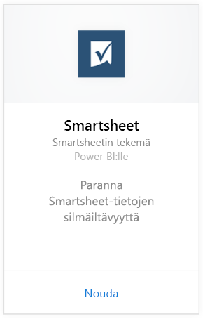
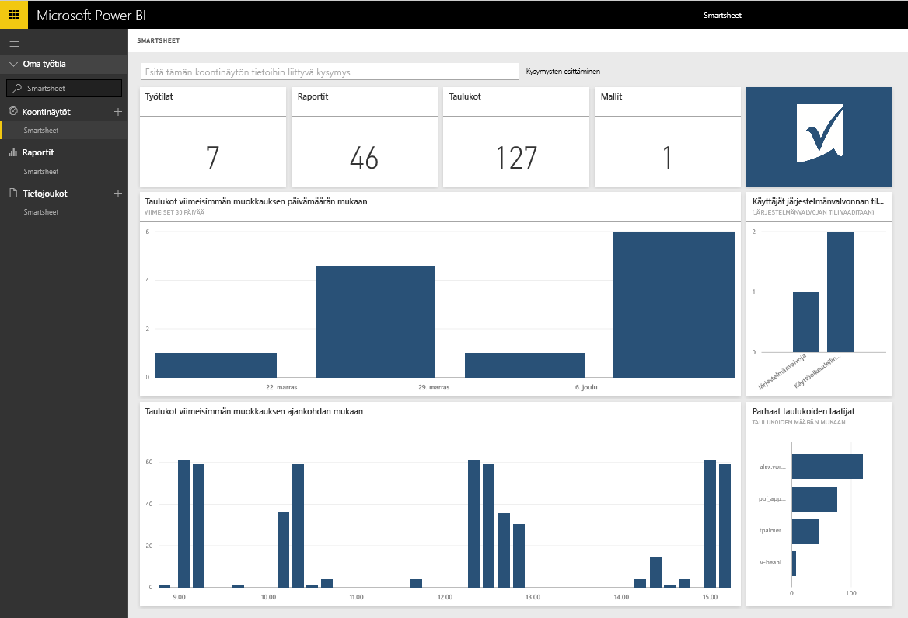

# Yhteyden muodostaminen Smartsheetiin Power BI:llä
Smartsheet tarjoaa helpon alustan yhteiskäyttöön ja tiedostojen jakamiseen. Smartsheet-sisältöpaketti Power BI:lle sisältää koontinäytön, raportteja ja tietojoukon, joka näkyy  Smartsheet-tilisi yleiskuvauksessa. Voit käyttää myös [Power BI Desktopia](desktop-connect-to-data.md) yhteyden muodostamiseen tiliisi yksittäisiin laskentataulukoihin. 

Yhdistä Power BI:n [Smartsheet-sisältöpakettiin](https://app.powerbi.com/groups/me/getdata/services/smartsheet).

>[!NOTE]
>Suosittelemme Smartsheet järjestelmänvalvojan tiliä yhdistämään ja lataamaan Power BI -sisältöpaketin, sillä se sisältää lisäoikeuksia.

## Yhteyden muodostaminen
1. Valitse vasemman siirtymisruudun alareunassa **Nouda tiedot**.
   
   
2. Valitse **Palvelut**-ruudussa **Nouda**.
   
    
3. Valitse **Smartsheet \> Nouda**.
   
   
4. Valitse todennusmenetelmäksi **oAuth2 \>Kirjaudu sisään**.
   
   Anna pyydettäessä Smartsheetin tunnistetiedot ja noudata todennusprosessia.
   
   
   
   
5. Kun Power BI on tuonut tiedot, näet vasemmassa siirtymisruudussa uuden koontinäytön, raportin ja tietojoukon. Uudet kohteet on merkitty keltaisella tähdellä \*, valitse Smartsheet-merkintä.
   
   

**Mitä seuraavaksi?**

* Kokeile [kysymyksen esittämistä raporttinäkymän yläreunassa olevassa Q&A-ruudussa](power-bi-q-and-a.md).
* [Muuta koontinäytön ruutuja](service-dashboard-edit-tile.md).
* [Valitse jokin ruutu](service-dashboard-tiles.md), jolloin siihen liittyvä raportti avautuu.
* Tietojoukko on ajastettu päivittymään päivittäin, mutta voit muuttaa päivitysaikataulua tai kokeilla tietojoukon päivittämistä **Päivitä nyt** -toiminnolla haluamanasi ajankohtana

## Paketin sisältö
Smartsheet-sisältöpaketti Power BI:lle sisältää yleiskatsauksen Smartsheet-tilistäsi kuten työtiloista, raporteista ja työkirjoista, joita sinulla on, kun niitä muokataan jne. Järjestelmänvalvojan käyttäjät näkevät myös tietoja käyttäjistä omassa järjestelmässään, kuten parhaat taulukoiden laatijat.  

Voit käyttää myös [Power BI Desktopin](desktop-connect-to-data.md) Smartsheet-liitintä yhteyden muodostamiseen tiliisi yksittäisiin taulukoihin.  

## Seuraavat vaiheet:

[Power BI:n käytön aloittaminen](service-get-started.md)

[Tietojen noutaminen Power BI:hin](service-get-data.md)