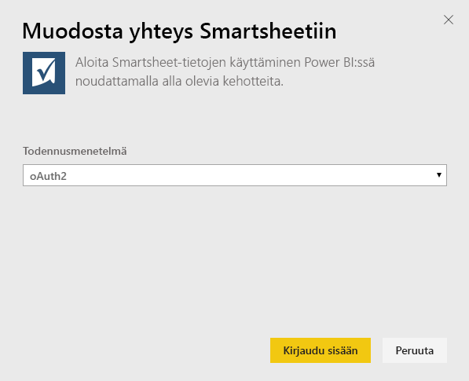
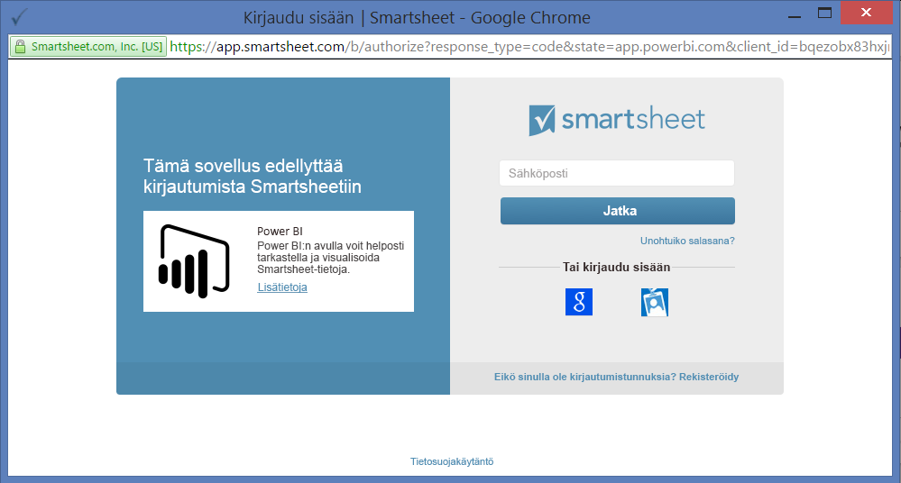
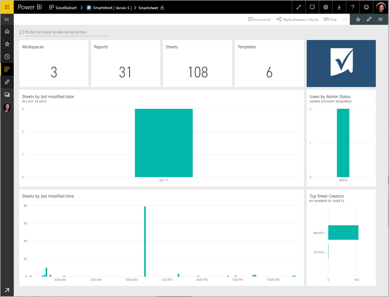
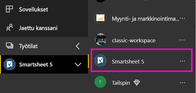
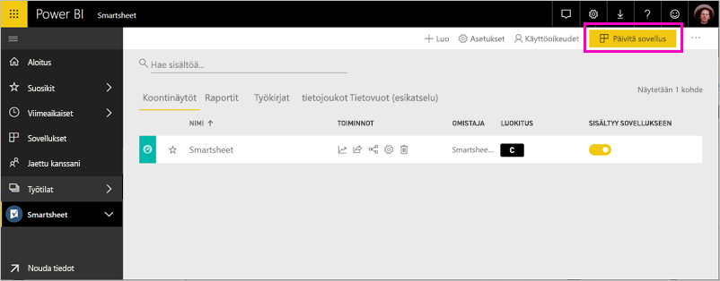

# Yhteyden muodostaminen Smartsheetiin Power BI:llä
Tässä artikkelissa opastetaan vetämällä Power BI-mallin sovelluksen Smartsheet-tilisi tiedot. Smartsheet tarjoaa helpon alustan yhteiskäyttöön ja tiedostojen jakamiseen. Power BI Smartsheet-mallin sovellus sisältää koontinäytön, raportteja ja tietojoukon, joka näyttää yleiskatsauksen Smartsheet-tilistäsi. Voit myös käyttää [Power BI Desktop](desktop-connect-to-data.md) yhteyden muodostamiseen tiliisi yksittäisiin taulukoihin. 

Kun olet asentanut sovelluksen mallin, voit muuttaa koontinäyttöä ja raporttia. Sitten voit jakaa sen sovelluksena työtovereiden organisaatiossasi.

Muodosta yhteys [Smartsheet mallin sovelluksen](https://app.powerbi.com/groups/me/getdata/services/smartsheet) Power BI.

>[!NOTE]
>Suosittelemme Smartsheet järjestelmänvalvojan tiliä suositellaan yhteyden ja ladataan Power BI-mallin sovelluksen, sillä se sisältää lisäoikeuksia.

## Yhteyden muodostaminen

[!INCLUDE [powerbi-service-apps-get-more-apps](./includes/powerbi-service-apps-get-more-apps.md)]

3. Valitse **Smartsheet** \> **hanki se nyt**.
4. - **Asentaa Power BI-sovelluksesta?** Valitse **asentaa**.
4. - **Sovelluksia** ruudussa **Smartsheet** ruudun.

    

6. - **Uuden sovelluksen käytön aloittaminen**, valitse **yhdistää tiedot**.

    

4. Valitse todennusmenetelmäksi **oAuth2 \>Kirjaudu sisään**.
   
   Anna pyydettäessä Smartsheetin tunnistetiedot ja noudata todennusprosessia.
   
   
   
   

5. Kun Power BI on tuonut tiedot, Smartsheet-koontinäyttö avautuu.
   
   

## Muokata ja jakaa sovelluksen

Olet asentanut sovelluksen Smartsheet-malli. Tämä tarkoittaa myös luomaasi Smartsheet-sovelluksen työtilassa. Työtilassa voit muuttaa raportin ja koontinäytön ja jakaa sen *sovelluksen* työtovereiden organisaatiossasi. 

1. Tarkastele uusi Smartsheet-työtila sisällön vasemmassa siirtymispalkissa valitsemalla **työtilat** > **Smartsheet**. 

    

    Tämä näkymä on työtilan sisältöluettelosta. Näet oikeassa yläkulmassa, **Päivitä sovellus**. Kun olet valmis jakamaan sovelluksesi työtovereillesi, joka on jossa aloitat. 

    

2. Valitse **raporttien** ja **tietojoukkoja** Nähdäksesi työtilan muut elementit.

    Lue [jakaminen sovellusten](service-create-distribute-apps.md) työtovereillesi.

## Paketin sisältö
Smartsheet-mallin sovelluksen Power BI sisältää yleiskatsauksen Smartsheet-tilistäsi kuten työtiloista, raporteista ja työkirjoista, joita on, kun niitä muokataan jne. Järjestelmänvalvojan käyttäjät näkevät myös tietoja käyttäjistä omassa järjestelmässään, kuten parhaat taulukoiden laatijat.  

Voit käyttää myös [Power BI Desktopin](desktop-connect-to-data.md) Smartsheet-liitintä yhteyden muodostamiseen tiliisi yksittäisiin taulukoihin.  

## Seuraavat vaiheet

* [Luo uusi työtilat Power BI](service-create-the-new-workspaces.md)
* [Asenna ja käytä sovelluksia Power BI:ssä](consumer/end-user-apps.md)
* [Power BI-sovelluksista ulkoisiin palveluihin yhdistäminen](service-connect-to-services.md)
* Onko sinulla kysyttävää? [Voit esittää kysymyksiä Power BI -yhteisössä](http://community.powerbi.com/)