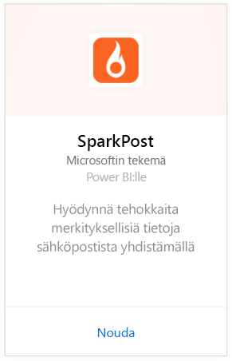
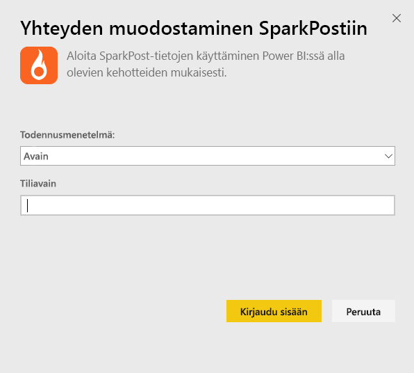
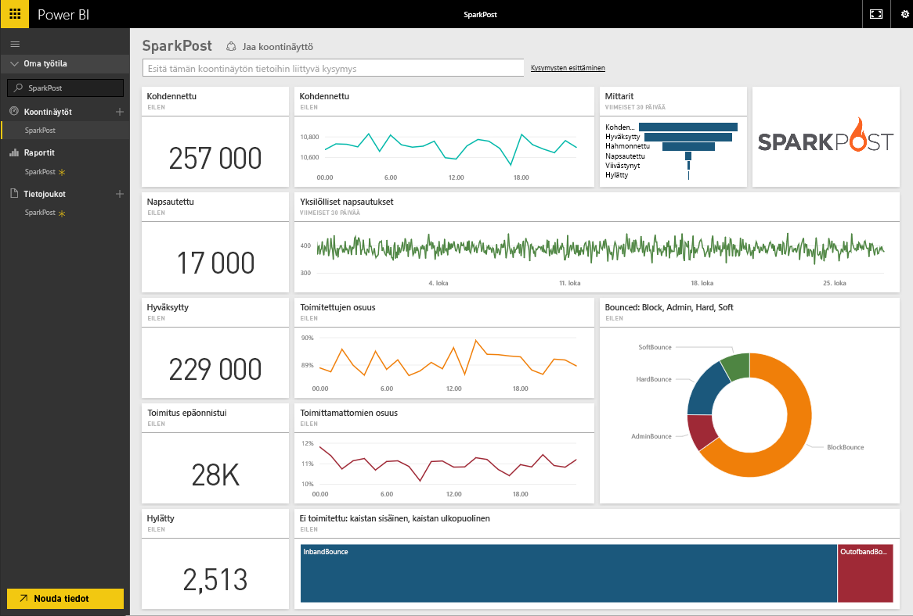
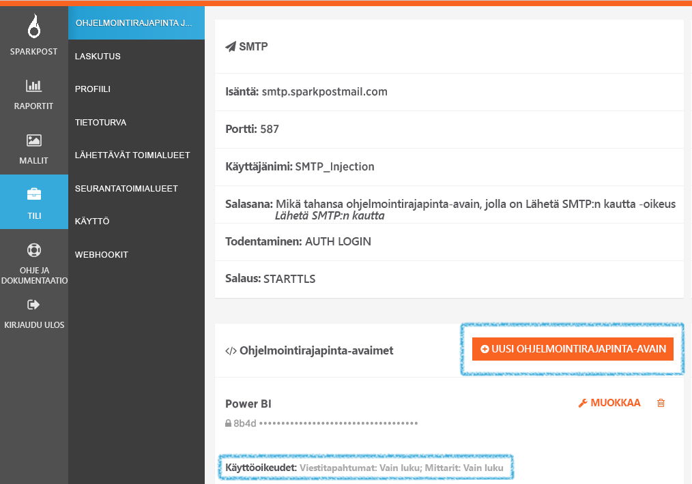

# Yhteyden muodostaminen SparkPostiin Power BI:llä
Power BI:n SparkPost-sisältöpaketilla voit poimia arvokkaita tietojoukkoja SparkPost-tililtäsi ja yhdistää ne samaan hyödylliseen ja havainnolliseen koontinäyttöön. SparkPost-sisältöpaketin avulla voit visualisoida sähköpostitilastoja, kuten toimialueita, kampanjoita ja osallistamista Internet-palveluntarjoajan mukaan.

Muodosta yhteys [Power BI:n SparkPost-sisältöpakettiin](https://app.powerbi.com/getdata/services/spark-post).

## Yhteyden muodostaminen
1. Valitse vasemman siirtymisruudun alareunassa **Nouda tiedot**.
   
   
2. Valitse **Palvelut**-ruudussa **Nouda**.
   
   
3. Valitse **SparkPost**-sisältöpaketti ja sitten **Nouda**. 
   
   
4. Anna pyydettäessä SparkPost-ohjelmointirajapinta-avain ja valitse Kirjaudu sisään. Lisätietoja [tämän parametrin etsimisestä](#FindingParams) on alla.
   
   
5. Tietojen lataaminen alkaa pian. Siinä voi kestää jonkin aikaa tilin koosta riippuen. Kun Power BI on tuonut tiedot, näet vasemmassa siirtymisruudussa oletusarvoisen koontinäytön, raportin ja tietojoukon, johon on täytetty sähköpostitilastot viimeisten 90 päivän ajalta. Uudet kohteet on merkitty keltaisella tähdellä \*.
   
   

**Mitä seuraavaksi?**

* Kokeile [kysymyksen esittämistä koontinäytön yläreunassa olevassa Q&A-ruudussa](power-bi-q-and-a.md).
* [Muuta koontinäytön ruutuja](service-dashboard-edit-tile.md).
* [Valitse jokin ruutu](service-dashboard-tiles.md), jolloin siihen liittyvä raportti avautuu.
* Tietojoukko on ajoitettu päivittymään päivittäin, mutta voit muuttaa päivitysaikataulua tai kokeilla tietojoukon päivittämistä **Päivitä nyt** -toiminnolla haluamanasi ajankohtana.

## Paketin sisältö
Power BI:n SparkPost-sisältöpakettiin sisältyy tietoja muun muassa yksilöllisistä napsautuksista sekä hyväksymis-, epäonnistumis-, viivästymis- ja hylkäämisasteista.

## Parametrien etsiminen
Sisältöpaketti yhdistää SparkPost-tilin Power BI:hin käyttämällä ohjelmointirajapinta-avainta. Löydät ohjelmointirajapinta-avaimesi tilisi tiedoista kohdassa Tili \> Ohjelmointirajapinta ja SMTP (lisätietoja on [täällä](https://support.sparkpost.com/customer/portal/articles/1933377-create-api-keys)). Suosittelemme, että käytät ohjelmointirajapinta-avainta, jolla on käyttöoikeudet kohteisiin `Message Events: Read-only ` ja `Metrics: Read-only`.

