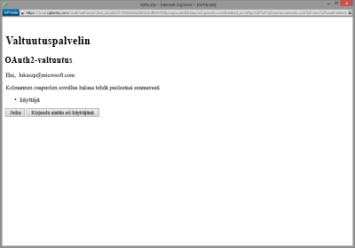

# Yhteyden muodostaminen SQL Sentry -palveluun Power BI:llä
SQL Sentryn keräämien suorituskykytietojen analysoiminen on helppoa Power BI:llä. Power BI noutaa tiedot ja laatii sitten oletuskoontinäytön ja siihen liittyvät raportit kyseisten tietojen perusteella.

Muodosta yhteys [SQL Sentry -sisältöpakettiin](https://app.powerbi.com/groups/me/getdata/services/sql-sentry) Power BI:tä varten.

>[!NOTE]
>Yhteyden muodostaminen edellyttää SQL Sentry-tilin käyttöä, jota käytät muodostettaessa yhteyttä kohteeseen http://cloud.sqlsentry.com, sekä tietokantatunnusta, jota itse valvot.  Ohjeet tietokantatunnuksen löytämiseen ovat alla.

## Yhteyden muodostaminen
1. Valitse vasemman siirtymisruudun alareunassa **Nouda tiedot**.
   
   
2. Valitse **Palvelut**-ruudussa **Nouda**.
   
    
3. Valitse **SQL Sentry \> Nouda**.
   
   
4. Anna **Tietokantatunnus** sille tietokannalle, jota haluat valvoa Power BI:ssä. Lisätietoja [sen löytämisestä](#FindingParams) on alla.
   
   
5. Valitse todennusmenetelmäksi **oAuth2 \> Kirjaudu sisään**.
   
   Anna pyydettäessä cloud.sqlsentry.com -tunnistetietosi ja noudata SQL Sentryn todennusprosessia.
   
   
   
   Ensimmäisen kerran, kun muodostat yhteyden, Power BI kysyy, haluatko sallia vain luku -käyttöoikeudet tiliisi. Aloita tuontiprosessi valitsemalla Myönnä.  Tuontiprosessi voi kestää muutamia minuutteja riippuen siitä, kuinka paljon tililläsi on tietoja.
   
   
6. Kun Power BI on tuonut tiedot, näet vasemmassa siirtymisruudussa uuden koontinäytön, raportin ja tietojoukon. Uudet kohteet on merkitty keltaisella tähdellä \*:
   
   
7. Valitse SQL Sentry -koontinäyttö.
   
   Tämä on oletuskoontinäyttö, jonka Power BI on luonut tietojesi näyttämistä varten. Voit muokata tätä koontinäyttöä, jotta näet tiedot juuri haluamallasi tavalla.
   
   

**Mitä seuraavaksi?**

* Kokeile [kysymyksen esittämistä raporttinäkymän yläreunassa olevassa Q&A-ruudussa](power-bi-q-and-a.md).
* [Muuta koontinäytön ruutuja](service-dashboard-edit-tile.md).
* [Valitse jokin ruutu](service-dashboard-tiles.md), jolloin siihen liittyvä raportti avautuu.
* Tietojoukko on ajastettu päivittymään päivittäin, mutta voit muuttaa päivitysaikataulua tai kokeilla tietojoukon päivittämistä **Päivitä nyt** -toiminnolla haluamanasi ajankohtana

## Paketin sisältö
Seuraavat tiedot ovat käytettävissä SQL Sentrystä Power BI:ssä:

| Taulukon nimi | Kuvaus |
| --- | --- |
| Yhteys |Tämä taulukko sisältää tietoja SQL Sentrylle määritetyistä yhteyksistä. |
| Päivämäärä  |Tämä taulukko sisältää päivämääriä tästä päivästä taaksepäin aikaisimpaan päivämäärään, josta suorituskykytietoja on kerätty ja säilytetty. |
| Käyttämättömyysaika  |Tämä taulukko sisältää käyttämättömyysaikaan ja käyttöaikaan liittyviä tietoja jokaisesta palvelimesta, jota ympäristössäsi seurataan. |
| Muistin käyttö  |Tässä taulukossa on tietoja siitä, paljonko muistia on käytettävissä tai vapaana kullakin palvelimellasi.  |
| Palvelin  |Tässä taulukossa on tallennetietoja ympäristösi jokaisesta palvelimesta. |
| Palvelimen kunto  |Tämä taulukko sisältää tietoa kaikista tapahtumista, jotka on luotu ympäristösi mukautetuilla ehdoilla, mukaan lukien vakavuus ja lukumäärä. |

## Parametrien etsiminen
**Tietokantatunnus** löytyy kirjautumalla kohtaan <https://cloud.sqlsentry.com> uudessa selainikkunassa.  **Tietokantatunnus** on lueteltu yleiskatsauksen pääsivulla:

    

**Tietokantatunnus** näkyy myös Tietokannan tiedot -näytössä:

    

## Vianmääritys
Jos joidenkin sovellustesi tietoja ei näy Power BI:ssä, varmista, että käytät oikeaa Tietokantatunnusta ja että sinulla on oikeudet tietojen tarkasteluun. 

Jos et omista SQL Sentry -tietokantaa, jota synkronoidaan kohteeseen <https://cloud.sqlsentry.com>, ota yhteyttä järjestelmänvalvojaan ja varmista, että sinulla on oikeudet kerättyjen tietojen tarkasteluun.

## Seuraavat vaiheet
[Mikä on Power BI?](power-bi-overview.md)

[Tietojen noutaminen Power BI:hin](service-get-data.md)

