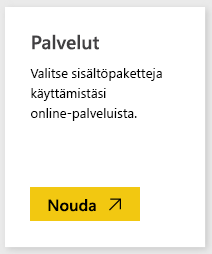
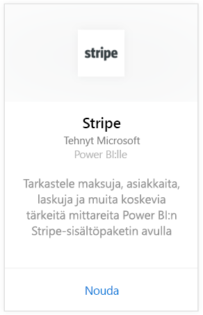
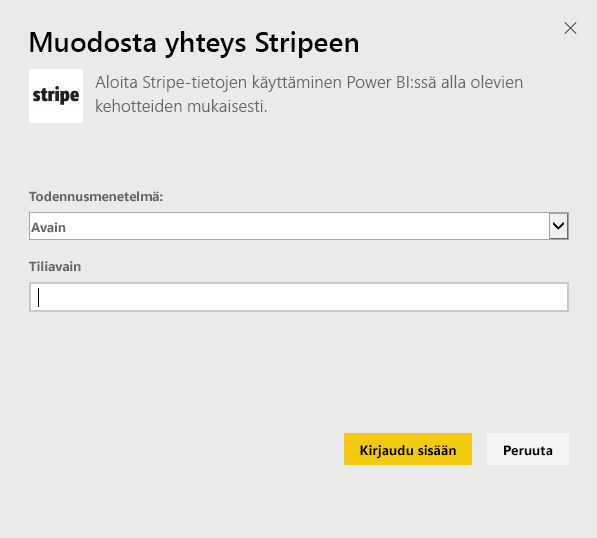
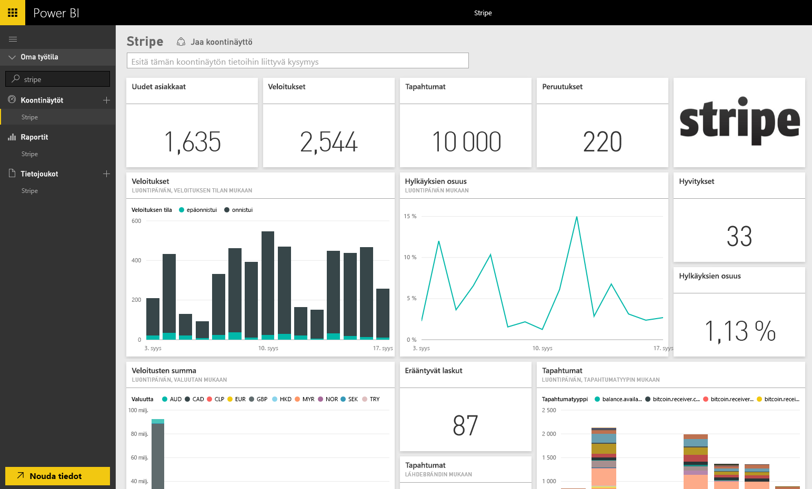

# Yhteyden muodostaminen Stripeen Power BI:llä
Visualisoi ja tutki Stripe-tietoja Power BI:ssä Power BI -sisältöpaketin avulla. Power BI Stripe -sisältöpaketti hakee tietoja asiakkaista, maksuista, tapahtumista ja laskuista. Tiedot sisältävät uusimmat kymmenen tuhatta tapahtumaa ja viisi tuhatta maksua viimeisten 30 päivän ajalta. Sisältö päivitetään automaattisesti kerran päivässä asettamasi aikataulun mukaisesti. 

Muodosta yhteys [Stripe-sisältöpakettiin](https://app.powerbi.com/getdata/services/stripe) Power BI:lle.

## Yhteyden muodostaminen
1. Valitse vasemman siirtymisruudun alareunassa Nouda tiedot.  
   
    
2. Valitse **Palvelut**-ruudussa **Nouda**.  
   
      
3. Valitse **Stripe** &gt; **Nouda**.  
   
      
4. Anna oma Stripe [Ohjelmointirajapinta-avaimesi](https://dashboard.stripe.com/account/apikeys) yhteyden luomiseksi.  
   
    
5. Tuontiprosessi alkaa automaattisesti. Kun kaikki on valmista, uusi raporttinäkymä, raportti ja malli näkyvät siirtymisruudussa, joka on merkitty tähdellä. Voit tarkastella tuotuja tietoja valitsemalla raporttinäkymän.
   
    

**Mitä seuraavaksi?**

* Kokeile [kysymyksen esittämistä koontinäytön yläreunassa olevassa Q&A-ruudussa](power-bi-q-and-a.md)
* [Muuta koontinäytön ruutuja](service-dashboard-edit-tile.md).
* [Valitse jokin ruutu](service-dashboard-tiles.md), jolloin siihen liittyvä raportti avautuu.
* Tietojoukko on ajastettu päivittymään päivittäin, mutta voit muuttaa päivitysaikataulua tai kokeilla tietojoukon päivittämistä **Päivitä nyt** -toiminnolla haluamanasi ajankohtana

## Seuraavat vaiheet
[Power BI:n käytön aloittaminen](service-get-started.md)

[Tietojen noutaminen Power BI:hin](service-get-data.md)

