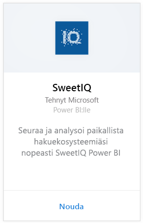
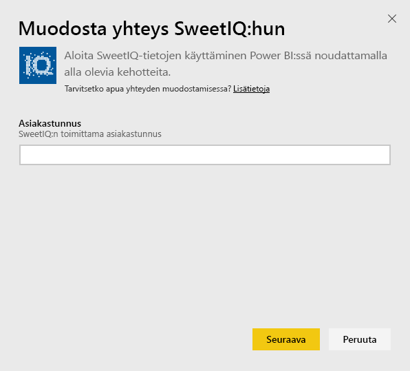
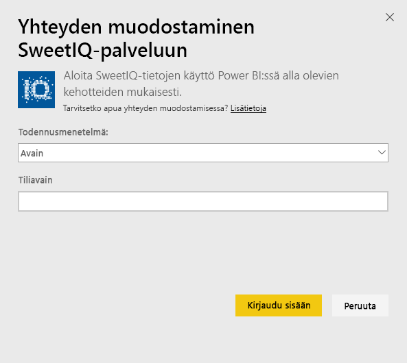
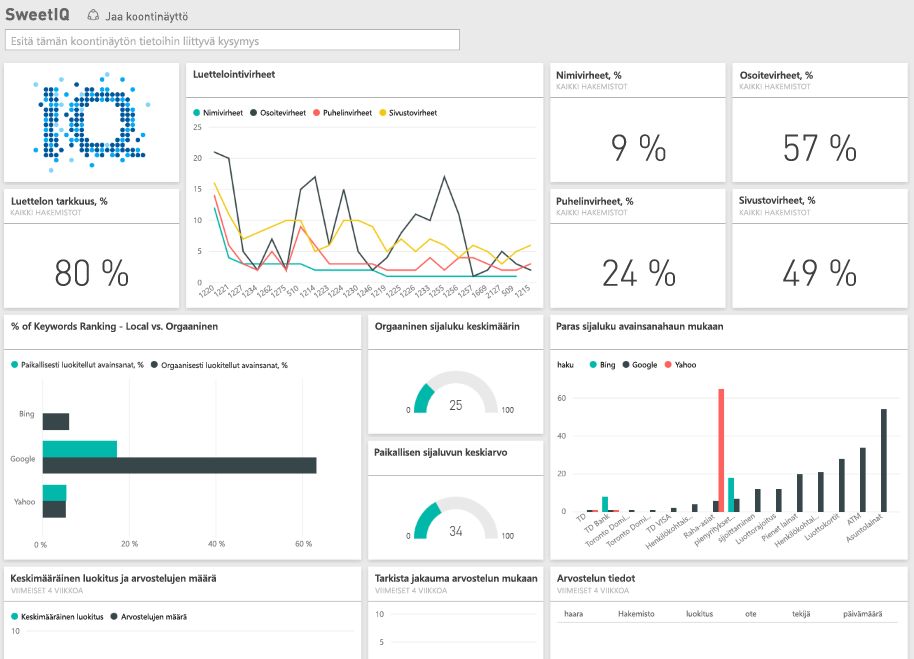

# Yhteyden muodostaminen SweetIQ:iin Power BI:llä
Power BI -sisältöpaketti hakee tietoja SweetIQ-tililtäsi ja luo valmiita sisältösarjoja, joiden avulla voit helposti tarkastella tietojasi. SweetIQ-sisältöpaketin avulla voit analysoida tietoja sijainnista, luetteloista, luokituksista ja arvioista. Tiedot on määritetty päivittymään päivittäin, niin että seuraamasi tiedot ovat varmasti ajan tasalla.

Muodosta yhteys [SweetIQ-sisältöpakettiin](https://app.powerbi.com/groups/me/getdata/services/sweetiq) Power BI:lle.

## Yhteyden muodostaminen
1. Valitse vasemmassa siirtymisruudussa **Nouda tiedot.**
   
    
2. Valitse **SweetIQ** ja napsauta **Nouda.**
   
    
3. Anna SweetIQ-asiakastunnus. Tämä on yleensä aakkosnumeerinen arvo. Lisätietoja arvon löytämisestä on alla.
   
    
4. Valitse **Avain**-todennustyyppi ja anna oma Sweet IQ API -avaimesi. Tämä on yleensä aakkosnumeerinen arvo. Lisätietoja arvon löytämisestä on alla.
   
    
5. Power BI aloittaa tietojesi lataamisen, mikä saattaa kestää jonkin aikaa tilisi tietojen koon mukaan: Kun lataus on valmis, näet vasemmassa siirtymisruudussa uuden koontinäytön, raportin ja tietojoukon.
   
    

**Mitä seuraavaksi?**

* Kokeile [kysymyksen esittämistä koontinäytön yläreunassa olevassa Q&A-ruudussa](power-bi-q-and-a.md)
* [Muuta koontinäytön ruutuja](service-dashboard-edit-tile.md).
* [Valitse jokin ruutu](service-dashboard-tiles.md), jolloin siihen liittyvä raportti avautuu.
* Tietojoukko on ajastettu päivittymään päivittäin, mutta voit muuttaa päivitysaikataulua tai kokeilla tietojoukon päivittämistä **Päivitä nyt** -toiminnolla haluamanasi ajankohtana

## Parametrien löytäminen
Tämä Asiakastunnus ja API-avain tälle sisältöpaketille ei ole sama kuin SweetIQ-käyttäjänimi ja salasana.

Valitse Asiakastunnus yhdelle asiakkaalle, jolle tililläsi on pääsy. Voit hakea asiakasluettelon kohdasta ”Asiakashallinta” SweetIQ-tililtäsi.

Ota yhteyttä järjestelmänvalvojaan API-avaimesi saamiseksi tietyn asiakkaan tietoihin.

## Seuraavat vaiheet
[Power BI:n käytön aloittaminen](service-get-started.md)

[Tietojen noutaminen Power BI:hin](service-get-data.md)

