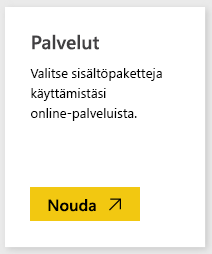
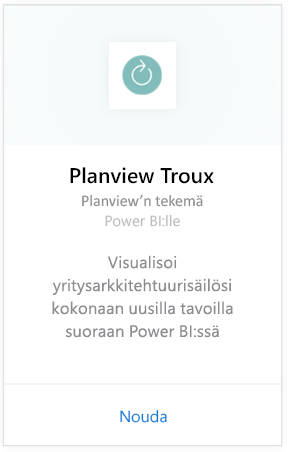
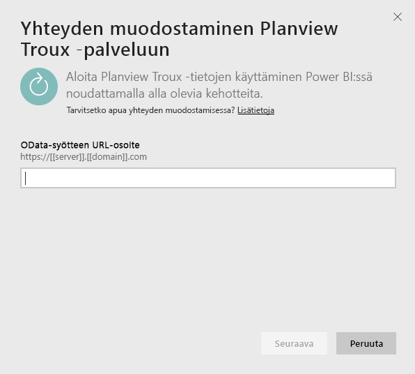
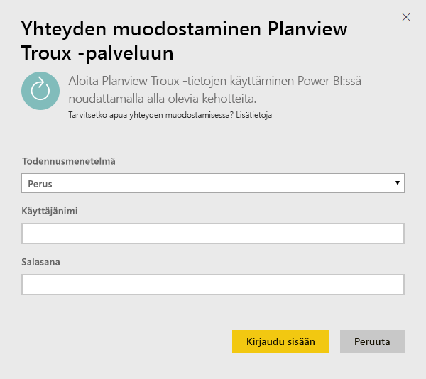
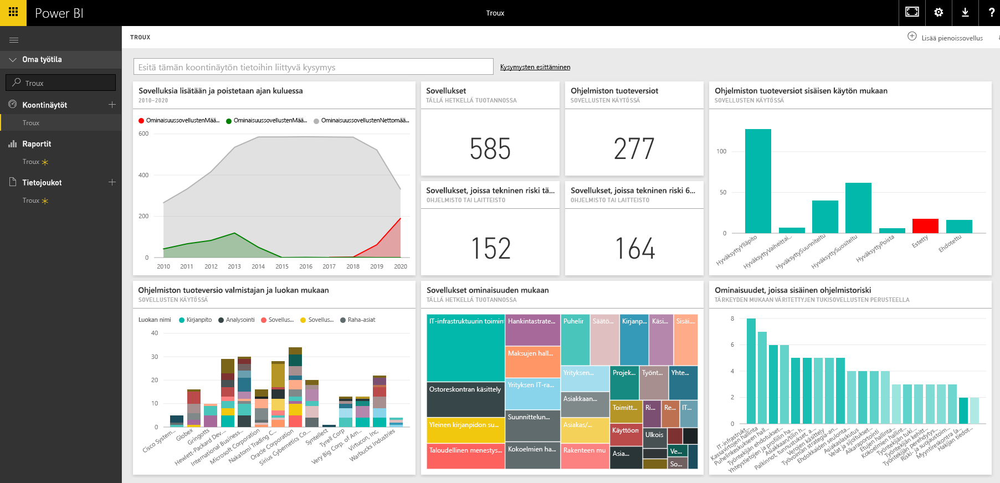

# Yhteyden muodostaminen Trouxiin Power BI:lle
Troux-sisältöpaketin avulla voit visualisoida yritysarkkitehtuurisäilösi kokonaan uusilla tavoilla suoraan Power BI:ssä. Sisältöpaketti tarjoaa joukon merkityksellisiä tietoja liiketoimintasi ominaisuuksista, kyseiset ominaisuudet mahdollistavista sovelluksista sekä näitä sovelluksia tukevista tekniikoista, jotka ovat Power BI:n avulla täysin mukautettavissa.

Muodosta yhteys [Troux-sisältöpakettiin](https://app.powerbi.com/getdata/services/troux) Power BI:lle.

## Yhteyden muodostaminen
1. Valitse vasemman siirtymisruudun alareunassa **Nouda tiedot**.
   
   
2. Valitse **Palvelut**-ruudussa **Nouda**.
   
   
3. Valitse **Troux** \> **Nouda**.
   
   
4. Määritä Troux-OData-URL-osoite. Lisätietoja [näiden parametrien löytämisestä](#FindingParams) on alla.
   
   
5. Valitse kohtaan **Todennusmenetelmä** **Perus** ja anna käyttäjänimesi ja salasanasi (kirjainkoolla on merkitystä), valitse sitten **Kirjaudu sisään**.
   
    
6. Hyväksymisen jälkeen tuontiprosessi alkaa automaattisesti. Kun kaikki on valmista, uusi raporttinäkymä, raportti ja malli näkyvät siirtymisruudussa. Voit tarkastella tuotuja tietoja valitsemalla raporttinäkymän.
   
     

**Mitä seuraavaksi?**

* Kokeile [kysymyksen esittämistä raporttinäkymän yläreunassa olevassa Q&A-ruudussa](consumer/end-user-q-and-a.md).
* [Muuta koontinäytön ruutuja](service-dashboard-edit-tile.md).
* [Valitse jokin ruutu](consumer/end-user-tiles.md), jolloin siihen liittyvä raportti avautuu.
* Tietojoukko on ajastettu päivittymään päivittäin, mutta voit muuttaa päivitysaikataulua tai kokeilla tietojoukon päivittämistä **Päivitä nyt** -toiminnolla haluamanasi ajankohtana

## Järjestelmävaatimukset
Seuraavien käyttöoikeus vaaditaan: Troux-OData-syöte ja Troux 9.5.1 tai uudempi.

## Parametrien löytäminen
Asiakastuki voi antaa sinulle yksilöllisen Troux-OData-syötteen URL-osoitteen

## Vianmääritys
Jos tunnistetietojen antamisen jälkeen ilmenee aikakatkaisuvirhe, yritä muodostaa yhteys uudelleen.

## Seuraavat vaiheet
[Power BI:n käytön aloittaminen](service-get-started.md)

[Tietojen noutaminen Power BI:ssä](service-get-data.md)

