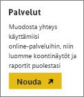
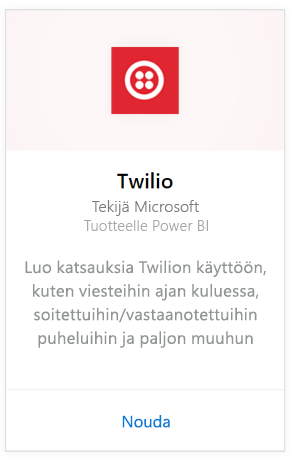
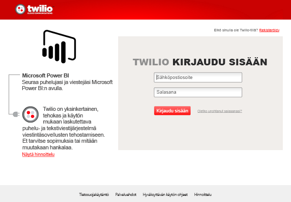
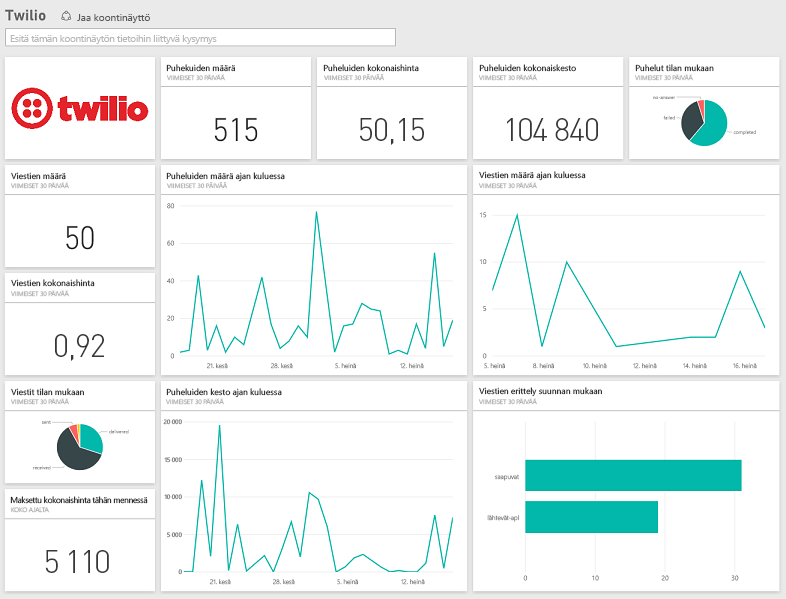

# Yhteyden muodostaminen Twilioon Power BI:llä
Microsoft Twilio -sisältöpaketin avulla Power BI:lle voit hakea tietoja Power BI:lle ja luoda valmiin [Twilio-koontinäytön](https://powerbi.microsoft.com/integrations/twilio) ja raportin, joka sisältää merkityksellisiä tietoja omista tiedoistasi. Voit myös luoda mukautettuja raportteja ja koontinäytön tietojoukolle, jonka Power BI Luo. Jotta näet aina uusimmat tiedot, tiedot päivitetään kerran päivässä.

Muodosta yhteys [Twilio-sisältöpakettiin](https://app.powerbi.com/getdata/services/twilio) Power BI:lle.

## Yhteyden muodostaminen
1. Valitse vasemman siirtymisruudun alareunassa **Nouda tiedot**.
   
    
2. Valitse **Palvelut**-ruudussa **Nouda**.
   
    
3. Valitse **Twilio** \> **Nouda**.
   
   
4. Valitse **todennusmenetelmäksi** **oAuth2** \>Kirjaudu sisään. Anna pyydettäessä Twilio-tunnistetietosi ja valtuuta Power BI-sovellus käyttämään tietojasi.
   
   
5. Tämä aloittaa tietojen tuomisen Twilio-tililtäsi, ja koontinäyttö täytetään puheluiden ja viestien käyttötiedoilla viimeisten 30 päivän ajalta. 
   
   

**Mitä seuraavaksi?**

* Kokeile [kysymyksen esittämistä raporttinäkymän yläreunassa olevassa Q&A-ruudussa](power-bi-q-and-a.md).
* [Muuta koontinäytön ruutuja](service-dashboard-edit-tile.md).
* [Valitse jokin ruutu](service-dashboard-tiles.md), jolloin siihen liittyvä raportti avautuu.
* Tietojoukko on ajastettu päivittymään päivittäin, mutta voit muuttaa päivitysaikataulua tai kokeilla tietojoukon päivittämistä **Päivitä nyt** -toiminnolla haluamanasi ajankohtana

## Paketin sisältö
Kaikki tiedot puheluista ja viestitapahtumista viimeisten 30 päivän ajalta. Voit analysoida ja koostaa näitä tietoja myös kaikin tavoin.

Kokoa tilastoja, joita haluat pitää silmällä. Tämä joukko sisältää:

        All Time Calls Count  
        All Time Calls Duration  
        All Time Calls Price  
        All Time Messages Price  
        All Time Messages Count  
        All Time Count of Phone Numbers  
        All Time Price of Phone Numbers  
        All Time Twilio Client Calls Price  
        All Time Twilio Client Calls Duration  
        All Time Twilio Client Calls Count  
        All Time Total Price  
        All Time Inbound Calls Price  
        All Time Inbound Calls Duration  
        All Time Inbound Calls Count  
        All Time Outbound Calls Price  
        All Time Outbound Calls Duration  
        All Time Outbound Calls Count  
        This Month Calls Price  
        This Month Calls Duration  
        This Month Calls Count  
        This Month Messages Count  
        This Month Messages Price  
        This Month Count of Phone Numbers  
        This Month Price of Phone Numbers  
        This Month Twilio Client Calls Price  
        This Month Twilio Client Calls Duration  
        This Month Twilio Client Calls Count  
        This Month Total Price  
        This Month Inbound Calls Price  
        This Month Inbound Calls Duration  
        This Month Inbound Calls Count  
        This Month Outbound Calls Price  
        This Month Outbound Calls Duration  
        This Month Outbound Calls Count  
        This Month Inbound Messages Price  
        This Month Inbound Messages Count  
        This Month Outbound Messages Price  
        This Month Outbound Messages Count

## Vianmääritys
Jos sinulla on erittäin paljon tietoja viimeisten 30 päivän ajalta (satoja tuhansia tapahtumia), tietojen noutaminen voi epäonnistua. Microsoft on tietoinen ongelmasta ja tekee työtä sen ratkaisemiseksi. Tällä välin ongelman sattuessa tulee käyttää tukilinkkiä Power BI-sivun yläosassa ja kertoa meille asiasta, jotta voimme ottaa yhteyttä asian ratkaisemiseksi.

## Seuraavat vaiheet
[Power BI:n käytön aloittaminen](service-get-started.md)

[Tietojen noutaminen Power BI:ssä](service-get-data.md)

