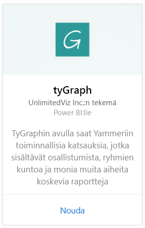
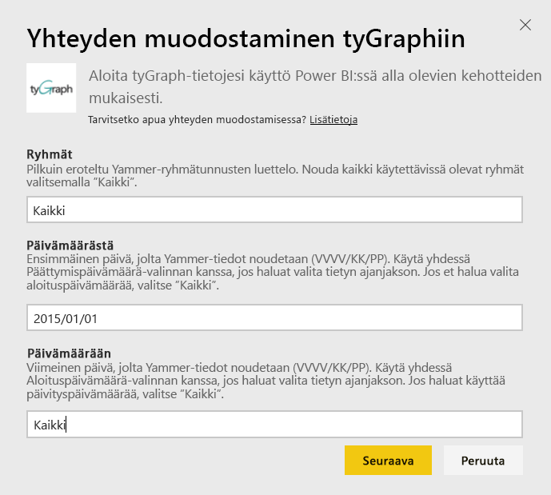
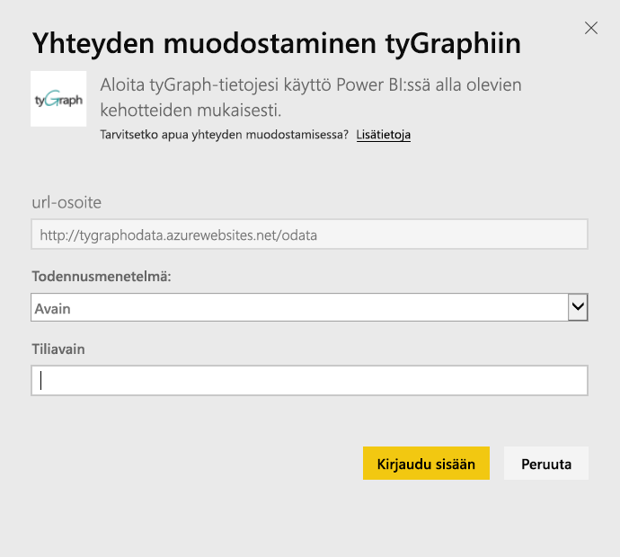
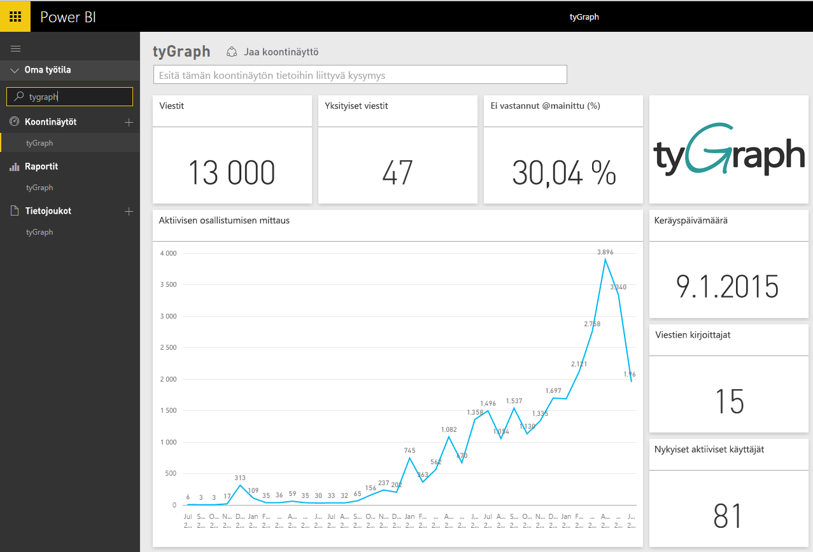
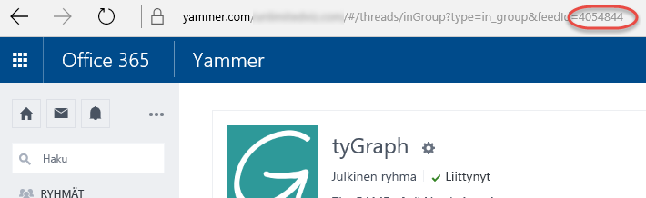

# Yhteyden muodostaminen tyGraphiin Power BI:n avulla
Visualisoi ja tutki tyGraph-tietoja Power BI:ssä Power BI -sisältöpaketin avulla. Aloita yhdistämällä tyGraph-tiliisi ja lataamalla raporttinäkymän, raportit ja tietojoukon. Heti käytettävän sisältöön kuuluu merkityksellisiä tietoja, Aktiivisen osallistumisen mittaritiedot (Measure of Active Engagement, MAE) ja suosituimmat sisällönluojat. Voit mukauttaa sitä edelleen, jotta voit korostaa sinua eniten kiinnostavia tietoja.  Tiedot päivitetään automaattisesti määrittämäsi aikataulun mukaan.

Yhteyden muodostaminen [tyGraphiin Power BI:ssä](https://app.powerbi.com/getdata/services/tygraph).

## Yhteyden muodostaminen
1. Valitse vasemman siirtymisruudun alareunassa **Nouda tiedot**.
   
   
2. Valitse **Palvelut**-ruudussa **Nouda**.
   
   
3. Valitse **tyGraph** \> **Hanki**.
   
   
4. Määritä ryhmät ja aika-alue, johon haluat muodostaa yhteyden. Muussa tapauksessa valitse ”Kaikki”, jos haluat tuoda kaikki tiedot. Huomaa, että päivämäärämuodon on oltava VVVV/KK/PP. Katsot alta lisätiedot [näiden parametrien löytämisestä](#FindingParams).
   
   
5. Anna tyGraph-avaimesi yhteyden muodostamista varten. Katso alta ohjeet tämän arvon löytämiseksi.
   
    **Jos olet varmennettu Yammer-järjestelmänvalvoja**  
    Ohjelmointirajapinta-avaimesi lähetetään sinulle sähköpostitse, kun tyGraph-tilisi on luotu. Jos olet hukannut kyseisen avaimen, voit pyytää uuden lähettämällä sähköpostia osoitteeseen support@unlimitedviz.com. Jos sinulla ei vielä ole tyGraph-tiliä, voit aloittaa kokeiluversion osoitteessa [http://www.tygraph.com/](http://www.tygraph.com/). 
   
    **Jos et ole varmennettu Yammer-järjestelmänvalvoja**
   
    TyGraph-sisältöpaketti vaatii tyGraph-tilin, jonka varmennettu Yammer-järjestelmänvalvoja on luonut. Kun tili on luotu, organisaatioon kuuluville käyttäjille voidaan antaa täydentäviä avaimia. Jos varmennettu järjestelmänvalvoja ei ole vielä luonut tyGraph-tiliä, pyydä häntä tekemään niin. Jos tili on luotu, voit pyytää avaimen lähettämällä sähköpostia osoitteeseen <support@unlimitedviz.com>.
   
    
6. Onnistuneen todennuksen jälkeen tuontiprosessi alkaa automaattisesti. Kun kaikki on valmista, uusi raporttinäkymä, raportti ja malli näkyvät siirtymisruudussa. Voit tarkastella tuotuja tietoja valitsemalla raporttinäkymän.
   
    

**Mitä seuraavaksi?**

* Kokeile [kysymyksen esittämistä raporttinäkymän yläreunassa olevassa Q&A-ruudussa](consumer/end-user-q-and-a.md).
* [Muuta koontinäytön ruutuja](service-dashboard-edit-tile.md).
* [Valitse jokin ruutu](consumer/end-user-tiles.md), jolloin siihen liittyvä raportti avautuu.
* Tietojoukko on ajastettu päivittymään päivittäin, mutta voit muuttaa päivitysaikataulua tai kokeilla tietojoukon päivittämistä **Päivitä nyt** -toiminnolla haluamanasi ajankohtana

## Parametrien löytäminen
Voit tuoda tiedot kaikista ryhmistä, joita voit käyttää, tai voit halutessasi määrittää alijoukon. Voit myös luoda tietojen alijoukon päivämäärän mukaan. Voit luoda useita tyGraph-raporttinäkymiä, jotta voit valvoa tiettyjä ryhmien ja/tai päivämäärien joukkoja. Näiden parametrien tiedot ovat alla.

**Ryhmät**

TyGraph-ohjelmointirajapinta voi suodattaa tietoja tietyn ryhmän tunnuksen mukaan. Nämä on annettu sisältöpaketissa pilkuin eroteltuna luettelona. 

    Example: 2427647,946595,1154464

Voit tunnistaa tietyn ryhmän tunnuksen Yammerissa siirtymällä kyseisen ryhmän syötteeseen ja katsomalla sen URL-osoitetta.

Yllä olevassa esimerkissä Yammer-ryhmän tunnus on 4054844

**Aloituspäivä**

Aloituspäivä-parametrin avulla voit rajoittaa palautettavien tietojen aikaisimman arvon. Vain kyseisenä päivänä tai sen jälkeen luodut tiedot lisätään tai ladataan sisältöpakettiin. Aloituspäivä-parametrin muoto on VVVV/KK/PP. 

    Example: 2013/10/29

Yllä olevassa esimerkissä sisältöpakettiin ladataan kaikki tiedot, jotka luotiin 29.10.2013 ja sen jälkeen. 

**Päättymispäivä**-parametrin avulla voit rajoittaa palautettujen tietojen viimeisintä arvoa. Voit käyttää sitä yhdessä Aloituspäivä-parametrin kanssa ladataksesi tiedot haluamaltasi aikaväliltä. Vain kyseisenä päivänä tai sitä ennen luodut tiedot lisätään tai ladataan sisältöpakettiin. Päättymispäivä-parametrin muoto on VVVV/KK/PP. 

    Example: 2014/10/20

Yllä olevassa esimerkissä sisältöpakettiin ladataan kaikki tiedot, jotka luotiin 20.10.2014 ja sitä ennen. 

## Seuraavat vaiheet
[Power BI:n käytön aloittaminen](service-get-started.md)

[Tietojen noutaminen Power BI:ssä](service-get-data.md)

