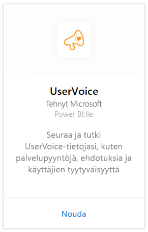
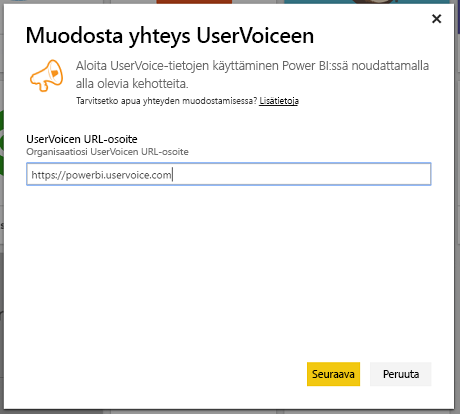
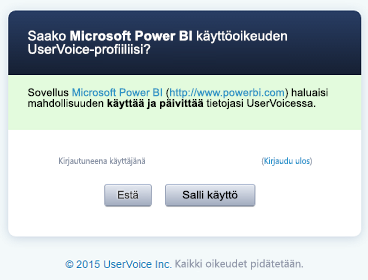
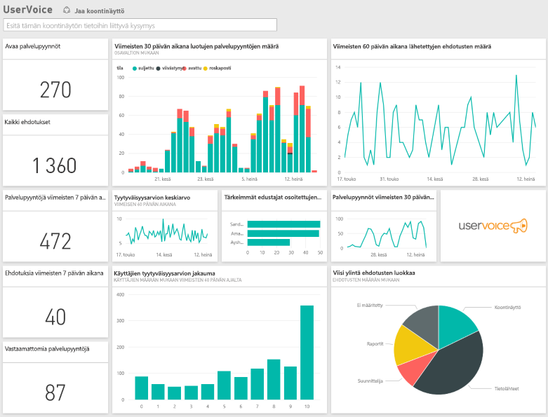

# Yhteyden muodostaminen Power BI:n UserVoiceen
UserVoice-tietojen seuranta ja analysointi on helppoa Power BI-ja UserVoice -sisältöpaketin avulla. Power BI noutaa tietosi, mukaan lukien tukipyynnöt, ehdotukset ja tyytyväisyysluokitukset ja rakentaa sitten valmiin raporttinäkymän kyseisten tietojen perusteella.

Muodosta yhteys [UserVoice-sisältöpakettiin ](https://app.powerbi.com/getdata/services/uservoice) Power BI:lle.

>[!NOTE]
>Järjestelmänvalvojatiliä tarvitaan yhteyden muodostamiseen Power BI-sisältöpakettiin. Sisältöpaketti myös hyödyntää UserVoice-ohjelmointirajapintaa ja vaikuttaa käyttöön kohti UserVoice-rajoituksia. Alla on lisätietoja.

## Yhteyden muodostaminen
1. Valitse vasemman siirtymisruudun alareunassa **Nouda tiedot**.
   
   
2. Valitse **Palvelut**-ruudussa **Nouda**.
   
    
3. Valitse **UserVoice** ja sitten **Nouda**.
   
   
4. Kirjoita pyydettäessä UserVoicen URL-osoite. URL-osoitteen on noudatettava täsmälleen muotoa `https://fabrikam.uservoice.com`, jossa ”fabrikam” korvataan tuotteen tai palvelun nimellä.
   
   >[!NOTE]
   >Huomaa, että lopussa ei ole vinoviivaa, ja että yhteys on http**s**.
   
   
5. Anna pyydettäessä UserVoice-tunnistetietosi ja noudata UserVoicen todennusprosessia. Jos olet jo kirjautunut UserVoiceen selaimessa, tunnistetietoja ei välttämättä pyydetä. Myönnä Power BI -sovellukselle pääsy tietoihisi valitsemalla ”Salli käyttö”.
   
   >[!NOTE]
   >Tarvitset UserVoice-tilisi järjestelmänvalvojan tunnistetiedot.
   
   
6. Power BI noutaa UserVoice-tietosi ja luo käyttövalmiin raporttinäkymän ja raportin puolestasi. Power BI noutaa seuraavat tiedot: kaikki ehdotukset, kaikki avoimet tukipyynnöt, kaikki viimeisten 30 päivän aikana luodut tukipyynnöt, mukaan lukien suljetut sekä kaikki käyttäjän tyytyväisyysarviot.
   
   

**Mitä seuraavaksi?**

* Kokeile [kysymyksen esittämistä raporttinäkymän yläreunassa olevassa Q&A-ruudussa](power-bi-q-and-a.md).
* [Muuta koontinäytön ruutuja](service-dashboard-edit-tile.md).
* [Valitse jokin ruutu](service-dashboard-tiles.md), jolloin siihen liittyvä raportti avautuu.
* Tietojoukko on ajastettu päivittymään päivittäin, mutta voit muuttaa päivitysaikataulua tai kokeilla tietojoukon päivittämistä **Päivitä nyt** -toiminnolla haluamanasi ajankohtana

## Vianmääritys
**"Parametrien vahvistaminen epäonnistui. Varmista, että kaikki parametrit ovat kelvollisia."**

Jos näet tämän virheen UserVoice URL-osoitteen kirjoittamisen jälkeen. Varmista, että seuraavat edellytykset täyttyvät:

* URL-osoite noudattaa täsmälleen muotoa `https://fabrikam.uservoice.com`, jossa ”fabrikam” korvataan oikealla UserVoice URL -etuliitteellä.
* Varmista, että kaikki kirjaimet ovat pieniä.
* Varmista, että URL-osoitteen alku on http**s**.
* Varmista, että URL-osoitteen lopussa ei ole vinoviivaa.

**”Kirjautuminen epäonnistui”**

Jos saat ”kirjautuminen epäonnistui”-virheilmoituksen, kun olet käyttänyt UserVoice-tunnistetietojasi kirjautumiseen, käyttämälläsi tilillä ei ole oikeutta hakea UserVoice-tietoja tililtäsi. Varmista, ettei kyseessä ole järjestelmänvalvojatili ja yritä uudelleen.

"**Tapahtui virhe**"

Jos näyttöön tulee tämä virhesanoma, kun tietoja ladataan, varmista että UserVoice-tilisi ei ole ylittänyt kuukausittaista API-käyttökiintiötä. Jos kaikki näyttää hyvältä, yritä muodostaa yhteys uudelleen. Jos ongelma jatkuu, ota yhteyttä Power BI -tukeen osoitteessa [https://community.powerbi.com](https://community.powerbi.com/).

**Muu**  

Power BI UserVoice -sisältöpaketti käyttää UserVoicen ohjelmointirajapintoja tietojen noutamiseen. Valvo API-käyttöä niin, että et ylitä rajaasi. Jos sinulla on paljon dataa UserVoice-tililläsi, ehdotamme minimoimaan API-käytön vaikutukset ja muuttamaan päivitystaajuutta nykyisestä oletusarvosta, joka on kerran päivässä niin, että päivitys tapahtuu vain arkipäivinä tai joka päivä tarpeidesi mukaan. Toinen ehdotus on niin, että yksi järjestelmänvalvoja luo sisältöpaketin ja jakaa sen tiimin kanssa sen sijaan, että jokaisen järjestelmänvalvojan organisaation työryhmän muiden jäsenten pitäisi aiheuttaa ylimääräistä tarpeetonta kuormitusta API:lle

## Seuraavat vaiheet
[Power BI:n käytön aloittaminen](service-get-started.md)

[Tietojen noutaminen Power BI:ssä](service-get-data.md)

