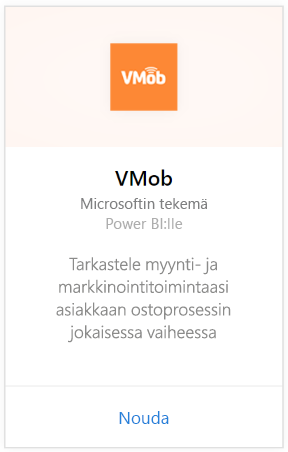
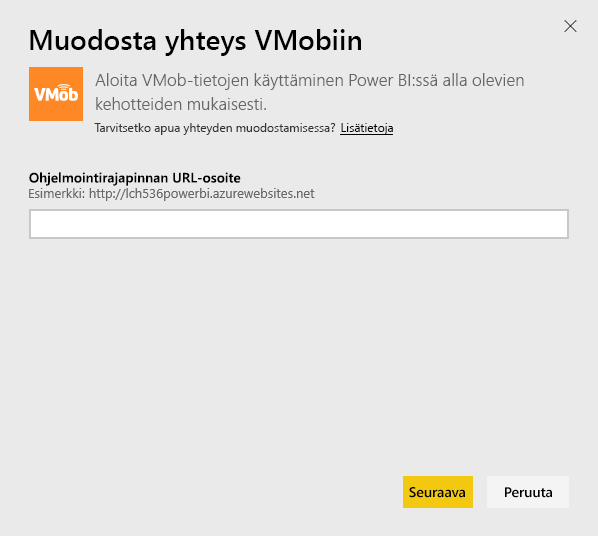
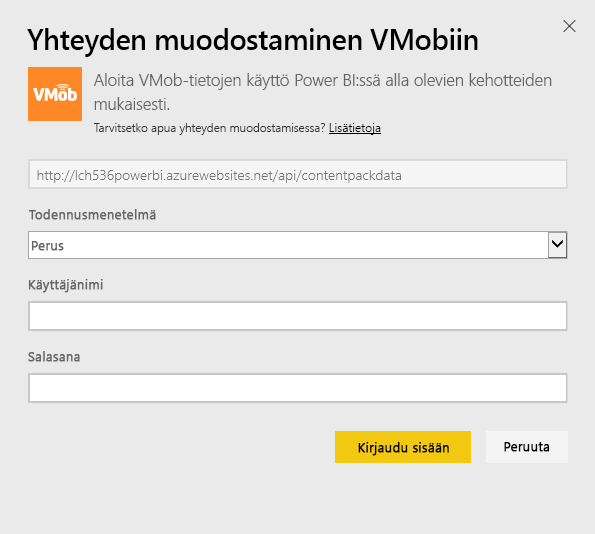
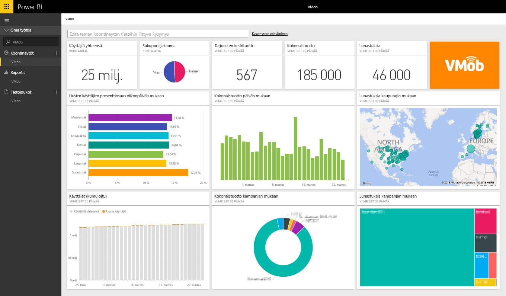

# VMobiin yhdistäminen Power BI:n avulla
VMob-tietojen seuranta ja analysointi on helppoa Power BI-ja VMob-sisältöpaketin avulla. Power BI noutaa seuraavat tiedot: käyttäjätilastot koko ajalta ja viimeisten 30 päivältä, vähittäismyynnin suorituskykyilmaisimet viimeisten 30 päivän ajalta ja kampanjan tuottavuus viimeisten 30 päivän ajalta.

Muodosta yhteys [VMob-sisältöpakettiin](https://app.powerbi.com/getdata/services/vmob) Power BI:lle.

## Yhteyden muodostaminen
1. Valitse vasemman siirtymisruudun alareunassa **Nouda tiedot**.
   
    
2. Valitse **Palvelut**-ruudussa **Nouda**.
   
   
3. Valitse **VMob** \> **Nouda**.
   
   
4. Anna pyydettäessä VMob URL-osoite ja valitse Seuraava-painike. Tämän URL-osoitteen antaa VMob erikseen.
   
    
5. Valitse **Basic** todentamismenetelmäksi avattavasta valikosta, kirjoita VMob-käyttäjänimesi ja salasanasi ja valitse **Kirjaudu sisään**.
   
    
6. Tuontiprosessin alkaa automaattisesti, ja Power BI noutaa VMob-tiedot valmiin koontinäytön ja raportin luomiseksi.
   
   

**Mitä seuraavaksi?**

* Kokeile [kysymyksen esittämistä raporttinäkymän yläreunassa olevassa Q&A-ruudussa](consumer/end-user-q-and-a.md).
* [Muuta koontinäytön ruutuja](service-dashboard-edit-tile.md).
* [Valitse jokin ruutu](consumer/end-user-tiles.md), jolloin siihen liittyvä raportti avautuu.
* Tietojoukko on ajastettu päivittymään päivittäin, mutta voit muuttaa päivitysaikataulua tai kokeilla tietojoukon päivittämistä **Päivitä nyt** -toiminnolla haluamanasi ajankohtana

## Seuraavat vaiheet
[Power BI:n käytön aloittaminen](service-get-started.md)

[Tietojen noutaminen Power BI:ssä](service-get-data.md)

