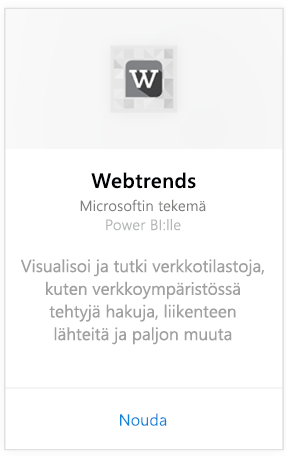
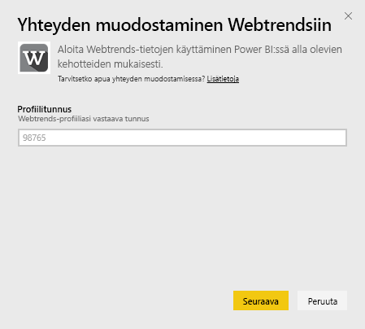
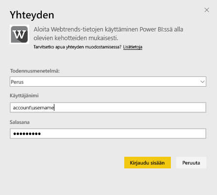
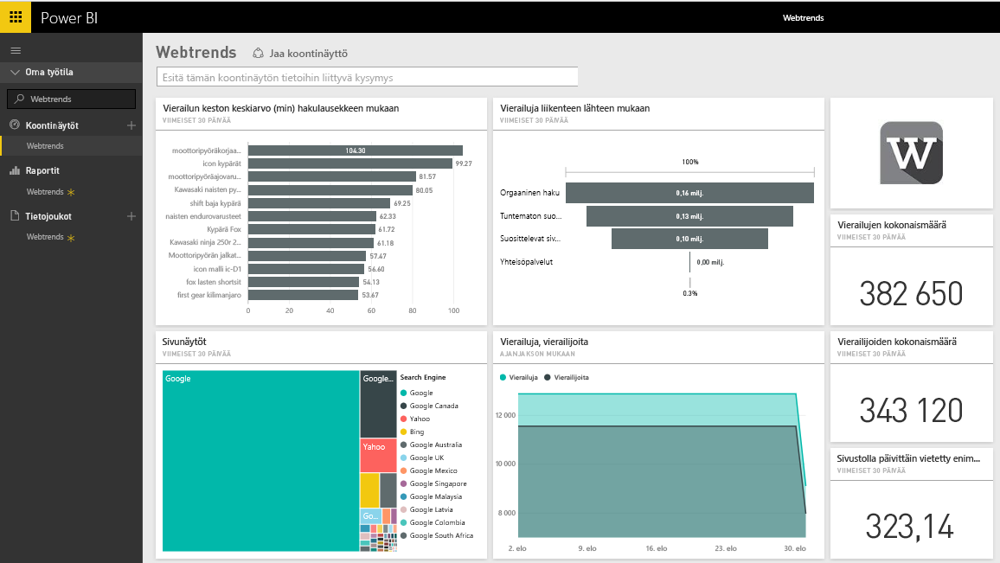
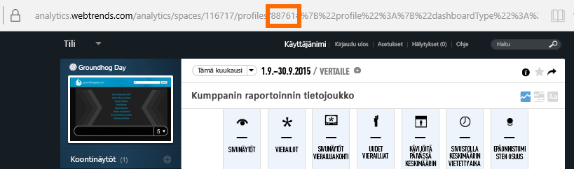
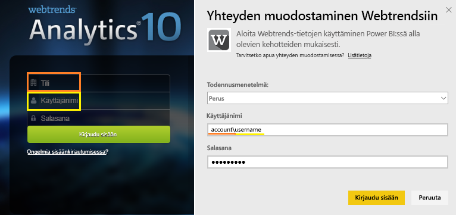

# Yhteyden muodostaminen Webtrendsiin Power BI:n avulla
Power BI:lle suunniteltu Webtrends-sisältöpaketti sisältää lukuisia heti käyttövalmiita mittareita, kuten sivunäkymien yhteismäärän ja vierailut liikenteen lähteen mukaan. Aloita Webtrends-tietojen visualisointi Power BI:ssä muodostamalla yhteys Webtrends-tiliisi. Voit käyttää annettua raporttinäkymää ja raportteja tai mukauttaa niitä, jotta niissä korostuvat itseäsi eniten kiinnostavat tiedot.  Tiedot päivitetään automaattisesti kerran päivässä.

Muodosta yhteys [Webtrends-sisältöpakettiin](https://app.powerbi.com/getdata/services/webtrends) Power BI:lle.

## Yhteyden muodostaminen
1. Valitse vasemman siirtymisruudun alareunassa **Nouda tiedot**.
   
   
2. Valitse **Palvelut**-ruudussa **Nouda**.
   
   
3. Valitse **Webtrends** \> **Hanki**.
   
   
4. Sisältöpaketti yhdistää tiettyyn Webtrends-profiilin tunnukseen. Lisätietoja [tämän parametrin etsimisestä](#FindingParams) on alla.
   
   
5. Muodosta yhteys antamalla Webtrends-tunnistetietosi. Huomaa, että käyttäjänimi-kenttään on kirjoitettava sekä tilisi että käyttäjänimesi. Katso [tiedot](#FindingParams) alla.
   
   
6. Hyväksymisen jälkeen tuontiprosessi alkaa automaattisesti. Kun kaikki on valmista, uusi raporttinäkymä, raportti ja malli näkyvät siirtymisruudussa. Voit tarkastella tuotuja tietoja valitsemalla raporttinäkymän.
   
   

**Mitä seuraavaksi?**

* Kokeile [kysymyksen esittämistä raporttinäkymän yläreunassa olevassa Q&A-ruudussa](consumer/end-user-q-and-a.md).
* [Muuta koontinäytön ruutuja](service-dashboard-edit-tile.md).
* [Valitse jokin ruutu](consumer/end-user-tiles.md), jolloin siihen liittyvä raportti avautuu.
* Tietojoukko on ajastettu päivittymään päivittäin, mutta voit muuttaa päivitysaikataulua tai kokeilla tietojoukon päivittämistä **Päivitä nyt** -toiminnolla haluamanasi ajankohtana

## Paketin sisältö

Webtrends-sisältöpaketti hakee tietoja seuraavista raporteista:  

| Raportin nimi | Raporttitunnus |
| --- | --- |
| Avainmittarit | |
| Sivustojen sisäiset haut |34awBVEP0P6 |
| Sivuilta poistumiset |7FshY8eP0P6 |
| Seuraavat sivut |CTd5rpeP0P6 |
| Edelliset sivut |aSdOeaUgnP6 |
| Sivuston sivut |oOEWQj3sUo6 |
| Sivustojen mainosten napsautukset |41df19b6d9f |
| Kaupungit |aUuHskcP0P6 |
| Maat |JHWXJNcP0P6 |
| Vierailijat |xPcmTDDP0P6 |
| Vierailun kesto |U5KAyqdP0P6 |
| Hakulausekkeet |IKYEDxIP0P6 |
| Liikenteen lähteet |JmttAoIP0P6 |
| Hakukoneet |yGz3gAGP0P6 |
| Sivuille saapumiset |i6LrkNVRUo6 |

>[!NOTE]
>SharePoint-profiilien mittajärjestelmään perustuvat järjestelmän nimet voivat poiketa hieman Webtrends-käyttöliittymässä näytetyistä. Seuraavien liitosten avulla SharePoint- ja Web-profiilien yhtenäisyys säilytetään:   

    - Istunnot = Vierailut  
    - Uudet käyttäjät = Uudet vierailijat  
    - Katselukertoja istuntoa kohden = Sivun katselukertoja vierailua kohden  
    - Päivittäinen käyttäjän kesto keskimäärin = Keskimääräinen sivustolla vietetty aika vierailijaa kohden  

## Järjestelmävaatimukset
Sisältöpaketti edellyttää pääsyä Webtrends-profiiliin, jossa on käytössä [oikea raporttien joukko](#Included).

## Parametrien löytäminen
Webtrends-profiilitunnuksesi löytyy URL-osoitteesta, kun olet valinnut profiilin:

Tunnistetiedot ovat samat kuin Webtrendsiin kirjautuessasi, mutta tilisi ja käyttäjänimesi on oltava samalla rivillä kenoviivalla erotettuna:

## Vianmääritys
Sisältöpakettia ladattaessa saattaa tapahtua virhe tunnistetietojen antamisen jälkeen. Jos näet ”Hups”-viestin ladattaessa, katso alla olevat vianmääritysehdotukset. Jos ongelmat jatkuvat, lähetä tukipyyntö osoitteessa https://support.powerbi.com

1. Jos oikea profiilitunnus on käytössä, katso lisätiedot [Parametrien etsiminen](#FindingParams) -ohjeartikkelista.
2. Käyttäjällä on käyttöoikeudet [Sisältö](#Included)-osion raportteihin

## Seuraavat vaiheet
[Mikä on Power BI?](power-bi-overview.md)

[Power BI:n peruskäsitteet](consumer/end-user-basic-concepts.md)

