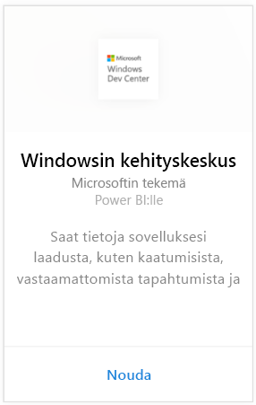
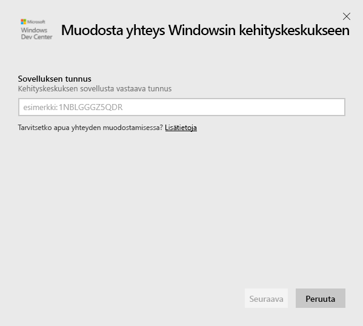
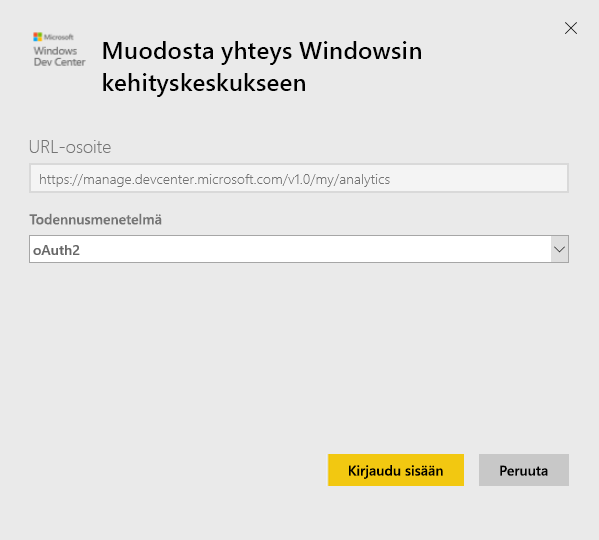
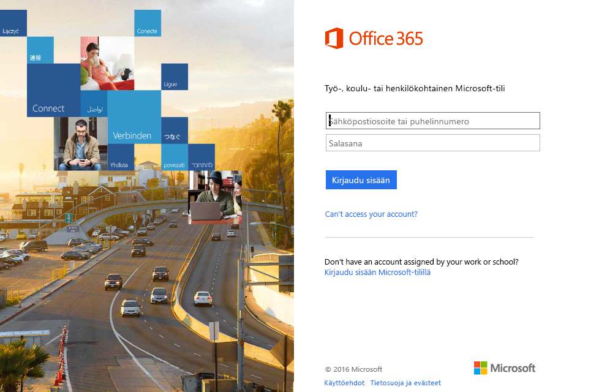
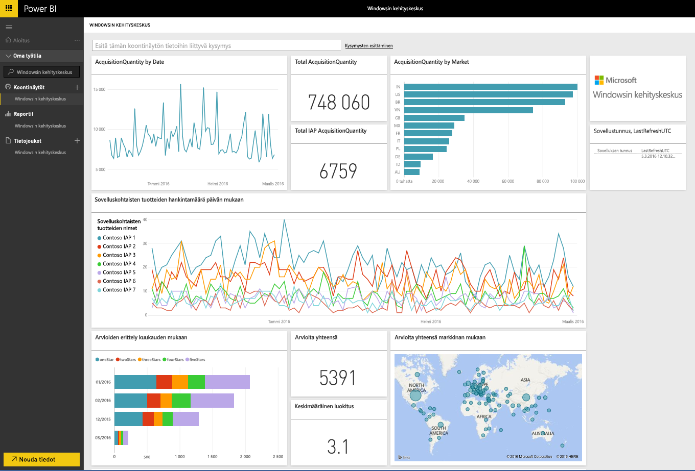
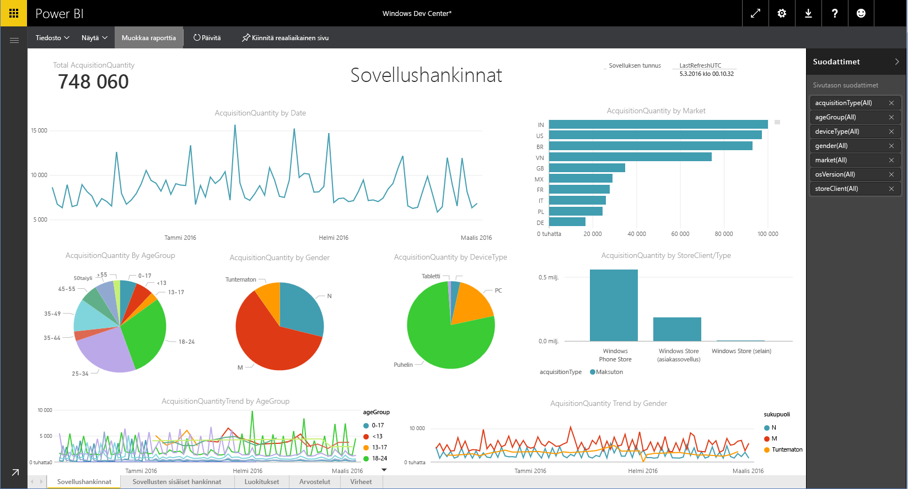

# Windowsin kehityskeskukseen yhdistäminen Power BI:n avulla
Tutki ja katsele Windowsin kehityskeskuksen sovelluksen analytiikkatietoja Power BI:ssä Power BI -sisältöpaketin avulla. Tiedot päivitetään automaattisesti kerran päivässä.

Yhdistä Power BI:n [Windowsin kehityskeskuksen sisältöpakettiin](https://app.powerbi.com/getdata/services/devcenter).

## Yhteyden muodostaminen
1. Valitse vasemman siirtymisruudun alareunassa **Nouda tiedot**.
   
   
2. Valitse **Palvelut**-ruudussa **Nouda**.
   
   
3. Valitse **Windowsin kehityskeskus** \>  **Nouda**.
   
   
4. Anna omistamasi sovelluksen sovellustunnus ja napsauta Seuraava. Alla on lisätietoja [näiden parametrien etsimisestä ](#FindingParams).
   
   
5. Valitse **todennusmenetelmäksi** **oAuth2** \> **Kirjaudu sisään**. Anna pyydettäessä Windowsin kehityskeskuksen tiliisi liitetyt Azure Active Directory -tunnistetiedot (lisätietoja on [järjestelmävaatimuksissa](#Requirements)).
   
    
   
    
6. Tuonti alkaa hyväksymisen jälkeen automaattisesti. Kun tuonti on valmis, uusi koontinäyttö, raportti ja malli näkyvät siirtymisruudussa. Valitse koontinäyttö, jos haluat katsella tuotuja tietoja, ja valitse ruutu, jos haluat siirtyä pohjana oleviin raportteihin.
   
    
   
    

**Mitä seuraavaksi?**

* Kokeile [kysymyksen esittämistä raporttinäkymän yläreunassa olevassa Q&A-ruudussa](consumer/end-user-q-and-a.md).
* [Muuta koontinäytön ruutuja](service-dashboard-edit-tile.md).
* [Valitse jokin ruutu](consumer/end-user-tiles.md), jolloin siihen liittyvä raportti avautuu.
* Tietojoukko on ajastettu päivittymään päivittäin, mutta voit muuttaa päivitysaikataulua tai kokeilla tietojoukon päivittämistä **Päivitä nyt** -toiminnolla haluamanasi ajankohtana

## Paketin sisältö
Kehityskeskuksen Power BI -sisältöpaketti sisältää sovelluksen, lisäosahankintojen, luokitusten, arvostelujen ja sovelluksen kunnon analytiikkatiedot. Tiedot esitetään kolmen edellisen kuukauden ajalta. Lisäksi tiedot esitetään liukuvina keskiarvoina, joten ajanjaksoon sisältyvät päivämäärät päivittyvät sitä mukaa kuin tietojoukko päivittyy.

## Järjestelmävaatimukset
Tämä sisältöpaketti edellyttää vähintään yhtä Windows Storeen julkaistua sovellusta ja Windowsin kehityskeskuksen tiliä (lisätietoja on [täällä](https://msdn.microsoft.com/windows/uwp/publish/manage-account-users)).

## Parametrien etsiminen
Voit etsiä sovelluksen sovellustunnuksen sovellustenhallinnan sovelluksen tunnistetietosivulta.

Sovellustunnus on Windows 10 Storen URL-osoitteen lopussa, https://www.microsoft.com/store/apps/ **{applicationId}**

## Seuraavat vaiheet
[Power BI:n käytön aloittaminen](service-get-started.md)

[Tietojen noutaminen Power BI:ssä](service-get-data.md)

