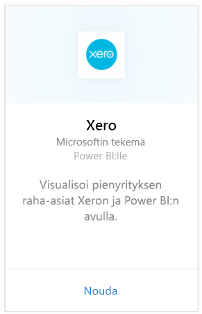
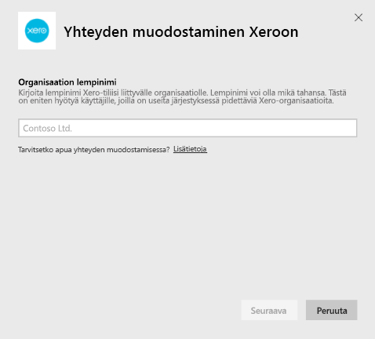
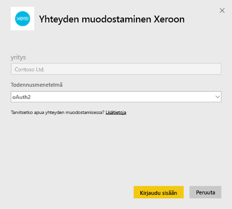
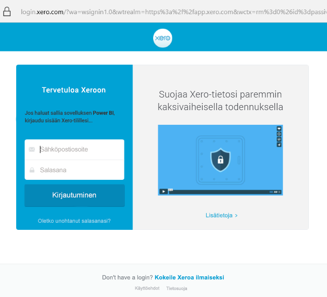
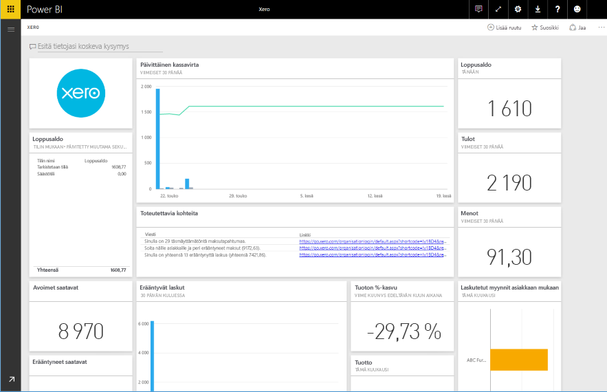

# Yhteyden muodostaminen Xeroon Power BI:n avulla
Xero on helppokäyttöinen verkkokirjanpito-ohjelmisto, joka on suunniteltu erityisesti pienille yrityksille. Tämän Power BI -sisältöpaketin avulla voit luoda vaikuttavia visualisointeja Xeron taloustietojen pohjalta. Oletuskoontinäyttö sisältää useita pienyritysten mittareita, kuten käteistilanteen, tuoton vs kulut, voiton ja tappion trendin, velallisen maksupäivät ja sijoitetun pääoman tuoton.

Muodosta yhteys Power BI:n [Xero-sisältöpakettiin](https://app.powerbi.com/getdata/services/xero) tai lue lisää [Xeron ja Power BI:n](https://help.xero.com/Power-BI) integroinnista.

## Yhteyden muodostaminen
1. Valitse vasemman siirtymisruudun alareunassa **Nouda tiedot**.
   
   
2. Valitse **Palvelut**-ruudussa **Nouda**.
   
   
3. Valitse **Xero** \> **Nouda**.
   
   
4. Kirjoita lempinimi Xero-tiliisi liittyvälle organisaatiolle. Mikä tahansa nimi kelpaa. Sen pääasiallinen tarkoitus on auttaa useiden Xero-organisaatioiden parissa toimivia käyttäjiä pitämään eri tilit järjestyksessä. Tarkempia tietoja on [alla](#FindingParams).
   
   
5. Valitse **todennusmenetelmäksi** **OAuth**, kun sinua kehotetaan kirjautumaan Xero-tilillesi ja valitsemaan organisaatio, johon haluat muodostaa yhteyden. Kun olet kirjautunut, käynnistä lataus valitsemalla **Kirjaudu sisään**.
   
    
   
    
6. Tuontiprosessi alkaa automaattisesti hyväksymisen jälkeen. Kun kaikki on valmista, uusi koontinäyttö, raportti ja malli näkyvät siirtymisruudussa. Voit tarkastella tuotuja tietoja valitsemalla koontinäytön.
   
     

**Mitä seuraavaksi?**

* Kokeile [kysymyksen esittämistä koontinäytön yläreunassa olevassa Q&A-ruudussa](power-bi-q-and-a.md).
* [Muuta koontinäytön ruutuja](service-dashboard-edit-tile.md).
* [Valitse jokin ruutu](service-dashboard-tiles.md), jolloin siihen liittyvä raportti avautuu.
* Tietojoukko ajastetaan päivittymään päivittäin, mutta voit muuttaa päivitysaikataulua tai kokeilla tietojoukon päivittämistä **Päivitä nyt** -toiminnolla haluamanasi ajankohtana.

## Paketin sisältö
Sisältöpaketin koontinäyttö sisältää ruutuja ja mittareita eri alueilta sekä vastaavat, lisätietoja sisältävät raportit:  

| Alue | Koontinäytön ruudut | Raportti |
| --- | --- | --- |
| Kassa |Päivittäinen kassavirta  Tulot  Menot  Loppusaldo tilin mukaan  Loppusaldo tänään |Pankkitilit |
| Asiakas |Laskutetut myynnit  Laskutetut myynnit asiakkaan mukaan  Laskutettujen myyntien kasvutrendi  Erääntyvät myyntilaskut  Avoimet saatavat  Erääntyneet saatavat |Asiakas  Varasto |
| Toimittaja |Laskutetut ostot  Laskutettu ostot toimittajan mukaan  Laskutettujen ostojen kasvutrendi   Erääntyvät ostolaskut  Avoimet maksettavat  Erääntyneet maksettavat |Toimittajat  Varasto |
| Varasto |Kuukausittaisen myynnin määrä tuotteen mukaan |Varasto |
| Tulos |Kuukausittainen tulos  Kuluvan tilikauden nettovoitto  Kuluvan kuukauden nettovoitto  Suurimmat kulutilit |Tulos |
| Tase |Vastaavaa yhteensä  Vastattavaa yhteensä  Oma pääoma |Tase |
| Kunto |Current ratio -tunnusluku  Bruttovoitto prosentteina   Pääoman tuottoaste  Vastattavan ja oman pääoman välinen suhde |Kunto  Sanasto ja tekniset huomautukset |

Tietojoukko sisältää myös seuraavat taulukot, joiden avulla raportteja ja koontinäyttöjä voi mukauttaa:  

* Osoitteet  
* Hälytykset  
* Tiliotteen päiväsaldo  
* Tiliotteet  
* Yhteystiedot  
* Kululaskut  
* Laskurivinimikkeet  
* Laskut  
* Kohteet  
* Kuukauden loppu  
* Organisaatio  
* Alustava tase  
* Xero-tilit

## Järjestelmävaatimukset
Xero-sisältöpaketin käyttämiseen tarvitaan Standard + Reports- tai Advisor-rooli.

## Parametrien etsiminen
Anna organisaatiollesi nimi, jolla sitä voi seurata Power BI:ssä. Näin voit muodostaa yhteyden useisiin eri organisaatioihin. Huomaa, että et voi muodostaa yhteyttä samaan organisaatioon useita kertoja, sillä se vaikuttaa ajoitettuun päivitykseen.   

## Vianmääritys
* Jotta Xero-käyttäjät voivat käyttää Power BI:n Xero-sisältöpakettia, heillä on oltava Standard + Reports- tai Advisor-rooli. Sisältöpaketti tarvitsee käyttäjäpohjaisia käyttöoikeuksia voidakseen käyttää raportointitietoja Power BI:n kautta.  
* Jos lataamisessa ilmenee virhe jonkin ajan kuluttua, tarkista kuinka kauan kesti, ennen kuin virhesanoma tuli näkyviin. Huomaa, että Xeron tarjoama käyttöoikeustietue on voimassa vain 30 minuuttia, joten jos tilillä on enemmän tietoja kuin kyseisenä ajanjaksona voi ladata, toiminto epäonnistuu. Pyrimme aktiivisesti tekemään parannuksia tässä suhteessa.
* Latauksen aikana koontinäytön ruudut ovat yleisessä lataustilassa. Niiden tilan ei pitäisi muuttua, ennen kuin koko lataus on valmis. Jos saat ilmoituksen, että lataus on suoritettu, mutta ruudut latautuvat yhä, yritä päivittää koontinäytön ruudut käyttämällä koontinäytön oikeassa yläkulmassa olevaa ...-painiketta.
* Jos-sisältöpaketin päivitys epäonnistuu, tarkista, oletko muodostanut yhteyden samaan organisaatioon Power BI:ssä useammin kuin kerran. Xero sallii vain yhden aktiivisen yhteyden organisaatioon, ja näyttöön voi tulla virhesanoma, jonka mukaan tunnistetiedot ovat virheelliset, jos muodostat yhteyden samaan kohteeseen useammin kuin kerran.  
* Jos yhteyden muodostamisessa Power BI:n Xero-sisältöpakettiin ilmenee ongelmia, kuten virhesanomia tai hyvin pitkiä latausaikoja, tyhjennä ensin välimuisti, poista evästeet ja käynnistä selain uudelleen ja muodosta sitten yhteys Power BI:hin uudelleen.  

Muissa ongelmatilanteissa tee palvelupyyntö osoitteessa http://support.powerbi.com, jos ongelma jatkuu.

## Seuraavat vaiheet
[Aloita Power BI:n käyttö](service-get-started.md)

[Nouda tietoja Power BI:ssä](service-get-data.md)

