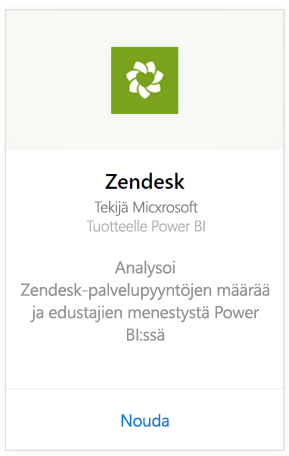
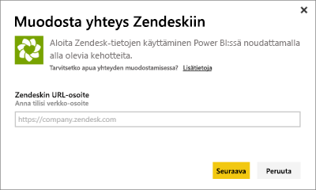
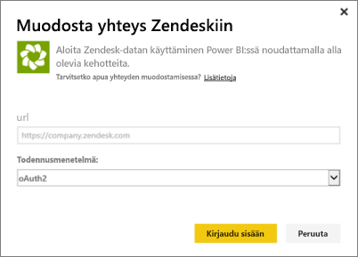
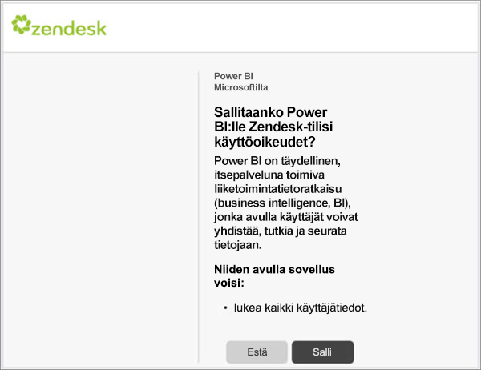
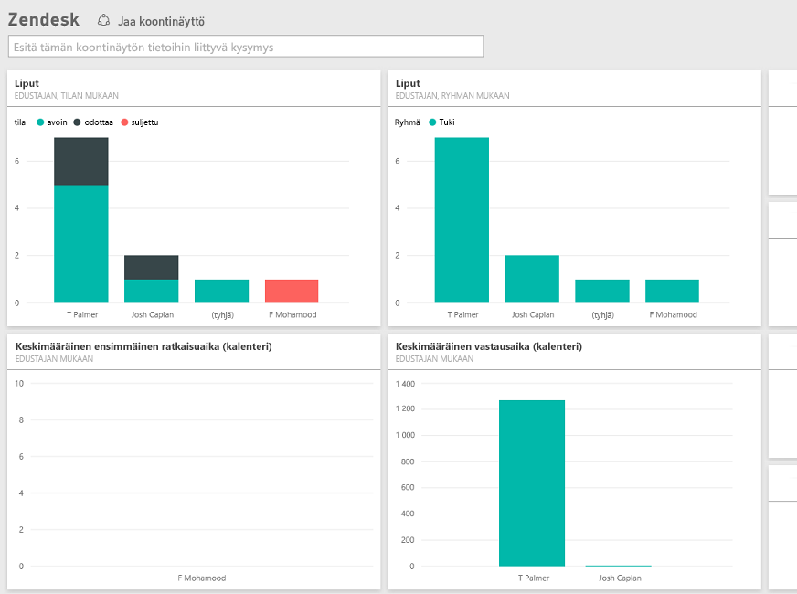

# Zendeskiin yhdistäminen Power BI:n avulla
Zendesk-sisältöpaketti tarjoaa Power BI -koontinäytön ja sarjan Power BI -raportteja, jotka tarjoavat merkityksellisiä tietoja lippujesi määrästä ja agentin suorituskyvystä. Voit käyttää annettua raporttinäkymää ja raportteja tai mukauttaa niitä, jotta niissä korostuvat itseäsi eniten kiinnostavat tiedot.  Tiedot päivitetään automaattisesti kerran päivässä. 

Muodosta yhteys [Zendesk-sisältöpakettiin](https://app.powerbi.com/getdata/services/zendesk) tai lue lisää Power Bi:n [Zendesk-integroinnista](https://powerbi.microsoft.com/integrations/zendesk).

>[!NOTE]
>Yhteyden muodostaminen edellyttää Zendesk-järjestelmänvalvojan tiliä. Lisätietoja [vaatimuksista](#Requirements) on alla.

## Yhteyden muodostaminen
1. Valitse vasemman siirtymisruudun alareunassa **Nouda tiedot**.
   
   
2. Valitse **Palvelut**-ruudussa **Nouda**.
   
    
3. Valitse **Zendesk** \> **Nouda.**
   
   
4. Anna tiliisi liitetty URL-osoite. Tämä on muodossa **https://company.zendesk.com**. Tiedot parametrien hakuun [löytyvät](#FindingParams) alta.
   
   
5. Anna pyydettäessä Zendesk-tunnistetiedot.  Valitse todennusmenetelmäksi **oAuth 2** ja valitse **Kirjaudu sisään**. Noudata Zendesk-todennuksen työnkulkua. Jos olet jo kirjautunut Zendeskiin selaimessa, tunnistetietoja ei välttämättä pyydetä.
   
   > [!NOTE]
   > Tämä sisältöpaketti edellyttää, että muodostat yhteyden Zendesk-järjestelmänvalvojan tililtä. 
   > 
   > 
   
   
6. Napsauta **Salli** salliaksesi Power BI:lle Zendesk-tilisi käyttöoikeudet.
   
   
7. Aloita tuontiprosessi valitsemalla **Yhdistä**. Kun Power BI on tuonut tiedot, näet vasemmassa siirtymisruudussa uuden koontinäytön, raportin ja tietojoukon. Uudet kohteet on merkitty keltaisella tähdellä \*.
   
   

**Mitä seuraavaksi?**

* Kokeile [kysymyksen esittämistä koontinäytön yläreunassa olevassa Q&A-ruudussa](power-bi-q-and-a.md)
* [Muuta koontinäytön ruutuja](service-dashboard-edit-tile.md).
* [Valitse jokin ruutu](service-dashboard-tiles.md), jolloin siihen liittyvä raportti avautuu.
* Tietojoukko on ajastettu päivittymään päivittäin, mutta voit muuttaa päivitysaikataulua tai kokeilla tietojoukon päivittämistä **Päivitä nyt** -toiminnolla haluamanasi ajankohtana

## Paketin sisältö
Power BI -sisältöpaketti sisältää tietoja seuraavista:  

* Käyttäjät (loppukäyttäjät ja agentit)  
* Organisaatiot  
* Ryhmät  
* Liput  

On myös olemassa joukko mittareita, jotka on laskettu, kuten keskimääräinen odotusaika ja ratkaissut tukipyynnöt viimeisten 7 päivän aikana. Täydellinen luettelo sisältyy sisältöpakettiin.

## Järjestelmävaatimukset
Zendesk-sisältöpaketti edellyttää Zendesk- järjestelmänvalvojan tiliä. Jos olet agentti tai loppukäyttäjä ja olet kiinnostunut Zendesk-tietojen tarkastelemisesta, lisää ehdotus ja tarkista Zendesk-yhdistin [Power BI Desktopista](desktop-connect-to-data.md).

## Parametrien löytäminen
Zendeskin URL-osoite on sama kuin URL-osoite, jota käytät kirjautuessasi Zendesk-tilillesi. Jos et ole varma Zendesk URL-osoitteesta, voit käyttää Zendesk [kirjautumisapua](https://www.zendesk.com/login/).

## Vianmääritys
Jos sinulla on ongelmia yhteyden kanssa, tarkista Zendeskin URL-osoite ja varmista, että käytät Zendesk-järjestelmänvalvojatiliä.

## Seuraavat vaiheet
* [Power BI:n käytön aloittaminen](service-get-started.md)
* [Nouda tiedot](service-get-data.md)

