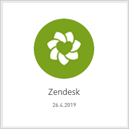
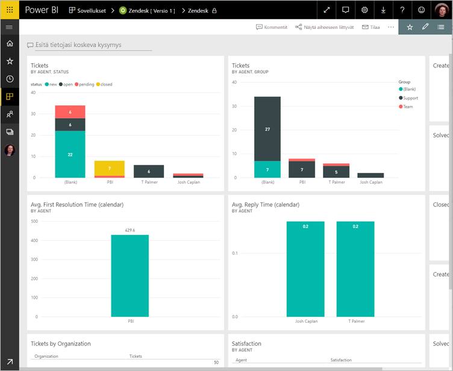
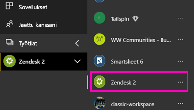

# Zendeskiin yhdistäminen Power BI:n avulla

Tässä artikkelissa opastetaan vetämällä Zendesk-tilisi sovelluksessa Power BI-mallin tiedot. Zendesk-sovellus tarjoaa Power BI-koontinäytön ja joukon Power BI-raportteja, jotka antavat merkityksellisiä tietoja lippujesi määrästä ja agentin suorituskyvystä. Tiedot päivitetään automaattisesti kerran päivässä. 

Kun olet asentanut sovelluksen mallin, voit mukauttaa koontinäyttöä ja raporttia, jotta voit korostaa tiedot, jotka kiinnostavat sinua eniten. Sitten voit jakaa sen sovelluksena työtovereiden organisaatiossasi.

Muodosta yhteys [Zendesk-sisältöpakettiin](https://app.powerbi.com/getdata/services/zendesk) tai lue lisää Power Bi:n [Zendesk-integroinnista](https://powerbi.microsoft.com/integrations/zendesk).

Kun olet asentanut sovelluksen mallin, voit muuttaa koontinäyttöä ja raporttia. Sitten voit jakaa sen sovelluksena työtovereiden organisaatiossasi.

>[!NOTE]
>Tarvitset yhteyden Zendesk-järjestelmänvalvojan tiliä. Lisätietoja [vaatimuksista](#system-requirements) on alla.

## Yhteyden muodostaminen

[!INCLUDE [powerbi-service-apps-get-more-apps](./includes/powerbi-service-apps-get-more-apps.md)]

3. Valitse **Zendesk** \> **hanki se nyt**.
4. - **Asentaa Power BI-sovelluksesta?** Valitse **asentaa**.
4. - **Sovelluksia** ruudussa **Zendesk** ruudun.

    

6. - **Uuden sovelluksen käytön aloittaminen**, valitse **yhdistää tiedot**.

    

4. Anna tiliisi liitetty URL-osoite. URL-osoite on muotoa **https://company.zendesk.com** . Lisätietoja [näiden parametrien löytämisestä](#finding-parameters) on alla.
   
   

5. Anna pyydettäessä Zendesk-tunnistetiedot.  Valitse todennusmenetelmäksi **oAuth 2** ja valitse **Kirjaudu sisään**. Noudata Zendesk-todennuksen työnkulkua. (Jos olet jo kirjautunut zendeskiin selaimessa, voit ehkä ei pyydetä tunnistetiedot.)
   
   > [!NOTE]
   > Tämä sisältöpaketti edellyttää, että muodostat yhteyden Zendesk-järjestelmänvalvojan tiliä. 
   > 
   
   
6. Napsauta **Salli** salliaksesi Power BI:lle Zendesk-tilisi käyttöoikeudet.
   
   
7. Aloita tuontiprosessi valitsemalla **Yhdistä**. 
8. Kun Power BI on tuonut tiedot, näet sisällön luettelon Zendesk-sovelluksellesi: uuden koontinäytön, raportin ja tietojoukon.
9. Valitse koontinäyttö Aloita tarkastelemisen.

    
   
## Muokata ja jakaa sovelluksen

Olet asentanut sovelluksen Zendesk-malli. Tämä tarkoittaa myös luomaasi Zendesk-sovelluksen työtilassa. Työtilassa voit muuttaa raportin ja koontinäytön ja jakaa sen *sovelluksen* työtovereiden organisaatiossasi. 

1. Tarkastele uusi Zendesk-työtila sisällön vasemmassa siirtymispalkissa valitsemalla **työtilat** > **Zendesk**. 

    

    Tämä näkymä on työtilan sisältöluettelosta. Näet oikeassa yläkulmassa, **Päivitä sovellus**. Kun olet valmis jakamaan sovelluksesi työtovereillesi, joka on jossa aloitat. 

    

2. Valitse **raporttien** ja **tietojoukkoja** Nähdäksesi työtilan muut elementit.

    Lue [jakaminen sovellusten](service-create-distribute-apps.md) työtovereillesi.

## Järjestelmävaatimukset
Zendesk-sisältöpaketti edellyttää Zendesk- järjestelmänvalvojan tiliä. Jos olet agentti tai loppukäyttäjä ja olet kiinnostunut Zendesk-tietojasi, Lisää ehdotus ja tarkista Zendesk-yhdistin [Power BI Desktop](desktop-connect-to-data.md).

## Parametrien löytäminen
Zendeskin URL-osoite on sama kuin URL-osoite, jota käytät kirjautuessasi Zendesk-tilillesi. Jos et ole varma Zendesk URL-osoitteesta, voit käyttää Zendesk [kirjautumisapua](https://www.zendesk.com/login/).

## Vianmääritys
Jos sinulla on ongelmia yhteyden, tarkista Zendeskin URL-osoite ja varmista käytät Zendesk-järjestelmänvalvojatiliä.

## Seuraavat vaiheet

* [Luo uusi työtilat Power BI](service-create-the-new-workspaces.md)
* [Asenna ja käytä sovelluksia Power BI:ssä](consumer/end-user-apps.md)
* [Power BI-sovelluksista ulkoisiin palveluihin yhdistäminen](service-connect-to-services.md)
* Onko sinulla kysyttävää? [Voit esittää kysymyksiä Power BI -yhteisössä](http://community.powerbi.com/)

