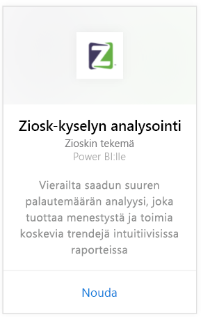

# Yhteyden muodostaminen Ziosk-kyselyn analysointiin Power BI:lla
Ziosk Survey Analytics -sisältöpaketti Power BI:lle tarjoaa Ziosk-tabletteja käyttäville ravintoloille ennennäkemättömän pääsyn Zioskin tutkimustietoihin mukaan lukien päiväkohtainen segmentointi, sijainti, työntekijä ja paljon muuta.

Muodosta yhteys Power BI:n [Ziosk Survey Analytics -sisältöpakettiin](https://app.powerbi.com/getdata/services/ziosk-survey-analytics).

## Yhteyden muodostaminen
1. Valitse vasemman siirtymisruudun alareunassa **Nouda tiedot**.  
   
    
2. Valitse **Palvelut**-ruudussa **Nouda**.  
   
    
3. Valitse **Ziosk Survey Analytics**, ja valitse sitten **Nouda**.  
   
    
4. Valitse **OAuth 2** ja sitten **Kirjaudu sisään**. Anna pyydettäessä Ziosk-tunnistetietosi.
   
    
   
    
5. Kun yhteys on muodostettu, koontinäyttö, raportti ja tietojoukko ladataan automaattisesti. Tämän jälkeen ruudut päivitetään Ziosk-tilisi tiedoilla.
   
    

**Mitä seuraavaksi?**

* Kokeile [kysymyksen esittämistä koontinäytön yläreunassa olevassa Q&A-ruudussa](power-bi-q-and-a.md)
* [Muuta koontinäytön ruutuja](service-dashboard-edit-tile.md).
* [Valitse jokin ruutu](service-dashboard-tiles.md), jolloin siihen liittyvä raportti avautuu.
* Tietojoukko on ajastettu päivittymään päivittäin, mutta voit muuttaa päivitysaikataulua tai kokeilla tietojoukon päivittämistä **Päivitä nyt** -toiminnolla haluamanasi ajankohtana

## Paketin sisältö
Sisältöpaketti sisältää tietoja seuraavista taulukoista:  

    - Alkoholiluokka  
    - Alkupalaluokka  
    - CommentKeywords  
    - Päivämäärä  
    - Daypart  
    - Jälkiruoat-luokka  
    - Vapaamuotoinen  
    - Lapset-luokka  
    - Viestit  
    - Premium-sisältöluokka  
    - Kysymys  
    - Myymälä  
    - Tutkimukset  
    - Arkipäivä  

## Järjestelmävaatimukset
Ziosk-tili, jolla on edellä mainittujen taulukoiden käyttöoikeudet, on edellytys tämän sisältöpaketin alustamiselle.

## Seuraavat vaiheet
[Power BI:n käytön aloittaminen](service-get-started.md)

[Power BI:n peruskäsitteet](service-basic-concepts.md)

