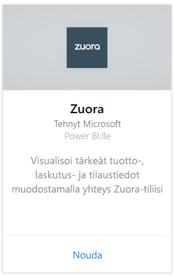
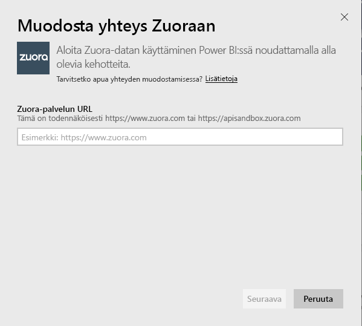
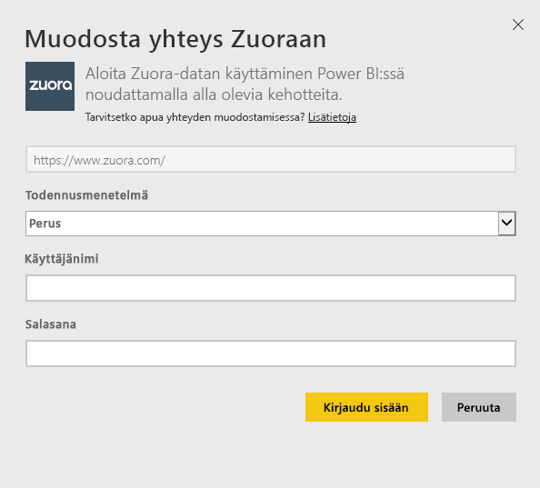
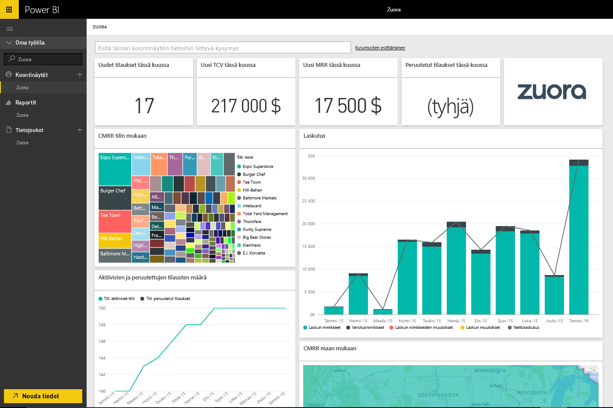

# Yhteyden muodostaminen Zuoraan Power BI:llä
Zuora for Power BI:n avulla voit visualisoida tärkeät tuotto-, laskutus- ja tilaustiedot. Käytä oletusraporttinäkymiä ja -raportteja käyttötrendien analysointiin, laskutuksen ja maksujen seurantaan sekä toistuvan tuoton valvontaan, tai mukauta niitä omien raporttinäkymä- ja raportointitarpeidesi mukaan.

Yhteyden muodostaminen [Zuora](https://app.powerbi.com/getdata/services/Zuora) for Power BI:hin.

## Yhteyden muodostaminen
1. Valitse vasemman siirtymisruudun alareunassa **Nouda tiedot**.

   
2. Valitse **Palvelut**-ruudussa **Nouda**.

   
3. Valitse **Zuora** \>  **Nouda**.

   
4. Määritä Zuoran URL-osoite. URL on tavallisesti <https://www.zuora.com>. Katso lisätiedot [näiden parametrien etsimisestä](#FindingParams) alta.

   
5. Valitse **Todennusmenetelmä**-kohdassa **Perus** ja anna käyttäjänimesi ja salasanasi (kirjainkoolla on merkitystä), ja valitse sitten **Kirjaudu sisään**.

    
6. Hyväksymisen jälkeen tuontiprosessi alkaa automaattisesti. Kun kaikki on valmista, uusi raporttinäkymä, raportti ja malli näkyvät siirtymisruudussa. Voit tarkastella tuotuja tietoja valitsemalla raporttinäkymän.

     

**Mitä seuraavaksi?**

* Kokeile [kysymyksen esittämistä raporttinäkymän yläreunassa olevassa Q&A-ruudussa](consumer/end-user-q-and-a.md).
* [Muuta koontinäytön ruutuja](service-dashboard-edit-tile.md).
* [Valitse jokin ruutu](consumer/end-user-tiles.md), jolloin siihen liittyvä raportti avautuu.
* Tietojoukko on ajastettu päivittymään päivittäin, mutta voit muuttaa päivitysaikataulua tai kokeilla tietojoukon päivittämistä **Päivitä nyt** -toiminnolla haluamanasi ajankohtana

## Paketin sisältö
Sisältöpaketti käyttää Zuora AQUA -ohjelmointirajapintaa seuraavien taulukoiden noutamiseksi:

| Taulukot |  |  |
| --- | --- | --- |
| Tili |InvoiceItemAdjustment |Hyvitys |
| AccountingCode |Maksu |RevenueSchedule |
| AccountingPeriod |PaymentMethod |RevenueScheduleItem |
| BillTo |Tuote |Tilaus |
| DateDim |ProductRatePlan |TaxationItem |
| Lasku |ProductRatePlanCharge |Käyttö |
| InvoiceAdjustment |RatePlan | |
| InvoiceItem |RatePlanCharge | |

Se sisältää myös nämä lasketut mittarit:

| Mittari | Kuvaus | Pseudo-laskenta |
| --- | --- | --- |
| Tili: maksut |Kokonaismaksusummat tietyllä ajanjaksolla maksun voimaantulopäivän mukaan. |SUM (Payment.Amount)  WHERE Payment.EffectiveDate =< TimePeriod.EndDate AND    Payment.EffectiveDate >= TimePeriod.StartDate |
| Tili: Hyvitykset |Kokonaishyvityssummat tietyllä ajanjaksolla hyvityksen päivämäärän mukaan. Summa ilmoitetaan negatiivisena lukuna. |-1*SUM(Refund.Amount) WHERE Refund.RefundDate = < TimePeriod.EndDate AND    Refund.RefundDate >= TimePeriod.StartDate |
| Tili: nettomaksut |Tilin maksut ja tilin hyvitykset ajanjaksolla. |Account.Payments + Account.Refunds |
| Tili: aktiiviset tilit |Niiden tilien määrä, jotka olivat aktiivisia ajanjaksolla. Tilaukset on oltava aloitettu viimeistään ajanjakson aloituspäivämääränä. |COUNT (Account.AccountNumber) WHERE     Subscription.Status != "Expired" AND    Subscription.Status != "Draft" AND    Subscription.SubscriptionStartDate <= TimePeriod.StartDate AND    (Subscription.SubscriptionEndDate > TimePeriod.StartDate TAI Subscription.SubscriptionEndDate = null) –evergreen subscription |
| Tili: keskimääräinen toistuva tuotto |Brutto-MRR aktiivista tiliä kohden ajanjaksolla. |Brutto-MRR / Account.ActiveAccounts |
| Tili: peruutetut tilaukset |Niiden tilien määrä, jotka ovat peruuttaneet tilauksen ajanjaksolla. |COUNT (Account.AccountNumber) WHERE Subscription.Status = "Cancelled" AND    Subscription.SubscriptionStartDate <= TimePeriod.StartDate AND    Subscription.CancelledDate >= TimePeriod.StartDate |
| Tili: maksuvirheet |Maksuvirheiden kokonaisarvo. |SUM (Payment.Amount) WHERE Payment.Status = "Error" |
| Tuoton ajoituskohde: tunnistettu tuotto |Tunnistettu kokonaistuotto laskentakaudella. |SUM (RevenueScheduleItem.Amount) WHERE AccountingPeriod.StartDate = TimePeriod.StartDate |
| Tilaus: uudet tilaukset |Uusien tilausten määrä ajanjaksolla. |COUNT (Subscription.ID) WHERE Subscription.Version = ”1” AND    Subscription.CreatedDate <= TimePeriod.EndDate AND    Subscription.CreatedDate >= TimePeriod.StartDate |
| Lasku: Laskun nimikkeet |Laskun kokonaisveloitussummat ajanjaksolla. |SUM (InvoiceItem.ChargeAmount) WHERE     Invoice.Status = "Posted" AND    Invoice.InvoiceDate <= TimePeriod.EndDate AND    Invoice.InvoiceDate >= TimePeriod.StartDate |
| Lasku: Verotusnimikkeet |Verotuskohteiden kokonaissummat ajanjaksolla. |SUM (TaxationItem.TaxAmount) WHERE Invoice.Status = "Posted" AND    Invoice.InvoiceDate <= TimePeriod.EndDate AND    Invoice.InvoiceDate >= TimePeriod.StartDate |
| Lasku: Laskun nimikkeiden muutokset |Laskun kohteiden kokonaismuutossummat ajanjaksolla. |SUM (InvoiceItemAdjustment.Amount)  WHERE     Invoice.Status = "Posted" AND    InvoiceItemAdjustment.AdjustmentDate <= TimePeriod.EndDate AND    InvoiceItemAdjustment.AdjustmentDate >= TimePeriod.StartDate |
| Lasku: Laskun muutokset |Laskun kokonaismuutossummat ajanjaksolla. |SUM (InvoiceAdjustment.Amount)  WHERE     Invoice.Status = "Posted" AND    InvoiceAdjustment.AdjustmentDate <= TimePeriod.EndDate AND    InvoiceAdjustment.AdjustmentDate >= TimePeriod.StartDate |
| Lasku: Nettolaskutus |Laskun kohteiden, verotuskohteiden, laskun kohteiden muutosten ja laskun muutosten summa ajanjaksolla. |Invoice.InvoiceItems + Invoice.TaxationItems + Invoice.InvoiceItemAdjustments + Invoice.InvoiceAdjustments |
| Lasku: laskun vanhentumissaldo |Kirjattujen laskun saldojen summa. |SUM (Invoice.Balance)  WHERE     Invoice.Status = "Posted" |
| Lasku: bruttolaskutukset |Kirjattujen laskujen kohteiden veloitusten summa ajanjaksolla. |SUM (InvoiceItem.ChargeAmount)  WHERE     Invoice.Status = "Posted" AND    Invoice.InvoiceDate <= TimePeriod.EndDate AND    Invoice.InvoiceDate >= TimePeriod.StartDate |
| Lasku: kokonaismuutokset |Kirjattuihin laskuihin liittyvien käsiteltyjen laskumuutosten ja laskukohteiden muutosten summa. |SUM (InvoiceAdjustment.Amount)  WHERE     Invoice.Status = "Posted" AND    InvoiceAdjustment.Status = "Processed" + SUM (InvoiceItemAdjustment.Amount)  WHERE     Invoice.Status = "Posted" AND    invoiceItemAdjustment.Status = "Processed" |
| Maksusuunnitelman veloitus: brutto-MRR |Tilausten kuukausittain toistuvan tuoton summa ajanjaksolla. |SUM (RatePlanCharge.MRR)  WHERE     Subscription.Status != "Expired" AND    Subscription.Status != "Draft" AND    RatePlanCharge.EffectiveStartDate <= TimePeriod.StartDate AND        RatePlanCharge.EffectiveEndDate > TimePeriod.StartDate     OR    RatePlanCharge.EffectiveEndDate = null --evergreen subscription |

## Järjestelmävaatimukset
Yhteys Zuora-ohjelmointirajapintaan vaaditaan.

## Parametrien löytäminen
Anna URL-osoite, jota käytät yleensä Zuora-tietojen noutamiseen. Kelvolliset vaihtoehdot ovat:  

* https://www.zuora.com  
* Palveluesiintymääsi vastaava URL-osoite  

## Vianmääritys
Zuora-sisältöpaketti hakee tietoja Zuora-tilisi monilta eri osa-alueilta. Jos et käytä tiettyjä ominaisuuksia, jotkin ruudut/raportit voivat olla tyhjiä. Jos sinulla on ongelmia lataamisessa, ota yhteyttä Power BI -tukeen.

## Seuraavat vaiheet
[Power BI:n käytön aloittaminen](service-get-started.md)

[Tietojen noutaminen Power BI:ssä](service-get-data.md)
