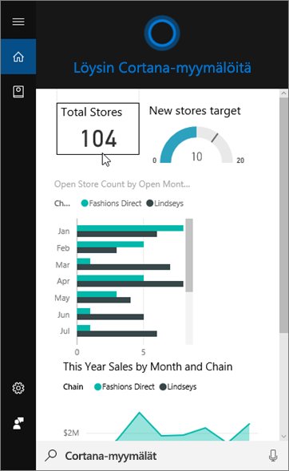
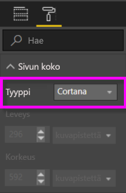
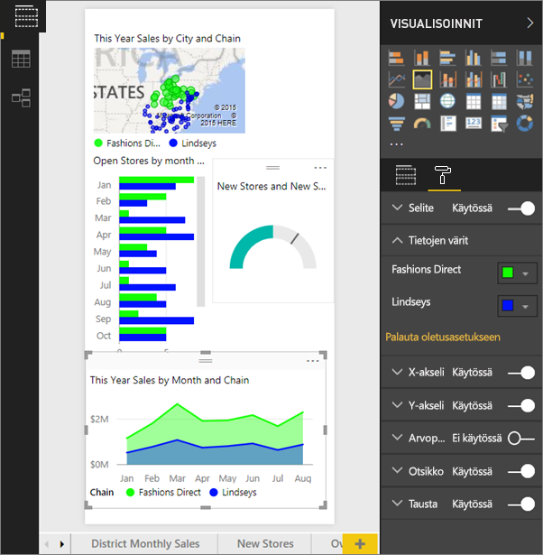
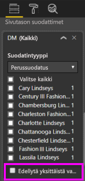

# Käytä Power BI -palvelua tai Power BI Desktopia luodaksesi mukautettuja vastaussivuja Cortanaa varten
Hyödynnä Power BI:n kaikkia ominaisuuksia ja luo erityisiä raporttisivuja, joita kutsutaan *Cortana-vastaussivuiksi* (sekä joskus nimellä "Cortana-vastauskortit"), ja jotka on suunniteltu vastaamaan erityisesti Cortana-kysymyksiin.

> [!IMPORTANT]
> Jos kokeilet Cortanan ja Power BI:n **koontinäytön** esikatselua, voit ohittaa loput tästä artikkelista. Cortanalle ei ole asennusvaatimuksia, jotta se voisi etsiä Power BI -raporttinäkymiäsi.
> 
> 

## Alkutoimet
Seuraavat neljä asiakirjaa opastavat Power BI:n Cortanan asetuksissa ja käytössä. Suosittelemme aloittamaan lukemalla artikkelin 1. Artikkeli 2 on erityisen tärkeä, koska siinä käsitellään joitakin vaiheita, jotka on suoritettava, ennen kuin voit käyttää Cortana-vastaussivuja.

**Artikkeli 1** [Opi kuinka Cortana ja Power BI toimivat yhdessä](service-cortana-intro.md)

**Artikkeli 2**: [Power BI -raporttien hakeminen: Cortanan käyttöönotto ja integrointi Power BI:hin Windowsissa](service-cortana-enable.md)

**Artikkelin 3**: Tämä artikkeli

**Artikkelin 4**: [Ongelmien vianmääritys](service-cortana-troubleshoot.md)

## Cortanalle erityisesti suunnitellun Cortana-vastaussivun luominen
Raportissa esiintyvän *Cortana-vastaussivun* koko on suunniteltu niin, että Cortana voi näyttää sen näytöllä vastauksena kysymykseen.  Cortana-vastaussivun luominen:

1. Suosittelemme aloittamaan [tyhjällä raporttisivulla](power-bi-report-add-page.md).
2. Valitse **Visualisoinnit**-ruudussa maalirullakuvake ja valitse**Sivun koko > Tyyppi >Cortana**.
   
    
3. Luo visualisointi tai joukko visualisointeja, joiden haluavat näkyvän Cortanassa, vastauksena tiettyyn kysymykseen (tai joukkoon kysymyksiä).
4. Varmista, että visualisoinnit on sovitettu sivun reunuksiin.  Voit halutessasi muokata näytön asetuksia, arvopisteiden nimiä, värejä ja taustoja.  
   
    
5. Nimeä sivu ja lisää vaihtoehtoisia nimiä.  Cortana käyttää näitä nimiä etsiessään tuloksia. Valitse **Visualisointi**-ruudussa sivellinkuvake ja sitten **Sivun tiedot**. Ota visualisoinnille Q&A käyttöön siirtämällä liukusäädin **Päällä**-asentoon.
   
    
   
   > [!TIP]
   > Saat parempia hakutuloksia välttämällä sarakkeiden nimien käyttöä.
   > 
   > 
6. Vaihtoehtoisesti jos raportissasi on sivutason suodattimet, voit halutessasi ottaa **Edellytä yksittäistä valintaa** -asetuksen käyttöön. Cortana näyttää kyseisen raportin vastaukseksi jos yksi, ja vain yksi, suodatinkohteista on määritelty kysymyksessä. **Edellytä yksittäistä valintaa** -asetus löytyy **Suodattimet**-ruudun alareunasta.
   
   > [!NOTE]
   > **Edellytä yksittäistä valintaa** -asetusta ei tarvitse välttämättä ottaa käyttöön, pyytääksesi Cortanaa näyttämään raportin, jossa on sivutason suodattimet.  Esimerkiksi ”näytä Charlotte Lindseyn myynnit” -haku näyttää vastaussivun, edellytä yksittäistä valintaa -asetuksesta riippumatta.
   > 
   > 
   
     
   
      Jos esimerkiksi pyydät Cortanaa:
   
   * "näytä myynnit myymälän nimen mukaan" -haulla kyseistä vastaussivua ei näytetä, koska hakuun ei sisällytetty mitään kohteita, mitkä vaatisivat sivutason suodatinta.
   * "näytä Cary Lindseyn ja Charlotte Lindseyn myynnit" -haulla kyseistä vastaussivua ei näytetä, koska hakuun määritettiin useampi kuin yksi kohde vaaditulta sivutason suodattimelta.
   * "näytä Charlotte Lindseyn myynnit" -haku puolestaan näyttää kyseisen vastaussivun.
     
     = "näytä myynnit" -haulla kyseistä vastaussivua ei näytetä, koska hakuun ei sisällytetty mitään vaaditun sivutason suodattimien kohteita.

> [!IMPORTANT]
> Cortana ei voi käyttää Cortana-vastaussivua ennen kuin [Ota tietojoukko käyttöön Cortanalle](service-cortana-enable.md) -asetus on päällä.
> 
> 

## Miten Cortana järjestää tulokset?
Tulokset, joiden vastauksilla on suuri pistemäärä (kuten täydellinen vastaavuus määritetyn sivun nimen kanssa) näkyvät ensimmäisinä Cortanassa*parhaina vastineina*. Useita parhaita vastineita voi esiintyä, jos Power BI:ssä on useita Cortana-vastaussivuja. Keskimääräisen tai sitä matalammat pistemäärän saaneita vastauksia, kuten sellaisia, jotka eivät perustu vastaussivun nimeen, tai jos kysymyksessä on käytetty sanoja, joita Power BI ei ymmärrä, listataan linkkeinä parhaiden vastineiden alapuolella.

> [!NOTE]
> Kun uusi tietojoukko tai mukautettu Cortana-vastaussivu lisätään Power BI:hin ja otetaan käyttöön Cortanassa, voi kestää jopa 30 minuuttia, että tulokset alkavat näkyä Cortanassa. Sisään- ja uloskirjautuminen Windows 10:en tai Cortanan uudelleenkäynnistäminen Windows 10:ssä sallii heti uuden sisällön ilmestymisen.
> 
> 

## Seuraavat vaiheet
[Cortanan käyttö Power BI:ssä](service-cortana-intro.md)

Mitä jos Cortana ei vieläkään toimi Power BI:ssä?  Kokeile [Cortanan vianmääritystä](service-cortana-troubleshoot.md).

Onko sinulla muuta kysyttävää? [Kokeile Power BI -yhteisöä](http://community.powerbi.com/)

