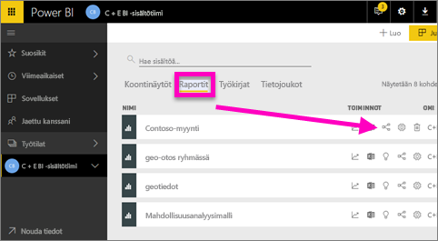
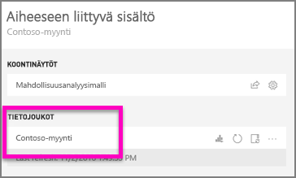
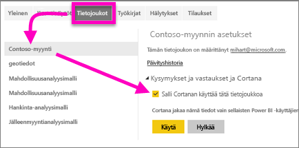
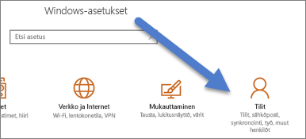
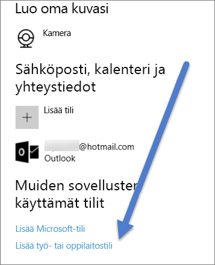

# Mahdollista Cortanalle Power BI-raporttien (ja niiden taustalla olevien tietojoukkojen) käyttö
Olet lukenut sivun [Perehdytys Cortanaan ja Power BI:hin](service-cortana-intro.md) (jos et ole, kannattaa se lukea ensin ja palata sitten takaisin). Ja nyt haluat kokeilla sitä itse.  Muutamien vaatimusten on täytyttävä ennen kuin voit esittää luonnollisella ohjelmointikielellä kysymyksiä Cortanassa ja etsiä vastauksia Power BI ***raportit*** -osioon tallennetuista tiedoista. Tarkemmin sanottuna sinun pitää toimia seuraavasti.

> [!IMPORTANT]
> Cortanan integrointi on vanhentumassa Power BI:ssä. 11. kesäkuuta alkaen Cortana ei enää toimi koontinäyttöjen ja raporttien kanssa.

Power BI -palvelussa

* salli yksi tai useampi tietojoukko Cortanalle (raportit ovat tietojoukkojen päällä, joten Cortana tarvitsee pääsyn kyseisiin tietojoukkoihin)

Microsoft Windowsissa

* Tarkista, että käytössäsi on Windows 10:n versio 1511 tai sitä uudempi versio
* Varmista, että Power BI ja Windows ovat yhteydessä toisiinsa. Tämä tarkoittaa, että liität tilisi Windowsiin.

## Käytä Power BI -palvelua mahdollistaaksesi Cortanan pääsyn Power BI:ssä oleviin raporttisivuihin
Power BI:sä olevien raporttien antaminen Cortanan käytettäväksi on yksinkertainen prosessi.  Itse asiassa sinun tarvitsee vain ottaa raportin pohjana oleva tietojoukko käyttöön valitsemalla ”salli Cortanan käyttää tätä tietojoukkoa”. Tämän jälkeen Windows 10:n käyttäjät voivat saada vastauksia Cortanassa olevasta raportista, mikäli heillä on pääsy Power BI:ssä olevaan tietojoukkoon joko tavallisen Power BI -jakamisen, sovellusten tai sisältöpaketin kautta.

Sinun tulee kirjautua sisään Power BI -palveluun (ei Power BI Desktopiin) ja toistaa nämä vaiheet jokaisen tietojoukon kohdalla, jota haluat Cortanan käyttävän.

1. Määritä, mitkä tietojoukot sallitaan käytettäväksi. Valitse sisältöluettelosta raportti, jota haluat Cortanan voivan käyttää ja valitse **näytä aiheeseen liittyvä** kuvake  .
   
    
2. Tähän raporttiin liittyvä tietojoukko on **Contoso Sales**.
   
    
3. Tietojoukon nimen oikealla puolella, valitse **Enemmän vaihtoehtoja** (...) > Asetukset**.  
   
    
4. Valitse **Q&A ja Cortana** > **salli Cortanan käyttää tätä tietojoukkoa** > **käytä**.
   
   
   
   Tässä esimerkissä mahdollistamme Cortanan käytön Contoso Sales -tietojoukkojen kanssa.
   
   > [!NOTE]
   > Tulokset alkavat ilmestyä 30 minuutin sisällä, uuden tietojoukon tai Cortanan vastauskortin lisäämisestä Power BI:hin ja sen käytön sallimisesta Cortanalle. Sisään- ja uloskirjautuminen Windows 10:en tai Cortanan uudelleenkäynnistäminen Windows 10:ssä sallii heti uuden sisällön ilmestymisen.
   > 
   > Jos sallit tietojoukon käytön Cortanalle, ja kyseinen tietojoukko on osa omistamaasi sisältöpakettia tai sovellusta, täytyy sinun julkaista uudelleen, jotta myös työtoverisi voisivat käyttää kyseistä tietojoukkoa Cortanan kanssa.
   > 
   > 

## Lisää Power BI -tunnistetietosi Windowsiin
Käytössäsi olevan Windows 10:n version on oltava 1511 tai sitä uudempi.

1. Selvitä, mikä Windows 10:n versio sinulla on käytössä. Avaa **asetukset**.
    

    Sen jälkeen valitse **järjestelmä > tietoja**. Näytön alareunassa näet **Windowsin määritykset > versio**

   * Jos sinulla on käytössäsi Windows 10:n versio väliltä 1511 (Windows 10, marraskuu 2015 päivitys) ja 1607, lisää työ- tai koulutilisi sekä Microsoft-tilisi (suorittamalla alla olevat vaiheet 2 ja 3).
   * Jos käytössäsi oleva Windows 10:n versio on 1607 (Windows 10, heinäkuu 2016 päivitys) tai sitä uudempi, lisää työ- tai koulutilisi (suorittamalla ainoastaan alla oleva vaihe 2).
1. Lisää työ- tai koulutilisi Cortanaan.
   
   * Avaa **asetukset** > **tilit**.
     
       
   * Vieritä alas ja valitse **lisää työ- tai koulutili**. Tai, valitse **Tilit**-sivulta **Käytä työ- tai koulutiliä > Yhdistä**.
     
     

Cortana käyttää tätä työ- tai koulutiliä, tarkistaakseen Power BI:stä mahdolliset vastaukset Cortanassa esittämiisi kysymyksiin.

## Seuraavat vaiheet
[Luo Cortana *Vastauskortit* Power BI:ssä](service-cortana-answer-cards.md)

[Cortanan ja Power BI:n integrointiin liittyvien ongelmien vianmääritys](service-cortana-troubleshoot.md)

Onko sinulla muuta kysyttävää? [Kokeile Power BI -yhteisöä](https://community.powerbi.com/)

