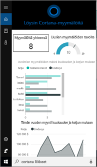
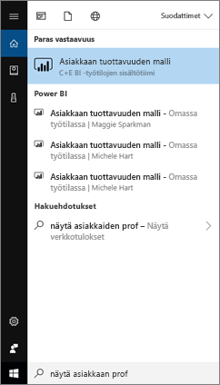
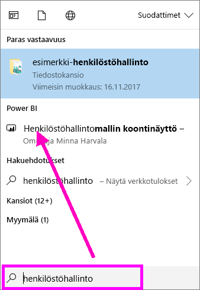
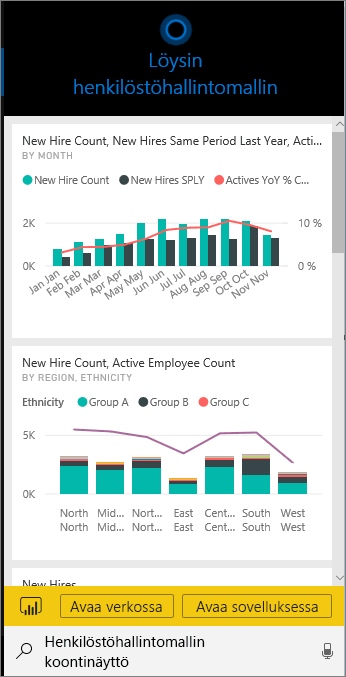
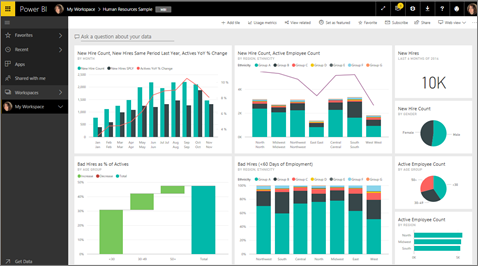
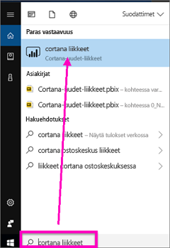
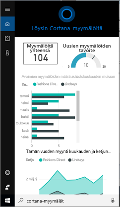
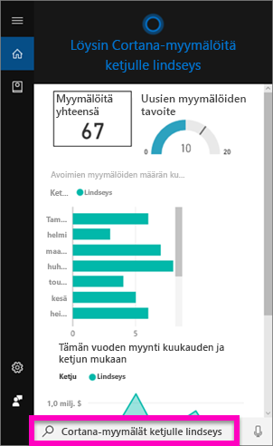
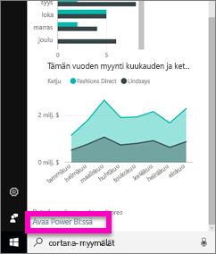
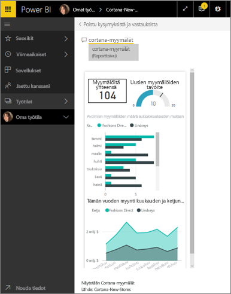

# Etsi ja tarkastele Cortanan kanssa Power BI-tietojasi Power BI-
Saat heti vastauksia liiketoimintaa koskeviin tärkeisiin kysymyksiisi Windows 10 -laitteilla Cortanan avulla. Power BI -integraation avulla Cortana voi noutaa avaintietoja suoraan Power BI -raporttinäkymistä ja -raporteista. Tarvitset vain Windows 10:n marraskuun 2015 version tai sitä uudemman, Cortanan, Power BI:n ja vähintään yhden tietojoukon käyttöoikeudet.

> [!IMPORTANT]
> Power BI-ollaan poistamassa Cortanan integrointia tuetaan. Alkaen kesäkuussa 11 Cortana ei enää toimi koontinäytöille ja raporteille.

## Esikatsele uuden Cortana *-raporttinäkymän* hakukokemusta Windows 10:llä
Aiemmin [Cortanan avulla on voinut noutaa tietyntyyppisiä raporttisivuja](service-cortana-answer-cards.md). Nyt olemme lisänneet **uuden käyttökokemuksen**: mahdollisuuden hakea myös raporttinäkymiä. Kokeile ja [Lähetä meille palautetta Power BI ideoita](https://ideas.powerbi.com/forums/265200-power-bi). *Uutta käyttökokemusta* laajennetaan niin, että lopulta se sisältää myös raporttien Cortana-haun.  Eräs uuden käyttökokemuksen suurimmista eduista on se, että sen käyttöönottoon ei vaadita mitään erityistä, kuten Cortanan käyttöönottoa tai Windows 10:n määrittämistä. Se vain toimii.

> [!NOTE]
> Jos se ei ”vain toimi”, tutustu [vianmääritysartikkelin](service-cortana-troubleshoot.md) ohjeisiin.
> 
> 

Pohjana oleva tekniikka perustuu [Microsoftin Azure-hakupalveluun](https://docs.microsoft.com/azure/search/). Kyseinen hakupalvelu sisältää lisätoimintoja, kuten älykkään luokittelun, virheenkorjauksen ja automaattisen täydentämisen.

Molemmat Cortana voi käyttökokemukset rinnakkain.

## Power BI:n Cortana-ominaisuuden ohjeet
Neljä asiakirjaa kerrotaan voit määrittäminen ja Power BI Cortanan avulla.

**Artikkeli 1** (tämä artikkeli): Opit ymmärtämään, miten Cortana ja Power BI toimivat yhdessä

**Artikkeli 2**: [Hae Power BI-raportit: Cortanan käyttöönotto ja integrointi Power BI:hin Windowsissa](service-cortana-enable.md)

**Artikkeli 3**: [Hakeminen Power BI-raporteista: erityisten *Cortana-vastauskorttien luominen*](service-cortana-answer-cards.md)

**Artikkeli 4**: [Ongelmien vianmääritys](service-cortana-troubleshoot.md)

## Miten Cortana ja Power BI toimivat yhdessä
Cortanan avulla voit esittää kysymyksiä, joihin Cortana voi etsiä vastauksia mm. Power BI:stä. Cortana voi etsiä Power BI -raporteista monipuolisia aineistoperäisiä vastauksia (jotka sisältävät *Cortana-vastauskorteiksi* kutsuttuja erityisiä raporttisivuja) ja Power BI -raporttinäkymiä.

Jos Cortana löytää vastauksen, se näyttää kyseisen raporttinäkymän tai raportin nimen suoraan Cortana-ruudulla. Voit avata raporttinäkymän tai raportin sivun Power BI:ssä. Raportin sivuja voi tarkastella myös suoraan Cortanassa – ne ovat vuorovaikutteisia.

### Cortana ja raporttinäkymät ( *uusi käyttökokemus*)
Cortana voi etsiä vastauksia omistamistasi raporttinäkymistä ja raporttinäkymistä, jotka on jaettu kanssasi. Kysy Cortanalta kysymyksiä otsikoiden, avainsanojen, omistajien nimen, työtilan nimen, sovellusten nimen tai muun ehdon perusteella.

Kysymyksessä on oltava vähintään kaksi sanaa, jotta Cortana voi etsiä vastausta. Jos etsit raporttinäkymää, jonka nimi on yksi sana (”Markkinointi”) lisää ”näytä” tai ”Power BI” tai omistajan nimi kysymykseesi: ”Näytä Markkinointi” ja ”michele hart otos”. 

Jos raporttinäkymän otsikossa on enemmän kuin yksi sana, Cortana palauttaa raporttinäkymän vain, jos hakusi vastaa vähintään kahta sanoista tai yhtä sanoista ja omistajan nimeä. Käytetään esimerkkinä raporttinäkymää, jonka nimi on ”Asiakkaan tuottavuuden malli”: 

* ”Näytä asiakkaan” *ei* palauttaa Power BI-raporttinäkymätulosta.   
* ”sijaan esimerkiksi” Näytä asiakkaan tuottavuuden ”,” asiakkaan t ”,” asiakkaan m ”,” tuottavuuden otos ”,” michele hart otos ”,” Näytä asiakkaan tuottavuuden otos ”ja” Näytä asiakkaan t ” *tehdä* Power BI-hakutuloksen.
* ”Powerbi”-sanan lisääminen lasketaan yhdeksi kaksi pakollinen sanoja, joten ”powerbi otos” *does* Power BI-hakutuloksen. 
  
    

### Cortana ja raportit
 Cortana voi etsiä vastauksia raporteista, joissa on [erityisesti Cortanassa näytettäväksi suunniteltuja sivuja](service-cortana-answer-cards.md). Esitä kysymys käyttämällä tällaisten erikoissivujen otsikkoa tai avainsanoja.  

Pohjana oleva tekniikka raportteja käytettäväksi [Power BI Q & A: n](power-bi-tutorial-q-and-a.md).

Kun esität Cortanalle kysymyksen, Power BI antaa vastaukseksi erityisesti Cortanalle suunniteltuja raporttisivuja. Cortana selvittää mahdolliset vastaukset lennosta suoraan Power BI:ssä luoduista Cortanan *vastauskorteista*.  Voit tutustua vastaukseen tarkemmin avaamalla tuloksen Power BI:ssä.

> [!NOTE]
> Ennen kuin Cortana voi hakea vastauksia Power BI -raporteista, sinun on [otettava tämä ominaisuus käyttöön Power BI -palvelussa ja määrittää Windowsin ja Power BI:n välinen tiedonsiirto](service-cortana-enable.md).  
> 
> 

## Vastauksien hakeminen Power BI:stä Cortanan avulla
1. Aloita Cortanasta. Voit *avata* Cortanan eri tavoilla: valitsemalla Cortana-kuvakkeen tehtäväpalkista (kuvassa alla), äänikomennolla tai napauttamalla Windows-mobiililaitteen hakukuvaketta.
   
     
2. Kun Cortana on valmis, kirjoita kysymyksesi Cortanan hakupalkkiin tai sano se ääneen. Cortana näyttää käytettävissä olevat tulokset. Jos Power BI -raporttinäkymä vastaa kysymystä, se näkyy kohdassa **Paras vastaavuus** tai **Power BI**.
   
     
   
   > [!NOTE]
   > Tällä hetkellä Cortanaa tuetaan vain englanniksi.
   > 
   > 
3. Valitse raporttinäkymä avataksesi sen Cortanassa.

    

    Voit muuttaa asettelua [muokkaamalla koontinäytön *puhelinnäkymää*](service-create-dashboard-mobile-phone-view.md). 

1. Cortanasta voit halutessasi avata raporttinäkymän Power BI -palvelussa tai Power BI -mobiilisovelluksessa. Avaa raporttinäkymä Power BI -palvelussa valitsemalla **Avaa verkossa**. 
   
      
4. Haetaan nyt raporttia Cortanan avulla. Tarvitsemme [raportin, jossa on Cortana-vastauskortin sisältävä sivu ](service-cortana-answer-cards.md). Tässä esimerkissä raportissa nimeltä ”Cortana-New-Stores” on Cortana-vastauskortti ”cortana stores” -sivulla.  
   
     Kirjoita kysymyksesi Cortanan hakupalkkiin tai sano se ääneen. Cortana näyttää käytettävissä olevat tulokset. Jos Power BI -raporttisivu vastaa kysymystä, se näkyy kohdassa **Paras vastaavuus** tai **Power BI**. Tässä esimerkissä vastauskortin luomiseen käyttämäni .pbix-tiedosto (ja varmuuskopio) näkyy myös -- **Asiakirjat**-kohdassa.
   
      
5. Valitse **Cortana stores** -raporttisivu näytettäväksi Cortana-ikkunassa.
   
       
   
    Muista, että *vastauskortti* on erityinen Power BI -raporttisivu, jonka tietoryhmän omistaja on luonut.  Lisätietoja on kohdassa [Cortana-vastauskortin luominen](service-cortana-answer-cards.md).
6. Eikä siinä vielä kaikki. Voit käsitellä vastauskortin visualisointeja samalla tavalla kuin Power BI:ssä.
   
   * Voit valita esimerkiksi yhden ristiinsuodatettavan visualisoinnin ja korostaa vastauskortin muut visualisoinnit.
     
     
   * Luonnollisen kielen suodattimen avulla voit suodattaa tulokset.  Voit esimerkiksi kysyä ”Cortana stores for Lindseys” ja saada suodattimien ansiosta vain Lindseys-ketjun tiedot kortissa.
     
     
7. Jatka tutustumista. Vieritä Cortana-ikkunan alareunaan ja valitse **Avaa Power BI:ssä**.
   
     
8. Raporttisivu avautuu Power BI:ssä.    
     

## Huomioon otettavat seikat ja vianmääritys
* Cortanalla ei ole pääsyä Cortana-kortteihin, joita ei ole [ottaa käyttöön Power BI](service-cortana-enable.md).
* Mitä jos Cortana ei vieläkään toimi Power BI:ssä?  Kokeile [Cortanan vianmääritystä](service-cortana-troubleshoot.md).
* Power BI:n Cortana-ominaisuus on tällä hetkellä käytettävissä vain englanniksi.
* Power BI:n Cortana-ominaisuus on käytettävissä vain Windows-mobiililaitteissa.

Onko sinulla kysyttävää? [Kokeile Power BI -yhteisöä](http://community.powerbi.com/).
Haluatko antaa palautetta? [Lähetä palautetta Power BI:n Ideat-ominaisuuden kautta](https://ideas.powerbi.com/forums/265200-power-bi).

## Seuraavat vaiheet
[Cortanan käyttöönotto ja integrointi Power BI:hin Windowsissa](service-cortana-enable.md)

