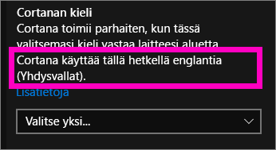
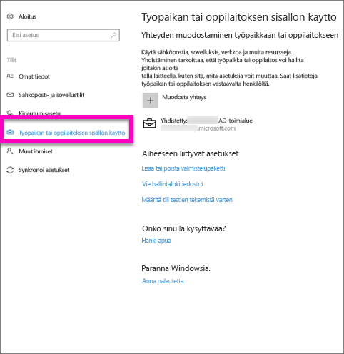
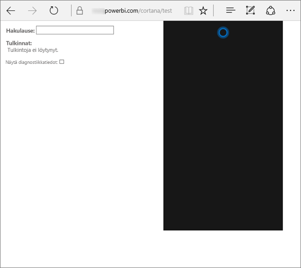
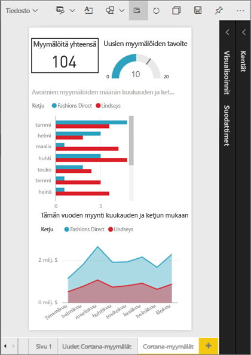
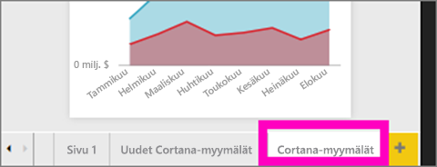
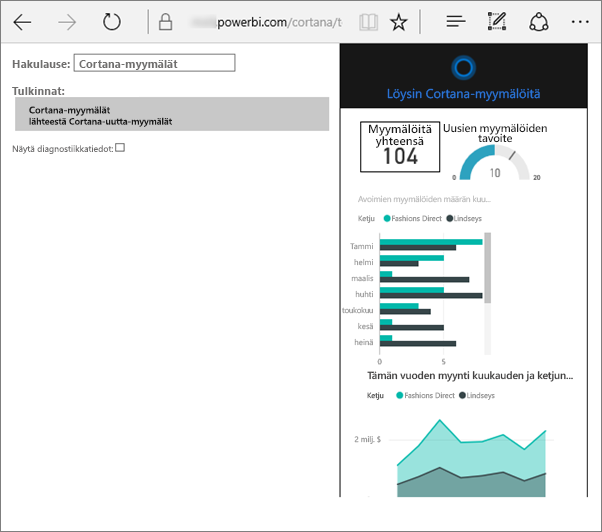
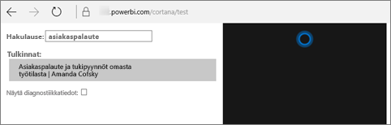

# Cortanan ja Power BI:n vianmääritys
Tämä artikkeli on osa pidempää sarjaa. 

> [!IMPORTANT]
> Cortanan integrointi on vanhentumassa Power BI:ssä. 11. kesäkuuta alkaen Cortana ei enää toimi koontinäyttöjen ja raporttien kanssa.

Jos sinulla on ongelmia Cortanan integroimisessa Power BI:hin, olet tullut oikean paikkaan. Tunnista ongelma ja korjaa se noudattamalla alla olevia ohjeita.

## Miksi Cortana ei löydä kysymyksiini vastauksia Power BI ‑raporteistani tai koontinäytöistäni?
1. Onko sinulla Power BI ‑tili?  Jos ei, [rekisteröi ilmainen kokeiluversio](https://powerbi.microsoft.com/get-started/).
2. Onko Cortana toiminnassa?  Näetkö Cortana-kuvakkeen tehtäväpalkissa?

    

    Kun valitset sen, avautuuko Cortana näyttäen kentän, johon voit kirjoittaa?
3. Käytitkö haussasi vähintään kahta sanaa? Cortana tarvitsee vähintään kahden sanan ilmauksia löytääkseen vastauksia Power BI:stä. Kokeile lisätä kysymyksen alkuun sana ”show” (näytä).
4. Jos koontinäyttösi otsikossa on enemmän kuin yksi sana, Cortana osaa toimittaa koontinäytön, jos hakusi vastaa vähintään kahta otsikon sanoista. Jos koontinäytön nimi on Sales FY16, niin:

   * kysymys ”show sales” *ei* palauta tulosta Power BI:ssä.   
   * ”show me sales fy16”, ”sales fy16”, ”show sales fy16” ja ”show me sales f” *palauttavat* tuloksen Power BI:ssä.    
   * sanan ”powerbi” lisääminen lasketaan toiseksi kahdesta vaadittavasta sanasta, joten ”powerbi sales” *palauttaa* tuloksen Power BI:ssä.
5. Onko sinulla käyttö- tai muokkausoikeuksia mihinkään raportteihin tai koontinäyttöihin? Raporttien osalta sinun on varmistettava, että sisällöllä, jota yrität hakea, on [vastauskortti](service-cortana-answer-cards.md).  Koontinäyttöjen osalta sinun on varmistettava, että sisältö, jota yrität hakea, on joko **Jaettu kanssani** ‑tilassa, työtilassa tai **Omassa työtilassa**. Yritä tunnistaa ongelma [vianmäärityksen työkalulla](#try-the-cortana-troubleshooting-tool).
6. Käytätkö mobiililaitetta?  Tällä hetkellä Power BI:n ja Cortanan integrointia tuetaan vain Windows-mobiililaitteissa.
7. Onko Cortanan kieleksi määritetty englanti?  Cortanan ja Power BI:n integrointia tuetaan tällä hetkellä vain englanniksi. Käynnistä Cortana ja avaa asetukset valitsemalla hammasrataskuvake. Selaa alaspäin kohtaan **Cortanan kieli** ja varmista, että kieliasetuksena on jokin englannin varianteista.

   
8. Onko sinulla Cortanassa käytössä yli 100 raporttia?  Cortana etsii yhteensä enintään sadasta.  Varmista, että raporttisi sisältyy hakujoukkoon siirtämällä tai kopioimalla se **Omaan työtilaan**, josta Cortana etsii ensimmäisenä.
9. Ehkä sinun täytyy odottaa hetki. Ensimmäisen kerran, kun kirjoitat kyselyn, malli saattaa olla vielä *kylmä*. Odota muutama sekunti, että tiedot ladataan muistiin, ja yritä sitten uudelleen.
10. Koontinäyttöjen osalta voi kestää jopa 24 tuntia, ennen kuin ne tulevat Cortanan käytettäviin.    
11. Raporttien osalta voi kestää jopa 30 minuuttia, että tulokset alkavat näkyä Cortanassa, kun uusi tietojoukko tai mukautettu vastauskortti lisätään Power BI:hin ja otetaan käyttöön Cortanassa. Kirjautuminen ulos Windows 10:stä ja takaisin sisään tai Cortana-prosessin muunlainen uudelleenkäynnistäminen Windows 10:ssä mahdollistaa uuden raporttisisällön tulemisen heti näkyviin.  
12. Power BI:n järjestelmänvalvoja on voinut poistaa toiminnon käytöstä. Kysy järjestelmänvalvojaltasi, onko kyse tästä.

## Vain raportit: Miksi Cortana ei löydä kysymyksiini vastauksia Power BI ‑raporteistani?
1. Jos etsit vastauksia raporteista, onko sinulla raportteja, joista on olemassa Cortanan **vastauskortteja**? Vastauskortit ovat ainoa tapa, jolla Cortana löytää vastauksia Power BI ‑raporteista.  Ohjeet vastauskorttien luomiseen annetaan ohjeaiheessa [Cortanan vastauskorttien luominen Power BI -palvelussa ja Power BI Desktopissa](service-cortana-answer-cards.md).
2. Onko sinulla käytössä Windowsin versio 1511 tai uudempi versio?  Näet versiotiedot, kun avaat Windowsin asetukset ja valitset **Järjestelmä > Tietoja**. Päivitä tarvittaessa Windows-versio uudempaan.
3. Onko Windows-tili yhdistetty Power BI ‑tiliin? Tämä voi aiheuttaa sekaannusta. Ohjeet tilien yhdistämiseen saat artikkelista [Power BI:n Cortanan käyttöönotto](service-cortana-enable.md#add-your-power-bi-credentials-to-windows).
4. Onko raportin perustana olevat tietojoukot sallittu Cortanalle? Ehkä työtoveri on jakanut tietojoukon, joka on jo sallittu valmiiksi Cortanan käyttöä varten. Mutta jos ei, [opettele sallimaan tietojoukkojen käyttö Cortanalle](service-cortana-enable.md) itse. Se käy helposti ja nopeasti.

## Vain koontinäytöt: Miksi Cortana ei löydä kysymyksiini vastauksia Power BI ‑koontinäytöistäni?
1. Varmista, että olet yhteydessä työtiliisi. Power BI tarvitsee yhteyden voidakseen todentaa tietojen käyttöoikeudet. Voit varmistaa, että olet yhteydessä – tai jos et ole, muodostaa yhteyden työtiliisi – siirtymällä Windowsin hakuruudun kautta asetukseen Yhteyden muodostaminen työpaikkaan tai oppilaitokseen.  

    
2. Onko sinulla Cortanan käyttöoikeudet? Valitse Windows-hakuruutu ja anna tietoihisi tarvittavat Cortana-käyttöoikeudet.

## Cortanan vianmääritystyökalun kokeileminen
Onko sinulla edelleen ongelmia?  Seuraavaksi kannattaa suorittaa Cortanan vianmääritystyökalu, joka voi rajata mahdollisia syitä ongelmiin.

### Onko sinulla vaikeuksia noutaa vastauksia raportista?
1. Raporttien osalta sinun kannattaa varmistaa ennen vianmääritystyökalun suorittamista, että Cortanan vastauskorttien **Sivutason** suodattimina on **Edellytä yksittäistä valintaa**. Ohjeet siihen on artikkelissa [Cortanan vastauskorttien luominen](service-cortana-answer-cards.md).
2. Avaa vianmääritystyökalu lisäämällä Power BI -palvelusi URL-osoitteen loppuun teksti /cortana/test. URL-osoitteesi pitäisi nyt näyttää tältä:

   app.powerbi.com/cortana/test

   
3. Tee raporttien vianmääritys kirjoittamalla **Utterance** (Ilmaus) ‑kenttään Cortanan vastauskortin nimi ***tismalleen sellaisena kuin se näkyy Power BI:n välilehdellä***.

   

    

   
4. Joskus, kun kirjoitat jotain **Utterance** (Ilmaus) ‑kenttään ensimmäistä kertaa, mitään ei tapahdu. Ajattele sitä järjestelmän alustamisena: ilmoitat vianmääritystyökalulle, että sen pitää käynnistyä. Leikkaa ja liitä teksti tai kirjoita se uudelleen **Utterance** (Ilmaus) ‑kenttään. Tässä esimerkissä vastauskortin nimi on **Cortana stores**. **Cortana stores** ‑tekstin liittäminen tai kirjoittaminen työkalun kenttään tuottaa yhden tuloksen, joka tulee näkyviin **Interpretations** (Tulkinnat) ‑kenttään. Napsauta sitä, niin vastauskortti tulee näkyviin Cortanan ikkunassa – tässä tapauksessa kortti on **Cortana stores**.

   

   Koska haku tuotti tuloksen, tiedämme nyt, että Cortana **on** käytössä Power BI:ssä. Se rajaa ongelmaa: vian täytyy olla Windowsin puolella, Cortanan kieliasetuksessa tai siinä, että Cortanan käytössä on yli 100 tietojoukkoa.

### Onko sinulla vaikeuksia noutaa vastauksia koontinäytöstä?
Etsitkö koontinäyttöä, joka on jaettu sinulle?  Avaa Power BI > **Jaettu kanssani** ja etsi sieltä halutun koontinäytön nimi.  Kirjoita sitten nimi **Utterance** (Ilmaus) ‑kenttään.

#### Vianmääritystyökalun tunnetut ongelmat
* Jos työkalu ei nouda tuloksia ensimmäisellä kerralla, liitä kysely Utterance (Ilmaus) ‑tekstikenttään.
* Kyselyn on oltava vähintään kaksi sanaa pitkä.  Jos kysely on liian lyhyt, lisää sana ”show” (näytä).
* Kyselymerkkijonot eivät välttämättä toimi, jos niissä on prepositioita, kuten esimerkiksi ilmauksessa ”sales by item” (myynti nimikkeittäin). Kokeile erilaisia kyselytermejä, joissa ei ole prepositioita ja jotka ovat kuvaavia tai yksilöllisiä.

Onko sinulla kysyttävää? [Kokeile Power BI -yhteisöä](https://community.powerbi.com/)
