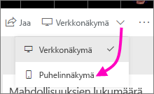
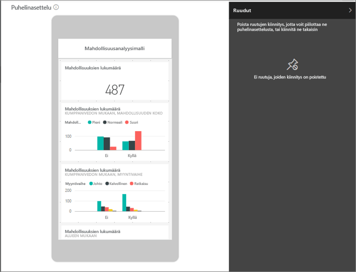
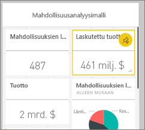
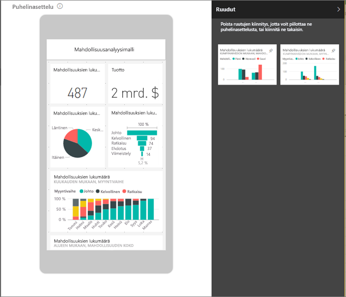
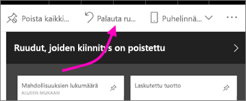

# Koontinäytön optimointi matkapuhelimille – Power BI 
Kun tarkastelet koontinäyttöjä pystytilassa puhelimessa, voit huomata, että koontinäytön ruudut ovat saman kokoisia ja aseteltu yksi toisensa jälkeen. Power BI -palvelussa voit luoda ennen kaikkea puhelimen pystytilalle tarkoitetun mukautetun näkymän koontinäytöstä. Myös luodessasi puhelinnäkymän, kun käännät puhelimen sivuttain, näet koontinäytön palvelussa näkyvällä tavalla.

Etsitkö tietoja koontinäyttöjen tarkastelemisesta mobiililaitteessa? Kokeile sen sijaan pikaopasta [Raporttinäkymien ja raporttien tarkastelu Power BI -mobiilisovelluksissa](consumer/mobile/mobile-apps-quickstart-view-dashboard-report.md).

> [!NOTE]
> Muokatessasi puhelinnäkymää kaikki koontinäyttöä puhelimella tarkastelevat voivat nähdä reaaliaikaisesti tekemäsi muutokset. Esimerkiksi, jos poistat kaikkien koontinäytön puhelinnäkymän ruutujen kiinnityksen, puhelimen koontinäytössä ei enää ole ruutuja. 
> 
> 

## Koontinäytön puhelinnäkymän luominen
1. Avaa Power BI -palvelussa koontinäyttö.
2. Valitse kohdan **Verkkonäkymä** vieressä oleva nuoli oikeassa yläkulmassa > valitse **Puhelinnäkymä**.

    

    Jos et ole koontinäytön omistaja, tämä asetus ei ole näkyvissä.

    

    Puhelimen koontinäytön muokkausnäkymä avautuu. Sen kautta voit poistaa ruutujen kiinnityksen ja järjestää ne uudelleen, niin että ne sopivat puhelinnäkymään. Koontinäytön verkkoversio ei muutu.

1. Valitse ruutu, jota haluat vetää, jonka kokoa haluat muuttaa tai jonka kiinnityksen haluat poistaa. Voit huomata, että muut ruudut siirtyvät pois tieltä ruutua vetäessäsi.
   
    
   
    Kiinnittämättömät ruudut siirtyvät Ruudut, joiden kiinnitys on poistettu -ruutuun, jossa ne pysyvät uudelleenkiinnitykseensä saakka.
   
    
2. Jos muutat mielesi, valitse **Palauta ruudut**. Siten voit palauttaa ne samankokoisina samaan kohtaan kuin  missä ne olivat aiemmin.
   
    
   
    Pelkkä puhelimen muokkausnäkymän avaaminen Power BI -palvelussa muuttaa hieman puhelimen ruutujen kokoa ja muotoa. Joten, koontinäytön palauttamiseksi tismalleen samanlaiseksi kuin se oli ennen puhelimen muokkausnäkymän avaamista, valitse **Palauta ruudut**.
3. Kun olet tyytyväinen puhelimen koontinäytön asetteluun, valitse kohdan **Puhelinnäkymä** vieressä oleva ruutu oikeassa yläkulmassa > valitse **Verkkonäkymä**.
   
    Power BI tallentaa puhelinasettelun automaattisesti.

## Seuraavat vaiheet
* [Power BI -puhelinsovelluksille optimoitujen raporttien luominen](desktop-create-phone-report.md)
* [Mihin tahansa kokoon optimaalisten reagoivien visualisointien luominen](visuals/desktop-create-responsive-visuals.md)
* Onko sinulla kysyttävää? [Voit esittää kysymyksiä Power BI -yhteisössä](https://community.powerbi.com/)

