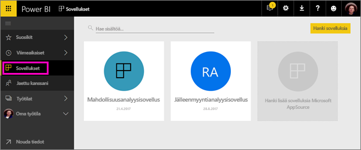
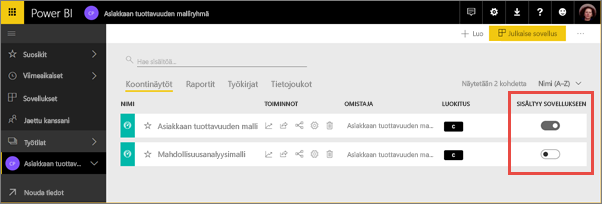
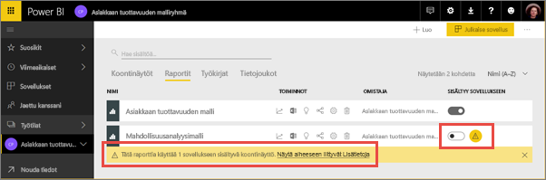
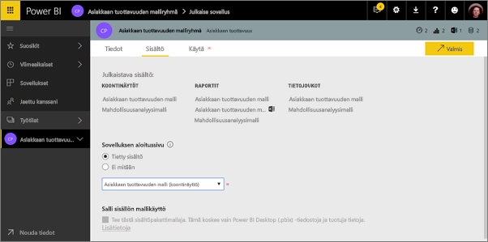
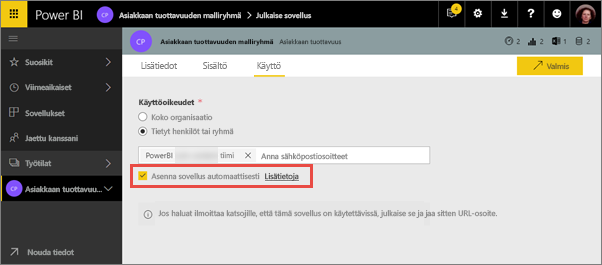
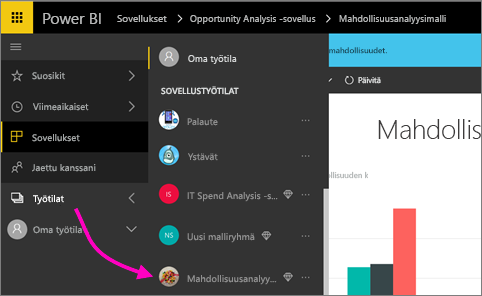
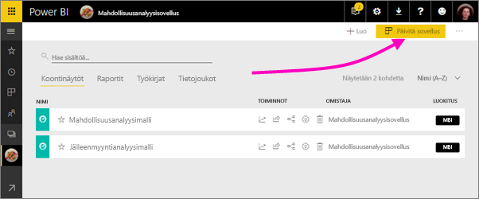
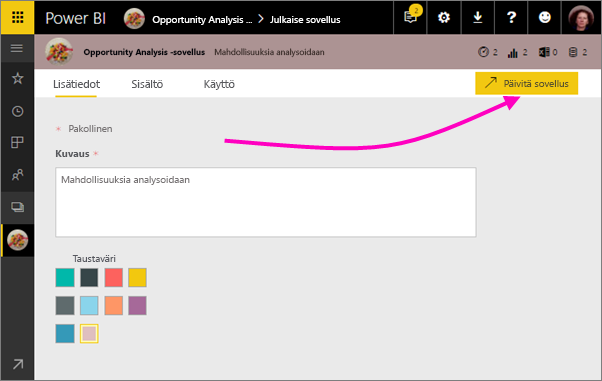
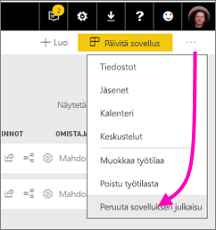

# Koontinäyttöjä ja raportteja sisältävien sovellusten luominen ja julkaiseminen Power BI:ssä

Power BI:ssä voit luoda *sovelluksia* kaikkien koontinäyttöjen ja raporttien tuomiseksi yhteen paikkaan ja sitten julkaista ne suurille ihmisryhmille organisaatiossasi. Voit myös muodostaa yhteyden [Power BI -sovelluksista ulkoisiin palveluihin](service-connect-to-services.md), kuten Google Analyticsiin ja Microsoft Dynamics CRM:ään.

Yrityskäyttäjät tarvitsevat usein monia Power BI -koontinäyttöjä ja raportteja yrityksensä pyörittämisessä. Sovellukset liittävät kaikki palaset yhteen, joten käyttäjien ei tarvitse muistaa kaikkien koontinäyttöjen nimiä ja sijainteja. Power BI -sovelluksilla voit luoda kokoelmia koontinäytöistä ja raporteista ja julkaista nämä sovellukset koko organisaatiolle tai tietyille ihmisille tai ryhmille. Jos olet raporttien luoja tai järjestelmänvalvoja, sovellukset tekevät koontinäyttöjen kokoelmien käyttöoikeuksien hallinnasta helpompaa.

Yrityskäyttäjät saavat sovelluksesi käyttöönsä eri tavoin. Jos Power BI -järjestelmänvalvojasi antaa sinulle luvan, voit asentaa ne automaattisesti työtovereittesi Power BI -tileille. Muussa tapauksessa he voivat asentaa sovelluksesi Microsoft AppSourcesta tai voit lähettää heille suoran linkin. He voivat löytää ja palata lukemaan sisältöäsi helposti, koska kaikki on samassa paikassa. He saavat päivitykset automaattisesti, ja sinä voit määrittää, kuinka usein tiedot päivitetään. Lisätietoja [sovellusominaisuudesta yrityskäyttäjille](service-install-use-apps.md).

### Sovellusten käyttöoikeudet
Sovellusten luojana tarvitset Power BI Pro -käyttöoikeudet. Sovelluksesi käyttäjillä on kaksi vaihtoehtoa tarkastella sovellusta.

* Vaihtoehto 1: Sovelluksen käyttäjälle on määritetty **Power BI Pro** -käyttöoikeus. 
* Vaihtoehto 2: Sovelluksen käyttäjälle ei ole määritetty **Power BI Pro** -käyttöoikeutta, mutta sovellus sijaitsee Power BI Premium -kapasiteetissa. Lisätietoja on artikkelissa [Mikä on Power BI Premium?](service-premium.md)

### Sovellukset ja organisaation sisältöpaketit
Sovellukset ovat organisaation sisältöpakettien seuraava kehitysaste. Jos sinulla on jo organisaation sisältöpaketteja, ne toimivat edelleen rinnakkain sovellusten kanssa.

Nyt, kun olet saanut yleiskatsauksen sovelluksiin, tutustutaanpa seuraavaksi *sovelluksen työtiloihin*, joissa sovelluksia luodaan. 

## Video: Sovellukset ja sovelluksen työtilat
<iframe width="640" height="360" src="https://www.youtube.com/embed/Ey5pyrr7Lk8?showinfo=0" frameborder="0" allowfullscreen></iframe>

## Sovelluksen työtilat
*Sovelluksen työtilat* ovat paikkoja, joissa sovelluksia luodaan, joten sinun pitää ensin luoda sovelluksen työtila ennen kuin voit luoda sovelluksia. Jos olet joskus työskennellyt ryhmätyötilassa Power BI:ssä, niin sovelluksen työtilat ovat tuttuja. Ne ovat ryhmätyötilojen seuraava kehitysaste – ne ovat sovelluksen sisällön valmistelualueita ja säilöjä. 

Voit lisätä työtovereita näihin työtiloihin jäseninä tai järjestelmänvalvojina. Kaikki sovelluksen työtilan jäsenet ja järjestelmänvalvojat tarvitsevat Power BI Pro -käyttöoikeudet. Työtilassa kaikki voivat tehdä yhteistyötä koontinäyttöjen, raporttien tai muiden artikkeleiden parissa, jotka halutaan julkaista laajemmalle lukijakunnalle tai jopa koko organisaatiolle. 

Kun sisältö on valmis, valitset, mitkä koontinäytöt ja raportit haluat julkaista, ja sitten julkaiset sovelluksen. Voit lähettää suoran linkin haluamallesi laajemmalle lukijakunnalle tai he voivat löytää sovelluksesi Sovellukset-välilehdestä siirtymällä kohtaan **Lataa ja etsi lisää sovelluksia AppSourcesta**. Nämä henkilöt eivät voi muokata sovelluksen sisältöä, mutta he voivat käyttää sitä joko Power BI -palvelussa tai jossain mobiilisovelluksista. He voivat suodattaa, korostaa ja lajitella tiedot itse. 

## Sovelluksen työtilan luominen
[!INCLUDE [powerbi-service-create-app-workspace](./includes/powerbi-service-create-app-workspace.md)]

Se on tyhjä, joten nyt voit lisätä siihen sisältöä. Huomaa, että kun luot sen, saatat joutua odottamaan noin tunnin verran, että työtila välittää sen Office 365:een. 

Sisällön lisääminen toimii samaan tapaan kuin sisällön lisääminen Omaan työtilaan, paitsi että myös työtilan muut ihmiset pystyvät näkemään sen ja työstämään sitä. Suurin ero on, että kun saat sen valmiiksi, voit julkaista sisällön sovelluksena. Ollessasi sovelluksen työtilassa voit ladata tai muodostaa yhteyden tiedostoihin tai muodostaa yhteyden kolmannen osapuolen palveluihin, aivan samalla tavalla kuin tekisit Omassa työtilassa. Esimerkki:

* [Muodosta yhteys palveluihin](service-connect-to-services.md), kuten Microsoft Dynamics CRM, Salesforce tai Google Analytics.
* [Nouda tiedot tiedostoista](service-get-data-from-files.md), esimerkiksi Excelistä, CSV-tiedostoista tai Power BI Desktop (PBIX) -tiedostoista.

Kun sisältöä tarkastellaan sovelluksen työtilassa, sovelluksen työtilan nimenä näkyy omistajan nimi.

## Lisää kuva sovellukseesi (valinnainen)
Oletusarvoisesti Power BI luo sovelluksellesi pienen värillisen ympyrän, jossa näkyy sovelluksen nimikirjaimet. Saatat kuitenkin haluta mukauttaa sitä käyttämällä jotain kuvaa. Kuvan lisäämiseksi tarvitset Exchange Online -käyttöoikeuden.

1. Valitse **Työtilat**, valitse työtilan nimen vierestä kolme pistettä (...), ja valitse sitten **Jäsenet**. 
   
     
   
    Työtilan Office 365 Outlook -tili aukeaa uuteen selainikkunaan.
2. Kun pidät hiiren osoitinta vasemman yläkulman värillisen ympyrän päällä, se muuttuu kynäkuvakkeeksi. Valitse se.
   
     
3. Valitse kynäkuvake uudelleen, ja etsi kuva, jota haluat käyttää.
   
     
4. Valitse **Tallenna**.
   
     
   
    Kuvan korvaa värillisen ympyrän Office 365:n Outlook-ikkunassa. 
   
     
   
    Muutaman minuutin kuluttua se näkyy myös sovelluksessa Power BI:ssä.
   
     

## Sovelluksen julkaiseminen
Kun sovellukseksi koontinäytöt ja raportit ovat valmiita, voit julkaista ne sovelluksena. Muista, että sinun ei tarvitse julkaista kaikkia työtilassa olevia raportteja ja koontinäyttöjä. Voit julkaista vain ne, jotka ovat valmiita.

1. Määritä työtilan luettelonäkymässä, mitkä koontinäytöt ja raportit haluat sisällyttää sovellukseen.

     

     Jos päätät olla julkaisematta raporttia, näet raportin ja siihen liittyvän koontinäytön vieressä varoituksen. Voit silti julkaista sovelluksen, mutta siihen liittyvästä koontinäytöstä puuttuvat kyseisen raportin ruudut.

     

2. Valitse **Julkaise sovellus** -painike työtilan oikeasta yläkulmasta kaiken kyseisen työtilan sisältämän sisällön jakamisprosessin aloittamiseksi.
   
     

3. Kirjoita **Tiedot**-kohtaan kuvaus, jotta ihmisten on helpompi löytää tämä sovellus. Voit määrittää haluamasi taustavärin sovelluksen mukauttamiseksi.
   
     

4. **Sisältö**-kohdassa näet sisältöä, joka julkaistaan osana sovellusta – kaikki tiedot, jotka olet valinnut kyseisessä työtilassa. Voit myös määrittää sovelluksen aloitussivun – koontinäytön tai raportin, jonka käyttäjät näkevät ensimmäiseksi, kun he avaavat sovelluksesi. Voit valita **Ei mikään**. Tässä tapauksessa käyttäjät päätyvät sovelluksen sisältöluetteloon. 
   
     

5. Päätä **Access**issa, kenellä on pääsy sovellukseen: joko kaikilla organisaatiossa, tietyillä henkilöillä, Active Directory -käyttöoikeusryhmillä. Jos sinulla on oikeudet, voit päättää asentaa sovelluksen automaattisesti vastaanottajille. Voit ottaa tämän asetuksen käyttöön [Power BI -hallintaportaalissa](#how-to-enable-pushing-apps). Voit myös lukea lisätietoja huomioon otettavista asioista [sovelluksen lähettämisestä](#how-to-enable-pushing-apps).

    

6. Kun valitset **Valmis**, näet sanoman, että sovellus on valmis julkaistavaksi. Onnistumisesta ilmoittavasta valintaikkunasta voit kopioida URL-osoitteen, joka on suora yhteys tähän sovellukseen ja lähettää sen henkilöille, joiden kanssa olet jakanut sen.
   
     

Yrityskäyttäjät, joille olet julkaissut sovelluksen, pystyvät löytämään sen muutamalla eri tavalla. Jos voit asentaa sen automaattisesti, se näkyy Sovellukset-kohdassa heidän Power BI -tileillään. Voit lähettää heille suoran linkin sovellukseen tai he voivat hakea sitä Microsoft AppSourcesta, jossa he näkevät kaikki sovellukset, jotka he voivat käyttää. Riippumatta siitä, miten he sen saavat, sen jälkeen he näkevät tämän sovelluksen luettelossaan Sovelluksiin siirtyessään.

Lisätietoja [sovellusominaisuudesta yrityskäyttäjille](service-install-use-apps.md).

## Julkaistun sovelluksen muuttaminen
Kun olet julkaissut sovelluksesi, voit halutessasi muuttaa tai päivittää sitä. Sen päivittäminen on helppoa, jos olet järjestelmänvalvoja tai sovelluksen työtilan jäsen. 

1. Avaa kyseistä sovellusta vastaava sovelluksen työtila. 
   
     
2. Avaa koontinäyttö tai raportti. Huomaat, että voit tehdä mitä tahansa haluamiasi muutoksia.
   
     Sovelluksen työtila on valmistelualueesi, joten tekemiäsi muutoksia ei lähetetä reaaliaikaisesti sovellukseen ennen sen julkaisemista uudelleen. Tämän avulla voit tehdä muutoksia ilman, että ne vaikuttaisivat julkaistuun sovellukseen.  
 
3. Siirry takaisin sovelluksen työtilan sisältöluetteloon ja valitse **Päivitä sovellus**.
   
     

4. Päivitä **Tiedot**, **Sisältö** ja **Käyttöoikeus** tarvittaessa ja valitse sitten **Päivitä sovellus**.
   
     

Henkilöt, joille olet sovelluksen julkaissut, näkevät automaattisesti sovelluksen päivitetyn version. 

# Sovellusten asentaminen automaattisesti käyttäjille
Voit asentaa sovelluksia automaattisesti käyttäjille, jolloin on helpompaa jakaa oikeat sovellukset oikeille henkilöille tai ryhmille.

Sovellukset toimittavat tietoja, joita käyttäjät tarvitsevat töidensä tekemiseen. Nyt voit automaattisesti asentaa tarvittavat sovellukset Sovellusten sisältöluetteloon sen sijaan, että ne pitäisi etsiä Microsoft AppSourcesta tai käyttää asennuslinkkiä. Tämän ansiosta sinun on helpompi julkaista tavallista Power BI -sisältöä käyttäjille.

## Sovelluksen asentaminen automaattisesti käyttäjille
Kun järjestelmänvalvoja on ottanut ominaisuuden käyttöön, sovelluksen julkaisijoilla on käytettävissään uusi vaihtoehto: **asenna sovellus automaattisesti**. Kun ruutu on ***valittu*** ja sovelluksen julkaisija valitsee **Valmis** (tai **Päivitä sovellus**, aiemmin luotujen sovellusten kohdalla), sovellus lähetetään kaikille käyttäjille tai ryhmille, jotka on määritetty sovelluksen **Käyttöoikeudet**-osassa **Käyttöoikeus**-välilehdessä.

## Näin käyttäjät saavat sovellukset, jotka heille on lähetetty
Kun olet lähettänyt sovelluksen, se näkyy automaattisesti Sovellukset-luettelossa. Voit järjestää sovellukset, jotka tietyillä käyttäjillä tai tehtävärooleilla organisaatiossasi on oltava käytettävissään.

### Huomioon otettavaa sovellusten automaattisesta asentamisesta
Sovelluksia lähetettäessä käyttäjille kannattaa ottaa huomioon seuraavat asiat:

* Sovelluksen asentaminen käyttäjille automaattisesti voi viedä aikaa. Useimmat sovellukset asennetaan käyttäjille välittömästi, mutta sovellusten lähettäminen voi viedä aikaa.  Se riippuu sovelluksessa olevien kohteiden määrästä ja käyttöoikeudet omistavien käyttäjien määrästä. Suosittelemme sovellusten lähettämistä ruuhka-aikojen ulkopuolella, jolloin on paljon aikaa ennen kuin käyttäjät tarvitsevat sovelluksia. Varmista useilta käyttäjiltä, ennen kuin lähetät tiedon laajalle käyttäjäkunnalle sovelluksen saatavuudesta.

* Päivitä selain. Ennen kuin lähetetty sovellus näkyy Sovellukset-luettelossa, käyttäjän pitää ehkä päivittää tai sulkea ja avata selaimensa uudelleen.

* Jos käyttäjä ei heti näe sovellusta Sovellukset-luettelossa, hänen tulee päivittää tai sulkea ja avata selaimensa uudelleen.

* Pyri siihen, ettet lähetä liikaa sovelluksia käyttäjille. Varo, ettet lähetä liian monia sovelluksia, jotta käyttäjäsi havaitsevat, että esiasennetut sovellukset heille hyödyllisiä. Kannattaa rajoittaa sitä, kuka voi lähettää sovelluksia käyttäjille, jotta ajoitukset voidaan paremmin koordinoida. Voit muodostaa yhteyspisteen organisaatiossasi niiden sovellusten saamiseen, jotka on julkaistu käyttäjille.

* Vieraskäyttäjät, jotka eivät ole hyväksyneet kutsua, eivät saa asennuksia automaattisesti asennettuina.  

## Sovelluksen julkaisun peruuttaminen
Kuka tahansa sovelluksen työtila jäsen voi peruuttaa sovelluksen julkaisun.

* Valitse sovelluksen työtilassa kolme pistettä (**...** ) oikeasta yläkulmasta > **Peruuta sovelluksen julkaisu**.
  
     

Tämä toiminto poistaa sovelluksen asennuksen kaikilta, joille se on julkaistu eivätkä he enää pysty käyttämään sitä. Se ei poista sovelluksen työtilaa tai sen sisältöä.

## Power BI -sovellusten usein kysytyt kysymykset
### Miten sovelluksen työtilat eroavat ryhmän työtiloista?
Tämän julkaisuversion myötä olemme nimenneet uudelleen kaikki ryhmän työtilat sovelluksen työtiloiksi. Voit julkaista sovelluksen mistä tahansa näistä työtiloista. Toiminto pysyy suurimmaksi osaksi samanlaisena ryhmän työtilojen kanssa. Lähikuukausien aikana aiomme tehdä seuraavat parannukset sovelluksen työtiloihin: 

* Sovelluksen työtilojen luominen ei luo vastaavia esiintymiä Office 365:ssä, kuten ryhmän työtilat tekevät. Joten voit luoda haluamasi määrän sovelluksen työtiloja murehtimatta kaikista eri Office 365 -ryhmistä, jotka luodaan taustalla (voit edelleen käyttää Office 365 -ryhmän OneDrive for Businessia tiedostojen tallentamiseen). 
* Nykyään voit lisätä vain yksittäisiä henkilöitä jäsenten ja järjestelmänvalvojien luetteloihin. Pian pystyt lisäämään useita AD-käyttöoikeusryhmiä tai uusia ryhmiä näihin luetteloihin, mikä helpottaa niiden hallintaa.  

### Miten sovellukset eroavat organisaation sisältöpaketeista?
Sovellukset ovat sisältöpakettien seuraava kehitysaskel, joka yksinkertaistaa niitä. Niiden välillä on muutamia merkittäviä eroja. 

* Kun yrityskäyttäjät ovat asentaneet sisältöpaketin, se menettää ryhmäidentiteettinsä: se on vain luettelo koontinäyttöjä ja raportteja, jotka ovat sikin sokin muiden koontinäyttöjen ja raporttien keskellä. Sovellukset taas säilyttävätä ryhmityksensä ja identiteettinsä jopa asennuksen jälkeen. Tämän ansiosta yrityskäyttäjien on helpompi käyttää niitä myöhemminkin.
* Voit luoda useita sisältöpaketteja mistä tahansa työtilasta, mutta sovelluksella on 1:1-suhde työtilansa kanssa. Uskomme, että tämä helpottaa sovellusten ymmärtämistä ja ylläpitämistä pitkällä aikavälillä. Power BI -blogin toteutussuunnitelman osassa on lisätietoja siitä, mitä parannuksia aiomme tällä alueella tehdä. 
* Ajan mittaan aiomme lakkauttaa organisaation sisältöpaketit, joten suosittelemme, että luot tästä lähtien sovelluksia.  

### Entä ryhmien vain luku -jäsenet?
Ryhmiin on voinut lisätä vain luku -jäseniä, jotka pystyivät vain lukemaan sisältöä. Tämän käytännön ensisijaisena ongelmana oli, että käyttöoikeusryhmiä ei voitu lisätä jäseninä. 

Sovelluksia käytettäessä voit julkaista sovelluksesi työtilan vain luku -version suurille käyttäjäryhmille, myös käyttöoikeusryhmille. Voit valmistella haluamasi muutokset sovelluksissa oleviin koontinäyttöihin ja raportteihin niin, ettei sillä ole vaikutusta käyttäjiin. Suosittelemme sovellusten käyttämistä tällä tapaa tulevaisuudessa. Ajan mittaan aiomme lakkauttaa myös työtilojen vain luku -käyttäjät.  

## Seuraavat vaiheet
* [Asenna ja käytä sovelluksia Power BI:ssä](service-install-use-apps.md)
* [Power BI -sovellukset ulkoisille palveluille](service-connect-to-services.md)
* [Power BI -hallintaportaali](https://docs.microsoft.com/en-us/power-bi/service-admin-portal)
* Ilmenikö kysyttävää? [Voit esittää kysymyksiä Power BI -yhteisössä](http://community.powerbi.com/)
