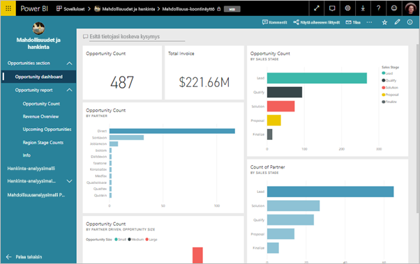
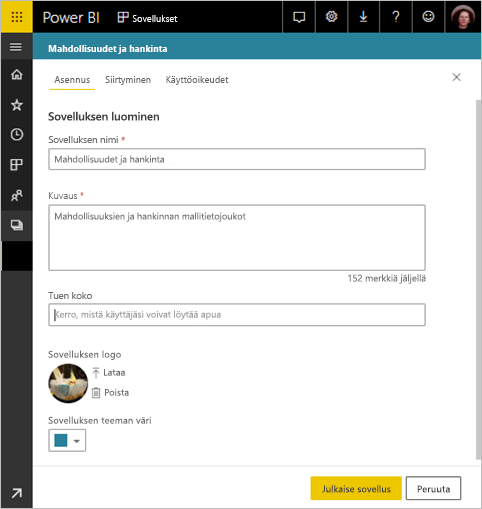
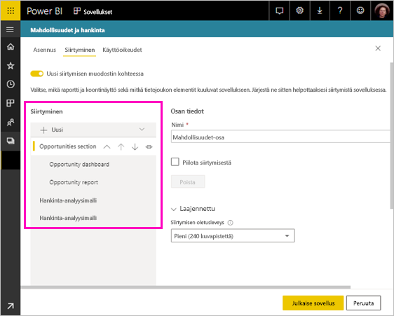
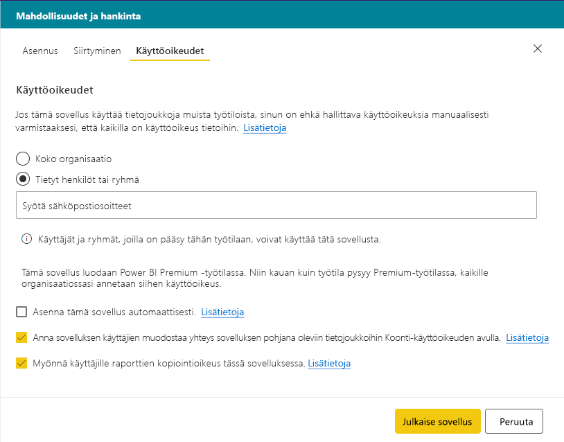

# Julkaise sovellus Power BI:ssä

Power BI:ssä voit luoda virallisia paketoituja sisältöjä ja sitten jakaa laajalle yleisölle *sovelluksena*. Voit luoda sovelluksia *sovellustyötiloissa*, joissa voit työstää Power BI -sisältöä yhdessä työtovereiden kanssa. Sen jälkeen voit julkaista valmiit sovellukset suurelle määrälle ihmisiä organisaatiossasi. 

Yrityskäyttäjät tarvitsevat usein monia Power BI -koontinäyttöjä ja raportteja yrityksensä pyörittämisessä. Power BI -sovelluksilla voit luoda kokoelmia koontinäytöistä ja raporteista ja julkaista nämä sovellukset koko organisaatiolle tai tietyille ihmisille tai ryhmille. Jos olet raporttien luoja tai järjestelmänvalvoja, sovellukset tekevät näiden kokoelmien käyttöoikeuksien hallinnasta helpompaa.

Yrityskäyttäjät saavat sovelluksesi käyttöönsä eri tavoin:

- He voivat etsiä ja asentaa sovelluksen Microsoft AppSourcesta
- Voit lähettää heille suoran linkin.
- Voit asentaa sen automaattisesti työtovereittesi Power BI -tileille, jos Power BI -järjestelmänvalvojasi antaa sinulle luvan.

Voit luoda sovelluksen, jossa on omat sisäänrakennetut siirtymiskomennot, jolloin käyttäjät voivat vaivattomasti löytää sisältösi. He eivät voi muokata sovelluksen sisältöä. He voivat käyttää sitä joko Power BI -palvelussa tai jossakin mobiilisovelluksista. He voivat suodattaa, korostaa ja lajitella tiedot itse. He saavat päivitykset automaattisesti, ja sinä voit määrittää, kuinka usein tiedot päivitetään. Lisätietoja [sovellusominaisuudesta yrityskäyttäjille](consumer/end-user-apps.md).

## Sovellusten käyttöoikeudet
Sovelluksen luomiseen tai päivittämiseen tarvitaan Power BI Pro -käyttöoikeus. Sovelluksen *kuluttajilla* on kaksi vaihtoehtoa.

* Vaihtoehto 1: Kaikilla käyttäjillä pitää olla **Power BI Pro** -käyttöoikeudet sovelluksesi näkemiseksi. 
* Vaihtoehto 2: Organisaatiosi ilmaiskäyttäjät voivat tarkastella sovelluksesi sisältöä, mikäli sovelluksesi työtila sijaitsee Power BI Premium -kapasiteetissa. Lisätietoja on artikkelissa [Mikä on Power BI Premium?](service-premium.md)

## Sovelluksen julkaiseminen
Kun työtilasi raporttinäkymät ja raportit ovat valmiita, voit valita, mitkä raporttinäkymät ja raportit haluat julkaista. Julkaise ne sitten sovelluksena. 

1. Määritä työtilan luettelonäkymässä, mitkä koontinäytöt ja raportit haluat **sisällyttää sovellukseen**.

     

     Jos päätät olla sisällyttämättä raporttia, jossa on siihen liittyvä koontinäyttö, näet raportin vieressä varoituksen. Voit silti julkaista sovelluksen, mutta siihen liittyvässä koontinäytössä ei ole kyseisen raportin ruutuja.

     

2. Valitse **Julkaise sovellus** -painike työtilan oikeasta yläkulmasta, jos haluat luoda ja julkaista sovelluksen kyseisestä työtilasta.
   
     

3. Kirjoita **Asennus**-kohtaan nimi ja kuvaus, jotta ihmisten on helpompi löytää sovellus. Voit mukauttaa sovellusta määrittämällä sille haluamasi teemavärin. Voit myös lisätä linkin tukisivustoon.
   
     

4. Kohdassa **Siirtyminen** valitset sovelluksen osana julkaistavan sisällön. Sitten lisäät sovelluksen siirtymisen järjestääksesi sisällön osiin. Lue lisätietoja tämän artikkelin kohdasta [Suunnittele sovelluksen siirtymistoiminnot](#design-the-navigation-experience-for-your-app).
   
     

5. **Käyttöoikeus**-kohdassa päätät, keillä on sovelluksen käyttöoikeus ja mitä he voivat sovelluksella tehdä. 
    - [Perinteisissä työtiloissa](service-create-workspaces.md): kaikki organisaatiosi henkilöt, tietyt henkilöt tai Azure Active Directory:n (AAD)käyttöoikeusryhmät.
    - [Uusissa työtilakokemuksissa](service-create-the-new-workspaces.md): tietyt henkilöt, AAD-käyttöoikeusryhmät ja jakeluluettelot ja Office 365 -ryhmät. Kaikille työtilan käyttäjille annetaan automaattisesti työtilan sovelluksen käyttöoikeudet.
    - Voit antaa sovelluksen käyttäjien muodostaa yhteyden sovelluksen pohjana oleviin tietojoukkoihin Koonti-käyttöoikeuden avulla. Nämä tietojoukot näkyvät tietojoukkojen hauissa.
    - Voit antaa sovelluksen käyttäjille oikeuden luoda raporttien kopioita Omaan työtilaansa tämän sovelluksen kautta. 
    
    >[!IMPORTANT]
    >Jos sovellus käyttää muissa työtiloissa olevia tietojoukkoja, sinun on varmistettava, että sovelluksen käyttäjille on pohjana olevien tietojoukkojen käyttöoikeudet.
> 
>     

6. Voit asentaa sovelluksen automaattisesti vastaanottajille, jos Power BI -järjestelmänvalvojasi on ottanut asetuksen käyttöön sinulle Power BI -hallintaportaalissa. Lue lisää [sovelluksen asentamisesta automaattisesti](#automatically-install-apps-for-end-users) tästä artikkelista.

     

7. Kun valitset kohdan **Julkaise sovellus**, näet sanoman, että sovellus on valmis julkaistavaksi. **Jaa sovellus** -valintaikkunassa voit kopioida URL-osoitteen, joka on suora linkki tähän sovellukseen.
   
     

Voit lähettää kyseisen suoran linkin henkilöille, joille olet jakanut sen, tai he voivat löytää sovelluksesi Sovellukset-välilehdestä siirtymällä kohtaan **Lataa ja etsi lisää sovelluksia AppSourcesta**. Lisätietoja [sovellusominaisuudesta yrityskäyttäjille](consumer/end-user-apps.md).

## Julkaistun sovelluksen muuttaminen
Kun olet julkaissut sovelluksesi, voit halutessasi muuttaa tai päivittää sitä. Sen päivittäminen on helppoa, jos olet järjestelmänvalvoja tai uuden sovelluksen työtilan jäsen. 

1. Avaa kyseistä sovellusta vastaava sovelluksen työtila. 
   
     

2. Tee koontinäytöihin tai raportteihin haluamasi muutokset.
 
     Sovelluksen työtila on valmistelualueesi, joten tekemiäsi muutoksia ei lähetetä reaaliaikaisesti sovellukseen ennen sen julkaisemista uudelleen. Tämän avulla voit tehdä muutoksia ilman, että ne vaikuttaisivat julkaistuun sovellukseen.  
 
    > [!IMPORTANT]
    > Jos poistat raportin ja päivität sovellusta ja vaikka lisäisit raportin takaisin sovellukseen, sovelluksen kuluttajat menettävät kaikki mukautukset, kuten kirjanmerkit, kommentit ja niin edelleen.  
 
3. Siirry takaisin sovelluksen työtilan sisältöluetteloon ja valitse **Päivitä sovellus** oikeasta yläkulmasta.
   
1. Päivitä **Asennus**, **Siirtyminen** ja **Käyttöoikeudet** mikäli tarpeen ja valitse sitten **Päivitä sovellus**.
   
Henkilöt, joille olet sovelluksen julkaissut, näkevät automaattisesti sovelluksen päivitetyn version. 

## Suunnittele sovelluksen siirtymistoiminnot
**Uusi siirtymisen muodostin** -asetuksen avulla voit luoda sovellukseen mukautetun siirtymisen. Mukautetun siirtymisen ansiosta käyttäjät voivat etsiä ja käyttää sisältöä helpommin sovelluksessa. Aiemmin luoduissa sovelluksissa tämä asetus on poissa käytöstä, ja uusissa sovelluksissa asetus on oletusarvoisesti käytössä.

Kun asetus on poistettu käytöstä, voit valita **sovelluksen aloitussivuksi** joko **tietyn sisällön**, esimerkiksi koontinäytön tai raportin tai valita **Ei mitään**, jolloin käyttäjälle näytetään tavallinen luettelo sisällöstä.

Kun otat käyttöön **Uusi siirtymisen muodostin** -asetuksen, voit suunnitella mukautetun siirtymisen. Oletusarvon mukaan sovellukseen sisällyttämäsi raportit, koontinäytöt ja Excel-työkirjat on merkitty jäsentämättömään luetteloon. 

Voit mukauttaa sovelluksessa siirtymistä seuraavilla tavoilla:
* Nimikkeiden uudelleen järjestäminen ylös- ja alas-nuolta käyttämällä. 
* Kohteiden nimeäminen uudelleen kohdissa **Raportin tiedot**, **Koontinäytön tiedot**, ja **Työkirjan tiedot**.
* Eräiden kohteiden piilottaminen siirtymisruudusta.
* **Uusi**-asetuksen käyttäminen **osien** lisäämiseksi ryhmään liittyvään sisältöön.
* **Uusi**-asetuksen käyttäminen **linkin** lisäämiseksi ulkoiseen resurssiin vasempaan siirtymisruutuun. 

Kun lisäät **linkin** kohdassa **Linkin tiedot**, voit valita, mihin linkki avautuu. Oletuksena linkki avautuu **nykyiseen välilehteen**, mutta voit valita vaihtoehdon **Uusi välilehti** tai **Sisältöalue**. 

### Huomioitavaa uuden siirtymisen muodostimen käytöstä
Tässä yleisiä asioita, jotka tulisi pitää mielessä uutta siirtymisen muodostinta käytettäessä:
* Raporttisivut näkyvät sovelluksen siirtymisalueella laajennettavana osana
* Jos otat uuden siirtymisen muodostimen pois käytöstä ja sitten julkaiset tai päivität sovelluksen, menetät tekemäsi mukautukset. Esimerkiksi osat, järjestykset, linkit ja mukautetut siirtymiskohteiden nimet menetetään.

Kun lisäät linkkejä sovelluksen siirtymisruutuun ja valitset Sisältöalue-asetuksen:
* Varmista, että linkki voidaan upottaa. Jotkin palvelut estävät sisältöjensä upottamisen kolmansien osapuolten sivustoihin, kuten Power BI:hin.
* Power BI -palvelun sisällön kuten raporttien tai koontinäyttöjen upottamista muihin työtiloihin ei tueta. 
* Upota Power BI -raporttipalvelimen sisältö sen alkuperäisen upotus-URL-osoitteen kautta paikallisesta käyttöönotosta. Hanki URL-osoite seuraamalla artikkelissa [Power BI -raporttipalvelimen URL:n luominen](https://docs.microsoft.com/power-bi/report-server/quickstart-embed#creating-the-power-bi-report-server-report-url) kerrottuja vaiheita. Huomaa, että normaalit todentamissäännöt ovat voimassa, joten sisällön tarkasteleminen vaatii VPN-yhteyden paikalliseen palvelimeen. 
* Upotetun sisällön yläosassa näytetään suojausvaroitus, joka ilmaisee, ettei sisältö ole Power BI:ssä.

## Sovellusten asentaminen automaattisesti käyttäjille
Jos järjestelmänvalvoja antaa sinulle oikeudet, voit asentaa sovelluksia automaattisesti *työntämällä* ne käyttäjille. Työntötoiminto helpottaa oikeiden sovellusten jakamista oikeille henkilöille tai ryhmille. Sovelluksesi tulee näkyviin automaattisesti käyttäjien Sisältösovellukset-luetteloon. Heidän ei tarvitse etsiä sovellusta Microsoft AppSourcesta tai napsauttaa asennuslinkkiä. Katso Power BI -hallintaportaalin artikkelista, miten järjestelmänvalvojat ottavat käyttöön [sovellusten työntämisen käyttäjille](service-admin-portal.md#push-apps-to-end-users).

### Miten voit työntää sovelluksen automaattisesti käyttäjille
Kun järjestelmänvalvoja on antanut sinulle oikeudet, voit halutessasi **asentaa sovelluksen automaattisesti**. Kun valitset ruudun ja valitset **Julkaise sovellus** (tai **Päivitä sovellus**), sovellus työnnetään kaikille käyttäjille tai ryhmille, jotka on määritetty sovelluksen **Käyttöoikeudet**-osassa **Käyttöoikeus**-välilehdessä.

### Näin käyttäjät saavat sovellukset, jotka lähetät heille
Kun olet työntänyt sovelluksen, se näkyy automaattisesti heidän Sovellukset-luettelossaan. Näin voit järjestää sovellukset, jotka tietyillä käyttäjillä tai tehtävärooleilla organisaatiossasi on oltava käytettävissään.

### Huomioon otettavaa sovellusten automaattisesta asentamisesta
Sovelluksia lähetettäessä käyttäjille kannattaa ottaa huomioon seuraavat asiat:

* Sovelluksen asentaminen käyttäjille automaattisesti voi viedä aikaa. Useimmat sovellukset asennetaan käyttäjille välittömästi, mutta sovellusten työntäminen voi viedä aikaa.  Se riippuu sovelluksessa olevien kohteiden määrästä ja käyttöoikeudet omistavien käyttäjien määrästä. Suosittelemme sovellusten lähettämistä ruuhka-aikojen ulkopuolella, jolloin on paljon aikaa ennen kuin käyttäjät tarvitsevat sovelluksia. Varmista useilta käyttäjiltä, ennen kuin lähetät tiedon laajalle käyttäjäkunnalle sovelluksen saatavuudesta.

* Päivitä selain. Ennen kuin lähetetty sovellus näkyy Sovellukset-luettelossa, käyttäjän pitää ehkä päivittää tai sulkea ja avata selaimensa uudelleen.

* Jos käyttäjät eivät heti näe sovellusta Sovellukset-luettelossa, heidän tulee päivittää tai sulkea ja avata selaimensa uudelleen.

* Pyri siihen, ettet lähetä liikaa sovelluksia käyttäjille. Varo, ettet lähetä liian monia sovelluksia, jotta käyttäjäsi havaitsevat, että esiasennetut sovellukset heille hyödyllisiä. Kannattaa rajoittaa sitä, kuka voi lähettää sovelluksia käyttäjille, jotta ajoitukset voidaan paremmin koordinoida. Muodosta yhteyspiste organisaatiossasi niiden sovellusten saamiseen, jotka on julkaistu käyttäjille.

* Vieraskäyttäjät, jotka eivät ole hyväksyneet kutsua, eivät saa asennuksia automaattisesti asennettuina.  

## Sovelluksen pohjana oleviin tietojoukkoihin yhdistämisoikeuksien myöntäminen käyttäjille
Kun valitset asetuksen, joka antaa kaikille käyttäjille oikeuden yhdistää sovelluksen pohjana oleviin tietojoukkoihin, sovelluksen käyttäjät saavat pohjana olevan tietojoukon Koonti-käyttöoikeudet. Näin käyttäjät voivat [käyttää sovelluksen tietojoukkoja eri työtiloissa](service-datasets-across-workspaces.md) sekä hakea näitä tietojoukkoja Power BI Desktopissa. Palvelu voi tarjota tietojen käyttökokemuksia sekä luoda näihin tietojoukkoihin perustuvia raportteja ja raporttinäkymiä. 

Kun poistat tämän asetuksen valinnan, sovellukseen lisäämäsi uudet käyttäjät eivät enää saa Koonti-käyttöoikeuksia. Pohjana olevien tietojoukkojen aiemmat käyttöoikeudet eivät muutu. Käyttöliittymän avulla voit manuaalisesti poistaa Koonti-käyttöoikeudet sovellusten käyttäjiltä, jotka eivät enää tarvitse niitä. Lue lisätietoja [muodostamisoikeudesta](service-datasets-build-permissions.md#build-permissions-for-shared-datasets).

## Sovelluksen sisäisten raportin kopiointioikeuksien myöntäminen käyttäjille
Jos valitset **Salli käyttäjien luoda sovelluksessa olevien raporttien kopioita** -asetuksen, käyttäjät voivat tallentaa minkä tahansa sovelluksessa olevista raporteista Omaan työtilaansa. Tämän jälkeen he voivat mukauttaa raporttia tarpeidensa mukaan. Tämä asetus edellyttää, että **Salli kaikkien käyttäjien yhdistää sovelluksen pohjana oleviin tietojoukkoihin Koonti-käyttöoikeuksien avulla** -asetus on käytössä. Tämä ominaisuus toimii kuten uusi [kopioi raportteja muista työtiloista](service-datasets-copy-reports.md) -ominaisuus.

## Sovelluksen julkaisun peruuttaminen
Kuka tahansa sovelluksen työtila jäsen voi peruuttaa sovelluksen julkaisun.

>[!IMPORTANT]
>Jos peruutat sovelluksen julkaisun, sovelluksen käyttäjät menettävät omat muokkauksensa. He menettävät kaikki sovelluksen sisältöön liittyvät omat kirjanmerkit, kommentit ja tilaukset. Peruuta sovelluksen julkaisu vain, jos sinun on poistettava sovellus.
> 
> 

* Valitse sovelluksen työtilassa kolme pistettä ( **...** ) oikeasta yläkulmasta > **Peruuta sovelluksen julkaisu**.
  
     

Tämä toiminto poistaa sovelluksen asennuksen kaikilta, joille se on julkaistu eivätkä he enää pysty käyttämään sitä. Se ei poista sovelluksen työtilaa tai sen sisältöä.

## Julkaistun sovelluksen tarkasteleminen

Kun sovelluksen kuluttajat avaavat sovelluksesi, he näkevät luomasi siirtymisruudun Power BI:n vasemmassa reunassa olevan tavallisen siirtymisruudun sijaan. Sovelluksen siirtymäruutu luetteloi määrittämiesi osien raportit ja koontinäytöt. Siinä luetellaan myös jokaisen raportin yksittäiset sivut pelkän raportin nimen sijaan.

## Seuraavat vaiheet
* [Sovelluksen työtilan luominen](service-create-workspaces.md)
* [Asenna ja käytä sovelluksia Power BI:ssä](consumer/end-user-apps.md)
* [Power BI -sovellukset ulkoisille palveluille](service-connect-to-services.md)
* [Power BI -hallintaportaali](https://docs.microsoft.com/power-bi/service-admin-portal)
* Ilmenikö kysyttävää? [Voit esittää kysymyksiä Power BI -yhteisössä](http://community.powerbi.com/)
