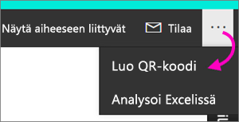
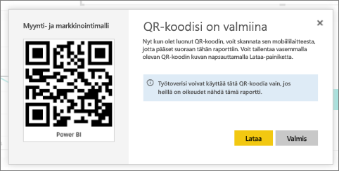

# Raportin QR-koodin luominen Power BI:ssä käytettäväksi mobiilisovelluksissa
Power BI:n QR-koodien avulla voit yhdistää mitä tahansa todellisesta maailmasta suoraan siihen liittyviin BI-tietoihin – siirtymis- tai hakutoimintoja ei tarvita.

Voit luoda QR-koodin Power BI -palvelussa mille tahansa raportille. Voit käyttää myös raporttia, jota et voi muokata. Sijoita sitten QR-koodi sopivaan sijaintiin. Voit esimerkiksi liittää sen sähköpostiviestiin tai tulostaa ja liimata sen sopivaan sijaintiin. 

Työtoverit, joiden kanssa olet jakanut kyseisen raportin, voivat lukea QR-koodin ja päästä siten [mobiililaitteellaan](consumer/mobile/mobile-apps-qr-code.md) suoraan haluttuun raporttiin. He voivat käyttää joko Power BI ‑sovelluksen omaa QR-koodinlukijaa tai mitä tahansa muuta heidän laitteessaan olevaa QR-lukijaa. He voivat myös [lukea raportin QR-koodin Power BI ja tehostettu todellisuus -sovelluksessa](consumer/mobile/mobile-mixed-reality-app.md#scan-a-report-qr-code-in-holographic-view).

## Raportin QR-koodin luominen
1. Avaa raportti Power BI -palvelussa.
2. Valitse ruudun oikeasta yläkulmasta kolme pistettä (...) ja valitse sitten **Muodosta QR-koodi**. 
   
    
3. Näytölle avautuu valintaikkuna, jossa on QR-koodi. 
   
    
4. Siitä voit lukea QR-koodin tai ladata ja tallentaa sen itsellesi, jotta voit: 
   
   * lisätä sen sähköpostiviestiin tai muuhun asiakirjaan tai 
   * tulostaa sen ja viedä sen haluttuun sijaintiin. 

## QR-koodin tulostaminen
Power BI luo QR-koodin JPG-tiedostona, joka on valmis tulostettavaksi. 

1. Valitse **Lataa** ja avaa sitten JPG-tiedosto tietokoneella, joka on yhdistetty tulostimeen.  
   
   JPG-tiedoston nimi on sama kuin ruudun nimi. Esimerkiksi Myynti- ja markkinointimalli.jpg.
   
1. Voit valita, haluatko tulostaa tiedoston koossa 100 % vai todellisessa koossa.  
2. Leikkaa QR-koodi paperilta reunoja pitkin ja liimaa se raportin kannalta olennaiseen sijaintiin. 

## Seuraavat vaiheet
* [Power BI:n yhdistäminen reaalimaailman tietoihin](consumer/mobile/mobile-apps-data-in-real-world-context.md) mobiilisovellusten avulla
* [Power BI:n QR-koodin lukeminen mobiililaitteella](consumer/mobile/mobile-apps-qr-code.md)
* [Ruudun QR-koodin luominen](service-create-qr-code-for-tile.md)
* Ilmenikö kysyttävää? [Voit esittää kysymyksiä Power BI -yhteisössä](http://community.powerbi.com/)

