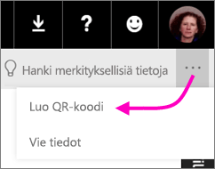
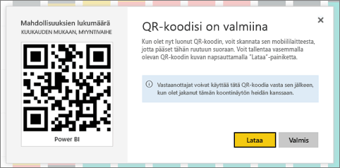

# QR-koodin luominen Power BI:n ruutuun mobiilisovelluksissa käytettäväksi
Power BI:n QR-koodien avulla voit yhdistää mitä tahansa todellisesta maailmasta suoraan siihen liittyviin BI-tietoihin – siirtymis- tai hakutoimintoja ei tarvita.

Voit luoda QR-koodin Power BI ‑palvelussa minkä tahansa koontinäytön ruutuun, jopa koontinäyttöihin, joihin sinulla ei ole muokkausoikeuksia. Sijoita sitten QR-koodi sopivaan paikkaan. Voit esimerkiksi liittää sen sähköpostiviestiin tai tulostaa sen tai liimata sen sopivaan sijaintiin. 

Työtoverit, joiden kanssa olet jakanut kyseisen koontinäytön, voivat [lukea QR-koodin ja päästä siten mobiililaitteellaan suoraan haluttuun ruutuun](consumer/mobile/mobile-apps-qr-code.md). He voivat käyttää joko Power BI ‑sovelluksen omaa QR-koodinlukijaa tai mitä tahansa muuta heidän laitteessaan olevaa QR-lukijaa.

## Ruudun QR-koodin luominen
1. Avaa Power BI -palvelussa haluamasi koontinäyttö.
2. Valitse ruudun oikeasta yläkulmasta **Lisää asetuksia** (...) ja valitse sitten **tarkastelutila** .
3. Valitse oikeasta yläkulmasta **Enemmän vaihtoehtoja** (...) ja valitse **Muodosta QR-koodi**. 
   
    
4. Näytölle avautuu valintaikkuna, jossa on QR-koodi. 
   
    
5. Siitä voit lukea QR-koodin tai ladata ja tallentaa sen itsellesi, jotta voit: 
   
   * lisätä sen sähköpostiviestiin tai muuhun asiakirjaan tai 
   * tulostaa sen ja viedä sen haluttuun sijaintiin. 

## QR-koodin tulostaminen
Power BI luo QR-koodin JPG-tiedostona, joka on valmis tulostettavaksi. 

1. Valitse **Lataa** ja avaa sitten JPG-tiedosto tietokoneella, joka on yhdistetty tulostimeen.  
   
   > [!TIP]
   > JPG-tiedoston nimi on sama kuin ruudun nimi. Esimerkiksi ”Mahdollisuuksien määrä - kuukausittain, myyntivaihe.jpg”.
   > 
   > 
2. Voit valita, haluatko tulostaa tiedoston koossa 100 % vai ”todellisessa koossa”.  
3. Leikkaa QR-koodi paperilta ja liimaa se ruudun kannalta olennaiseen sijaintiin. 

## Seuraavat vaiheet
* [Power BI:n yhdistäminen reaalimaailman tietoihin](consumer/mobile/mobile-apps-data-in-real-world-context.md) mobiilisovellusten avulla
* [Power BI:n QR-koodin lukeminen mobiililaitteella](consumer/mobile/mobile-apps-qr-code.md)
* [QR-koodin luominen raportista](service-create-qr-code-for-report.md)
* Onko sinulla kysyttävää? [Voit esittää kysymyksiä Power BI -yhteisössä](https://community.powerbi.com/)

