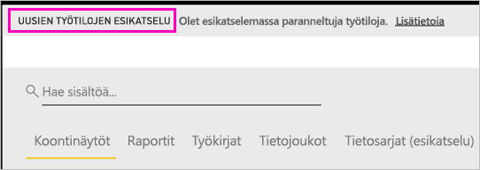
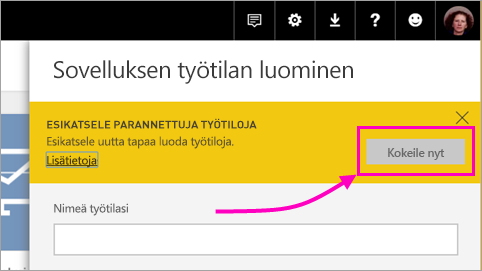
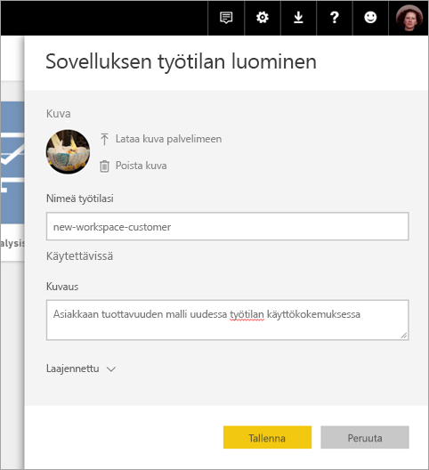
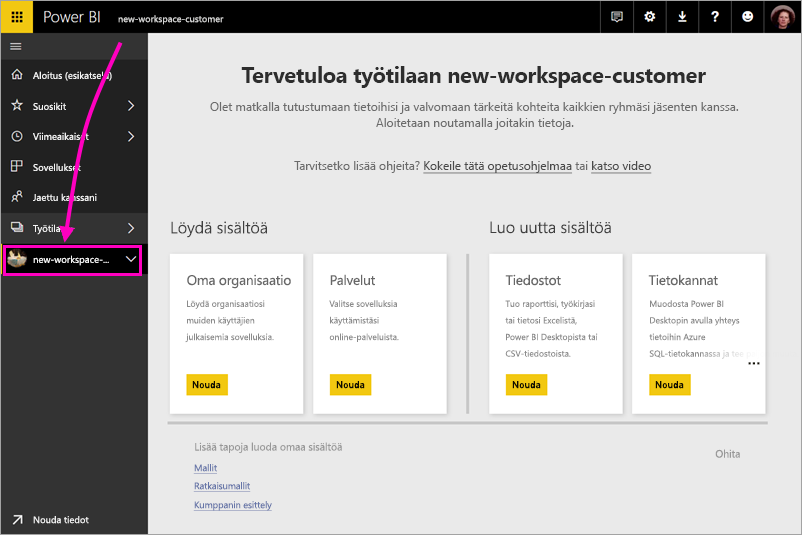
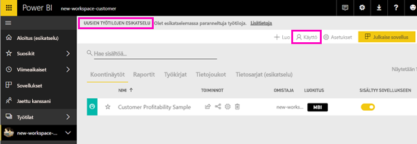
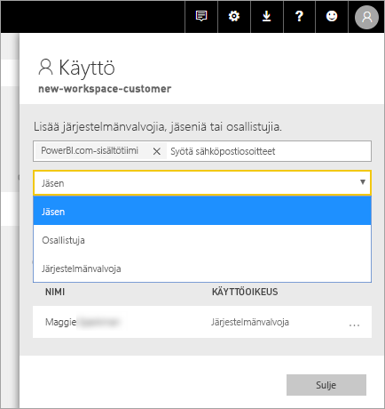
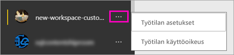

# Uusien työtilojen luominen (esiversio) Power BI:ssä

Power BI:ssä esitellään uusi työtilakokemus esiversiona. Työtilat ovat edelleen paikkoja, joissa voi yhteistyössä työtovereiden kanssa luoda kokoelmia raporttinäkymistä ja raporteista. Kokoelmat voi paketoida *sovelluksiksi* ja jakaa koko organisaatiolle tai tietyille henkilöille tai ryhmille. 

Uusien työtilojen esiversion avulla voit käyttää seuraavia ominaisuuksia:

- Työtilan roolien määrittäminen käyttäjäryhmille: käyttöoikeusryhmät, jakeluluettelot, Office 365 -ryhmiä ja henkilöt.
- Työtilan luominen Power BI:ssä luomatta Office 365 -ryhmää.
- Tarkempien työtilaroolien käyttäminen oikeuksien määrittämiseksi työtilassa entistä joustavammin.
 
Kun luot jonkin uusista työtiloista, et luo taustalla toimivaa, työtilaan liitettyä Office 365 -ryhmää. Työtilaa hallitaan Power BI:ssä Office 365:n sijasta. Voit yhä lisätä Office 365 -ryhmän työtilaan ja jatkaa käyttöoikeuksien hallitsemista Office 365 -ryhmien kautta. Voit myös käyttää käyttöoikeusryhmiä ja jakeluluetteloita sekä lisätä henkilöitä suoraan Power BI:ssä ja hallita näin joustavasti työtilan käyttöoikeuksia. Koska työtilan hallinta tapahtuu nyt Power BI:ssä, Power BI:n järjestelmänvalvojat päättävät, kuka voi luoda työtiloja organisaatiossa. Katso lisätietoja [Power BI:n järjestelmänvalvojan portaalin artikkelin Työtilat-osiosta](service-admin-portal.md#workspace-settings). 

Voit lisätä käyttäjäryhmiä tai henkilöitä uusiin työtiloihin jäseninä, osallistujina tai järjestelmänvalvojina. Kaikki käyttäjäryhmän jäsenet saavat määrittämäsi roolin. Jos käyttäjä on useissa käyttäjäryhmissä, hän saa roolin myöntämän parhaan käyttöoikeustason.  Eri roolien tarkempi kuvaus on jäljempänä tässä artikkelissa kohdassa [Roolit uusissa työtiloissa](#roles-in-the-new-workspaces).

Jokainen sovellustyötilaan lisätty jäsen tarvitsee Power BI Pro -käyttöoikeuden. Työtilassa nämä käyttäjät voivat tehdä yhteistyötä niiden raporttinäkymien ja raporttien parissa, jotka aiot julkaista laajemmalle lukijakunnalle tai jopa koko organisaatiolle. Jos haluat jakaa sisältöä muille organisaatiosi sisällä, voit määrittää Power BI Pro -käyttöoikeudet kyseisille käyttäjille tai sijoittaa työtilan Power BI Premium -kapasiteettiin.

Uusien työtilojen myötä suunnittelemme joitakin ominaisuuksia uudelleen. Tämän artikkelin jäljempänä olevassa kohdassa [Eri tavalla toimivat sovellustyötilan ominaisuudet](#app-workspace-features-that-work-differently) on selitetty muutokset, jotka todennäköisesti tulevat olemaan pysyviä tämän esiversion myötä. Koska tämä on esiversio-ominaisuus, ominaisuuteen liittyy joitakin rajoituksia, jotka kannattaa tiedostaa. Tämän artikkelin jäljempänä olevassa kohdassa [Tunnetut ongelmat](#known-issues) selitetään nykyisiä rajoituksia. 

## Uusien sovellustyötilojen julkaiseminen

Esiversion aikana uudet ja vanhat työtilat voivat olla olemassa rinnakkain, ja voit luoda kumman tahansa. Kun uuden työtilakokemuksen esiversio päättyy ja ne ovat yleisesti saatavilla, vanhat työtilat ovat olemassa yhä jonkin aikaa. Niitä ei voi enää luoda, ja sinun tulee valmistautua työtilojen siirtämiseen uuteen työtilainfrastruktuuriin. Siirron tekemiseen on aikaa useita kuukausia.

## Uuden sovellustyötilan luominen

1. Aloita luomalla sovellustyötila. Valitse **Työtilat** > **Luo sovelluksen työtila**.
   
     

2. Valitse **Esikatsele paranneltuja työtiloja** -kohdassa **Kokeile nyt**.
   
     

2. Anna työtilalle nimi. Jos nimi ei ole käytettävissä, muokkaa nimeä niin, että saat yksilöllisen tunnuksen.
   
     Sovelluksella on sama nimi kuin työtilalla.
   
1. Lisää kuva, jos haluat. Tiedostokoon on oltava pienempi kuin 45 kt.
 
    

1. Valitse **Tallenna**.

    Tässä on uuden työtilasi **Tervetuloa**-näyttö. Voit lisätä tietoja. 

    

1. Valitse esimerkiksi **Mallit** > **Asiakkaan tuottavuuden malli**.

    Näet työtilan sisältöluettelossa **uusien työtilojen esiversion**. Koska olet järjestelmänvalvoja, näet myös uuden toiminnon **Käyttö**.

    

1. Valitse **Käyttö**.

1. Lisää käyttöoikeusryhmiä, jakeluluetteloita, Office 365 -ryhmiä tai henkilöitä näihin työtiloihin jäseninä, osallistujina tai järjestelmänvalvojina. Eri roolien tarkempi kuvaus on jäljempänä tässä artikkelissa kohdassa [Roolit uusissa työtiloissa](#roles-in-the-new-workspaces).

    

9. Valitse **Lisää** > **Sulje**.

1. Power BI luo työtilan ja avaa sen. Työtila ilmestyy luetteloon työtiloista, joiden jäsen olet. Järjestelmänvalvojana voit valita kolme pistettä (...) ja palata takaisin tekemään muutoksia työtilan asetuksiin, lisäämään uusia jäseniä ja muuttamaan jäsenten käyttöoikeuksia.

     

## Sisällön lisääminen sovellustyötilaan

Kun olet luonut uutta tyyliä olevan sovellustyötilan, on aika lisätä siihen sisältöä. Sisällön lisääminen tapahtuu samankaltaisella tavalla uusissa ja vanhoissa työtiloissa yhdellä poikkeuksella. Ollessasi jommassakummassa sovelluksen työtilassa voit ladata tai muodostaa yhteyden tiedostoihin aivan samalla tavalla kuin tekisit Omassa työtilassa. Uusissa työtiloissa et voi muodostaa yhteyttä organisaation sisältöpaketteihin tai kolmannen osapuolen sisältöpaketteihin, kuten Microsoft Dynamics CRM:ään, Salesforceen tai Google Analyticsiin. Nykyisissä työtiloissa voit muodostaa yhteyden sisältöpaketteihin.

Kun sisältöä tarkastellaan sovellustyötilan sisältöluettelossa, sovellustyötilan nimenä näkyy omistajan nimi.

### Kolmannen osapuolen palveluihin yhdistäminen uusissa työtiloissa (esiversio)

Uudessa työtilakokemuksessa painotetaan sovelluksia. Kolmannen osapuolen palveluille tarkoitettujen sovellusten avulla käyttäjät voivat helposti noutaa tietoja käyttämistään palveluista, kuten Microsoft Dynamics CRM:stä, Salesforcesta tai Google Analyticsista.
Organisaation sovellusten kautta käyttäjät pääsevät käyttämään tarvitsemiansa sisäisiä tietoja. Aiomme lisätä ominaisuuksia organisaation sovelluksiin, jotta käyttäjät voivat mukauttaa sovelluksista löytyvää sisältöä. Sen jälkeen sisältöpaketteja ei enää tarvita. 

Et voi luoda tai käyttää organisaation sisältöpaketteja uusien työtilojen esiversiossa. Voit sen sijaan käyttää saatavilla olevia sovelluksia ja muodostaa yhteyden kolmannen osapuolen palveluihin tai pyytää sisäisiä ryhmiä tarjoamaan sovellukset tällä hetkellä käytössäsi oleviin sisältöpaketteihin. 

## Roolit uusissa työtiloissa

Roolien avulla voit hallita, kuka voi tehdä mitäkin työtilassa, joten ryhmät voivat tehdä yhteistyötä. Uusissa työtiloissa voit määrittää henkilöille ja käyttäjäryhmille rooleja. Voit käyttää käyttöoikeusryhmiä, Office 365 -ryhmiä ja jakeluluetteloita. 

Kun määrität rooleja käyttäjäryhmälle, ryhmän käyttäjät voivat käyttää sisältöä. Jos asetat sisäkkäin käyttäjäryhmiä, kaikilla ryhmien käyttäjillä on käyttöoikeus. Käyttäjä, joka on useissa käyttäjäryhmissä, joille on määritetty eri rooleja, saa parhaan myönnetyn käyttöoikeuden. 

Uusissa työtiloissa on kolme roolia: järjestelmänvalvojat, jäsenet ja osallistujat.

**Järjestelmänvalvojat voivat:**

- Päivittää työtilaa ja poistaa sen. 
- Lisätä tai poistaa ihmisiä, myös muita järjestelmänvalvojia.
- Tehdä kaikkea, mitä jäsenet voivat tehdä.

**Jäsenet voivat:** 

- Lisätä jäseniä tai muita, joilla on vähäisemmät oikeudet.
- Julkaista ja päivittää sovelluksen.
- Jakaa kohteen tai sovelluksen.
- Sallia muille kohteiden jakaminen uudelleen.
- Tehdä kaikkea, mitä osallistujat voivat tehdä.

**Osallistujat voivat:** 

- Luoda, muokata ja poistaa työtilan sisältöä. 
- Julkaista raportteja työtilaan ja poistaa sisältöä.
- Uusille henkilöille ei voi myöntää sisällön käyttöoikeutta; uutta sisältöä ei voi jakaa, mutta jakaminen onnistuu henkilölle, jolle työtila, kohde tai sovellus on jo jaettu. 
- Ryhmän jäseniä ei voi muokata.
 
Luomme Pyydä käyttöoikeutta -työnkulkuja palvelun kautta, jotta käyttäjät, joilla ei ole käyttöoikeutta, voivat pyytää sitä. Pyydä käyttöoikeutta -työnkulut ovat tällä hetkellä käytettävissä raporttinäkymille, raporteille ja sovelluksille.

## Sovelluksen jakaminen

Kun sisältö on valmis, valitset, mitkä raporttinäkymät ja raportit haluat julkaista, ja sitten julkaiset sen *sovelluksena*. Voit luoda yhden sovelluksen kustakin työtilasta. Työtoverisi voivat saada sovelluksesi käyttöönsä eri tavoin. Voit asentaa sen automaattisesti työtovereittesi Power BI -tileille, jos Power BI -järjestelmänvalvojasi antaa sinulle luvan. Muussa tapauksessa he voivat hakea ja asentaa sovelluksesi Microsoft AppSourcesta tai voit lähettää heille suoran linkin. He saavat päivitykset automaattisesti, ja sinä voit määrittää, kuinka usein tiedot päivitetään. Lisätietoja on artikkelissa [Raporttinäkymiä ja raportteja sisältävien sovellusten julkaiseminen Power BI:ssä](service-create-distribute-apps.md).

## Vanhojen sovellustyötilojen muuntaminen uusiksi sovellustyötiloiksi

Esiversion aikana et voi muuntaa vanhoja sovellustyötiloja automaattisesti uusiksi. Voit kuitenkin luoda uuden sovellustyötilan ja julkaista sisältöä uudessa sijainnissa. 

Kun uudet työtilat ovat yleisesti käytettävissä (GA), voit siirtää vanhat työtilat automaattisesti. Jonkin aikaa GA:n jälkeen ne on siirrettävä.

## Power BI -sovellusten usein kysytyt kysymykset

### Miten uudet sovellustyötilat eroavat nykyisistä sovellustyötiloista?
* Sovelluksen työtilojen luominen ei luo vastaavia esiintymiä Office 365:ssä, kuten nykyiset sovellustyötilat tekevät. (Voit silti lisätä Office 365 -ryhmän työtilaasi määrittämällä sille roolin.) 
* Nykyisissä sovellustyötiloissa voit lisätä vain yksittäisiä henkilöitä jäsenten ja järjestelmänvalvojien luetteloihin. Uusissa sovellustyötiloissa voit lisätä useita AD-suojausryhmiä, jakeluluetteloita tai Office 365 -ryhmiä näihin luetteloihin, mikä helpottaa käyttäjien hallintaa. 
- Voit luoda organisaation sisältöpaketin nykyisestä sovellustyötilasta. Et pysty luomaan sisältöpakettia uusista sovellustyötiloista.
- Voit käyttää organisaation sisältöpakettia nykyisestä sovellustyötilasta. Et pysty käyttämään sisältöpakettia uusista sovellustyötiloista.
- Esiversion aikana jotkin ominaisuudet eivät ole vielä käytössä uusissa sovellustyötiloissa. Lisätietoja on kohdassa [Muita suunniteltuja uuden työtilan ominaisuuksia](service-create-the-new-workspaces.md#other-planned-new-app-workspace-preview-features).

## Suunniteltuja uuden sovellustyötilan esiversio-ominaisuuksia

Joitakin uuden sovellustyötilan esiversio-ominaisuuksia kehitetään edelleen, mutta ne eivät ole vielä käytettävissä esiversiota julkaistaessa:

- Ei **Poistu työtilasta** -painiketta.
- Käyttötietoja ei vielä tueta.
- Premium-version toiminta: Voit määrittää ja luoda työtiloja Premium-kapasiteetissa, mutta jos haluat siirtää työtilan kapasiteetista toiseen, siirry työtilan asetuksiin.
- SharePointin verkko-osan upottamista ei vielä tueta.
- Ei **OneDrive**-painiketta Office 365 -ryhmille Nouda tiedot- tai Hae tiedostot -ominaisuudessa.

## Eri tavalla toimivat sovellustyötilan ominaisuudet

Jotkin ominaisuudet toimivat uusissa sovellustyötiloissa eri tavalla kuin nykyisissä sovellustyötiloissa. Nämä erot on tarkoituksellista. Ne perustuvat saatuun asiakaspalautteeseen, ja ne mahdollistavat entistä joustavamman yhteistyötavan työtiloissa:

- Jäsenet voivat tai eivät voi jakaa uudelleen: korvataan osallistujan roolilla
- Vain luku -työtilat: Sen sijaan, että myöntäisit käyttäjille Vain luku -käyttöoikeuden työtilaan, määrität käyttäjille tulevan katselijan roolin, johon kuuluu samankaltainen Vain luku -käyttöoikeus työtilan sisältöön.

## Tunnetut ongelmat

Seuraavat ongelmat ovat tiedossa ja niiden korjauksia kehitetään:

- Maksuttomat käyttäjät tai käyttäjäryhmät, jotka on lisätty sähköpostitilausten vastaanottajiksi, eivät saa sähköpostiviestejä, vaikka heidän pitäisi saada viestit. Ongelma ilmenee silloin, kun yksi uusista työtiloista on Premium-kapasiteetissa, mutta tilauksen luovan käyttäjän oma työtila ei ole Premium-kapasiteetissa. Jos oma työtila on Premium-kapasiteetissa, maksuttomat käyttäjät ja käyttäjäryhmät saavat sähköpostiviestit.
- Kun työtila on siirretty Premium-kapasiteetista jaettuun kapasiteettiin, maksuttomat käyttäjät ja käyttäjäryhmät saavat joissakin tapauksissa sähköpostiviestejä edelleen, vaikka heidän ei pitäisi saada niitä. Ongelma ilmenee, kun tilauksen luoneen käyttäjän oma työtila on Premium-kapasiteetissa.

## Seuraavat vaiheet
* [Nykyisten työtilojen luominen](service-create-workspaces.md)
* [Asenna ja käytä sovelluksia Power BI:ssä](service-create-distribute-apps.md)
* Onko sinulla kysyttävää? [Voit esittää kysymyksiä Power BI -yhteisössä](http://community.powerbi.com/)
