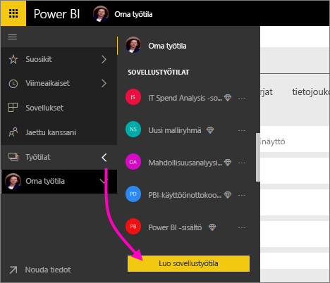
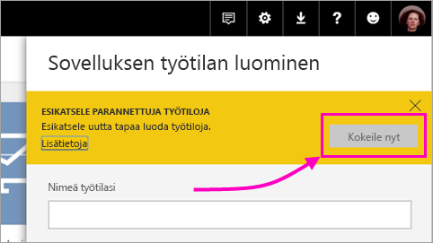
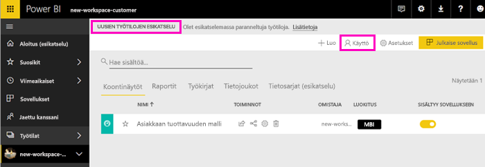
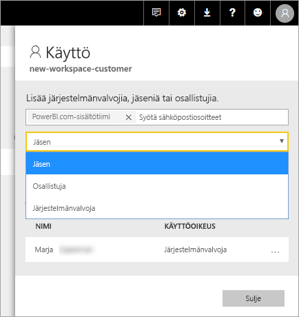
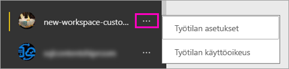

# Uusien työtilojen luominen (esiversio) Power BI:ssä

Power BI:ssä esitellään uusi työtilakokemus esiversiona. Työtilat ovat edelleen paikkoja, joissa voi yhteistyössä työtovereiden kanssa luoda kokoelmia raporttinäkymistä ja raporteista. Kokoelmat voi paketoida *sovelluksiksi* ja jakaa koko organisaatiolle tai tietyille henkilöille tai ryhmille. 

Uusien työtilojen esikatselun avulla voit nyt suorittaa seuraavia toimintoja:

- Työtilan roolien määrittäminen käyttäjäryhmille: käyttöoikeusryhmät, jakeluluettelot, Office 365 -ryhmiä ja henkilöt.
- Työtilan luominen Power BI:ssä luomatta Office 365 -ryhmää.
- Tarkempien työtilaroolien käyttäminen oikeuksien määrittämiseksi työtilassa entistä joustavammin.

Katso lisätietoja artikkelista [Uudet työtilat (esikatselu)](service-new-workspaces.md).

## Uuden sovellustyötilan luominen

1. Aloita luomalla sovellustyötila. Valitse **Työtilat** > **Luo sovelluksen työtila**.
   
     

2. Valitse **Esikatsele paranneltuja työtiloja** -kohdassa **Kokeile nyt**.
   
     

2. Anna työtilalle nimi. Jos nimi ei ole käytettävissä, muokkaa nimeä niin, että saat yksilöllisen tunnuksen.
   
     Sovelluksella on sama nimi kuin työtilalla.
   
1. Lisää kuva, jos haluat. Tiedostokoon on oltava pienempi kuin 45 kt.
 
    

1. Valitse **Tallenna**.

    Tässä on uuden työtilasi **Tervetuloa**-näyttö. Voit lisätä tietoja. 

    

1. Valitse esimerkiksi **Mallit** > **Asiakkaan tuottavuuden malli**.

    Näet työtilan sisältöluettelossa **uusien työtilojen esiversion**. Koska olet järjestelmänvalvoja, näet myös uuden toiminnon **Käyttö**.

    

1. Valitse **Käyttö**.

1. Lisää käyttöoikeusryhmiä, jakeluluetteloita, Office 365 -ryhmiä tai henkilöitä näihin työtiloihin jäseninä, osallistujina tai järjestelmänvalvojina. Eri roolien tarkempi kuvaus on [Roolit uusissa työtiloissa](service-new-workspaces.md#roles-in-the-new-workspaces) -kohdassa.

    

9. Valitse **Lisää** > **Sulje**.

1. Power BI luo työtilan ja avaa sen. Näet sen niiden työtilojen luettelossa, joiden jäsen olet. Järjestelmänvalvojana voit valita kolme pistettä (...) ja palata takaisin tekemään muutoksia työtilan asetuksiin, lisäämään uusia jäseniä ja muuttamaan jäsenten käyttöoikeuksia.

     

## Sisällön lisääminen sovellustyötilaan

Kun olet luonut uutta tyyliä olevan sovellustyötilan, on aika lisätä siihen sisältöä. Sisällön lisääminen tapahtuu samankaltaisella tavalla uusissa ja vanhoissa työtiloissa yhdellä poikkeuksella. Ollessasi jommassakummassa sovelluksen työtilassa voit ladata tai muodostaa yhteyden tiedostoihin aivan samalla tavalla kuin tekisit Omassa työtilassa. Uusissa työtiloissa et voi muodostaa yhteyttä organisaation sisältöpaketteihin tai kolmannen osapuolen sisältöpaketteihin, kuten Microsoft Dynamics CRM:ään, Salesforceen tai Google Analyticsiin. Voit nykyisissä työtiloissa muodostaa yhteyden sisältöpaketteihin.

Kun sisältöä tarkastellaan sovellustyötilan sisältöluettelossa, sovellustyötilan nimenä näkyy omistajan nimi.

### Kolmannen osapuolen palveluihin yhdistäminen uusissa työtiloissa (esiversio)

Keskitymme uusien työtilojen kokemuksessa *sovelluksiin*. Kolmannen osapuolen palveluille tarkoitettujen sovellusten avulla käyttäjät voivat helposti noutaa tietoja käyttämistään palveluista, kuten Microsoft Dynamics CRM:stä, Salesforcesta tai Google Analyticsista.
Organisaation sovellusten kautta käyttäjät pääsevät käyttämään tarvitsemiansa sisäisiä tietoja. Aiomme lisätä ominaisuuksia organisaation sovelluksiin, jotta käyttäjät voivat mukauttaa sovelluksista löytyvää sisältöä. Tämän toiminnon ansiosta sisältöpaketteja ei enää tarvita. 

Et voi luoda tai käyttää organisaation sisältöpaketteja uusien työtilojen esiversiossa. Voit sen sijaan käyttää saatavilla olevia sovelluksia ja muodostaa yhteyden kolmannen osapuolen palveluihin tai pyytää sisäisiä ryhmiä tarjoamaan sovellukset tällä hetkellä käytössäsi oleviin sisältöpaketteihin. 

## Sovelluksen jakaminen

Kun sisältö on valmis, valitset, mitkä raporttinäkymät ja raportit haluat julkaista, ja sitten julkaiset sen *sovelluksena*. Voit luoda yhden sovelluksen kustakin työtilasta. Työtoverisi voivat saada sovelluksesi käyttöönsä eri tavoin. Voit asentaa sen automaattisesti työtovereittesi Power BI -tileille, jos Power BI -järjestelmänvalvojasi antaa sinulle luvan. Muussa tapauksessa he voivat hakea ja asentaa sovelluksesi Microsoft AppSourcesta tai voit lähettää heille suoran linkin. He saavat päivitykset automaattisesti, ja sinä voit määrittää, kuinka usein tiedot päivitetään. Lisätietoja on artikkelissa [Raporttinäkymiä ja raportteja sisältävien sovellusten julkaiseminen Power BI:ssä](service-create-distribute-apps.md).

## Vanhojen sovellustyötilojen muuntaminen uusiksi sovellustyötiloiksi

Esiversion aikana et voi muuntaa vanhoja sovellustyötiloja automaattisesti uusiksi. Voit kuitenkin luoda uuden sovellustyötilan ja julkaista sisältöä uudessa sijainnissa. 

Kun uudet työtilat ovat yleisesti käytettävissä (GA), voit siirtää vanhat työtilat automaattisesti. Jonkin aikaa GA:n jälkeen ne on siirrettävä.

## Seuraavat vaiheet
* Lue [työn järjestämisestä uusissa työtiloissa (esikatselu) Power BI:ssä](service-new-workspaces.md)
* [Nykyisten työtilojen luominen](service-create-workspaces.md)
* [Asenna ja käytä sovelluksia Power BI:ssä](service-create-distribute-apps.md)
* Onko sinulla kysyttävää? [Voit esittää kysymyksiä Power BI -yhteisössä](http://community.powerbi.com/)
