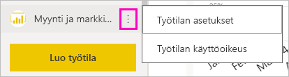
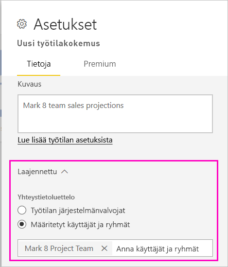
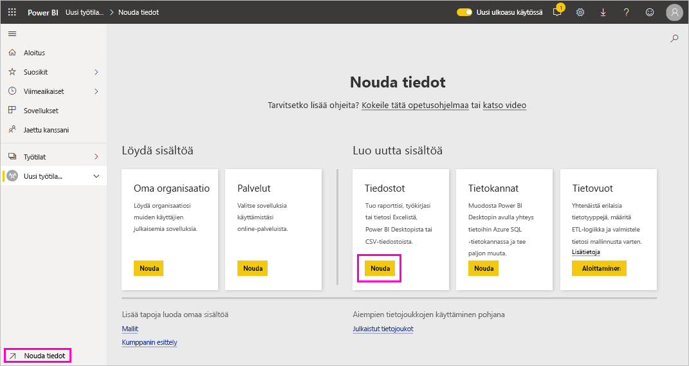
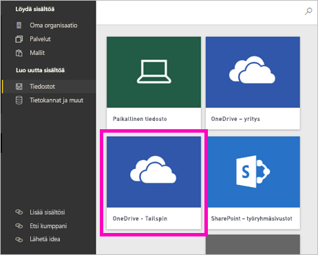
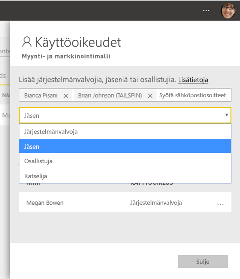

# Uusien työtilojen luominen Power BI:ssä

Power BI:ssä esitellään uusi työtilakokemus. Työtilat ovat edelleen paikkoja, joissa voit yhdessä työtovereiden kanssa luoda raporttinäkymien, raporttien ja sivutettujen raporttien kokoelmia. Sen jälkeen voit niputtaa ne yhteen *sovellukseksi* ja jakaa sen koko organisaatiolle tai tietyille henkilöille tai ryhmille. 

Seuraavat asiat ovat muuttuneet. Uusissa työtiloissa voit:

- Työtilan roolien määrittäminen käyttäjäryhmille: käyttöoikeusryhmät, jakeluluettelot, Office 365 -ryhmiä ja henkilöt.
- Työtilan luominen Power BI:ssä luomatta Office 365 -ryhmää.
- Tarkempien työtilaroolien käyttäminen oikeuksien määrittämiseksi työtilassa entistä joustavammin.

> [!NOTE]
> Jos haluat pakottaa rivitason suojauksen (RLS) käyttöön työtilan sisältöä selaaville Power BI Pro -käyttäjille, määritä käyttäjille Katselija-rooli.

Katso lisätietoja artikkelista [Uudet työtilat](service-new-workspaces.md).

## Uuden työtilan luominen

1. Aloita luomalla työtila. Valitse **Työtilat** > **Luo työtila**.
   
     

2. Sinulle luodaan oletuksena uudenlainen työtila, ellet halua **palata perinteisen** työtilan käyttöön.
   
     
     
     Jos valitset **Palaa perinteiseen**, luot [Office 365 -ryhmään perustuvan työtilan](service-create-workspaces.md). 

2. Anna työtilalle nimi. Jos nimi ei ole käytettävissä, muokkaa nimi yksilölliseksi.
   
     Työtilan sovelluksella on oltava sama nimi ja kuvake kuin työtilalla.
   
1. Tässä on joitain valinnaisia kohteita, joita voit asettaa työtilaasi:

    Lataa **Työtilan kuva** palvelimeen. Tiedostot voivat olla .png- tai .jpg-muotoisia. Tiedostokoon on oltava alle 45 kt.
    
    [Lisää **Yhteystietoluettelo**](#workspace-contact-list). Työtilan järjestelmänvalvojat ovat oletusarvoisia yhteyshenkilöitä. 
    
    [Määritä **työtilan OneDrive**](#workspace-onedrive) kirjoittamalla olemassa olevan Office 365 -ryhmän nimi (ei URL-osoite). Nyt tämä työtila voi käyttää Office 365 -ryhmän tiedostosäilön sijaintia. 

    

    Valitse **Erillinen kapasiteetti** **Premium**-välilehdeltä, jotta voit määrittää työtilan **Erilliseen kapasiteettiin**.
     
    

1. Valitse **Tallenna**.

    Power BI luo työtilan ja avaa sen. Näet sen niiden työtilojen luettelossa, joiden jäsen olet. 

## Työtilan yhteystietoluettelo

Voit määrittää käyttäjät, joille ilmoitetaan työtilassa esiintyneistä ongelmista. Oletusarvon mukaan ilmoitus annetaan kaikille käyttäjille tai ryhmille, jotka on määritetty työtilan järjestelmänvalvojiksi, mutta voit mukauttaa luetteloa lisäämällä vastaanottajia *yhteystietoluetteloon*. Yhteystietoluettelossa olevat käyttäjät tai ryhmät näytetään käyttöliittymässä (UI), jotta käyttäjät saavat työtilaa koskevaa apua.

1. Pääset uuteen **Yhteystietoluettelo**-asetukseen kahdella tavalla:

    **Luo työtila** -ruudusta, kun luot sen ensimmäisen kerran.

    Valitse siirtymisruudussa **Työtilat**-kohdan vieressä oleva nuoli. Valitse **Enemmän vaihtoehtoja** (...) työtilan nimen vierestä ja valitse **Työtilan asetukset**. **Asetukset**-ruutu avautuu.

    

2. Hyväksy **Lisäasetukset** > **Yhteystietoluettelo**-kohdan oletusasetus (**Työtilan järjestelmänvalvojat**) tai lisää oma **tiettyjen käyttäjien tai ryhmien** luettelo. 

    

3. Valitse **Tallenna**.

## Työtilan OneDrive

Työtilan OneDrive -ominaisuuden avulla voit määrittää Office 365 -ryhmän, jonka SharePoint-tiedostokirjaston tiedostosäilö on työtilan käyttäjien käytettävissä. Luot ryhmän ensin Power BI:n ulkopuolella. 

Power BI ei synkronoi niiden käyttäjien tai ryhmien käyttöoikeuksia, joille on määritetty työtilan käyttöoikeus Office 365 -ryhmän jäsenyyden yhteydessä. Paras käytäntö on antaa Office 365 -ryhmälle, jonka tiedostosäilön määritit tämän asetuksen Office 365 -ryhmässä, samat [työtilan käyttöoikeudet](#give-access-to-your-workspace). Hallitse työtilan käyttöoikeuksia Office 365 -ryhmän jäsenyyksien kautta. 

1. Voit käyttää uuden **työtilan OneDriven** asetusta kahdella tavalla:

    **Luo työtila** -ruudusta, kun luot sen ensimmäisen kerran.

    Valitse siirtymisruudussa **Työtilat**-kohdan vieressä oleva nuoli. Valitse **Enemmän vaihtoehtoja** (...) työtilan nimen vierestä ja valitse **Työtilan asetukset**. **Asetukset**-ruutu avautuu.

    

2. Kirjoita **Lisäasetukset** > **Työtilan OneDrive** -kohtaan aiemmin luomasi Office 365 -ryhmän nimi. Power BI valitsee automaattisesti ryhmän OneDriven.

    

3. Valitse **Tallenna**.

### Työtilan OneDrive-sijaintiin pääseminen

Kun olet määrittänyt OneDrive-sijainnin, pääset siihen samalla tavalla kuin Power BI -palvelun muihin tietolähteisiin.

1. Valitse siirtymisruudussa **Nouda tiedot**, ja valitse sitten **Tiedostot**-ruudussa **Nouda**.

    

1.  **OneDrive – Business** -kirjaus viittaa omaan OneDrive for Business -palveluusi. Toinen OneDrive on se, jonka lisäsit.

    

### Kolmannen osapuolen palveluihin yhdistäminen uusissa työtiloissa

Keskitymme uusien työtilojen kokemuksessa *sovelluksiin*. Kolmannen osapuolen palveluille tarkoitettujen sovellusten avulla käyttäjät voivat helposti noutaa tietoja käyttämistään palveluista, kuten Microsoft Dynamics CRM:stä, Salesforcesta tai Google Analyticsista.

Et voi luoda tai käyttää organisaation sisältöpaketteja uudenlaisissa työtiloissa. Voit sen sijaan käyttää saatavilla olevia sovelluksia ja muodostaa yhteyden kolmannen osapuolen palveluihin tai pyytää sisäisiä ryhmiä tarjoamaan sovellukset tällä hetkellä käytössäsi oleviin sisältöpaketteihin. 

## Työtilan käyttöoikeuksien antaminen

1. Järjestelmänvalvojat näkevät työtilan sisältöluettelossa uuden toiminnon, **Käyttöoikeudet**.

    

1. Lisää käyttöoikeusryhmiä, jakeluluetteloita, Office 365 -ryhmiä tai henkilöitä näihin työtiloihin katselijoina, jäseninä, osallistujina tai järjestelmänvalvojina. Eri roolien tarkempi kuvaus on [Roolit uusissa työtiloissa](service-new-workspaces.md#roles-in-the-new-workspaces) -kohdassa.

    

9. Valitse **Lisää** > **Sulje**.

## Sovelluksen jakaminen

Jos haluat levittää virallista sisältöä suurelle yleisölle organisaatiossasi, voit julkaista sovelluksen työtilasta.  Kun sisältö on valmis, valitse julkaistaviksi haluamasi raporttinäkymät ja raportit ja julkaise se *sovelluksena*. Voit luoda yhden sovelluksen kustakin työtilasta.

Lisätietoja [sovelluksen julkaisemisesta uuden työtilan kautta](service-create-distribute-apps.md)

## Seuraavat vaiheet
* Lue [työn järjestämisestä uusissa työtiloissa Power BI:ssä](service-new-workspaces.md)
* [Perinteisten työtilojen luominen](service-create-workspaces.md)
* [Sovelluksen julkaiseminen uusista työtiloista Power BI:ssä](service-create-distribute-apps.md)
* Onko sinulla kysyttävää? [Voit esittää kysymyksiä Power BI -yhteisössä](https://community.powerbi.com/)
