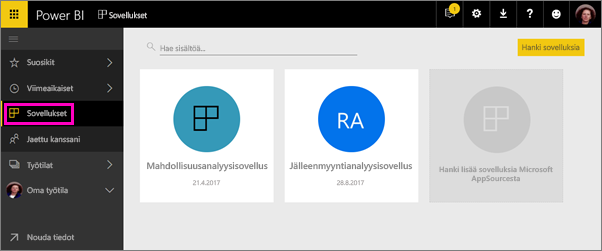
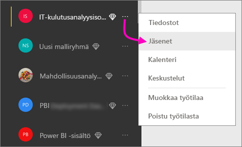
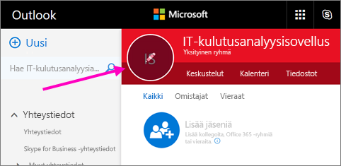
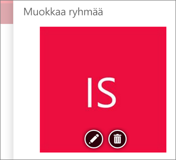
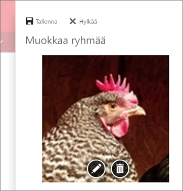
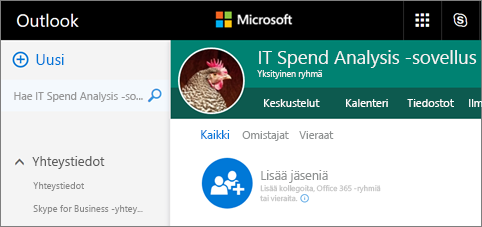
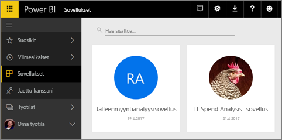

# Työtilojen luominen työtovereiden kanssa Power BI:ssä

Voit luoda Power BI:ssä *työtiloja*. Ne ovat paikkoja, joissa voit yhteistyössä työtovereiden kanssa luoda ja tarkentaa raporttinäkymien ja raporttien kokoelmia. Sen jälkeen voit paketoit ne yhteen *sovelluksiksi*, jotka voit jakaa koko organisaatiolle tai tietyille henkilöille tai ryhmille. 

Kun luot työtilan, luot taustalla toimivan, työtilaan liitetyn Office 365 -ryhmän. Työtilaa hallitaan Office 365:ssä. Voit lisätä työtovereita näihin työtiloihin jäseninä tai järjestelmänvalvojina. Työtilassa kaikki voivat tehdä yhteistyötä raporttinäkymien, raporttien tai muiden artikkeleiden parissa, jotka halutaan julkaista laajemmalle lukijakunnalle. Jokainen sovellustyötilaan lisätty jäsen tarvitsee Power BI Pro -käyttöoikeuden. 

**Tiesitkö?** Power BI:ssä esikatsellaan uutta työtilakokemusta. Lisätietoja työtilojen muuttumisesta tulevaisuudessa on artikkelissa [Uusien työtilojen luominen (esiversio)](service-create-the-new-workspaces.md). 

## Video: Sovellukset ja sovelluksen työtilat
<iframe width="640" height="360" src="https://www.youtube.com/embed/Ey5pyrr7Lk8?showinfo=0" frameborder="0" allowfullscreen></iframe>

## Office 365 -ryhmään perustuvan sovellustyötilan luominen

Kun luot sovellustyötilan, se perustuu Office 365 -ryhmään.

[!INCLUDE [powerbi-service-create-app-workspace](./includes/powerbi-service-create-app-workspace.md)]

Kun luot sen, saatat joutua odottamaan noin tunnin verran, että työtila välittää sen Office 365:een. 

### Kuvan lisääminen Office 365:n sovellustyötilaan (valinnainen)
Oletusarvoisesti Power BI luo sovelluksellesi pienen värillisen ympyrän, jossa näkyy sovelluksen nimikirjaimet. Saatat kuitenkin haluta mukauttaa sitä käyttämällä jotain kuvaa. Kuvan lisäämiseksi tarvitset Exchange Online -käyttöoikeuden.

1. Valitse **Työtilat**, valitse työtilan nimen vierestä kolme pistettä (...), ja valitse sitten **Jäsenet**. 
   
     
   
    Työtilan Office 365 Outlook -tili aukeaa uuteen selainikkunaan.
2. Kun pidät hiiren osoitinta vasemman yläkulman värillisen ympyrän päällä, se muuttuu kynäkuvakkeeksi. Valitse se.
   
     
3. Valitse kynäkuvake uudelleen, ja etsi kuva, jota haluat käyttää.
   
     

4. Valitse **Tallenna**.
   
     
   
    Kuvan korvaa värillisen ympyrän Office 365:n Outlook-ikkunassa. 
   
     
   
    Muutaman minuutin kuluttua se näkyy myös sovelluksessa Power BI:ssä.
   
     

## Sisällön lisääminen sovellustyötilaan

Kun olet luonut sovellustyötilan, on aika lisätä siihen sisältöä. Lisääminen toimii samaan tapaan kuin sisällön lisääminen Omaan työtilaan, paitsi että myös työtilan muut ihmiset pystyvät näkemään sen ja työstämään sitä. Suurin ero on, että kun saat sen valmiiksi, voit julkaista sisällön sovelluksena. Kun sisältöä tarkastellaan sovellustyötilan sisältöluettelossa, sovellustyötilan nimenä näkyy omistajan nimi.

### Yhteyden muodostaminen kolmannen osapuolen palveluihin sovellustyötiloissa

Sovellukset toimitetaan kaikille kolmannen osapuolen palveluille, joita Power BI tukee. Sen ansiosta saat helposti tiedot käyttämistäsi palveluista, kuten Microsoft Dynamics CRM:stä, Salesforcesta tai Google Analyticsista. Voit julkaista organisaation sovellukset, jotta käyttäjät pääsevät käyttämään tarvitsemiansa tietoja.

Nykyisissä työtiloissa voit myös muodostaa yhteyden organisaation sisältöpaketteihin ja kolmannen osapuolen sisältöpaketteihin, kuten Microsoft Dynamics CRM:ään, Salesforceen tai Google Analyticsiin. Harkitse organisaation sisältöpakettien siirtämistä sovelluksiin.

## Sovelluksen jakaminen

Kun sisältö on valmis, valitset, mitkä raporttinäkymät ja raportit haluat julkaista, ja sitten julkaiset sen *sovelluksena*. Työtoverisi saavat sovelluksesi käyttöönsä eri tavoin. Voit asentaa ne automaattisesti työtovereittesi Power BI -tileille, jos Power BI -järjestelmänvalvojasi antaa sinulle luvan. Muussa tapauksessa he voivat hakea ja asentaa sovelluksesi Microsoft AppSourcesta tai voit lähettää heille suoran linkin. He saavat päivitykset automaattisesti, ja sinä voit määrittää, kuinka usein tiedot päivitetään. Lisätietoja on artikkelissa [Raporttinäkymiä ja raportteja sisältävien sovellusten julkaiseminen Power BI:ssä](consumer/end-user-create-apps.md).

## Power BI -sovellusten usein kysytyt kysymykset

### Miten sovellukset eroavat organisaation sisältöpaketeista?
Sovellukset ovat organisaation sisältöpakettien seuraava kehitysaste. Jos sinulla on jo organisaation sisältöpaketteja, ne toimivat edelleen rinnakkain sovellusten kanssa. Sovelluksilla ja sisältöpaketeilla on muutamia merkittäviä eroja. 

* Kun yrityskäyttäjät ovat asentaneet sisältöpaketin, se menettää ryhmäidentiteettinsä: se on vain luettelo koontinäyttöjä ja raportteja, jotka ovat sikin sokin muiden koontinäyttöjen ja raporttien keskellä. Sovellukset taas säilyttävätä ryhmityksensä ja identiteettinsä jopa asennuksen jälkeen. Tämän ansiosta yrityskäyttäjien on helpompi käyttää niitä myöhemminkin.
* Voit luoda useita sisältöpaketteja mistä tahansa työtilasta, mutta sovelluksella on 1:1-suhde työtilansa kanssa. 
* Ajan mittaan aiomme lakkauttaa organisaation sisältöpaketit, joten suosittelemme, että luot tästä lähtien sovelluksia.  
* Uuden työtilakokemuksen esiversion myötä siirrymme kohti organisaation sisältöpakettien poistamista käytöstä. Ei voi käyttää tai luoda niitä esiversion työtiloissa.

Voit verrata nykyisiä ja uusia sovellustyötiloja tutustumalla artikkeliin [Miten uudet sovellustyötilat eroavat nykyisistä sovellustyötiloista?](service-create-the-new-workspaces.md#how-are-the-new-app-workspaces-different-from-current-app-workspaces). 

## Seuraavat vaiheet
* [Asenna ja käytä sovelluksia Power BI:ssä](consumer/end-user-apps.md)
* [Power BI -sovellukset ulkoisille palveluille](consumer/end-user-connect-to-services.md)
- [Uusien työtilojen luominen (esiversio)](service-create-the-new-workspaces.md)
* Onko sinulla kysyttävää? [Voit esittää kysymyksiä Power BI -yhteisössä](http://community.powerbi.com/)
