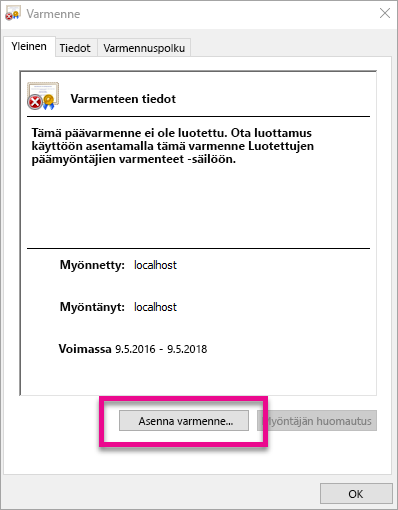
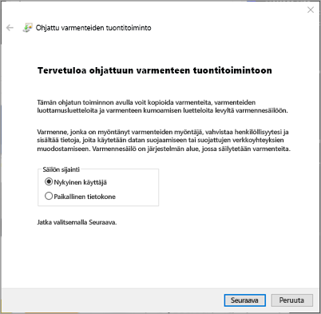
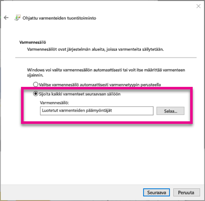
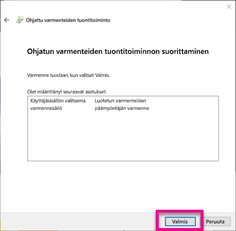
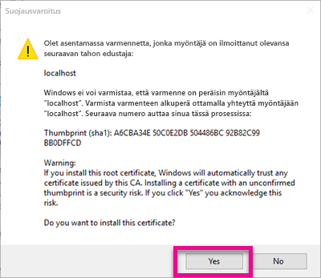
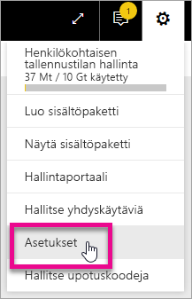
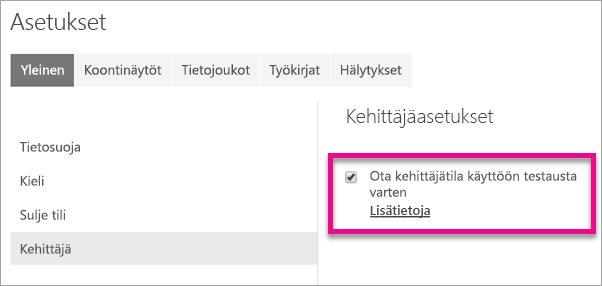
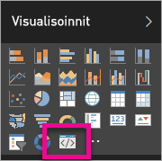

# <a name="use-developer-tools-to-create-custom-visuals"></a>Mukautettujen visualisointien luominen kehittäjätyökalujen avulla

Voit mukautettujen visualisointien avulla vastata käyttäjiesi tarpeita ja sovelluksesi rakennetta. Lue, miten voit luoda mukautetun visualisoinnin Power BI:lle kehittäjätyökalujen avulla.

> [!NOTE]
> Pääset alkuun tämän asiakirjan avulla. Katso lisätietoja artikkelin [Power BI -visualisointien Git Repo](https://github.com/Microsoft/PowerBI-visuals) viitetiedoista.

## <a name="requirements"></a>Vaatimukset

* Vähintään NodeJS 4.0 pakollinen (suositeltu versio 5.0 tai uudempi) [NodeJS:n lataaminen](https://nodejs.org)

## <a name="install-nodejs-and-the-power-bi-tools"></a>NodeJS:n ja Power BI -työkalujen asentaminen

Jotta voit luoda mukautetun visualisoinnin, sinun on asennettava NodeJS. NodeJS vaaditaan komentorivin työkalujen suorittamiseen.

1. Lataa ja asenna [NodeJS](https://nodejs.org). Versio 4.0 tai uudempi on pakollinen, mutta suosittelemme versiota 5.0 tai uudempaa versiota.
2. Asenna komentorivin työkalut. Suorita seuraava komento komentokehotteesta.

        npm install -g powerbi-visuals-tools
3. Voit vahvistaa työkalujen asentamisen suorittamalla seuraavan komennon ilman parametreja.

        pbiviz

    Näkyviin pitäisi tulla tulee Ohje-tuloste.

    <pre><code>
         +syyso+/
    oms/+osyhdhyso/
    ym/       /+oshddhys+/
    ym/              /+oyhddhyo+/
    ym/                     /osyhdho
    ym/                           sm+
    ym/               yddy        om+
    ym/         shho /mmmm/       om+
     /    oys/ +mmmm /mmmm/       om+
    oso  ommmh +mmmm /mmmm/       om+
   ymmmy smmmh +mmmm /mmmm/       om+
   ymmmy smmmh +mmmm /mmmm/       om+
   ymmmy smmmh +mmmm /mmmm/       om+
   +dmd+ smmmh +mmmm /mmmm/       om+
         /hmdo +mmmm /mmmm/ /so+//ym/
               /dmmh /mmmm/ /osyhhy/
                 //   dmmd
                       ++

       PowerBI Custom Visual Tool

    Usage: pbiviz [options] [command]

    Commands:

    new [name]        Create a new visual
    info              Display info about the current visual
    start             Start the current visual
    package           Package the current visual into a pbiviz file
    update [version]  Updates the api definitions and schemas in the current visual. Changes the version if specified
    help [cmd]        display help for [cmd]

    Options:

    -h, --help      output usage information
    -V, --version   output the version number
    --install-cert  Install localhost certificate
    </code></pre>

<a name="ssl-setup"></a>

### <a name="server-certificate-setup"></a>Palvelinvarmenteen määritys

Jotta voit ottaa käyttöön visualisoinnin reaaliaikaisen esikatselun, tarvitset luotettua https-palvelinta. Ennen kuin voit aloittaa, sinun on asennettava SSL-varmenne, jotta visualisointiresurssit voidaan ladata verkkoselaimeen. 

> [!NOTE]
> Kyse on kehittäjän työaseman yhden kerran suoritettavasta määrityksestä.

Voit *luoda* varmenteen suorittamalla seuraavan komennon.

    pbiviz --create-cert

> [!NOTE]
> Sinun pitäisi nähdä viesti, jossa on ilmoitettu varmenteen sijaintipolku ja juuri luotu tunnuslause.

Voit *asentaa*  varmenteen suorittamalla seuraavan komennon.

    pbiviz --install-cert

> [!NOTE]
> Sinun pitäisi nähdä viesti, jossa sinua pyydetään käyttämään juuri luotua tunnuslausetta PFX-varmenteen asentamiseen.

**Windows-käyttöjärjestelmä**

1. Valitse **Asenna varmenne...**.

    
2. Valitse **Nykyinen käyttäjä** ja valitse sitten **Seuraava**.

    
3. Valitse **Sijoita kaikki varmenteet seuraavaan paikkaan** ja valitse **Selaa...**.
4. Valitse **Luotetut juurivarmennemyöntäjät** ja valitse sitten **OK**. Valitse **Seuraava**.

    
5. Valitse **Valmis**.

    
6. Valitse **Kyllä** suojauksen varoitusikkunasta.

    
7. Sulje kaikki selaimet, jotka ovat avoinna.

> [!NOTE]
> Jos varmennetta ei tunnisteta, sinun on ehkä käynnistettävä tietokone uudelleen.

**OSX**

1. Jos lukko on lukittu vasemmassa yläkulmassa, avaa sen lukitus valitsemalla lukko. Hae *localhost* ja kaksoisnapsauta varmennetta.

    
2. Valitse **Luota aina** ja sulje ikkuna.

    
3. Kirjoita käyttäjänimi ja salasana. Valitse **Päivitä asetukset**.

    
4. Sulje kaikki selaimet, jotka ovat avoinna.

> [!NOTE]
> Jos varmennetta ei tunnisteta, sinun on ehkä käynnistettävä tietokone uudelleen.

## <a name="enable-a-live-preview-of-the-developer-visual"></a>Kehittäjän visualisoinnin reaaliaikaisen esikatselun käyttöönotto

Voit ottaa mukautetun visualisoinnin reaaliaikaisen esikatselun käyttöön seuraavasti. Tällä tavoin visualisointia voi käyttää Power BI -palvelussa raporttien muokkauksen aikana.

1. Selaa ja kirjaudu sisään [app.powerbi.comiin](https://app.powerbi.com).
2. Valitse **hammaspyöräkuvake** ja valitse sitten **Asetukset**.

    
3. Valitse **Kehittäjä** ja valitse sitten **Ota käyttöön kehittäjän visualisointi testausta varten**.

    
4. Valitse **Kehittäjän visualisointi** **Visualisointi**-ruudussa.

    

   > [!NOTE]
   > Tämä edellyttää, että olet suorittanut `pbiviz start` visualisointikansiosta kehittäjän tietokoneessa. Katso lisätietoja visualisoinnin luomisesta tästä artikkelista [Uuden visualisoinnin luominen](#create-a-new-visual).

5. Valitse visualisointi raporttipohjassa. Voit sitoa tietoja samalla tavalla kuin muita visualisointeja.

Voit nyt aloittaa visualisoinnin kehittämisen.

## <a name="create-a-new-visual"></a>Uuden visualisoinnin luominen

Voit luoda uuden visualisointiprojektin suorittamalla seuraavan komennon.

```powershell
pbiviz new MyVisualName
```

Voit korvata *MyVisualName*-kohdan nimellä, jonka haluat antaa visualisoinnille. Sitä voi muuttaa myöhemmin muokkaamalla `name`- ja `displayName`-kenttiä luodussa `pbiviz.json`-tiedostossa.

Tämä komento luo uuden kansion paikkaan, jossa komento suoritettiin. Se luo visualisoinnin perusaloitusmallin. Kun komento on suoritettu, voit avata hakemiston ja käyttää uutta visualisointia suosikkieditorisi avulla.

## <a name="testing-your-visual-in-power-bi"></a>Visualisoinnin testaus Power BI:ssä

Voit testata visualisointia Power BI -palvelun raporteissa ja koontinäytöissä.

<a name="running-your-visual"></a>

### <a name="running-your-visual"></a>Visualisoinnin suorittaminen

Voit suorittaa visualisoinnin toimimalla seuraavasti.

1. Avaa kehote.
2. Muuta hakemisto visualisointikansioksi. Tämä kansio sisältää `pbiviz.json`-tiedoston.
3. Suorita seuraava komento.

    ```powershell
    pbiviz start
    ```

    

Jos olet väärässä paikassa, näet seuraavanlaisen virheen.

```powershell
    error  LOAD ERROR Error: pbiviz.json not found. You must be in the root of a visual project to run this command.
        at e (C:\Users\[user]\AppData\Roaming\npm\node_modules\powerbi-visuals-tools\lib\VisualPackage.js:67:35)
        at Function.loadVisualPackage (C:\Users\[user]\AppData\Roaming\npm\node_modules\powerbi-visuals-tools\lib\VisualPackage.js:62:16)
        at Object.<anonymous> (C:\Users\[user]\AppData\Roaming\npm\node_modules\powerbi-visuals-tools\bin\pbiviz-start.js:43:15)
        at Module._compile (module.js:556:32)
        at Object.Module._extensions..js (module.js:565:10)
        at Module.load (module.js:473:32)
        at tryModuleLoad (module.js:432:12)
        at Function.Module._load (module.js:424:3)
        at Module.runMain (module.js:590:10)
        at run (bootstrap_node.js:394:7)
```

### <a name="viewing-your-visual-in-power-bi"></a>Visualisoinnin tarkasteleminen Power BI:ssä

Voit tarkastella visualisointia raportissa siirtymällä tähän raporttiin ja valitsemalla visualisoinnin **Visualisoinnit**-ruudussa.

> [!NOTE]
> Tätä ennen on suoritettava `pbiviz start`-komento [Visualisoinnin suorittaminen](#running-your-visual) -osiossa kuvatun mukaisesti.


Näyttöön tulee sitten visualisoinnin aloitusmalli.


| Työkalurivin kohde | Kuvaus |
| --- | --- |
| Päivitä visualisointi |Päivitä visualisointi manuaalisesti, jos automaattinen uudelleenlataus on poistettu käytöstä. |
| Automaattinen uudelleenlataus käytössä tai ei käytössä |Kun se on käytössä, visualisointi päivitetään automaattisesti aina, kun tallennat visualisointitiedoston. |
| Näytä tietonäkymä |Näyttää visualisoinnin pohjana olevan tietonäkymän virheenkorjausta varten. |
| Hanki apua |Dokumentaatio GitHubissa |
| Lähetä palautetta |Kerro meille, jos voimme jotenkin parantaa käyttökokemustasi! (GitHub-tili pakollinen) |

## <a name="package-your-visual-for-use-in-power-bi-desktop-and-distribution"></a>Pakkaa visualisointi käytettäväksi Power BI Desktopissa ja jakelussa

Ennen kuin voit ladata visualisoinnin [Power BI Desktopiin](https://powerbi.microsoft.com/desktop/) tai jakaa sen yhteisön [Power BI -visualisointivalikoimassa](https://visuals.powerbi.com), sinun on luotava `pbiviz`-tiedosto.

Voit pakata visualisoinnin toimimalla seuraavasti.

1. Avaa kehote.
2. Muuta hakemisto visualisointikansioksi. Tämä kansio sisältää `pbiviz.json`-tiedoston.
3. Suorita seuraava komento.

    ```powershell
    pbiviz package
    ```

Tämä komento luo `pbiviz`in visualisointiprojektin `dist/`-hakemistossa. Jos täällä on jo `pbiviz`-tiedosto, se korvataan.

## <a name="updating-the-visuals-api-version"></a>Visualisointien ohjelmointirajapintaversion päivitys

Kun luot visualisointeja `pbiviz new`in avulla, asianomaisen ohjelmointirajapintatyypin määritelmät ja json-rakenteet kopioidaan visualisoinnin hakemistoon. Voit päivittää näitä tiedostoja tarvittaessa `pbiviz update`-komennon avulla. Tästä voi olla hyötyä, jos julkaisemme aiemman ohjelmointirajapintaversion korjauksen tai jos haluat päivittää uusimpaan ohjelmointirajapintaversioon.

### <a name="updating-your-existing-api-version"></a>Päivitys olemassa olevaan ohjelmointirajapintaversioon

Jos julkaisemme päivityksen olemassa olevaan ohjelmointirajapintaan, saat uusimman version toimimalla seuraavasti.

```powershell
#Update your version of pbiviz
npm install -g powerbi-visuals-tools

#Run update from the root of your visual project, where pbiviz.json is located
pbiviz update
```

Tämä lataa uusimmat työkalut npm:stä, joka sisältää päivitetyn tyypin määritykset ja rakenteet. `pbiviz update` korvaa `apiVersion` -ominaisuuden *pbiviz.json*-kentässä uusimpaan versioon.

### <a name="upgrading-to-a-different-api-version"></a>Päivitys eri ohjelmointirajapintaversioon

Voit päivittää eri ohjelmointirajapintaversioon noudattamalla edellä mainittuja samoja vaiheita. Voit nimenomaisesti määrittää ohjelmointirajapintaversion, jota haluat käyttää.

```powershell
#Update your version of pbiviz
npm install -g powerbi-visuals-tools

#Run update from the root of your visual project, where pbiviz.json is located
pbiviz update 1.2.0
```

Tämä päivittää visualisoinnin ohjelmointirajapintaversioon 1.2.0. Voit korvata `1.2.0`in millä tahansa versiolla, jota haluat käyttää.

> [!WARNING]
> Työkalujen käyttämä oletusarvoinen ohjelmointirajapintaversio on aina ohjelmointirajapinnan vakaa versio. Kaikki oletusarvoista ohjelmointirajapintaversiota myöhemmät versiot ovat epävakaita ja saattavat muuttua. Ne voivat toimia odottamattomasti ja käyttäytyä eri tavalla Power BI -palvelussa ja Power BI Desktopissa. Katso nykyinen vakaa ohjelmointirajapintaversio [muutoslokista](https://github.com/Microsoft/PowerBI-visuals/blob/master/ChangeLog.md). Katso lisätietoja esijulkaistuista versiosta [suunnitelmasta](https://github.com/Microsoft/PowerBI-visuals/blob/master/Roadmap/README.md).

## <a name="inside-the-visual-project"></a>Visualisointiprojektin sisällä

Visualisointiprojekti on kansio, joka luodaan, kun suoritat `pbiviz new`-komennon. 

### <a name="file-structure"></a>Tiedoston rakenne

| Kohde | Kuvaus |
| --- | --- |
| assets/ |Käytetään visualisointiresurssien (kuvake, näyttökuvat jne.) tallentamiseen. |
| dist/ |Kun suoritat `pbiviz package`-komennon, pbiviz-tiedosto luodaan tänne. |
| src/ |Visualisoinnin typescript-koodi. |
| style/ |Visualisoinnin Less-tyylit. |
| .gitignore |Ilmoittaa gitille ohitettavat tiedostot, joita ei pidä jäljittää säilössä. |
| capabilities.json |Käytetään määrittämään visualisoinnin [ominaisuudet](https://github.com/Microsoft/PowerBI-visuals/blob/master/Capabilities/Capabilities.md). |
| package.json |[npm](https://www.npmjs.com/) käyttää hallinnoimaan moduuleja. |
| pbiviz.json |Tärkein määritystiedosto. |
| tsconfig.json |Typescript-kääntäjän asetukset. Lue lisää [tsconfig.jsonista](https://www.typescriptlang.org/docs/handbook/tsconfig-json.html). |

### <a name="pbivizjson"></a>pbiviz.json

Tämä tiedosto on visualisoinnin tärkein määritystiedosto. Se sisältää metatiedot ja tietoja tiedostoista, joita tarvitaan visualisoinnin luomiseen.

```
{
    "visual": {
        "name": "myVisual", // internal visual name (should not contain spaces)
        "displayName": "My Visual!", // visual name displayed to user (used in gallery)
        "guid": "PBI_CV_xxxxxxx", // a unique id for this visual MUST BE UNIQUE
        "visualClassName": "Visual" // the entry class for your visual
        "version": "1.0.0", // visual version. Should be semantic version (increment if you update the visual)
        "description": "", // description used in gallery
        "supportUrl": "", // url to where users can get support for this visual
        "gitHubUrl": "" // url to the source in github (if applicable)
    },
    "apiVersion": "1.0.0", //API version this visual was created with
    "author": {
        "name": "", // your name
        "email": "" // your e-mail
    },
    "assets": {
        "icon": "assets/icon.png" // relative path to your icon file (20x20 png)
    },
    "style": "style/visual.less", // relative path to your less file
    "capabilities": "capabilities.json" // relative path to your capabilities definition 
}
```

### <a name="visual-source-typescript"></a>Visualisoinnin lähde (TypeScript)

Visualisointikoodi pitäisi kirjoittaa TypeScriptiin. Se on JavaScriptin yläjoukko, joka tukee edistyneempiä ominaisuuksia ja varhaista pääsyä ES6/ES7-toimintoon.

Kaikki TypeScript-tiedostot olisi tallennettava `src/`-hakemistoon ja lisättävä `files` -valikoimaan `tsconfig.json`ssä. Tällä tavoin TypeScript-kääntäjä voi ladata ne tietyssä järjestyksessä.

Kun visualisointi on luotu, TypeScriptin koko sisältöä kootaan yhteen JavaScript-tiedostoon. Näin voit viitata muista tiedostoista tuotuihin elementteihin ilman, että niitä tarvitsee `require` manuaalisesti, jos molemmat tiedostot on lueteltu tsconfigissa.

Voit luoda niin monta tiedostoa ja luokkaa kuin tarvitset visualisoinnin luomiseksi.

Lue lisää [TypeScriptistä](http://www.typescriptlang.org/).

### <a name="visual-style-less"></a>Visualisointityylit (Less)

Visualisointityylit määritetään cascading style sheet (CSS) -arkkien avulla. Käyttömukavuuden lisäämiseksi käytämme Less-esikääntäjää, joka tukee joitakin kehittyneitä ominaisuuksia, kuten sisäkkäisyyttä, muuttujia, sekoitusta, ehtoja, silmukoita jne. Jos et halua käyttää jotakin näistä ominaisuuksista, voit kirjoittaa tavallisen CSS:n Less-tiedostoon.

Kaikki Less-tiedostot tallennetaan `style/`-hakemistoon. Tässä yhteydessä ladataan `pbiviz.json`-tiedoston `style`-kentässä määritetty tiedosto. Kaikki lisätiedostot on ladattava `@import`in avulla.

Lue lisää [Less](http://lesscss.org/)-tiedostoista.

## <a name="debugging"></a>Virheenkorjaus

Katso vihjeitä mukautetun visualisoinnin virheenkorjauksesta [virheenkorjauksen oppaasta](https://github.com/Microsoft/PowerBI-visuals/blob/master/tools/debugging.md).

## <a name="submit-your-visual-to-appsource"></a>Visualisoinnin lähettäminen AppSourceen

Voit luetella visualisoinnin muiden käyttöön, mutta lähettää sen AppSourceen. Katso lisätietoja tästä prosessista artikkelista [Mukautettujen visualisointien julkaiseminen AppSourceen](developer/office-store.md).

## <a name="troubleshooting"></a>Vianmääritys

**Pbiviz-komentoa ei löydy (tai samankaltaisia virheitä)**

Jos suoritat `pbiviz` päätteessä/komentorivillä, näkyviin pitäisi tulla Ohje-näyttö. Jos näin ei ole, sitä ei ole asennettu oikein. Varmista, että olet asentanut vähintään NodeJS 4.0 -version.

Katso lisätietoja artikkelista [NodeJS:n ja Power BI -työkalujen asentaminen](#install-nodejs-and-the-power-bi-tools).

**Visualisoinnin virheenkorjausta ei löydy Visualisoinnit-välilehdestä**

Visualisoinnin virheenkorjaus on kehotekuvakkeen kaltainen **Visualisoinnit**-välilehdessä.


Jos et näe sitä, varmista, että olet ottanut sen käyttöön Power BI:n asetuksissa. 

> [!NOTE]
> Virheenkorjauksen visualisointi on nykyisin saatavilla vain Power BI Desktopissa tai mobiilisovelluksessa. Pakattu visualisointi toimii edelleen kaikkialla.

Katso lisätietoja artikkelista [Kehittäjän visualisoinnin reaaliaikaisen esikatselun käyttöönotto](#enable-live-preview-of-developer-visual).

**Yhteyden muodostaminen visualisointipalvelimeen ei onnistu**

Suorita visualisointipalvelin käyttämällä `pbiviz start`-komentoa päätteessä/komentorivillä visualisointiprojektin juurikansiosta. Jos palvelin on käynnissä, SSL-varmenteita ei ole todennäköisesti asennettu oikein.

Katso lisätietoja artikkelista [Visualisointien suorittaminen](#running-your-visual) tai [Palvelinvarmenteen asetukset](#ssl-setup).

## <a name="next-steps"></a>Seuraavat vaiheet

[Visualisoinnit Power BI:ssä](visuals/power-bi-report-visualizations.md)  
[Mukautetut visualisoinnit Power BI:ssä](power-bi-custom-visuals.md)  
[Mukautettujen visualisointien julkaiseminen Office-kauppaan](developer/office-store.md)  
[TypeScript](http://www.typescriptlang.org/)  
[Less CSS](http://lesscss.org/)  

Onko sinulla muuta kysyttävää? [Voit esittää kysymyksiä Power BI -yhteisössä](http://community.powerbi.com/) 