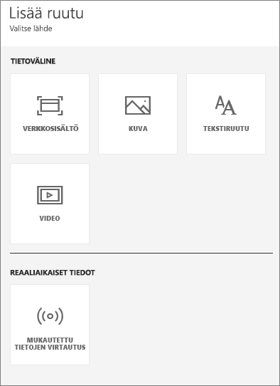
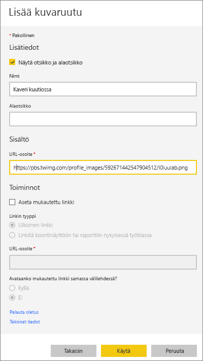
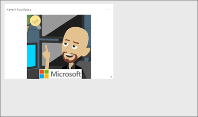
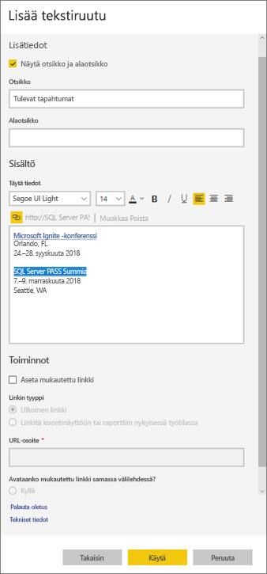
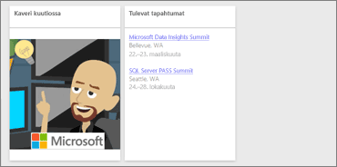
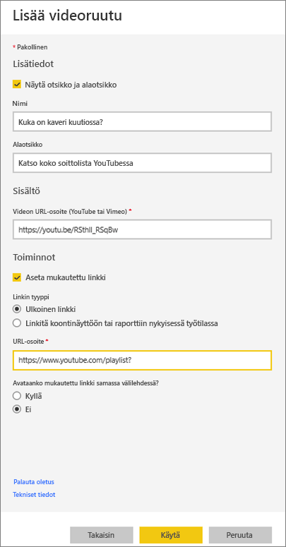
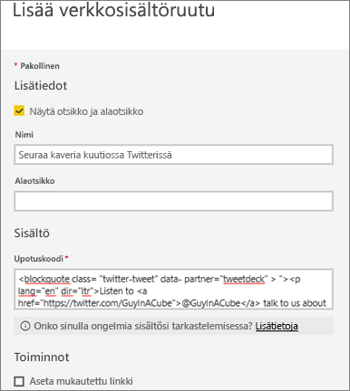
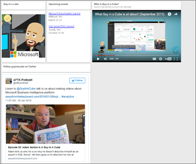
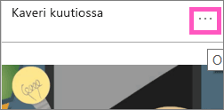
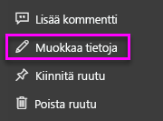

# <a name="add-image-text-video-and-more-to-your-dashboard"></a>Kuvan, tekstin, videon ja muiden elementtien lisääminen koontinäyttöön
<iframe width="560" height="315" src="https://www.youtube.com/embed/e2PD8m1Q0vU" frameborder="0" allowfullscreen></iframe>


## <a name="add-tile"></a>Lisää ruutu
**Lisää ruutu** -ohjausobjektin avulla voit lisätä kuvan, tekstiruudun, videon, virtautettavat tiedot tai verkkokoodin suoraan koontinäyttöön.

1. Valitse ylävalikkorivillä **Lisää ruutu**. Tilarajoituksista riippuen saatat nähdä vain plus  -merkin.
   
    
2. Valitse, millaisen ruudun haluat lisätä: **kuvan**, **tekstiruudun**, **videon**, **verkkosisällön** vai **mukautetut virtautettavat tiedot**.
   
    

## <a name="add-an-image"></a>Kuvan lisääminen
Kuvitellaan, että haluat koontinäyttöösi yrityksen logon tai jonkin muun kuvan. Sinun on tallennettava kuvatiedosto verkkoon ja linkitettävä se. Varmista, että kuvatiedoston käyttämiseen ei tarvita mitään erityisiä tunnistetietoja. Esimerkiksi OneDrive ja SharePoint edellyttävät todentamista, joten niihin tallennettuja kuvia ei voi lisätä koontinäyttöön tässä esitellyllä tavalla.  

1. Valitse **Kuva** > **Seuraava**.
2. Lisää kuvan tiedot **Lisää kuvaruutu** -ikkunaan.
   
    
   
   * Jos haluat otsikon kuvan yläpuolelle, valitse *Näytä otsikko ja alaotsikko* ja kirjoita otsikko ja/tai alaotsikko.
   * Anna kuvan URL-osoite.
   * Jos haluat tehdä ruudusta hyperlinkin, valitse **Aseta mukautettu linkki** ja anna URL-osoite.  Kun työtoverisi napsauttavat kuvaa tai otsikkoa, heidät siirretään tähän URL-osoitteeseen.
   * Valitse **Käytä**.  Muuta kuvan kokoa ja siirrä kuvaa tarvittaessa koontinäytössä.
     
     

## <a name="add-a-text-box-or-dashboard-heading"></a>Tekstiruudun tai koontinäytön otsikon lisääminen
1. Valitse **Tekstiruutu > Seuraava**.
   
   > **HUOMAUTUS**: Jos haluat lisätä raporttinäkymän otsikon, kirjoita otsikko tekstiruutuun ja suurenna fonttia.
   > 
2. Muotoile tekstiruutua:
   
   * Jos haluat otsikon tekstiruudun yläpuolelle, valitse **Näytä otsikko ja alaotsikko** ja kirjoita otsikko ja/tai alaotsikko.
   * Kirjoita tekstiruudun sisältö ja muotoile se.  
   * Halutessasi voit määrittää otsikolle mukautetun linkin. Mukautettu linkki voi olla ulkoinen sivusto tai työtilassasi oleva koontinäyttö tai raportti. Tässä esimerkissä olemme kuitenkin lisänneet hyperlinkit tekstiruudun sisään, joten jätämme **Aseta mukautettu linkki** -valintaruudun valitsematta.

     
   
3. Valitse **Käytä**.  Muuta tekstiruudun kokoa ja siirrä ruutua tarvittaessa koontinäytössä.
   
   

## <a name="add-a-video"></a>Videon lisääminen
Kun lisäät koontinäyttöön YouTube- tai Vimeo-videoruudun, video toistetaan suoraan koontinäytössä.

1. Valitse **Video > Seuraava**.
2. Lisää videon tiedot **Lisää videoruutu** -ikkunassa.
   
    
   
   * Jos haluat otsikon ja alaotsikon videoruudun yläpuolelle, valitse *Näytä otsikko ja alaotsikko* ja kirjoita otsikko ja/tai alaotsikko. Tässä esimerkissä lisäämme alaotsikon ja teemme siitä sitten hyperlinkin, joka johtaa koko soittoluetteloon YouTubessa.
   * Anna videon URL-osoite.
   * Lisää hyperlinkki otsikkoon ja alaotsikkoon.  Ehkäpä haluat työtoveriesi katsovan koko soittolistan YouTubessa sen jälkeen, kun he ovat katsoneet upotetun videon – lisää linkki soittolistaan tässä.
   * Valitse **Käytä**.  Muuta videoruudun kokoa ja siirrä ruutua tarvittaessa koontinäytössä.
     
      
3. Voit toistaa videon valitsemalla videoruudun.
4. Voit siirtyä YouTuben soittolistaan valitsemalla alaotsikon.

## <a name="add-streaming-data"></a>Virtautettavien tietojen lisääminen
<iframe width="560" height="315" src="https://www.youtube.com/embed/kOuINwgkEkQ" frameborder="0" allowfullscreen></iframe>

## <a name="add-web-content"></a>Verkkosisällön lisääminen
Voit liittää tai kirjoittaa mitä tahansa HTML-sisältöä.  Power BI lisää sen ruutuna koontinäyttöösi. Anna upotuskoodi käsin tai kopioi ja liitä se haluamastasi sivustosta, esimerkiksi Twitteristä, YouTubesta tai embed.ly-sivustosta.

1. Valitse **Verkkosisältö > Seuraava**.
2. Lisää tiedot **Lisää verkkosisältöruutu** -ikkunassa.
   
    
   
   * Jos haluat otsikon ruudun yläpuolelle, valitse *Näytä otsikko ja alaotsikko* ja kirjoita otsikko ja/tai alaotsikko.
   * Anna upotuskoodi. Tässä esimerkissä kopioimme ja liitämme Twitter -syötteen.
3. Valitse **Käytä**.  Muuta verkkosisältöruudun kokoa ja siirrä ruutua tarvittaessa koontinäytössä.
     
      

## <a name="tips-for-embedding-web-content"></a>Vihjeitä verkkosisällön upottamiseen
* Käytä iframe-kehyksissä suojattua lähdettä. Jos annat iframe-upotuskoodin ja näyttöön tulee tyhjä ruutu, tarkista, onko iframe-lähteenä **http**.  Jos on, vaihda se **https**-muotoon.
  
  ```html
  <iframe src="https://xyz.com">
  ```
* Muokkaa leveys- ja korkeustietoja. Tämä upotuskoodi upottaa videon ja määrittää videosoittimen kooksi 560 x 315 kuvapistettä.  Tämä koko ei muutu, vaikka muuttaisit ruudun kokoa.
  
  ```html
  <iframe width="560" height="315"
  src="https://www.youtube.com/embed/Cle_rKBpZ28" frameborder="0"
   allowfullscreen></iframe>
  ```
  
  Jos haluat, että soittimen koko muuttuu ruudun koon mukaan, määritä leveydeksi ja korkeudeksi 100 %.
  
  ```html
  <iframe width="100%" height="100%"
  src="https://www.youtube.com/embed/Cle_rKBpZ28" frameborder="0"
   allowfullscreen></iframe>
  ```
* Tämä koodi upottaa twiitin ja säilyttää koontinäytössä erilliset linkit seuraaviin elementteihin: **AFK**-podcast, **käyttäjän @GuyInACube Twitter-sivu**, **Seuraa**,  **#analytics**, **vastaus**, **uudelleentwiittaus** ja **tykkäys**.  Valitsemalla itse ruudun siirryt Twitterin podcastiin.
  
  ```html
  <blockquote class="twitter-tweet" data-partner="tweetdeck">
  <p lang="en" dir="ltr">Listen to
  <a href="https://twitter.com/GuyInACube">@GuyInACube</a> talk to
  us about making videos about Microsoft Business Intelligence
  platform
  <a href="https://t.co/TmRgalz7tv">https://t.co/TmRgalz7tv </a>
  <a href="https://twitter.com/hashtag/analytics?src=hash">
  #analytics</a></p>&mdash; AFTK Podcast (@aftkpodcast) <a
  href="https://twitter.com/aftkpodcast/status/693465456531771392">
  January 30, 2016</a></blockquote> <script async src="//platform.twitter.com/widgets.js" charset="utf-8"></script>
  ```

## <a name="edit-a-tile"></a>Ruudun muokkaaminen
Jos haluat tehdä ruutuun muutoksia...

1. Vie hiiren osoitin ruudun oikeaan yläkulmaan ja valitse kolme pistettä.
   
    
2. Valitse muokkauskuvake, jolloin **Ruudun tiedot** -ikkuna avautuu uudelleen, ja tee muutokset.
   
    

## <a name="considerations-and-troubleshooting"></a>Huomioon otettavat seikat ja vianmääritys
* Helpota ruudun siirtämistä koontinäytössä lisäämällä otsikko ja/tai alaotsikko.
* Jos haluat upottaa sivuston sisältöä, mutta et saa upotuskoodia kopioitua ja liitettyä sivustolta, tutustu embed.ly-palveluun, joka auttaa upotuskoodin luomisessa.

## <a name="next-steps"></a>Seuraavat vaiheet
[Koontinäytön ruudut](consumer/end-user-tiles.md)

Onko sinulla muuta kysyttävää? [Kokeile Power BI -yhteisöä](http://community.powerbi.com/).

