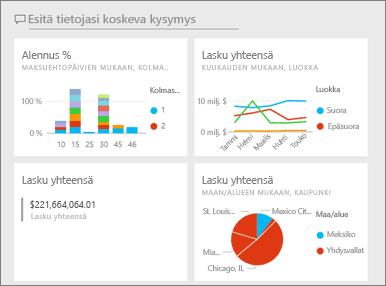
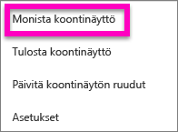
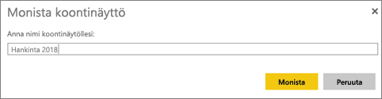
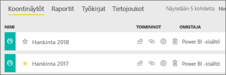

# Koontinäytön kopion luominen Power BI -palvelussa

 Koontinäytön kopioimiselle on monia eri syitä. Voit tehdä muutoksia ja testata sen toimintaa alkuperäiseen verrattuna tai luoda hieman erilaisia versioita, jotka voit jakaa työtovereiden, alueen tai työryhmän perusteella. Työtoverisi saattaa tykätä koontinäyttösi mallista ja haluaa käyttää sitä raporteissaan omille esimiehilleen. Yksi syy voisi olla, että sinulla on uusi tietokanta, jossa on sama tietorakenne ja tietotyypit ja haluat käyttää jo luomaasi koontinäyttöä uudelleen. Tämäkin pystytään tekemään, mutta se vaatii hieman lisätöitä Power BI Desktopissa. 

Koontinäyttöjä luodaan (ja kopioidaan) Power BI -palvelun avulla ja niitä voidaan tarkastella Power BI -mobiililaitteilla ja Power BI Embedded -toiminnolla.  Koontinäytöt eivät ole käytettävissä Power BI Desktopissa. 

Koontinäytön kopioimiseksi sinun pitää olla kyseisen koontinäytön *luoja*. Koontinäyttöjä, jotka on jaettu kanssasi sovelluksena, ei voida monistaa.

1. Avaa koontinäyttö.
2. Valitse oikeasta yläkulmasta kolme pistettä (...) ja valitse **Monista koontinäyttö**.
   
   
3. Anna koontinäytölle nimi ja valitse **Monista**. 
   
   
4. Uusi koontinäyttö tallennetaan samaan työtilaan kuin alkuperäinenkin. 
   
   

5.    Avaa uusi koontinäyttö ja muokkaa sitä tarvittaessa. Tässä on joitakin asioita, joita voit tehdä seuraavaksi:    
    a. [Siirrä, nimeä uudelleen, kokoa tai jopa poista ruutuja](service-dashboard-edit-tile.md).  
    b. Muokkaa ruudun tietoja ja hyperlinkkejä valitsemalla ruudun kolme pistettä (...) ja valitsemalla **Muokkaa tietoja**.  
    c. [Lisää uusia ruutuja koontinäytön valikkopalkista](service-dashboard-add-widget.md) (**Lisää ruutu**)  
    d. Kiinnitä uusia ruutuja [kysymyksistä ja vastauksista](service-dashboard-pin-tile-from-q-and-a.md) tai [raporteista](service-dashboard-pin-tile-from-report.md).  
    e. Nimeä koontinäyttö uudelleen, ota Kysymykset ja vastaukset käyttöön tai poista ne käytöstä, ja määritä ruutujen työvirta koontinäytön Asetukset-ruudusta.  (valitse luetteloruudusta koontinäytön kolme pistettä (...) ja valitse **Asetukset**)  
    f. Jaa koontinäyttösi työtovereiden kanssa suoraan tai osana Power BI -sovellusta. 

## Seuraavat vaiheet
* [Vinkkejä laadukkaiden koontinäyttöjen suunnitteluun](service-dashboards-design-tips.md) 

Ilmenikö muuta kysyttävää? [Kokeile Power BI -yhteisöä](http://community.powerbi.com/)

