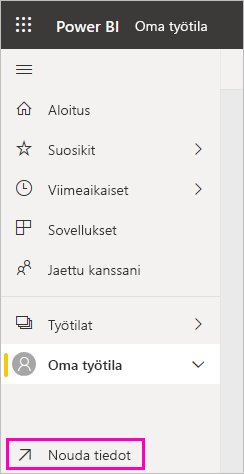

# Power BI -koontinäytön luominen raportista
Olet lukenut [Johdatus raporttinäkymiin Power BI:ssä](service-dashboards.md) ja haluat nyt luoda omasi. Koontinäyttö voidaan luoda monin eri tavoin. Voit esimerkiksi luoda uuden alusta alkaen, raportista, tietojoukosta tai kopioimalla aiemmin luotu koontinäyttö.  

Aloitetaan luomalla nopea ja helppo koontinäyttö, joka kiinnittää visualisointeja raportista, joka on jo muodostettu. 

Kun olet päässyt tämän artikkelin loppuun, sinulla on hyvä käsitys seuraavista asioista:
- Koontinäyttöjen ja raporttien välinen suhde
- Muokkausnäkymän avaaminen raporttieditorissa
- Ruudun kiinnittäminen 
- Koontinäytön ja raportin välillä siirtyminen 
 

> [!NOTE] 
> Koontinäytöt ovat Power BI -palvelun ominaisuus, eivät Power BI Desktopin. Vaikka raporttinäkymiä ei luoda Power BI -mobiilisovelluksilla, niitä voi [tarkastella ja jakaa](consumer/mobile/mobile-apps-view-dashboard.md) niillä.
>
> 

## Video: Koontinäytön luominen kiinnittämällä visualisointeja ja kuvia raportista
Katso, kun Amanda luo uuden koontinäytön kiinnittämällä visualisointeja raportista. Kokeile sitten samaa itse [Tietojoukon ja raportin tuominen](#import-a-dataset-with-a-report) -kohdassa noudattamalla seuraavan osion ohjeita.
    

<iframe width="560" height="315" src="https://www.youtube.com/embed/lJKgWnvl6bQ" frameborder="0" allowfullscreen></iframe>

## Tietojoukon ja raportin tuominen
Näissä vaiheittaisissa ohjeissa tuomme yhden Power BI -mallitietojoukon ja käytämme sitä uuden koontinäytön luomiseen. Käyttämämme malli on Excel-työkirja, jossa on kaksi PowerView-taulukkoa. Kun Power BI tuo työkirjan, se lisää tietojoukon sekä raportin työtilaasi. Raportti luodaan automaattisesti PowerView-taulukoista.

1. Lataa [hankinta-analyysimallin](https://go.microsoft.com/fwlink/?LinkId=529784) Excel-tiedosto. On suositeltavaa tallentaa se OneDrive for Businessiin.
2. Avaa Power BI -palvelu (app.powerbi.com) selaimessasi.
3. Valitse siirtymisruudusta **Oma työtila** ja valitse sitten **Nouda tiedot**.

    
5. Valitse **Hanki** kohdassa **Tiedostot**.

   
6. Siirry paikkaan, jonne olet tallentanut Hankinta-analyysimallin Excel-tiedoston. Valitse se ja valitse **Yhdistä**.

   
7. Valitse tässä harjoituksessa **Tuonti**.

    
8. Kun näkyviin tulee onnistumisilmoitus, sulje se valitsemalla **x**.

   

> [!TIP]
> Tiesitkö? Voit kaventaa siirtymisruutua valitsemalla yläreunassa olevan kuvakkeen, jossa on kolme riviä . Näin saat enemmän tilaa itse raportille.

### Avaa raportti ja kiinnitä koontinäyttöön ruutuja
1. Valitse samassa työtilassa **Raportit**-välilehti ja avaa sitten raportti valitsemalla **Hankinta-analyysimalli**.

     Raportti avautuu lukunäkymässä. Huomaathan, että sen alareunassa on kaksi välilehteä: **Alennusanalyysi** ja **Kulujen yleiskatsaus**. Kukin välilehti edustaa yhtä raportin sivua.

2. Avaa raportti Muokkausnäkymässä valitsemalla **Lisää asetuksia (...)**  > **Muokkaa raporttia**.

    
3. Tuo käytettävissä olevat vaihtoehdot esiin pitämällä hiiren osoitinta visualisoinnin päällä. Voit lisätä visualisoinnin koontinäyttöön valitsemalla nastakuvakkeen .

    
4. Koska olemme luomassa uutta koontinäyttöä, valitse vaihtoehto **Uusi koontinäyttö** ja anna sille nimi.

    
5. Kun valitset **Kiinnitä**-kuvakkeen, Power BI luo uuden koontinäytön nykyisessä työtilassa. Kun näkyviin tulee **Kiinnitetty koontinäyttöön** -ilmoitus, valitse **Siirry koontinäyttöön**. Jos sinua kehotetaan tallentamaan raportti, valitse **Tallenna**.

    

    Power BI avaa uuden koontinäytön. Siinä on yksi ruutu: juuri kiinnittämäsi visualisointi.

   
7. Jos haluat palata raporttiin, valitse ruutu. Kiinnitä uuteen koontinäyttöön muutamia lisäruutuja. Kun **Kiinnitä koontinäyttöön** -ikkuna ilmestyy näkyviin, valitse **Aiemmin luotu koontinäyttö**.  

   

## Koko raporttisivun kiinnittäminen koontinäyttöön
Yhden visualisoinnin kerrallaan kiinnittämisen sijaan voit [kiinnittää koko raporttisivun *tapahtumaruutuna*](service-dashboard-pin-live-tile-from-report.md). Näin se tapahtuu.

1. Valitse raporttieditorissa **Kulujen yleiskatsaus** -välilehti raportin toisen sivun avaamiseksi.

   

2. Haluamme, että raportin kaikki visualisoinnit näkyvät koontinäytössä. Valitse valikkorivin oikeassa yläkulmassa **Kiinnitä reaaliaikainen sivu**. Koontinäytössä reaaliaikaiset sivujen ruudut päivittyvät aina, kun sivu päivitetään.

   

3. Kun **Kiinnitä koontinäyttöön** -ikkuna ilmestyy näkyviin, valitse **Aiemmin luotu koontinäyttö**.

   

4. Kun näkyviin tulee onnistumisilmoitus, valitse **Siirry koontinäyttöön**. Siellä näkyvät raportista kiinnitetyt ruudut. Alla olevassa esimerkissä olemme kiinnittäneet kaksi ruutua raportin sivulta 1 ja yhden tapahtumaruudun, joka on raportin sivu 2.

   

## Seuraavat vaiheet
Onnittelut ensimmäisen koontinäytön luomisen johdosta! Nyt kun sinulla on koontinäyttö, voit tehdä sen parissa paljon muutakin. Seuraa jotakin alla olevista ehdotetuista artikkeleista tai aloita omatoiminen tutustuminen: 

* [Ruutujen koon muuttaminen ja siirtäminen](service-dashboard-edit-tile.md)
* [Kaikki koontinäyttöruuduista](service-dashboard-tiles.md)
* [Koontinäytön jakaminen luomalla sovellus](service-create-workspaces.md)
* [Power BI:n peruskäsitteet](service-basic-concepts.md)
* [Vinkkejä laadukkaiden koontinäyttöjen suunnitteluun](service-dashboards-design-tips.md)

Onko sinulla kysyttävää? [Kokeile Power BI -yhteisöä](https://community.powerbi.com/).
