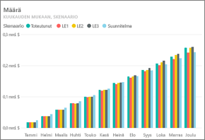
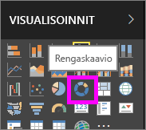
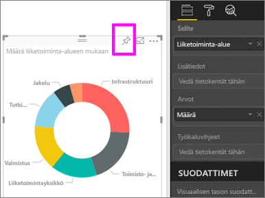
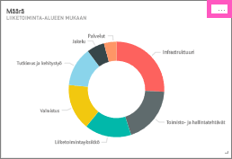
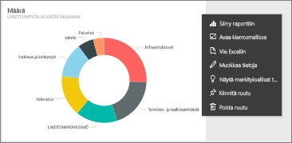
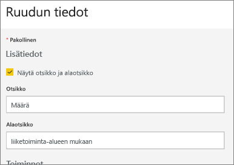
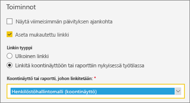
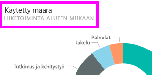
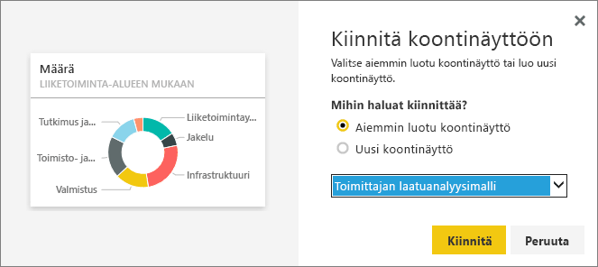

# Koontinäytön ruudun muokkaaminen tai poistaminen

## Koontinäytön *omistajat* verrattuna koontinäytön *kuluttajiin*
Kun luot koontinäytön tai olet sen omistaja, käytettävissäsi on paljon asetuksia, joilla voit muokata koontinäytön ruutujen ulkoasua ja oletusarvoista käyttäytymistä. Alla esiteltyjen asetusten ja strategioiden avulla voit suunnitella koontinäytön käyttökokemuksen työtovereillesi, jotka ovat koontinäytön *kuluttajia*.  Avaako ruudun valitseminen näytölle ruutuun liittyvän raportin, mukautetun URL-osoitteen vai toisen koontinäytön? Haluatko [lisätä ruudun, joka näyttää videota tai tietovirtaa](service-dashboard-add-widget.md)? Ehkä haluat [tehdä ruudun, jossa on vuorovaikutteisia osittajia](service-dashboard-pin-live-tile-from-report.md). Koontinäytön *tekijänä* käytettävissäsi on useita asetusvaihtoehtoja. 

<iframe width="560" height="315" src="https://www.youtube.com/embed/lJKgWnvl6bQ" frameborder="0" allowfullscreen></iframe>

Tässä artikkelissa käsitellään vaihtoehdoista seuraavat:

* [Visualisoinnin luominen ja kiinnittäminen koontinäyttöön](#create)
* [Ruudun siirtäminen toiseen paikkaan](#move)
* [Ruudun koon muuttaminen](#resize)
* [Ruudun nimeäminen uudelleen](#rename)
* [Hyperlinkin lisääminen ruutuun](#hyperlink)
* [Ruudun kiinnittäminen toiseen koontinäyttöön](#different)
* [Ruudun poistaminen](#delete)
  
 > [!TIP]
 > Jos haluat vaihtaa ruudussa näytettävän visualisoinnin, poista ruutu ja lisää uusi [koontinäytön ruutu](service-dashboard-tiles.md).
 > 

 ### Edellytykset
 1. Voidaksesi tehdä opastuksen mukana samat vaiheet itse, avaa Power BI -palvelu (ei Power BI Desktop) ja [lataa itsellesi IT-kulutusanalyysimalli](sample-it-spend.md). Kun näkyviin tulee onnistumissanoma, valitse **Siirry koontinäyttöön**

- - -

## Uuden visualisoinnin luominen ja kiinnittäminen koontinäyttöön
1. Valitse IT-kulutusanalyysin koontinäyttö ja avaa raportti valitsemalla Määrä-ruutu.

    

2. Avaa raportti muokkausnäkymässä valitsemalla yläreunan valikkoriviltä **Muokkaa raporttia**.

3. Lisää uusi raporttisivu valitsemalla plusmerkki (+) raportin alareunasta.

    

4. Valitse KENTÄT-paneelista **Fakta > Määrä** ja **Liiketoiminta-alue > Liiketoiminta-alue**.
 
5. Muunna visualisointi rengaskaavioksi valitsemalla VISUALISOINTI-paneelista rengaskaavion kuvake.

    

5. Valitse Kiinnitä-kuvake ja kiinnitä rengaskaavio IT-kulutusanalyysimallin koontinäyttöön.

   

6. Kun näkyviin tulee onnistumissanoma, valitse **Siirry koontinäyttöön**. Ohjelma pyytää tallentamaan muutokset. Valitse **Tallenna**.

- - -

## Ruudun siirtäminen toiseen paikkaan
Etsi koontinäytöstä luomasi uusi ruutu. Paina ruutua pitkään ja vedä se koontinäytön taustalla uuteen kohtaan.

- - -

## Ruudun koon muuttaminen
Voit tehdä ruuduista erikokoisia: koko voi olla pienimmillään 1×1 ruutuyksikköä ja suurimmillaan 5×5. Muuta ruudun kokoa valitsemalla kahvaa (ruudun oikeasta alakulmasta) ja vetämällä sitä.

- - -
## Kolmen pisteen valikko (...)

1. Valitse ruudun oikeasta yläkulmasta kolme pistettä (...). 
   
   

2. Vie hiiren osoitin Tili-ruudun kohdalle ja valitse kolme pistettä, jolloin asetukset tulevat esiin. Esiin tulevat asetukset vaihtelevat ruudun tyypin mukaan.  Esimerkiksi reaaliaikaiselle ruudulle on saatavilla erilaiset asetukset kuin tavalliselle visualisointiruudulle. Lisäksi jos sinulle on jaettu koontinäyttö (eli et ole sen omistaja), käytettävissäsi on vähemmän asetusvaihtoehtoja.

   

3. Avaa Ruudun tiedot ‑ikkuna valitsemalla **Muokkaa tietoja**. 

    Voit muokata ruudun otsikkoa ja oletusarvoista toimintaa.  Voit esimerkiksi päättää, että kun *kuluttaja* valitsee ruudun, ruudun luomiseen käytetyn raportin sijasta näkyviin tuleekin uusi koontinäyttö.  
   

### Ruudun nimen vaihtaminen
Vaihda Ruudun tiedot ‑ikkunan yläreunasta **Otsikko**-asetukseksi **Kulutettu summa**.

### Oletusarvoisen hyperlinkin muuttaminen
Oletusarvoisesti ruudun valitseminen siirtää käyttäjän raporttiin, josta ruutu luotiin, tai Q&A:han (jos ruutu luotiin Q&A:lla). Jos haluat linkittää ruudun toiseen koontinäyttöön tai raporttiin (samassa työtilassa), SSRS-raporttiin tai muuhun verkkosisältöön, lisää mukautettu linkki.

1. Valitse Toiminnot-otsikon alta asetus **Aseta mukautettu linkki**.

2. Valitse tyypiksi **Linkitä koontinäyttöön tai raporttiin nykyisessä työtilassa** ja valitse sitten kohde avattavasta valikosta.  Tässä esimerkissä valitaan henkilöstöhallintomallin koontinäyttö. Jos sinulla ei ole kyseistä mallia valmiina työtilassasi, voit lisätä sen ja palata tähän vaiheeseen tai voit valita jonkin toisen koontinäytön. 

    

3. Valitse **Käytä**.

4. Uusi otsikko tulee näkyviin ruutuun.  Kun valitset ruudun, Power BI avaa Henkilöstöhallinto-koontinäytön. 

    

### Ruudun kiinnittäminen toiseen koontinäyttöön
1. Valitse kolmen pisteen valikosta **Kiinnitä ruutu**  .
2. Päätä, haluatko kiinnittää ruudun kaksoiskappaleen aiemmin luotuun vai uuteen koontinäyttöön. 
   
   
3. Valitse **Kiinnitä**.

### Ruudun poistaminen
1. Jos haluat poistaa ruudun pysyvästi koontinäytöstä, valitse kolmen pisteen valikosta **Poista ruutu** . 

2. Ruudun poistaminen ei poista sen perustana toimivaa visualisointia. Voit avata perustana olevan raportin valitsemalla Summa-ruudun. Kun avaat raportin viimeisen sivun, niin nähdä, ettei alkuperäistä visualisointia ole poistettu raportista. 

- - -
## Seuraavat vaiheet
[Koontinäyttöruudut Power BI:ssä](service-dashboard-tiles.md)

[Koontinäytöt Power BI:ssä](service-dashboards.md)

[Power BI:n peruskäsitteet](service-basic-concepts.md)

Onko sinulla muuta kysyttävää? [Kokeile Power BI -yhteisöä](http://community.powerbi.com/)

