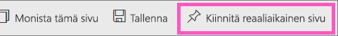
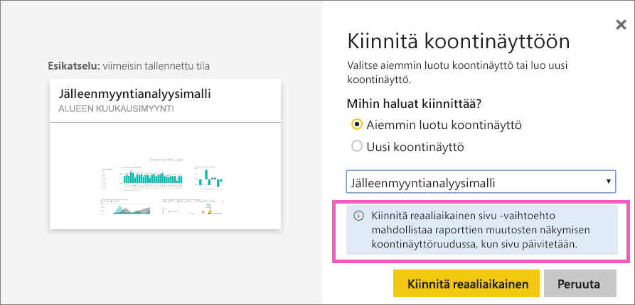
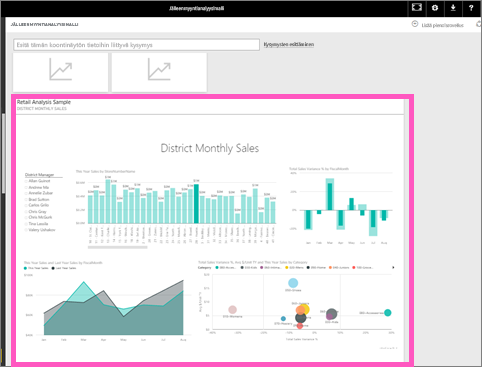

# Koko raporttisivun kiinnittäminen tapahtumaruutuna Power BI:n koontinäyttöön
Toinen tapa lisätä uusi [koontinäytön ruutu](service-dashboard-tiles.md) on kiinnittää koko raporttisivu. Se on helppo tapa kiinnittää kerralla useita visualisointeja.  Kun kiinnität koko sivun, ruudut ovat *reaaliaikaisia*. Voit käsitellä niitä suoraan koontinäytössä. Jos teet visualisointeihin muutoksia raporttieditorissa, kuten lisäät suodattimen tai muutat kaaviossa käytettäviä kenttiä, muutokset näkyvät myös koontinäytön ruudussa.  

Reaaliaikaisten ruutujen kiinnittäminen raporteista koontinäyttöihin on käytettävissä vain Power BI -palvelussa (app.powerbi.com).

> [!NOTE]
> Et voi kiinnittää ruutuja raporteista, jotka on jaettu sinulle.
> 
> 

## Raporttisivun kiinnittäminen
Katso, miten Amanda kiinnittää reaaliaikaisen raporttisivun koontinäyttöön. Seuraa sen jälkeen vaiheittaisia ohjeita videon alla ja kokeile kiinnittämistä itse.

<iframe width="560" height="315" src="https://www.youtube.com/embed/EzhfBpPboPA" frameborder="0" allowfullscreen></iframe>

1. Avaa raportti [muokkausnäkymässä](service-interact-with-a-report-in-editing-view.md).
2. Kun visualisointeja ei ole valittuna, valitse valikkopalkista **Kiinnitä reaaliaikainen sivu**.
   
    
3. Kiinnitä ruutu aiemmin luotuun koontinäyttöön tai uuteen koontinäyttöön. Huomaa korostettu teksti: *Kiinnitä reaaliaikainen sivu -vaihtoehto mahdollistaa raporttien muutosten näkymisen koontinäyttöruudussa, kun sivu päivitetään.*
   
   * Aiemmin luotu koontinäyttö: valitse avattavasta luetteloruudusta koontinäytön nimi. Kanssasi jaetut koontinäytöt eivät näy avattavassa luetteloruudussa.
   * Uusi koontinäyttö: anna nimi uudelle koontinäytölle.
     
     
4. Valitse **Kiinnitä reaaliaikainen**. Onnistumissanoma (oikean yläkulman lähellä) ilmaisee, että visualisointi lisättiin ruutuna koontinäyttöön.

## Näet kiinnitetyn reaaliaikaisen ruudun avaamalla koontinäytön
1. Valitse siirtymisruudussa koontinäyttö uuden reaaliaikaisen ruudun kera. Sen jälkeen voit käsitellä kiinnitettyä raporttisivua. Voit esimerkiksi [nimetä sen uudelleen, muuttaa sen kokoa, linkittää ja siirtää](service-dashboard-edit-tile.md).  
2. Käsittele reaaliaikaista ruutua.  Alla olevassa näyttökuvassa palkin valitseminen sarakekaaviossa suodattaa ja korostaa ristiin muut ruudun visualisoinnit.
   
    

## Seuraavat vaiheet
[Koontinäytöt Power BI:ssä](service-dashboards.md)

Onko sinulla muuta kysyttävää? [Kokeile Power BI -yhteisöä](http://community.powerbi.com/)

