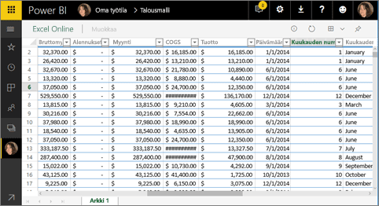
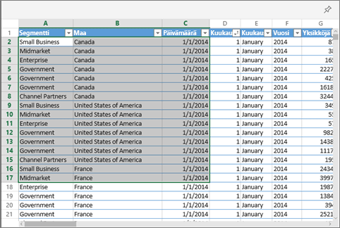
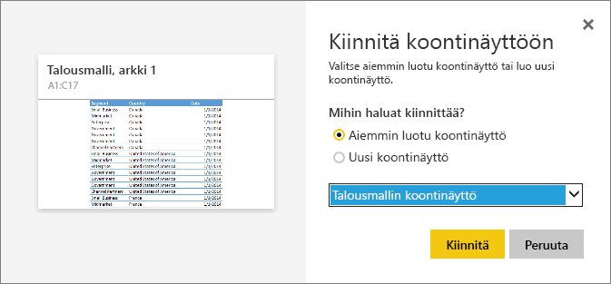

# Ruudun kiinnittäminen Power BI -raporttinäkymään Excelistä
Ennen kuin voit kiinnittää ruudun Excel-työkirjasta, yhdistät kyseisen työkirjan Power BI -palveluun (app.powerbi.com). Työkirjan yhdistäminen tuo lähinnä tämän työkirjan linkitetyn vain luku -version Power BI -palveluun, ja voit näin kiinnittää alueita raporttinäkymiin. Voit kiinnittää jopa kokonaisen laskentataulukon raporttinäkymään.  
Jos työkirja on jaettu kanssasi, voit tarkastella omistajan kiinnittämiä ruutuja, mutta et voi luoda raporttinäkymän ruutuja itse. 

Lue lisää siitä, miten Excel ja Power BI toimivat yhdessä, artikkelista [Tietojen noutaminen Excel-työkirjatiedostoista](https://go.microsoft.com/fwlink/?LinkID=521962).

Seuraavassa videossa esitetään useita tapoja tuoda tietoja Excel-työkirjoista ja yhdistää tietoja niihin.

<iframe width="560" height="315" src="https://www.youtube.com/embed/l8JoB7w0zJA" frameborder="0" allowfullscreen></iframe>

## Excel-työkirjan yhdistäminen OneDrive for Businessista Power BI:hin
Kun valitset **Yhdistä**, työkirjasi näkyy Power BI:ssä aivan samalla tavalla kuin se näkyisi Excel Onlinessa. Mutta toisin kuin Excel Onlinessa, käytettävissäsi on käteviä ominaisuuksia, joilla voit kiinnittää laskentataulukoiden elementtejä suoraan raporttinäkymiin.

Työkirjaa ei voi muokata Power BI:ssä. Jos muutoksia on tehtävä, voit valita kynäkuvakkeen työtilasi **Työkirjat**-välilehdestä ja valita sitten työkirjan muokkaamisen joko Excel Onlinessa tai tietokoneesi Excelissä. Tekemäsi muutokset tallennetaan työkirjaan OneDrivessa.

1. Lataa työkirja OneDrive for Businessiin.

2. [Yhdistä työkirjaan](service-excel-workbook-files.md) Power BI:ssä valitsemalla **Nouda tiedot > Tiedostot > OneDrive – Business** ja siirtymällä Excel-tiedoston tallennuspaikkaan. Valitse tiedosto ja sitten **Yhdistä > Yhdistä**.

    

3. Power BI:ssä työkirja lisätään työtilasi **Työkirjat**-välilehteen.   ilmaisee, että kyseessä on Excel-työkirja ja keltainen tähti osoittaa, että se on uusi.
    
    
4. Avaa työkirja Power BI:ssä valitsemalla työkirjan nimi.

    Työkirjaan Power BI:ssä tekemiäsi muutoksia ei tallenneta, eivätkä ne vaikuta alkuperäiseen työkirjaan OneDrive for Businessissa. Jos lajittelet, suodatat tai muutat arvoja Power BI:ssä, kyseisiä muutoksia ei voi tallentaa tai kiinnittää. Jos sinun on tehtävä muutoksia, jotka tallennetaan, avaa työkirja Excel Onlinessa tai Excelissä muokkaamista varten valitsemalla **Muokkaa** oikeasta yläkulmasta. Näin tehtyjen muutosten päivittyminen raporttinäkymän ruutuihin voi kestää muutamia minuutteja.
   
    

## Solualueen kiinnittäminen raporttinäkymään
Uusi [raporttinäkymän ruutu](consumer/end-user-tiles.md) voidaan lisätä Excel-työkirjasta Power BI:ssä. Alueita voidaan kiinnittää Excel-työkirjoista, jotka on tallennettu OneDrive for Businessiin tai toiseen ryhmän jakamaan tiedostokirjastoon. Alueet voivat sisältää tietoja, kaavioita, taulukoita, pivot-taulukoita, pivot-kaavioita ja muita Excel-osia.

1. Korosta solut, jotka haluat kiinnittää raporttinäkymään.
   
    
2. Valitse Kiinnitä  kuvake. 
3. Kiinnitä ruutu aiemmin luotuun raporttinäkymään tai uuteen raporttinäkymään. 
   
   * Aiemmin luotu koontinäyttö: valitse avattavasta luetteloruudusta koontinäytön nimi.
   * Uusi raporttinäkymä: anna nimi uudelle raporttinäkymälle.
   
     
4. Valitse **Kiinnitä**. Onnistumissanoma (lähellä oikeaa yläkulmaa) ilmaisee, että alue lisättiin ruutuna raporttinäkymään. 
   
    
5. Valitse **Siirry raporttinäkymään**. Täällä kiinnitetty visualisointi voidaan [nimetä uudelleen, linkittää ja siirtää ja sen kokoa voidaan muuttaa](service-dashboard-edit-tile.md). Oletuksena kiinnitetyn ruudun valitseminen avaa työkirjan Power BI:ssä.

## Koko taulukon tai Pivot-taulukon kiinnittäminen raporttinäkymään
Noudata edellä olevia ohjeita, mutta valitse solualueen sijaan koko taulukko tai Pivot-taulukko.

Jos halua kiinnittää taulukon, valitse koko taulukon alue ja varmista, että otsikot sisältyvät alueeseen.  Jos haluat kiinnittää Pivot-taulukon, sisällytä kaikki Pivot-taulukon näkyvät osat mahdollisesti käytetyt suodattimet mukaan lukien.

 

Taulukosta tai Pivot-taulukosta luotu ruutu näyttää koko taulukon.  Jos lisäät, poistat tai suodatat alkuperäisen työkirjan rivejä tai sarakkeita, myös ne lisätään, poistetaan tai suodatetaan ruudussa.

## Ruutuun linkitetyn työkirjan tarkasteleminen
Työkirjan ruudun valitseminen avaa linkitetyn työkirjan Power BI:ssä. Koska työkirjatiedosto sijaitsee omistajan OneDrive for Businessissa, työkirjan tarkasteleminen edellyttää, että sinulla on työkirjan lukuoikeudet. Jos sinulla ei ole oikeuksia, saat virheilmoituksen.  

 

## Huomioon otettavat seikat ja vianmääritys
Ominaisuudet, joita ei tueta: Power BI käyttää Excel Servicesiä työkirjan ruutujen noutamiseen. Näin ollen koska joitakin Excelin ominaisuuksia ei tueta Excel Servicesin REST-ohjelmointirajapinnassa, ne eivät näy Power BI:n ruuduissa. Esimerkkejä: sparkline-kaaviot, kuvakejoukon ehdollinen muotoilu ja aikaosittajat. Täydellinen luettelo ominaisuuksista, joita ei tueta, on artikkelissa [Excel Servicesin REST-ohjelmointirajapinnan ominaisuudet, joita ei tueta](https://msdn.microsoft.com/library/office/ff394477.aspx)

## Seuraavat vaiheet
[Excel-työkirjaan linkittävän raporttinäkymän jakaminen](service-share-dashboard-that-links-to-excel-onedrive.md)

[Tietojen noutaminen Excel-työkirjoista](service-excel-workbook-files.md)

Onko sinulla kysyttävää? [Kokeile Power BI -yhteisöä](https://community.powerbi.com/)

