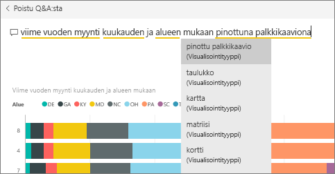
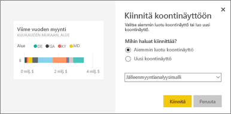
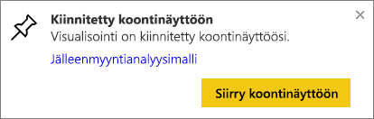
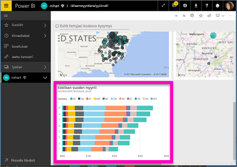
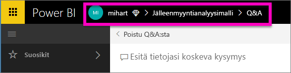

# Ruudun kiinnittäminen koontinäyttöön Q&A:sta
## Ohjeet ruudun kiinnittämiseen Q&A:sta
Q&A on Power BI:n ad-hoc-raportointityökalu. Haluatko löytää tietyn merkityksellisen tiedon? Esitä tietojasi koskeva kysymys, jotta saat vastauksen visualisoinnin muodossa.

Näissä ohjeissa käytetään Power BI -palvelua (app.powerbi.com) koontinäytön avaamiseen, kysymyksen esittämiseen luonnollisella kielellä visualisoinnin luomista varten ja kyseisen visualisoinnin kiinnittämiseen koontinäyttöön. Koontinäytöt eivät ole käytettävissä Power BI Desktopissa. Lisätietoja Q&A:n käyttämisestä muiden Power BI:n työkalujen ja sisältöjen kanssa on artikkelissa [Yleiskatsaus Power BI Q&A:sta](consumer/end-user-q-and-a.md). 

Avaa seuraamista varten [Jälleenmyyntianalyysimalli](sample-retail-analysis.md).

1. Avaa [koontinäyttö](consumer/end-user-dashboards.md), johon on kiinnitetty vähintään yksi ruutu raportista. Kun esität kysymyksen, Power BI etsii vastausta kaikista tietojoukoista, joissa on kiinnitettynä ruutu kyseiseen koontinäyttöön.  Lisätietoja on artikkelissa [Tietojen noutaminen](service-get-data.md).
2. Ala kirjoittaa tiedoista etsittävää asiaa koontinäyttösi ylälaidassa olevaan kysymysruutuun.  
   
3. Kun kirjoitat esimerkiksi ”viime vuoden myynti kuukauden ja alueen mukaan”...  
   

   kysymysruutu antaa ehdotuksia.
4. Jos haluat lisätä kaavion koontinäyttöösi ruutuna, valitse Kiinnitä  pohjan oikeassa yläkulmassa. Jos koontinäyttö on jaettu kanssasi, et voi kiinnittää visualisointeja.

5. Kiinnitä ruutu aiemmin luotuun koontinäyttöön tai uuteen koontinäyttöön.

   

   * Aiemmin luotu koontinäyttö: valitse avattavasta luetteloruudusta koontinäytön nimi. Vaihtoehtosi rajoittuvat vain nykyisessä työtilassasi oleviin koontinäyttöihin.
   * Uusi koontinäyttö: anna uudelle koontinäytölle nimi ja se lisätään nykyiseen työtilaasi.

6. Valitse **Kiinnitä**.

   Onnistumissanoma (oikean yläkulman lähellä) ilmaisee, että visualisointi lisättiin ruutuna koontinäyttöön.  

   
7. Valitse **Siirry koontinäyttöön**, jotta näet uuden ruudun. Siellä voit esimerkiksi [nimetä uudelleen, muuttaa kokoa, lisätä hyperlinkin ja sijoittaa ruudun uudelleen](service-dashboard-edit-tile.md) koontinäytössä.

   

## Huomioon otettavat seikat ja vianmääritys
* Kun alat kirjoittaa kysymystä, Q&A alkaa heti hakea parasta vastausta kaikista tietojoukoista, jotka liittyvät nykyiseen koontinäyttöön.  Nykyinen koontinäyttö on yläreunan siirtymispalkissa lueteltu koontinäyttö. Esimerkiksi tämä kysymys esitetään Jälleenmyyntianalyysimalli**Retail Analysis Sample**-koontinäytössä, joka on osa **mihart**-sovellustyötilaa.

  
* **Mistä Q&A tietää, mitä tietojoukkoja pitää käyttää**?  Q&A pääsee käyttämään kaikkia tietojoukkoja, joista on vähintään yksi visualisointi kiinnitettynä kyseiseen koontinäyttöön.

* **Eikö kysymysruutu näy**? Ota yhteyttä Power BI -järjestelmänvalvojaasi. Järjestelmänvalvoja voi poistaa Q&A:n käytöstä.

## Seuraavat vaiheet
[Nimeäminen uudelleen, koon muuttaminen, hyperlinkin lisääminen ja ruudun sijoittaminen uudelleen](service-dashboard-edit-tile.md)    
[Koontinäytön ruudun näyttäminen kohdistustilassa](consumer/end-user-focus.md)     
[Takaisin Q&A:han Power BI:ssä](consumer/end-user-q-and-a.md)  
Onko sinulla muuta kysyttävää? [Kokeile Power BI -yhteisöä](http://community.powerbi.com/)
