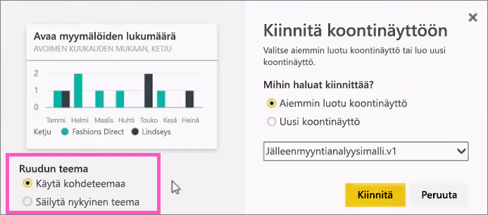

# Ruudun kiinnittäminen Power BI:n koontinäyttöön raportista
## Ruutujen kiinnittäminen raportista
Uusi [raporttinäkymän ruutu](service-dashboard-tiles.md) voidaan lisätä [Power BI -raportista](service-reports.md). Voit itse asiassa lisätä useita uusia ruutuja raportista.  Kukin näistä on napsautettaessa linkki takaisin raporttiin.

Myös raportin kokonaisia sivuja voi kiinnittää koontinäyttöön.  Tätä kutsutaan myös kiinnittämiseksi *live*-ruutuun.  *Live* tarkoittaa, että voit käsitellä ruutua koontinäytössä interaktiivisesti ja toisin kuin yksittäisissä visualisointiruuduissa, raporttiin tehdyt muutokset synkronoidaan koontinäyttöön. Voit lukea lisätietoja asiasta alta.

Et voi kiinnittää ruutuja raporteista, jotka on jaettu kanssasi tai jos ne ovat Power BI Desktopista. 

> **Vihje**: Joissakin visualisoinneissa voi käyttää taustakuvia. Kiinnittäminen ehkä toimi taustakuvan ollessa liian suuri.  Kokeile kuvan koon pienentämistä tai kuvan pakkausta.  
> 
> 

## Ruudun kiinnittäminen raportista
Amanda esittää koontinäytön luomisen kiinnittämällä visualisointeja ja kuvia Power BI -raportista.

<iframe width="560" height="315" src="https://www.youtube.com/embed/lJKgWnvl6bQ" frameborder="0" allowfullscreen></iframe>

Nyt voit luoda oman koontinäytön käyttäen jotakin Power BI:n malliraporteista.

1. Osoita sitä visualisointia, jonka haluat kiinnittää, ja napsauta nastakuvaketta. Power BI avaa **Kiinnitä koontinäyttööni** -näytön.
   
     
2. Valitse, haluatko kiinnittää aiemmin luotuun koontinäyttöön vai luoda uuden koontinäytön.
   
   * Aiemmin luotu koontinäyttö: valitse avattavasta luetteloruudusta koontinäytön nimi. Kanssasi jaetut koontinäytöt eivät näy avattavassa luetteloruudussa.
   * Uusi koontinäyttö: anna nimi uudelle koontinäytölle.
3. Joissakin tapauksissa kiinnitettävä kohde voi olla *teema*, joka on jo käytössä.  Esimerkkinä visualisoinnit, jotka on kiinnitetty Excel-työkirjasta. Jos näin on, valitse, mitä teemaa ruudussa käytetään.
4. Valitse **Kiinnitä**.
   
   Onnistumissanoma (oikean yläkulman lähellä) ilmaisee, että visualisointi lisättiin ruutuna koontinäyttöön.
   
   
5. Valitse siirtymisruudussa koontinäyttö uuden ruudun kera. Valitse ruutu, joka siirretään takaisin raporttiin. Tai [muokkaa ruudun näyttöä ja toimintaa](service-dashboard-edit-tile.md).

## Koko raportin sivun kiinnittäminen
Toinen vaihtoehto on koko raporttisivun kiinnittäminen koontinäyttöön. Se on helppo tapa kiinnittää kerralla useita visualisointeja.  Kun kiinnität koko sivun, ruudut ovat *reaaliaikaisia*. Voit käsitellä niitä suoraan koontinäytössä. Jos teet visualisointeihin muutoksia raporttieditorissa, kuten lisäät suodattimen tai muutat kaaviossa käytettäviä kenttiä, muutokset näkyvät myös koontinäytön ruudussa.  

Jos haluat lisätietoja, katso [Koko raportin sivun kiinnittäminen](service-dashboard-pin-live-tile-from-report.md)

## Seuraavat vaiheet
[Koontinäytöt Power BI:ssä](service-dashboards.md)

[Koontinäyttöruudut Power BI:ssä](service-dashboard-tiles.md)

[Raportit Power BI:ssä](service-reports.md)

[Tietojen päivittäminen Power BI:ssä](refresh-data.md)

[Power BI:n peruskäsitteet](service-basic-concepts.md)

Onko sinulla muuta kysyttävää? [Kokeile Power BI -yhteisöä](http://community.powerbi.com/)

