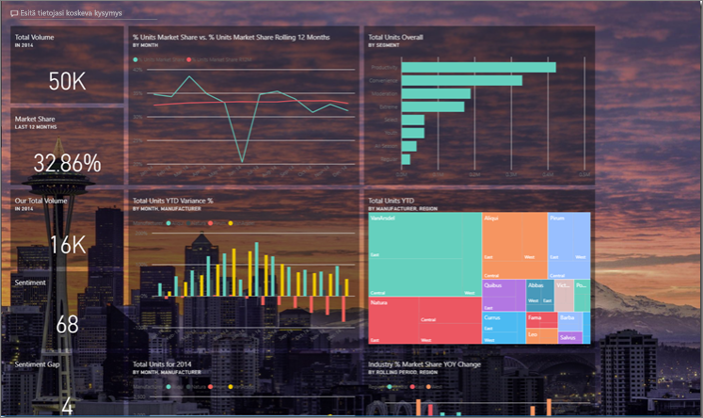
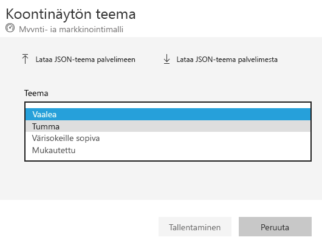
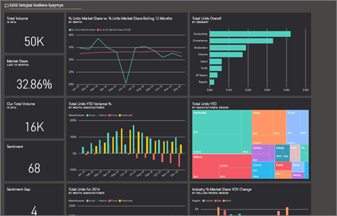
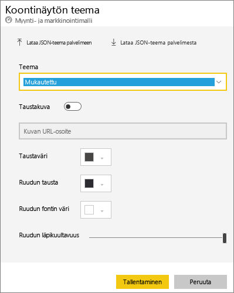
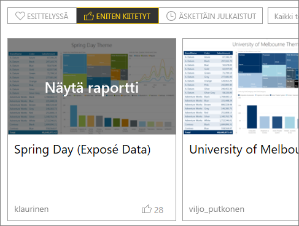
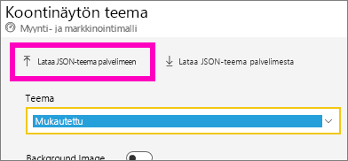
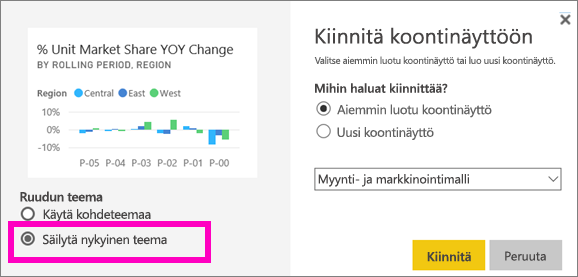
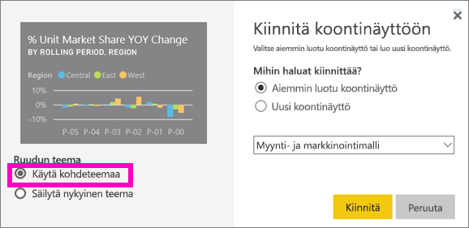

# Raporttinäkymän teemojen käyttö Power BI-palvelussa
**Raporttinäkymän teemojen** avulla voit käyttää väriteemaa koko raporttinäkymässä, kuten yrityksen värejä, kausivärejä tai mitä tahansa muuta haluamaasi väriteemaa. Kun otat **raporttinäkymän teeman** käyttöön, kaikki raporttinäkymän visualisoinnit käyttävät valitun teeman värejä (lukuun ottamatta muutamia poikkeuksia, jotka kuvataan myöhemmin tässä artikkelissa).

Raportin visualisointien värien muuttaminen raporttinäkymässä, ei vaikuta raportin visualisointeihin. Lisäksi kun kiinnität ruutuja raportista, joka käyttää [raporttiteemaa](desktop-report-themes.md), voit vaihtoehtoisesti säilyttää raportin nykyisen teeman tai käyttää raporttinäkymän teemaa.

## Edellytykset
* Avaa ensin [Myynti ja markkinointi -malliraporttinäkymä](sample-datasets.md).

## Raporttinäkymän teemojen toiminta
Aloita avaamalla raporttinäkymä, jonka olet luonut (tai jota sinulla on oikeus muokata) ja jota haluat mukauttaa. Valitse kolme pistettä (...) ja valitse sitten **Raporttinäkymän teema**. 

Valitse jokin valmiiksi luoduista teemoista ilmestyvässä raporttinäkymäruudussa.  Alla olevassa esimerkissä olemme valinneet **Tumman**.

## Luo mukautettu teema

Power BI:n raporttinäkymän oletusteema on **Vaalea**. Jos haluat mukauttaa teeman värejä tai luoda oman teeman, valitse avautuvasta valikosta **Mukautettu**. 

Luo oma raporttinäkymän teemasi käyttämällä mukautettuja asetuksia. Jos lisäät taustakuvan, suosittelemme kuvalle vähintään 1920 x 1080 tarkkuutta. Jos haluat käyttää kuvaa taustana, lataa kuva julkiseen sivustoon, kopioi URL-osoite ja liitä se **Kuvan URL-osoite** -kenttään. 

### JSON-teemojen käyttäminen
Toinen tapa luoda mukautettu teema, on ladata JSON-tiedosto, joka sisältää kaikki asetukset väreille, joita haluat raporttinäkymässä käytettävän. Power BI Desktopissa raportin tekijät käyttävät JSON-tiedostoja [luodessaan raporttiteemoja](desktop-report-themes.md). Näitä samoja JSON-tiedostoja voidaan ladata raporttinäkymiin tai niitä voi etsiä ja ladata Power BI -yhteisön[Teemavalikoima-sivulta](https://community.powerbi.com/t5/Themes-Gallery/bd-p/ThemesGallery) 

Voit myös tallentaa mukautetun teeman JSON-tiedostona ja jakaa sen muiden raporttinäkymien tekijöiden kanssa. 

### Teeman käyttäminen teemavalikoimasta

Valmiit ja mukautetut asetukset, kuten myös teeman värit, otetaan automaattisesti käyttöön kaikissa raporttinäkymän ruuduissa kun teema ladataan. 

1. Pidä hiiren osoitin teeman päällä ja valitse **Näytä raportti**.

    

2. Vieritä alaspäin ja etsi linkki JSON-tiedostoon.  Valitse lataa-kuvake ja tallenna tiedosto.

    

3. Power BI -palvelussa, valitse mukautetun raporttinäkymän teema -ikkunassa **Lataa JSON-teema**.

    

4. Siirry sijaintiin, johon tallensit JSON-teematiedoston ja valitse **Avaa** .

5. Valitse raporttinäkymän teema -sivulta **Tallenna**. Uusi teema otetaan käyttöön raporttinäkymässä.

    

## Huomioitavat asiat ja rajoitukset

* Jos raporttisi teema eroaa raporttinäkymän teemasta, voit hallita, säilytetäänkö visualisoinnissa nykyinen teema vai käytetäänkö raporttinäkymän teemaa, jotta eri lähteistä peräisin olevat visualisoinnit ovat yhdenmukaisia. Kun kiinnität ruutua raporttinäkymään, voit säilyttää raporttiteeman valitsemalla **Säilytä nykyinen teema**. Raporttinäkymän visualisointi säilyttää raporttiteeman, mukaan lukien läpinäkyvyys asetukset. 

    Ainoa kerta kun näet **Ruudun teemoitus** -asetukset on, jos olet luonut raportin Power BI Desktopissa, [lisännyt raporttiteeman](desktop-report-themes.md) ja julkaissut raportin Power BI -palvelussa. 

    

    Yritä ruudun kiinnittämistä uudelleen ja valitse **Käytä raporttinäkymän teemaa**.

    

* Raporttinäkymän teemoja ei voida käyttää kiinnitetyissä reaaliaikaisissa raporttisivuissa, iframe-ruuduissa, SSRS-ruuduissa, työkirjan ruuduissa tai kuvissa.
* Raporttinäkymän teemoja voi tarkastella mobiililaitteilla, mutta raporttinäkymän teemoja voidaan luoda vain Power BI -palvelussa. 
* Raporttinäkymän mukautetut teemat toimivat vain raporteista kiinnitetyissä ruuduissa. 

