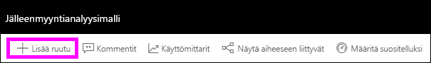
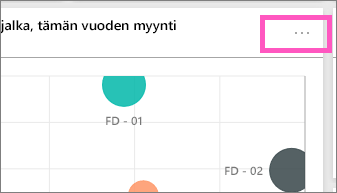

# Koontinäyttöruudut Power BI:ssä
Koontinäytöt ja koontinäyttöruudut ovat Power BI -palvelun ominaisuus eivätkä Power BI Desktopin. Vaikka koontinäyttöruutuja ei voi luoda tai kiinnittää Power BI -mobiilisovelluksessa, [niitä voidaan tarkastella ja jakaa](mobile-tiles-in-the-mobile-apps.md). Power BI -mobiilisovelluksessa voit [lisätä kuvia koontinäyttöösi iPhone-sovelluksella](mobile-iphone-app-get-started.md).

## Koontinäytön ruudut

Ruutu on tietojen tilannevedos, joka on kiinnitetty koontinäyttöön. Ruutu voidaan luoda raportista, tietojoukosta, koontinäytöstä, Q&A-ruudusta, Excelistä, SQL Server Reporting Servicesistä (SSRS) ja niin edelleen.  Tämä näyttökuva esittää useita eri ruutuja, jotka on kiinnitetty koontinäyttöön.

Kiinnittämisen lisäksi yksittäisiä ruutuja voidaan luoda suoraan koontinäyttöön valitsemalla [Lisää ruutu](service-dashboard-add-widget.md). Yksittäisiä ruutuja ovat tekstiruudut, kuvat, videot, suoratoistotiedot ja verkkosisältö.

Tarvitsetko apua Power BI:n rakenneosien kanssa?  Katso [Power BI - peruskäsitteet](service-basic-concepts.md).

> [!NOTE]
> Jos ruudun luomiseen käytetty alkuperäinen visualisointi muuttuu, ruutu ei muutu.  Jos esimerkiksi kiinnitit raportin viivakaavion ja muutit sitten viivakaavion palkkikaavioksi, koontinäytön ruudussa näkyy edelleen viivakaavio. Tiedot päivittyvät, mutta visualisointityyppi ei.
> 
> 

## Kiinnitä ruutu kohteesta...
Voit lisätä (kiinnittää) ruudun koontinäyttöön monella eri tavalla. Ruutuja voi kiinnittää seuraavista kohteista:

* [Power BI:n kysymyksiä ja vastauksia](service-dashboard-pin-tile-from-q-and-a.md)
* [raportti](service-dashboard-pin-tile-from-report.md)
* [toinen koontinäyttö](service-pin-tile-to-another-dashboard.md)
* [OneDrive for Businessin Excel-työkirja](service-dashboard-pin-tile-from-excel.md)
* [Power BI Publisher for Excel](publisher-for-excel.md)
* [Nopeat merkitykselliset tiedot](service-insights.md)
* [SSRS](https://msdn.microsoft.com/library/mt604784.aspx)

Voit luoda erillisiä ruutuja kuville, muokkausruuduille, videoille, suoratoistotiedoille ja verkkosisällölle suoraan koontinäytössä valitsemalla [Lisää ruutu](service-dashboard-add-widget.md).

  

## Koontinäytön ruutujen käsitteleminen
### Ruudun siirtäminen ja koon muuttaminen
Tartu ruutuun ja [siirrä sitä koontinäytössä](service-dashboard-edit-tile.md). Muuta ruudun kokoa pitämällä osoitinta kahvan  päällä ja valitsemalla se.

### Muuta ulkoasua ja toimintaa pitämällä osoitinta ruudun päällä
1. Tuo kolme pistettä näyttöön pitämällä osoitinta ruudun päällä.
   
    
2. Avaa ruudun toimintovalikko valitsemalla kolme pistettä.
   
    
   
    Täältä voit:
   
   * [avata raportin, jolla tämä ruutu on luotu ](service-reports.md)   
   
   * [avata laskentataulukon, jolla tämä ruutu on luotu ](service-reports.md)   
     
    * [tarkastella kohdistustilassa ](service-focus-mode.md)   
     * [viedä ruudussa käytettyjä tietoja](power-bi-visualization-export-data.md) 
     * [muokata otsikkoa ja alaotsikkoa, lisätä hyperlinkin](service-dashboard-edit-tile.md) 
     * [suorittaa merkityksellisiä tietoja ](service-insights.md) 
     * [kiinnitä ruudun toiseen koontinäyttöön ](service-pin-tile-to-another-dashboard.md) 
        
     * [poistaa ruudun](service-dashboard-edit-tile.md)
     .
3. Jos haluat sulkea toimintovalikon, valitse kankaan tyhjä alue.

### Ruudun valitseminen (napsauttaminen)
Kun valitset ruudun, seuraavaksi tapahtuva asia riippuu siitä, miten ruutu on luotu ja onko sillä [mukautettu linkki](service-dashboard-edit-tile.md). Jos sillä on mukautettu linkki, ruudun valitseminen ohjaa sinut kyseiseen linkkiin. Muussa tapauksessa ruudun valitseminen avaa raportin, Excel Online -työkirjan, SSRS-raportin, joka on paikallinen, tai kysymysten ja vastausten kysymyksen, jolla ruutu on luotu.

> [!NOTE]
> Poikkeuksena tähän ovat videoruudut, jotka on luotu suoraan koontinäyttöön **Lisää ruutu** -toiminnolla. (Tällä tavalla luodun) videoruudun valitseminen toistaa videon suoraan koontinäytössä.   
> 
> 

## Huomioon otettavat seikat ja vianmääritys
* Jos raporttia, jolla visualisointi on luotu, ei tallennettu, ruudun valitseminen ei tuota mitään toimia.
* Jos ruudun luotiin Excel Onlinen työkirjasta eikä sinulla ole vähintään lukuoikeuksia kyseiseen työkirjaan, ruudun valitseminen ei avaa työkirjaa Excel Onlinessa.
* Jos suoraan koontinäyttöön **Lisää ruutu** -toiminnolla luoduissa ruuduissa on määritetty mukautettu hyperlinkki, otsikon, alaotsikon tai ruudun valitseminen avaa kyseisen URL-osoitteen.  Muussa tapauksessa jonkin näiden suoraan koontinäytössä luotujen kuvan, verkkokoodin tai muokkausruudun ruudun valitseminen ei oletusarvoisesti tuota mitään toimia.
* Jos sinulla ei ole raportin käyttöoikeutta SSRS:ssä, SSRS:ssä luodun ruudun valitseminen avaa sivun, jossa ilmoitetaan, ettei sinulla ole käyttöoikeutta (rsAccessDenied).
* Jos sinulla ei ole käyttöoikeutta SSRS-palvelimen sisältävään verkkoon, SSRS:ssä luodun ruudun valitseminen avaa sivun, joka osoittaa, ettei palvelinta ei löytynyt (HTTP 404). Laitteellasi on oltava verkkoyhteys raporttipalvelimeen raportin tarkastelemiseksi.
* Jos ruudun luomiseen käytetty alkuperäinen visualisointi muuttuu, ruutu ei muutu.  Jos esimerkiksi kiinnitit raportin viivakaavion ja muutat sitten viivakaavion palkkikaavioksi, koontinäytön ruudussa näkyy edelleen viivakaavio. Tiedot päivittyvät, mutta visualisointityyppi ei.

## Seuraavat vaiheet
[Kortin (suurinumeroiden ruudun) luominen koontinäytölle](power-bi-visualization-card.md)

[Koontinäytöt Power BI:ssä](service-dashboards.md)  

[Tietojen uudelleenlataus](refresh-data.md)

[Power BI:n peruskäsitteet](service-basic-concepts.md)

[Ruudun vieminen Power Pointiin](http://blogs.msdn.com/b/powerbidev/archive/2015/09/28/integrating-power-bi-tiles-into-office-documents.aspx)

[Reporting Services -kohteiden kiinnittäminen Power BI -koontinäyttöihin](https://msdn.microsoft.com/library/mt604784.aspx)

Onko sinulla muuta kysyttävää? [Kokeile Power BI -yhteisöä](http://community.powerbi.com/)

