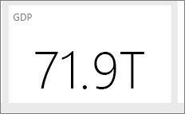

# Vinkkejä laadukkaiden Power BI -koontinäyttöjen suunnitteluun
Nyt kun olet luonut koontinäytön ja lisännyt siihen ruutuja, mieti, miten voisit parantaa sen toiminnallisuutta. Yleensä tämä tarkoittaa tärkeimpien tietojen korostamista ja koontinäytön selkeyttämistä.

Tässä on joitakin vihjeitä.

> [!TIP]
> Useimpia raporttien suunnittelukäytäntöjä voi soveltaa myös koontinäyttöihin.  Lue tekninen raportti [Raporttien ja visualisointien parhaat suunnittelukäytännöt](visuals/power-bi-visualization-best-practices.md).
>
>

## Katso [koontinäyttöjä käsittelevä verkkoseminaari](https://info.microsoft.com/CO-PowerBI-WBNR-FY16-05May-12-Dashboard-Makeover-Registration.html)
Siitä näet, miten Microsoftin ohjelmajohtaja ja Power BI -koontinäyttöjen asiantuntija Marc Reguera [uudistaa koontinäyttöjä](https://info.microsoft.com/CO-PowerBI-WBNR-FY16-05May-12-Dashboard-Makeover-Registration.html).

## Mieti yleisöäsi
Mitä ovat tärkeimpiä mittareita, jotka auttavat heitä tekemään päätöksiä? Miten koontinäyttöä käytetään? Mitkä opitut tai kulttuuriset olettamat saattavat vaikuttaa visualisointivalintoihin? Mitä tietoja yleisö tarvitsee onnistumiseen ja menestymiseen?

Koontinäyttö on yhteenveto tietojen nykyisestä tilasta. Koontinäyttö perustuu pohjana oleviin raportteihin ja tietojoukkoihin, jotka voivat sisältää paljon tietoja. Lukijat voivat siirtyä raportteihin koontinäytöstä. Älä siis sijoita yksityiskohtia koontinäyttöön, ellet halua lukijoiden keskittyvän juuri niihin.

Missä koontinäyttöä näytetään? Jos sitä näytetään suurikokoisessa näytössä, siihen voi lisätä paljon sisältöä. Jos käyttäjät tarkastelevat sitä tableteillaan, pienempi määrä ruutuja parantaa luettavuutta.

## Tiivistä tarinasi yhteen näyttöön
Koska koontinäytöt on tarkoitettu tärkeiden tietojen tarkasteluun yhdellä silmäyksellä, kaikki ruudut yhdessä näytössä toimii parhaiten. Voitko välttää vierityspalkkien käyttämisen koontinäytössä?

Onko koontinäyttö sekava?  Poista kaikki muut paitsi olennaisimmat tiedot, joita voi lukea ja tulkita helposti.

## Käytä koko näytön tilaa
Näytä koontinäyttö [koko näytön tilassa ](consumer/end-user-focus.md) ilman häiriötekijöitä.

## Näytä tärkeimmät tiedot suurimmassa koossa
Jos koontinäytön teksti ja visualisoinnit ovat kaikki samaa kokoa, lukijan on vaikea keskittyä tärkeimpään asiaan. Esimerkiksi korttivisualisoinnit ovat hyvä tapa esittää tärkeitä lukuja näkyvästi:  

Muista tarjota konteksti.  

Lue lisätietoja [vain luvun sisältävän ruudun luonnista](visuals/power-bi-visualization-card.md).

## Sijoita tärkeimmät tiedot yläkulmaan
Useimmat henkilöt lukevat ylhäältä alas, joten sijoita tärkein tieto ylös ja näytä lisää yksityiskohtia katsojan lukusuunnan mukaisesti (vasemmalta oikealle, oikealta vasemmalle).

## Käytä tiedolle juuri oikeaa visualisointia ja muotoile se vaivattomasti luettavaksi
Vältä erilaisten visualisointien lisäämistä vain vaihtelun vuoksi.  Visualisointien pitäisi maalata tietty kuva, joka on helppo sisäistää ja ymmärtää.  Joillekin tiedoille ja visualisoinneille riittää hyvin yksinkertainen grafiikka. Jotkin muut tiedot edellyttävät monimutkaisempaa visualisointia. Muista silloin käyttää otsikoita, nimiä ja muita lukijaa auttavia mukautuksia.  

* [Valitse asianmukaiset tietojen visualisoinnit](https://www.youtube.com/watch?v=-tdkUYrzrio). Suhtaudu varoen todellisuutta vääristäviin kaavioihin, kuten 3D-kaavioihin. Pidä mielessä, että ympyrämuotojen tulkitseminen on ihmisaivoille vaativaa. Ympyräkaaviot, rengaskaaviot, mittarit ja muut pyöreät kaaviotyypit ovat hienoja, mutta ne eivät ole paras vaihtoehto tietojen visualisointiin.
* Käytä akselien asteikkoja, ulottuvuuksien järjestystä ja dimensioarvoja kuvaavia värejä johdonmukaisesti kaaviosta toiseen.
* Esitä kvantitatiiviset tiedot kompaktisti ja siististi. Älä käytä luvuissa yli kolmea tai neljää numeroa. Vältä runsasta desimaalien käyttöä ja skaalaa luvut mahdollisimman suuriin mittayksiköihin, kuten tuhansista miljooniin: ”3,4 miljoonaa” mieluummin kuin ”3 400 000”.
* Älä yhdistä eri tarkkuuksia ja aikoja. Varmista, että käytetyt ajanjaksot on helppo käsittää.  Älä esimerkiksi laita samaan visualisointiin viime kuukautta kuvaavaa kaaviota ja suodatettuja kaavioita vuoden joltain muulta kuukaudelta rinnakkain.
* Vältä myös suurten ja pienten mittayksiköitten yhdistelemistä samalle asteikolle esimerkiksi viivakaaviona ja palkkikaaviona.  Esimerkki tällaisesta on, että yksi mittayksikkö on miljoonia ja toinen tuhansia.  Tällöin tuhansia mittaavan kaavion eroja voi olla vaikea havaita.  Jos yhdistely on välttämätöntä, valitse visualisointi, jossa voi käyttää toista akselia.
* Vältä kaavioiden täyttämistä arvopisteiden otsikoilla, jotka eivät ole välttämättömiä. Palkkikaavioissa arvot ovat yleensä helposti ymmärrettävissä ilman varsinaisia lukuja.
* Kiinnitä huomiota [kaavioiden lajitteluun](consumer/end-user-change-sort.md).  Jos haluat kiinnittää huomiota suurimpaan tai pienimpään lukuun, lajittele mittayksikön mukaan.  Jos haluat, että tietty luokka on nopeasti löydettävissä useiden muiden joukosta, lajittele akselin mukaan.  
* Ympyräkaaviot ovat parhaimmillaan, kun niissä on alle kahdeksan luokkaa. Koska arvoja ei voi tarkastella rinnakkain ympyräkaaviossa, niiden vertaaminen on vaikeampaa kuin palkki- ja pylväskaavioissa. Ympyräkaaviot toimivat parhaiten, kun osien vertailun sijaan tarkastellaan tietyn osan suhdetta kokonaisuuteen. Mittarikaaviot puolestaan ovat hyviä nykyisen tilanteen esittämisessä suhteessa tavoitteeseen.

Lisää visualisointikohtaisia ohjeita on artikkelissa [Visualisointityypit Power BI:ssä](visuals/power-bi-visualization-types-for-reports-and-q-and-a.md).  

## Lisätietoja parhaiden käytäntöjen mukaisesta koontinäyttörakenteesta
Koontinäyttöjen rakenne liittyy läheisesti yleisiin hahmottamisen ja ryhmittelyn periaatteisiin ja käytäntöihin. Suosittelemme tähän liittyen opiskelemaan käytännöllisen tiedon esittämistä asiayhteydessä. Meidän blogitekstien lisäksi myös muualla verkossa on paljon avointa tietoa ja valmiita resursseja tähän liittyen. Suosittelemiamme teoksia:

* Stephen Few: *Information Dashboard Design*  
* Stephen Few: *Show Me the Numbers*  
* Stephen Few: *Now You See It*  
* Edward Tufte: *Envisioning Information*  
* Andrew Abela: *Advanced Presentations by Design*   

## Seuraavat vaiheet
[Koontinäytön luominen raportista](service-dashboard-create.md)  
[Power BI:n peruskäsitteet](consumer/end-user-basic-concepts.md)  
Onko sinulla muuta kysyttävää? [Kokeile Power BI -yhteisöä](http://community.powerbi.com/)
