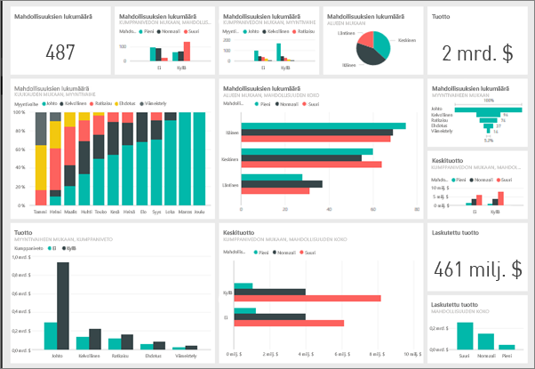
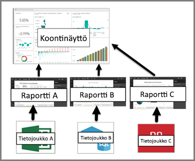

# Johdatus raporttinäkymiin Power BI -kehittäjille

Power BI -*raporttinäkymä* on yksittäinen sivu, joka kertoo tarinan visualisointien kautta. Koska se on rajattu yhdelle sivulle, hyvin suunniteltu raporttinäkymä sisältää vain tarinan kohokohdat. Lukijat voivat tutustua yksityiskohtiin raporttinäkymään liittyvien raporttien kautta.

Raporttinäkymä on vain Power BI -palvelun ominaisuus. Raporttinäkymät eivät ole käytettävissä Power BI Desktopissa. Raporttinäkymiä ei voi luoda mobiililaitteilla, mutta niitä voi [tarkastella ja jakaa](mobile-apps-view-dashboard.md) niillä.

## Raporttinäkymien perusteet 

Raporttinäkymän visualisointeja kutsutaan *ruuduiksi*. Ruutuja *kiinnitetään* raporttinäkymiin raporteista. Jos olet uusi Power BI:n käyttäjä, saat hyvän pohjan sen käyttöön lukemalla [Power BI -palvelun peruskäsitteitä suunnittelijoille](service-basic-concepts.md) -ohjeartikkelin.

Raporttinäkymän visualisoinnit ovat peräisin raporteista, ja kukin raportti perustuu tietojoukkoon. Itse asiassa raporttinäkymää voidaan ajatella eteisenä, josta pääsee sen pohjana oleviin raportteihin ja tietojoukkoihin. Valitsemalla visualisoinnin pääset sen perustana olevaan raporttiin (ja tietojoukkoon).

## Koontinäyttöjen edut
Raporttinäkymät tarjoavat erinomaisen tavan liiketoiminnan tarkkailuun ja tärkeimpien tietojesi näkemiseen yhdellä silmäyksellä. Koontinäytöillä olevat visualisoinnit saattavat olla peräisin yhdestä tai useammasta tietojoukosta sekä yhdestä tai useammasta pohjana olevasta raportista. Raporttinäkymä yhdistää paikalliset ja pilvipalvelussa olevat tiedot ja tarjoaa niistä yhdistetyn näkymän riippumatta siitä, missä tiedot todella sijaitsevat.

Raporttinäkymä ei ole pelkkää koreilua. Se on erittäin vuorovaikutuskykyinen, ja sen ruudut päivittyvät sitä mukaa, kun pohjana olevat tiedot muuttuvat.

## Kuka voi luoda koontinäytön?
Koontinäytön luominen on *luoja*-toiminto ja edellyttää raportin muokkausoikeuksia. Muokkausoikeudet ovat raportin luojien käytettävissä ja niiden työtovereiden käytössä, joille luoja myöntää käyttöoikeudet. Esimerkiksi jos David luo raportin työtilaABC:ssä ja lisää sinut työtilan jäseneksi, niin sinulla ja Davidilla on muokkausoikeudet. Jos taas raportti on jaettu kanssasi suoraan tai osana [Power BI -sovellusta](service-create-distribute-apps.md), olet raportin *kuluttaja*. Et ehkä voi kiinnittää ruutuja koontinäyttöön. 

> [!IMPORTANT]
> Raporttinäkymien luomiseen työtilassa tarvitaan [Power BI Pro](service-free-vs-pro.md) -käyttöoikeus. Voit luoda koontinäyttöjä omassa työtilassa ilman Power BI Pro -käyttöoikeutta.

## Koontinäytöt vs. raportit
[Raportit](service-reports.md) ja raporttinäkymät vaikuttavat samankaltaisilta, koska ne ovat molemmat eräänlaisia pohjia, jotka ovat täynnä visualisointeja. Niissä on kuitenkin merkittäviä eroja, kuten voit nähdä seuraavasta taulukosta.

| **Ominaisuus** | **Koontinäytöt** | **Raportit** |
| --- | --- | --- |
| Sivut |Yksi sivu |Yksi tai useampi sivu |
| Tietolähteet |Yksi tai useampi raportti ja yksi tai useampi tietojoukko koontinäyttöä kohden |Yksi tietojoukko raporttia kohden |
| Käytettävissä Power BI Desktopissa |Ei | Kyllä. Voi luoda ja tarkastella raportteja Power BI Desktopissa |
| Tilaa |Kyllä. Koontinäytön voi tilata |Kyllä. Raporttisivun voi tilata |
| Suodatus |Ei. Ei voi suodattaa tai jakaa sektoreihin |Kyllä. Monta eri tapaa suodattaa, korostaa ja jakaa sektoreihin |
| Esittelyssä |Kyllä. Voit määrittää jonkin koontinäytön *esittelyssä olevaksi* koontinäytöksi |Ei |
| Suosikki | Kyllä. Useita koontinäyttöjä voi merkitä *suosikeiksi* | Kyllä. Useita raportteja voi merkitä *suosikeiksi*
| Hälytysten asettaminen |Kyllä. Käytettävissä koontinäytön ruuduilta tietyissä tilanteissa |Ei |
| Kyselyt luonnollisella kielellä (Q&A) |Kyllä | Kyllä, jos käytettävissä on raportin ja sen pohjana olevan tietojoukon muokkausoikeudet |
| Pohjana olevat tietojoukkojen taulukot ja kentät ovat näkyvissä |Ei. Voit viedä tietoja, mutta et näe taulukoita ja kenttiä itse koontinäytössä |Kyllä |

## Seuraavat vaiheet
* Tutustu koontinäyttöihin paremmin tutustumalla johonkin [mallikoontinäytöistämme](sample-tutorial-connect-to-the-samples.md).
* Lue lisää [raporttinäkymien ruuduista](service-dashboard-tiles.md).
* Haluatko seurata yksittäistä koontinäytön ruutua ja saada sähköpostiviestin, kun se saavuttaa tietyn raja-arvon? [Luo hälytys ruutuun](service-set-data-alerts.md).
* Opettele käyttämään [Power BI:n kysymyksiä ja vastauksia](power-bi-tutorial-q-and-a.md) -toimintoa kysymyksen esittämiseksi tietojasi koskien, jolloin saat vastauksen visualisoinnin muodossa.
