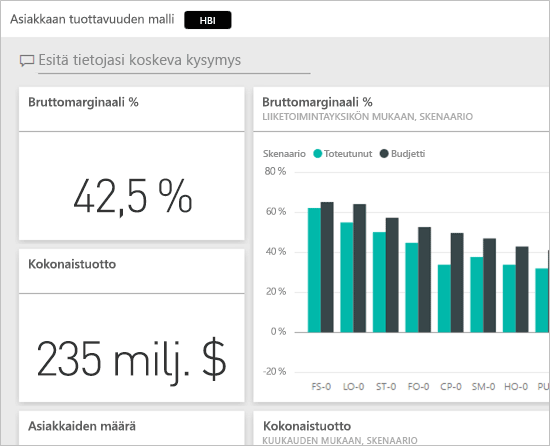
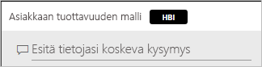
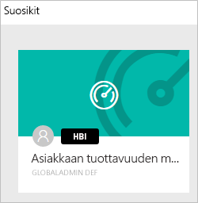
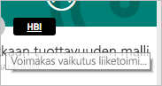
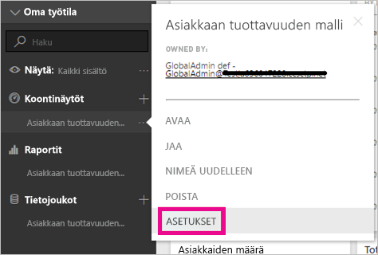
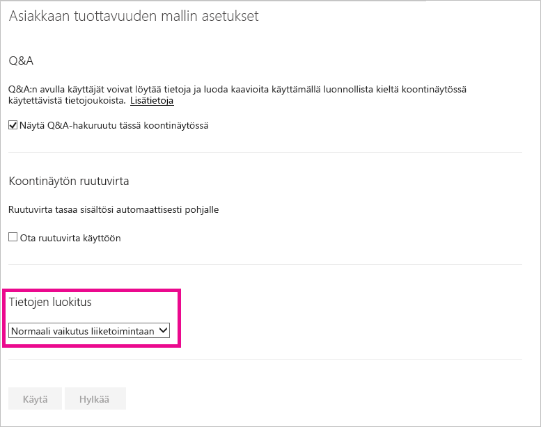
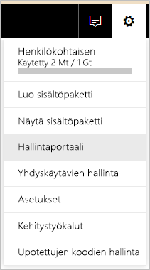
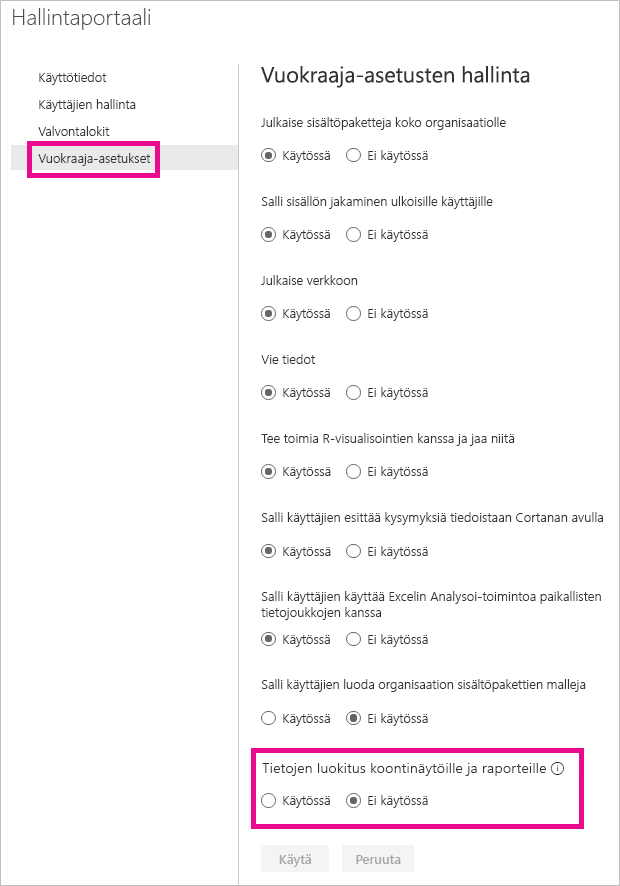
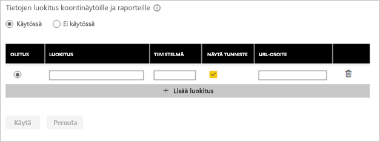
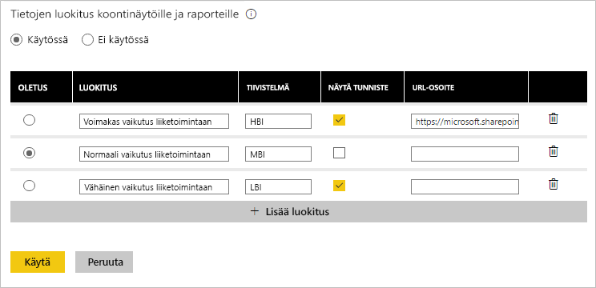

# Koontinäytön tietojen luokittelu
Jokainen koontinäyttö on erilainen ja riippuen yhdistetystä tietolähteestä, havaitset luultavasti, että sinun ja työtovereidesi, joiden kanssa jaat tietoja, on suoritettava eri varotoimia tietojen arkaluontoisuuden mukaisesti. Joitakin koontinäyttöjä ei pitäisi koskaan jakaa yrityksen ulkopuolisille henkilöille tai tulostaa, kun taas osa voidaan jakaa vapaasti. Käyttämällä koontinäytön tietojen luokitusta, pystyt nostamaan tietoisuutta koontinäyttösi tarkastelijoiden keskuudessa siitä, mitä suojaustasoa tulisi käyttää. Voit lisätä koontinäyttöösi tunnisteen, jossa luokitukset on määritelty yrityksesi IT-osaston mukaan, joten kaikilla ketkä katselevat sisältöä, on saman tasoinen ymmärrys tietojen arkaluontoisuudesta.

## Tietojen luokittelutunnisteet
Tietojen luokittelutunnisteet näkyvät koontinäytön nimen vieressä, kertoen koontinäytöllä käytettävän suojaustason ja sen sisältämät tiedot.

Se näkyy myös koontinäyttöruudun vieressä, suosikit-listallasi.

Kun pidät osoitinta tunnisteet päällä, näet luokituksen koko nimen.

Järjestelmänvalvojat voivat määrittää tunnisteelle myös URL-osoitteen tarjoamaan lisätietoja.

> [!NOTE]
> Järjestelmänvalvojan määrittelemistä luokitusasetuksista riippuen, jotkin luokitustyypit eivät välttämättä näy tunnisteina koontinäytössä. Jos olet koontinäytön omistaja, voit aina tarkistaa koontinäytön luokitustyypin koontinäytön asetuksista.
> 
> 

## Koontinäytön luokituksen asettaminen
Jos tietojen luokitus on otettu yrityksessäsi käyttöön, kaikki koontinäytöt aloittavat oletusluokitustyyppisinä, mutta koontinäytön omistajana voit muuttaa luokituksen vastaamaan koontinäyttöjen suojaustasoa.

Muuta luokitustyyppiä seuraavasti.

1. Siirry koontinäytön asetuksiin valitsemalla koontinäytön nimen vieressä olevat **kolme pistettä** ja valitse **Asetukset**.
   
    
2. Koontinäytön asetuksista näet koontinäytön nykyisen luokituksen ja voit muuttaa luokitustyyppiä avattavaa valikkoa käyttämällä.
   
    
3. Valitse **Käytä**, kun olet valmis.

Kun muutokset on otettu käyttöön, kaikki joiden kanssa olet jakanut koontinäyttösi, näkevät päivityksen kun he seuraavan kerran lataavat koontinäytön.

## Tietojen luokittelutunnisteiden käsittely järjestelmänvalvojana
Tietojen luokitus organisaatiossasi toteutetaan yleisen järjestelmänvalvojan toimesta. Voit ottaa tietojen luokitus käyttöön seuraavasti.

1. Valitse Asetukset-hammaskuvake ja sitten **Hallintaportaali**.
   
    
2. Vaihda **Koontinäyttöjen ja raporttien tietojen luokitus** *päälle* **Vuokraajan asetukset** -välilehdeltä.
   
    

Kun asetus on päällä, näyttöön ilmestyy lomake, jonka avulla voit luoda useita luokituksia organisaatioosi.

Jokaisella luokituksella on **nimi** sekä **tiivistelmä**, jotka näkyvät koontinäytössä. Voit päättää näkyvätkö kunkin luokituksen tiivistelmätunnisteet koontinäytöllä valitsemalla **Näytä tunniste**. Jos päätät, ettei luokitustyyppiä näytetä koontinäytössä, omistaja näkee tyypin tästä huolimatta koontinäytön asetuksista. Voit lisäksi lisätä **URL-osoitteen**, joka sisältää lisätietoja organisaatiosi luokitusohjeista sekä käyttövaatimuksista.  

Viimeiseksi sinun on päätettävä mikä luokitustyyppi toimii oletuksena.  

Kun olet täyttänyt lomakkeen luokitustyypeilläsi, valitse **Käytä** tallentaaksesi muutokset.

Tässä vaiheessa kaikki koontinäytöt määritetään oletusarvoiseen luokitukseen ja koontinäyttöjen omistajat voivat nyt päivittää luokitustyypin vastaamaan sisältöä. Voit palata tänne myöhemmin lisätäksesi tai poistaaksesi luokitustyyppejä, tai muuttaaksesi oletusta.  

> [!NOTE]
> Tässä muutama tärkeä asia, jotka tulee muistaa kun palaat tekemään muutoksia:
> 
> * Jos poistat tietojen luokituksen käytöstä, mitään tunnisteita ei säilytetä. Sinun on aloitettava alusta, jos päätät ottaa sen takaisin käyttöön myöhemmin.  
> * Jos poistat luokitustyyppejä, kaikki kyseiseen luokitukseen määritetyt koontinäytöt palautetaan oletusarvoisiksi, kunnes omistaja asettaa uuden luokituksen.  
> * Jos vaihdat oletusluokitusta, kaikki koontinäytöt, mitä ei omistajien toimesta oltu vielä määritetty mihinkään luokitukseen, muuttuvat oletusarvoisiksi.
> 
> 

