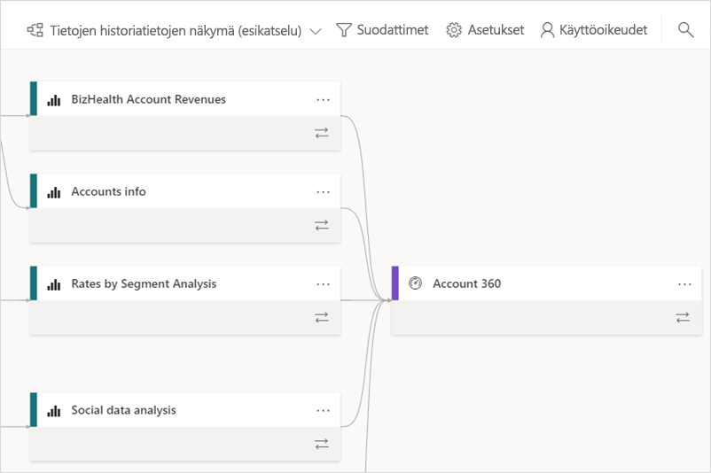
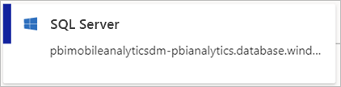
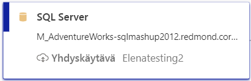
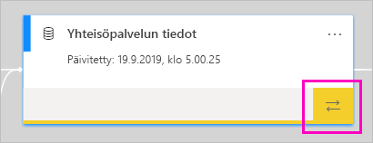
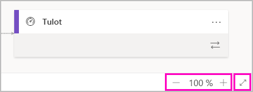

# Tietojen historiatiedot (esiversio)
Moderneissa liiketoimintatietojen projekteissa tietovirran ymmärtäminen tietolähteestä kohteeseen voi olla haastavaa. Haaste on vieläkin suurempi, jos olet luonut edistyneitä analyysiprojekteja, jotka kattavat useita tietolähteitä, artefakteja ja riippuvuuksia.  Esimerkiksi kysymyksiin ”Mitä tapahtuu, jos muutan näitä tietoja?” tai ”Miksi tämä raportti ei ole ajan tasalla?” voi olla vaikea vastata. Niiden ymmärtäminen voi vaatia asiantuntijaryhmän tai syvällistä tutkintaa. Olemme suunnitelleet tietojen historiatietojen näkymän, jonka avulla näihin kysymyksiin voi vastata.

 
Power BI sisältää useita artefaktityyppejä, kuten koontinäyttöjä, raportteja, tietojoukkoja ja tietovoita. Monet tietojoukot ja tietovuot muodostavat yhteyden ulkoisiin tietolähteisiin, kuten SQL Serveriin, ja muissa työtiloissa oleviin ulkoisiin tietojoukkoihin. Kun tietojoukko on ulkoinen työtilassasi olevaan työtilaan nähden, se saattaa olla IT:n työntekijän tai toisen analyytikon omistamassa työtilassa. Ulkoisten tietolähteiden ja tietojoukkojen takia on vaikeampi tietää, mistä tiedot ovat lopulta peräisin. Esittelemme monimutkaisia ja yksinkertaisiakin projekteja varten tietojen historiatietojen näkymän. 

Tietojen historiatietojen näkymässä näet kaikkien työtilassa olevien artefaktien väliset historiatiedot ja kaikki sen ulkoiset riippuvuudet. Tietovoiden näkymässä oli jo kaavionäkymä, ja tietojen historiatietojen näkymä laajentaa kyseistä näkymää. Se näyttää yhteydet kaikkien työtilan artefaktien välillä, mukaan lukien yhteydet tietovoihin sekä ennen että jälkeen. Erillinen tietovoiden kaavionäkymä poistuu marraskuusta alkaen.

## Tutki tietojen historiatietojen näkymää

Jokaisessa työtilassa riippumatta siitä, onko se uusi tai perinteinen, on automaattisesti tietojen historiatietojen näkymä Omaa työtilaa lukuun ottamatta. Sen tarkastelemiseen työtilassa tarvitaan vähintään osallistujan rooli. Katso lisätietoja tämän artikkelin kohdasta [Oikeudet](#permissions). 

- Jos haluat käyttää tietojen historiatietojen näkymää, siirry työtilan luettelonäkymään. Napauta **Luettelonäkymä**-kohdan vieressä olevaa nuolta ja valitse **Tietojen historiatietojen näkymä**.

    

    Tässä näkymässä näet kaikki työtilan artefaktit ja tiedon kulun artefaktien välillä

**Tietolähteet**

Näet tietolähteet, joista tietojoukot ja tietovuot saavat tietonsa. Tietolähteen korteista näet lisää tietoja, joiden avulla voit tunnistaa lähteen. Esimerkiksi Azuren SQL-palvelimesta näet myös tietokannan nimen.

 
**Yhdyskäytävät**

Jos tietolähde on yhdistetty paikallisen yhdyskäytävän kautta, yhdyskäytävän tiedot lisätään tietolähteen korttiin. Jos sinulla on oikeudet joko yhdyskäytävän järjestelmänvalvojana tai tietolähteen käyttäjänä, näet lisätietoja, kuten yhdyskäytävän nimen.

**Tietojoukot ja tietovuot**
 
Tietojoukoista näet viimeisimmän päivitysajan ja tiedon siitä, onko tietojoukko sertifioitu tai korotettu.

 
Jos työtilan raportti perustuu toisessa työtilassa olevaan tietojoukkoon, näet lähdetyötilan nimen tietojoukon kortissa. Siirry kyseiseen työtilaan valitsemalla lähdetyötilan nimi.
 
- Näet asetusvalikon mistä tahansa artefaktista valitsemalla **Enemmän vaihtoehtoja** (...). Se sisältää kaikki samat toiminnot, jotka ovat käytettävissä luettelonäkymässä.
  
Jos haluat tarkastella lisää tietojoukkojen metatietoja, valitse tietojoukon kortti. Tietojoukon lisätiedot näytetään sivuruudussa.

 
## Näytä minkä tahansa artefaktin tietojen historiatiedot 

Oletetaan, että haluat tarkastella tietyn artefaktin tietojen historiatietoja.

- Valitse kaksoisnuolet artefaktin alla.

    

    Power BI korostaa kaikki kyseiseen artefaktiin liittyvät artefaktit ja himmentää loput. 

## Siirtyminen ja koko näyttö 

Tietojen historiatietojen näkymä on vuorovaikutteinen pohja. Voit käyttää hiirtä ja kosketuslevyä pohjaan siirtymiseksi sekä lähentämiseen tai loitontamiseen.  

- Lähennä ja loitonna käyttämällä joko oikeassa alakulmassa olevaa valikkoa tai hiirtä tai kosketuslevyä. 

- Jos haluat saada enemmän tilaa kaaviolle, käytä koko näytön vaihtoehtoa oikeassa alakulmassa. 

    

## Käyttöoikeudet

- Tietojen historiatietojen näkymän tarkastelemiseen tarvitaan Power BI Pro -käyttöoikeus.
- Tietojen historiatietojen näkymä on vain niiden käyttäjien käytettävissä, joilla on työtilan käyttöoikeus.
- Käyttäjillä on oltava järjestelmänvalvojan, jäsenen tai osallistujan rooli työtilassa. Katselijan roolissa olevat käyttäjät eivät voi siirtyä tietojen historiatietojen näkymään.

## Huomioitavat asiat ja rajoitukset

- Tietojen historiatietojen näkymä ei ole käytettävissä Internet Explorerissa. Katso lisätietoja kohdasta [Power BI:n tuetut selaimet](power-bi-browsers.md).
- Tietojen historiatietojen näkymä ei ole käytettävissä omassa työtilassa.

## Seuraavat vaiheet

- [Johdanto tietojoukkojen käyttöön eri työtiloissa (esikatselu)](service-datasets-across-workspaces.md)
