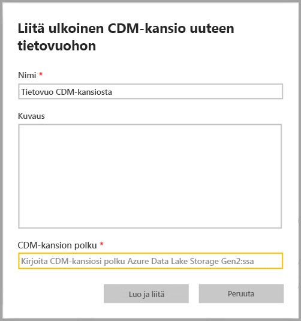
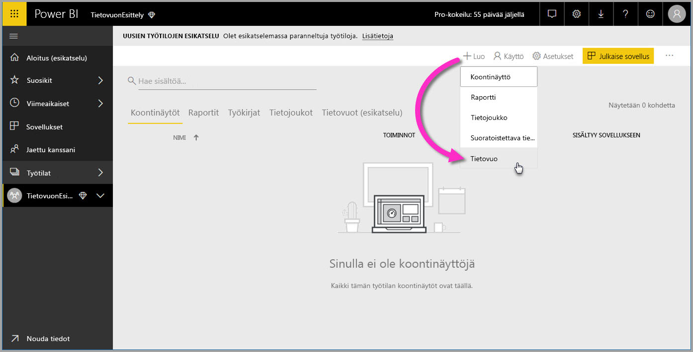
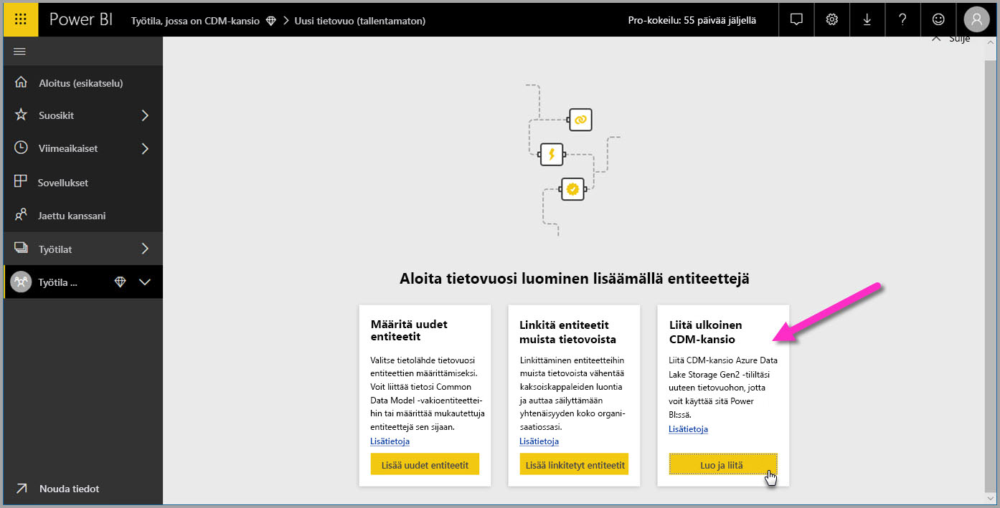

# Lisää CDM-kansio Power BI:hin tietovuona (esikatselu)

Voit lisätä Power BI:ssä organisaation Azure Data Lake Storage Gen2:en tallennetut Common Data Model (CDM) -kansiot tietovoina. Kun olet luonut tietovuon CDM-kansiosta, voit luoda **Power BI Desktopin** ja **Power BI -palvelun** avulla tietojoukkoja, raportteja, raporttinäkymiä ja sovelluksia, jotka perustuvat CDM-kansioihin lisäämiisi tietoihin.

Tietovoiden luomiseen CDM-kansioista on muutamia vaatimuksia, kuten seuraavassa luettelossa kuvataan:

* Tietovoiden luominen CDM-kansioista on käytettävissä *vain* [uudessa työtilakokemuksessa](service-create-the-new-workspaces.md). 
* CDM-kansion lisääminen Power BI:hin edellyttää, että kansion lisäävällä käyttäjällä on [CDM-kansion ja sen tiedostojen käyttöoikeus](https://go.microsoft.com/fwlink/?linkid=2029121).
* Sinulla on oltava luku- ja käyttöoikeudet kaikkiin CDM-kansiossa oleviin tiedostoihin ja kansioihin, jotta ne voi lisätä Power BI:hin.

Seuraavissa osissa kuvataan tietovuon luominen CDM-kansiosta.

> [!NOTE]
> Tietovuotoiminto on esikatselutilassa, ja sitä voidaan muuttaa ja päivittää ennen kuin se on yleisesti saatavilla.

## Tietovuon luominen CDM-kansiosta

Aloita tietovuon luominen CDM-kansiosta käynnistämällä **Power BI -palvelu**. Valitse sitten **sovellustyötila** vasemmasta siirtymisruudusta. Voit myös luoda uuden työtilan, jossa voit luoda uuden tietovuon.

Valitse näkyviin tulevassa näytössä **Luo ja liitä** seuraavassa kuvassa esitetyllä tavalla.

Seuraavaksi näkyviin tulevassa näytössä voit nimetä tietovuon, lisätä tietovuolle kuvauksen ja lisätä polun organisaatiosi Azure Data Lake Gen2 -tilin CDM-kansioon. Lue artikkelista osio, jossa kuvataan [CDM-kansion polun hankkiminen](service-dataflows-configure-workspace-storage-settings.md#get-the-uri-of-stored-dataflow-files). 

Kun olet antanut tiedot, luo tietovuo valitsemalla **Luo ja liitä**.

CDM-kansioiden tietovuot on merkitty *ulkoinen*-kuvakkeella, kun ne näkyvät Power BI:ssä. Seuraavassa osiossa kuvataan tavallisten tietovoiden ja CDM-kansioista luotujen tietovoiden erot.

Kun käyttöoikeudet on määritetty oikein aiemmin tässä artikkelissa kuvatulla tavalla, voit muodostaa yhteyden tietovuohon **Power BI Desktopissa**.

## Huomioitavat asiat ja rajoitukset

Kun käsittelet CDM-kansioista luodun tietovuon oikeuksia, prosessi muistuttaa ulkoisten tietolähteiden prosessia Power BI:ssä. Oikeuksia hallitaan tietolähteessä. Niitä ei hallita Power BI:ssä. Oikeudet on määritettävä asianmukaisesti tietolähteessä, kuten CDM-kansiosta luodussa tietovuossa, jotta ne toimivat oikein Power BI:ssä.

Seuraava luettelo selventää, miten CDM-kansioista luodut tietovuot toimivat Power BI:ssä.

Power BI Pro-, Power BI Premium- ja Power BI Embedded -työtilat:
* CDM-kansioista tulevat tietovuot eivät ole muokattavissa
* CDM-kansiosta luodun tietovuon lukuoikeutta hallitsee CDM-kansion omistaja Power BI:n sijasta

Power BI Desktop:
* Vain käyttäjät, joilla on oikeus sekä työtilaan, jossa tietovuo on luotu, että CDM-kansioon, voivat käyttää sen tietoja Power BI -tietovoiden yhdistimen kautta

Muita harkittavia seikkoja on seuraavassa luettelossa:

* Tietovoiden luominen CDM-kansioista on käytettävissä *vain* [uudessa työtilakokemuksessa](service-create-the-new-workspaces.md)
* Linkitetyt entiteetit eivät ole käytettävissä CDM-kansioista luodulle tietovuolle

**Power BI Desktop** -asiakas ei voi käyttää Azure Data Lake Storage Gen2 -tiliin tallennettuja tietovoita, jos hän ei ole tietovuon omistaja tai jos hänelle ei ole myönnetty nimenomaista oikeutta käyttää tietovuon CDM-kansiota. Katso seuraavaa esimerkkiä:

1.  Anna luo uuden sovellustyötilan ja määrittää sen tallentamaan tietovuot CDM-kansioon.
2.  Ben, joka on myös jäsen Annan luomassa työtilassa, haluaa noutaa tietoja Annan luomasta tietovuosta Power BI Desktopin ja tietovuon yhdistimen avulla.
3.  Ben saa virheen, koska häntä ei ole lisätty tietovuon CDM-kansion valtuutetuksi käyttäjäksi Data Lake -järjestelmässä.

    

Tämän ongelman ratkaisemiseksi Benin on saatava CDM-kansion ja sen tiedostojen lukuoikeudet. Lisätietoja oikeuksien myöntämisestä CDM-kansioon on [tässä artikkelissa](https://go.microsoft.com/fwlink/?linkid=2029121).

## Seuraavat vaiheet

Tässä artikkelissa annetaan ohjeet työtilan tallennustilan määrittämiseen tietovoita varten. Lisätietoja saat seuraavista artikkeleista:

Lisätietoja tietovoista, CDM:stä ja Azure Data Lake Storage Gen2:sta on seuraavissa artikkeleissa:

* [Tietovuot ja Azure Data Lake -integrointi (esikatselu)](service-dataflows-azure-data-lake-integration.md)
* [Määritä työtilan tietovuoasetukset (esikatselu)](service-dataflows-configure-workspace-storage-settings.md)
* [Yhdistä Azure Data Lake Storage Gen2 tietovuotallennusta varten (esikatselu)](service-dataflows-connect-azure-data-lake-storage-gen2.md)

Lisätietoja tietovoista yleisesti on seuraavissa artikkeleissa:

* [Tietovoiden luominen ja käyttäminen Power BI:ssä](service-dataflows-create-use.md)
* [Laskettujen entiteettien käyttäminen Power BI Premiumissa (esikatselu)](service-dataflows-computed-entities-premium.md)
* [Tietovoiden käyttäminen paikallisten tietolähteiden kanssa (esikatselu)](service-dataflows-on-premises-gateways.md)
* [Kehittäjien resurssit Power BI -tietovoille (esikatselu)](service-dataflows-developer-resources.md)

Lisätietoja Azure-tallennustilasta on seuraavissa artikkeleissa:
* [Azure-tallennuksen suojausopas](https://docs.microsoft.com/azure/storage/common/storage-security-guide)
* [Ajoitetun päivityksen määrittäminen](refresh-scheduled-refresh.md)
* [Azure-tietopalveluiden github-mallien käytön aloittaminen](https://aka.ms/cdmadstutorial)

Lisätietoja Common Data Modelista on sen yleiskatsauksen sisältävässä artikkelissa:
* [Common Data Model – yleiskatsaus](https://docs.microsoft.com/powerapps/common-data-model/overview)
* [CDM-kansiot](https://go.microsoft.com/fwlink/?linkid=2045304)
* [CDM-mallitiedoston määritys](https://go.microsoft.com/fwlink/?linkid=2045521)

Voit myös yrittää [esittää kysymyksiä Power BI -yhteisössä](http://community.powerbi.com/).

