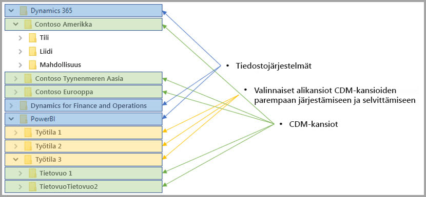

# Tietovuot ja Azure Data Lake -integrointi (esikatselu)

Oletusarvon mukaan Power BI:ssä käytetyt tiedot tallennetaan Power BI:n tarjoamaan sisäiseen tallennustilaan. Tietovoiden ja Azure Data Lake Storage Gen2 (ADLS Gen2) -järjestelmän integroinnin myötä voit tallentaa tietovuot organisaatiosi Azure Data Lake Storage Gen2 -tilille. 

> [!NOTE]
> Tietovuotoiminto on esikatselutilassa, ja sitä voidaan muuttaa ja päivittää ennen kuin se on yleisesti saatavilla.

## Miten CDM-kansiot liittyvät tietovoihin

**Tietovoiden** avulla käyttäjät ja organisaatiot voivat yhdistää eri lähteistä olevia tietoja ja valmistella ne mallinnusta varten. Organisaatiot voivat käyttää Common Data Model (CDM) -mallin kanssa tietomuotoa, joka tarjoaa semanttisen yhdenmukaisuuden kaikissa sovelluksissa ja käyttöönotoissa. Azure Data Lake Storage Gen2 (ADLS Gen2) -järjestelmän avulla Data Lake -järjestelmiin voidaan käyttää tarkkaa käytönvalvontaa ja käyttöoikeuksien myöntämisen valvontaa Azuressa. Yhdistettyinä nämä elementit tarjoavat vakuuttavat keskitetyt tiedot, jäsennetyt tiedot, tarkan käyttöoikeuksien valvonnan ja semanttisen yhdenmukaisuuden sovelluksille ja käyttöönotoille koko yrityksessä.

Tallennetut tiedot CDM-muodossa tarjoavat semanttisen yhdenmukaisuuden organisaation eri sovelluksissa ja käyttöönotoissa. Kun CDM integroidaan ADLS Gen2 -järjestelmään, samaa rakenteellista yhdenmukaisuutta ja semanttista merkitystä voidaan käyttää tallennettuihin tietoihin (ADLS Gen2) käyttämällä CDM-kansioita, jotka sisältävät rakenteelliset tiedot CDM-vakiomuodossa. Azure Data Lakessa standardoidut metatiedot ja itsekuvaavat tiedot helpottavat metatietojen löytämistä sekä yhteentoimivuutta tietojen tuottajien ja kuluttajien, kuten Power BI:n, Azure Data Factoryn, Azure Data Laken, Databricksin ja Microsoft Azuren automaattianalyysipalveluiden (ML), välillä. 

Tietovuot tallentavat määritykset ja tiedot CDM-kansioihin seuraavissa muodoissa:

**Model.json**
* **Model.json**-metatietotiedosto sisältää semanttisia tietoja entiteetin tietueista ja ominaisuuksista sekä muodostaa yhteyden taustalla oleviin datatiedostoihin. Model.json-tiedoston olemassaolo ilmaisee, että CDM-metatietomuotoa noudatetaan. Se voi sisältää vakioentiteettejä, joissa on lisää monipuolisia räätälöityjä semanttisia metatietoja, joita voidaan käyttää sovelluksissa.
* Power BI tallentaa myös kunkin tietolähteen tiedot ja Power BI -palvelun tietovuon editorikokemuksessa luodun **kyselyn ja muunnokset**. Tietolähteiden salasanoja ei tallenneta mallitiedostoon.

**Datatiedostot**
* Datatiedostot sisältyvät CDM-kansioon määritellyllä rakenteella ja muodolla (alikansiot ovat valinnaisia, kuten myöhemmin tässä artikkelissa kuvataan), ja niihin viitataan model.json-tiedostossa. Tällä hetkellä datatiedostojen on oltava .csv-muodossa, mutta muita muotoja saatetaan tukea tulevissa päivityksissä. 

Seuraavassa kaaviossa esitetään esimerkki CDM-kansiosta, joka on luotu Power BI -tietovuosta. Se sisältää kolme entiteettiä:

Edellisen kuvan model.json- tai metatietotiedosto tarjoaisi osoittimet entiteetin datatiedostoihin koko CDM-kansiossa.

## Power BI järjestää CDM-kansiot Data Lake -järjestelmässä

Power BI:n tietovoiden ja sen ADLS Gen2 -integroinnin ansiosta Power BI voi tuottaa tietoja Data Lake -järjestelmään. Tietojen tuottajana Power BI:ssä on luotava CDM-kansio kullekin tietovuolle, joka sisältää model.json-tiedoston ja siihen liittyvät datatiedostot. Power BI tallentaa tiedot erikseen muista Data Lake -järjestelmän tietojen tuottajista käyttämällä *tiedostojärjestelmiä*. Lisätietoja Azure Data Lake Storage Gen2 -tiedostojärjestelmästä ja hierarkkisesta nimitilasta [on niitä käsittelevässä artikkelissa](https://docs.microsoft.com/azure/storage/data-lake-storage/namespace).

Power BI käyttää alikansioita selvitykseen ja luomaan tiedoille paremman järjestyksen, kun ne esitetään **Power BI -palvelussa**. Kansion nimeäminen ja rakenne edustavat työtiloja (kansiot) ja tietovoita (CDM-kansiot). Seuraavassa kaaviossa esitetään, miten Power BI:n ja muiden tietojen tuottajien jakama Data Lake -järjestelmä voidaan muodostaa. Kukin palvelu – tässä tapauksessa Dynamics 365, Dynamics for Finance and Operation sekä Power BI – luo oman tiedostojärjestelmän ja ylläpitää sitä. Kunkin palvelun käyttökokemuksen mukaan luodaan alikansioita, jotta CDM-kansiot voidaan järjestää paremmin tiedostojärjestelmässä. 

## Power BI suojaa tiedot Data Lake -järjestelmässä

Power BI käyttää *Active Directory OAuth Bearer* -tunnusten ja *POSIX ACL -käyttöoikeusluetteloiden* toimintoja, jotka tarjoaa Azure Data Lake Storage Gen2. Nämä ominaisuudet mahdollistavat Power BI:n pääsyn rajoittamisen tiedostojärjestelmään, jota se hallitsee Data Lake -järjestelmässä, ja myös käyttäjien käyttöoikeuden rajoittamisen vain käyttäjien luomiin tietovoihin tai CDM-kansioihin. 

CDM-kansioiden luomiseen ja hallitsemiseen Power BI -tiedostojärjestelmässä tarvitaan tiedostojärjestelmän luku-, kirjoitus- ja suoritusoikeudet. Jokainen Power BI:ssä luotu tietovuo tallennetaan omaan CDM-kansioon ja tietovuon omistajalle myönnetään vain luku -oikeus CDM-kansioon ja sen sisältöön. Tämä lähestymistapa suojaa Power BI:n luomien tietojen eheyden ja tarjoaa järjestelmänvalvojille mahdollisuuden valvoa valvontalokien avulla, ketkä käyttäjät käyttävät CDM-kansiota. 

### CDM-kansioiden käyttöoikeuden myöntäminen käyttäjille tai palveluille

CDM-kansioiden jakaminen tietojen kuluttajille, kuten käyttäjille tai palveluille, joiden on päästävä lukemaan tietoja, on entistä yksinkertaisempaa Active Directory OAuth Bearer -tunnusten ja POSIX ACL -käyttöoikeusluetteloiden ansiosta. Tällöin järjestelmänvalvojat voivat valvoa, ketkä käyttävät CDM-kansiota. Järjestelmänvalvojan tarvitsee vain myöntää halutulle Active Directory -objektille (kuten käyttäjäryhmälle tai palvelulle) CDM-kansion käyttöoikeus. Suosittelemme, että CDM-kansion kaikki käyttöoikeudet määritetään vain luku -tasolle tietojen tuottajaa lukuun ottamatta. Tämä toimintatapa varmistaa tuottajan luomien tietojen eheyden.

Jotta CDM-kansioita voidaan lisätä Power BI:hin, CDM-kansion lisäävällä käyttäjällä tulee olla *lukuoikeuksien* käyttöoikeusluettelot sekä itse CDM-kansiossa että kaikissa sen sisältämissä tiedostoissa tai kansioissa. Lisäksi *suorituksen* käyttöoikeusluettelot on oltava sekä CDM-kansiossa ja sen sisältämissä kansioissa. Suosittelemme, että luet lisätietoja sekä [tiedostojen ja hakemiston käyttöoikeuksien valvontaluetteloita](https://docs.microsoft.com/azure/storage/blobs/data-lake-storage-access-control#access-control-lists-on-files-and-directories) että [Azure Data Lake Storage Gen2 -järjestelmän parhaita käytäntöjä](https://docs.microsoft.com/azure/storage/blobs/data-lake-storage-best-practices) käsittelevistä artikkeleista.

### Vaihtoehtoiset käyttöoikeuksien myöntämistavat

Power BI:n ulkopuolella olevat henkilöt tai palvelut voivat myös käyttää vaihtoehtoisia käyttöoikeuksien myöntämistapoja. Näiden vaihtoehtojen avulla sallivat avainkäyttöoikeuden saaneille käyttäjille pääsyn *kaikkiin* tilin resursseihin, täydet käyttöoikeudet kaikkiin Lake-järjestelmän resursseihin, eikä niitä voida rajata tiedostojärjestelmiin tai CDM-kansioihin. Nämä vaihtoehdot voivat olla yksinkertainen tapa myöntää käyttöoikeus, mutta ne rajoittavat mahdollisuutta jakaa tiettyjä Data Lake -järjestelmän resursseja, eivätkä ne tarjoa käyttäjille keinoa, jolla he voisivat valvoa tallennustilan käyttöä. Tarkat tiedot käytettävissä olevista käyttöoikeuksien myöntämismalleista löytyvät [Azure Data Lake Storage Gen2:n käyttöoikeuksien valvonnan artikkelista](https://docs.microsoft.com/azure/storage/blobs/data-lake-storage-access-control
).

## Seuraavat vaiheet

Tässä artikkelissa annetaan yleiskuva Power BI:n tietovoiden, CDM-kansioiden ja Azure Data Lake Storage Gen2:n integroinnista. Lisätietoja saat seuraavista artikkeleista:

Lisätietoja tietovoista, CDM:stä ja Azure Data Lake Storage Gen2:sta on seuraavissa artikkeleissa:

* [Määritä työtilan tietovuoasetukset (esikatselu)](service-dataflows-configure-workspace-storage-settings.md)
* [Lisää CDM-kansio Power BI:hin tietovuona (esikatselu)](service-dataflows-add-cdm-folder.md)
* [Yhdistä Azure Data Lake Storage Gen2 tietovuotallennusta varten (esikatselu)](service-dataflows-connect-azure-data-lake-storage-gen2.md)

Lisätietoja tietovoista yleisesti on seuraavissa artikkeleissa:

* [Tietovoiden luominen ja käyttäminen Power BI:ssä](service-dataflows-create-use.md)
* [Laskettujen entiteettien käyttäminen Power BI Premiumissa (esikatselu)](service-dataflows-computed-entities-premium.md)
* [Tietovoiden käyttäminen paikallisten tietolähteiden kanssa (esikatselu)](service-dataflows-on-premises-gateways.md)
* [Kehittäjien resurssit Power BI -tietovoille (esikatselu)](service-dataflows-developer-resources.md)

Lisätietoja Azure-tallennustilasta on seuraavissa artikkeleissa:
* [Azure-tallennuksen suojausopas](https://docs.microsoft.com/azure/storage/common/storage-security-guide)
* [Azure-tietopalveluiden github-mallien käytön aloittaminen](https://aka.ms/cdmadstutorial)

Lisätietoja Common Data Modelista on sen yleiskatsauksen sisältävässä artikkelissa:
* [Common Data Model – yleiskatsaus](https://docs.microsoft.com/powerapps/common-data-model/overview)
* [CDM-kansiot](https://go.microsoft.com/fwlink/?linkid=2045304)
* [CDM-mallitiedoston määritys](https://go.microsoft.com/fwlink/?linkid=2045521)

Voit myös yrittää [esittää kysymyksiä Power BI -yhteisössä](http://community.powerbi.com/).
