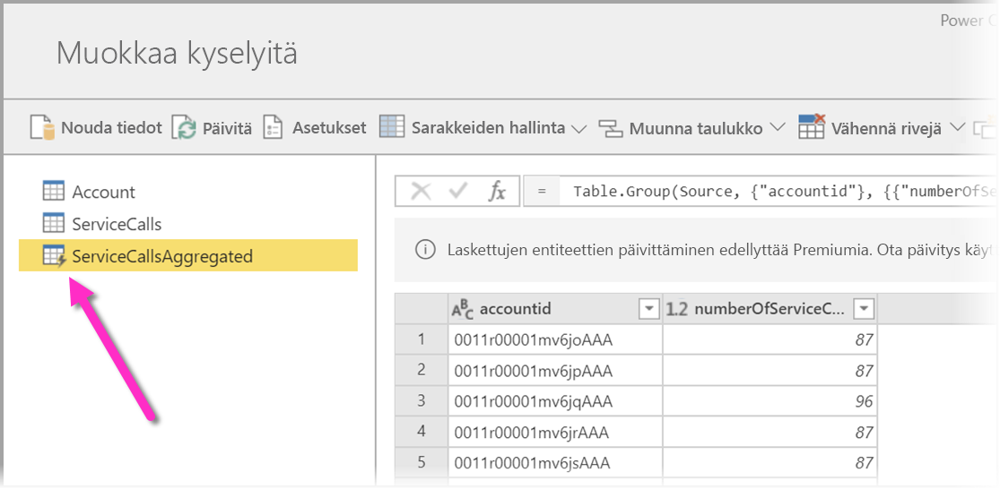
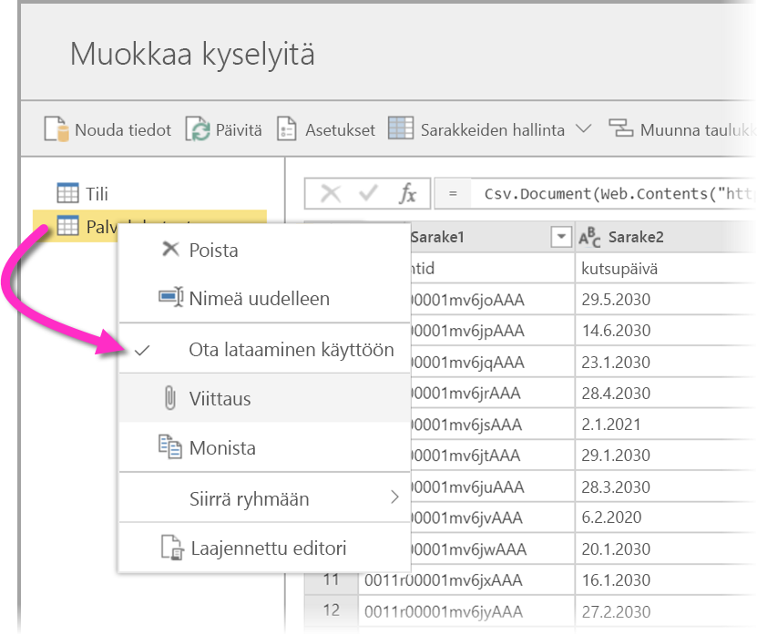
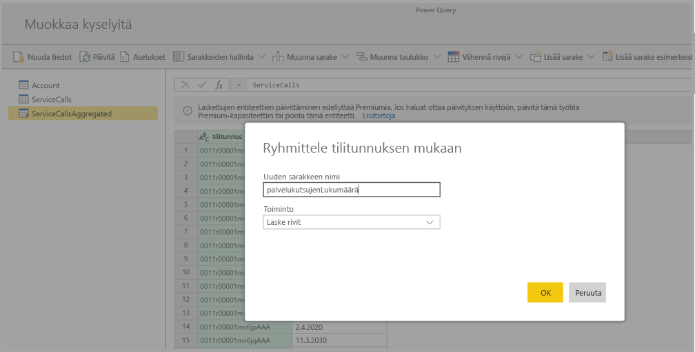
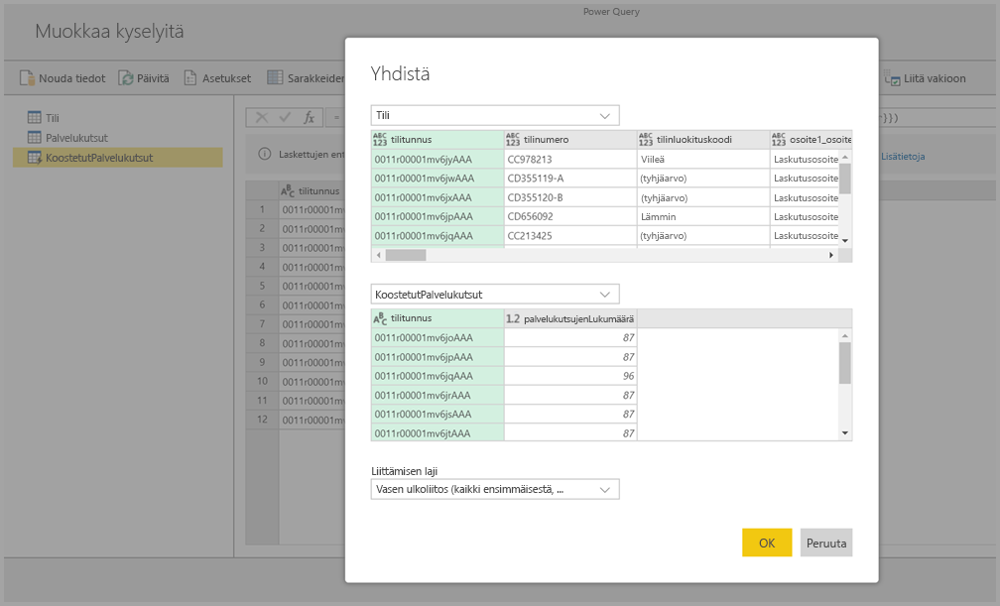
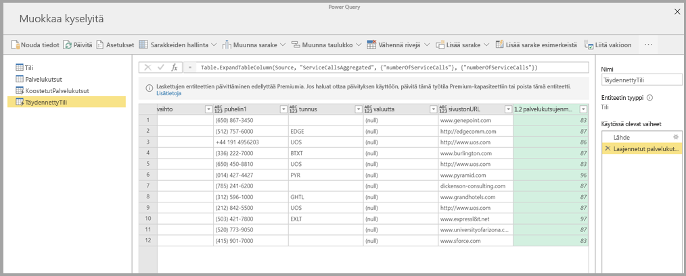

# Laskettujen entiteettien käyttäminen Power BI Premiumissa (esikatselu)

Voit suorittaa **laskutoimituksia tallennustilassa**, kun käytät **tietovoita** Power BI Premium -tilauksessa. Näin voit suorittaa laskutoimituksia aiemmin luoduilla tietovoilla ja palauttaa tulokset, joiden avulla voit keskittyä raporttien luomiseen ja analysointiin. 

Jos haluat suorittaa **laskutoimituksia tallennustilassa**, sinun on ensin luotava tietovuo ja tuotava tiedot kyseiseen Power BI:n tietovuon tallennustilaan. Kun sinulla on tietoja sisältävä tietovuo, voit luoda **laskettuja entiteettejä**, mikä tarkoittaa laskutoimituksia tallennustilassa suorittavia entiteettejä. 

Voit yhdistää tietovuon tiedot Power BI:hin kahdella eri tavalla:

* [Käyttämällä tietovuon omatoimista luomista](service-dataflows-create-use.md)
* Käyttämällä ulkoista tietovuota

Seuraavissa osioissa käsitellään laskettujen entiteettien luomista tietovuon tiedoista.

> [!NOTE]
> Tietovuotoiminto on esikatselutilassa, ja sitä voidaan muuttaa ja päivittää ennen kuin se on yleisesti saatavilla.

## Laskettujen entiteettien luominen 

Kun sinulla on entiteettiluettelon sisältävä tietovuo, voit suorittaa laskutoimituksia kyseisillä entiteeteillä.

Valitse Power BI -palvelun tietovuon luontityökalussa **Muokkaa entiteettejä** ja napsauta hiiren kakkospainikkeella entiteettiä, jota haluat käyttää lasketun entiteetin pohjana ja jolla haluat suorittaa laskutoimituksia. Valitse pikavalikosta **Viittaus**.

Jotta entiteetti voi olla laskettu entiteetti, **Ota lataaminen käyttöön** -kohdan on oltava valittuna seuraavan kuvan mukaisesti. Napsauta entiteettiä hiiren kakkospainikkeella, niin tämä pikavalikko tulee näkyviin.

Kun valitset **Ota lataaminen käyttöön**, luot uuden entiteetin, jonka lähteenä on viitattu entiteetti. Kuvake muuttuu ja näyttää **lasketun** kuvakkeen seuraavan kuvan mukaisesti.

Kaikki äskettäin luotuun entiteettiin tehtävät muunnokset suoritetaan Power BI:n tietovuon tallennustilassa jo oleville tiedoille. Tämä tarkoittaa sitä, että kyselyä ei suoriteta ulkoiselle tietolähteelle, josta tiedot tuotiin (esimerkiksi SQL-tietokanta, josta tiedot koottiin), vaan se suoritetaan tietovuon tallennustilassa jo oleville tiedoille.

### Esimerkkitilanteet
Millaisia muunnoksia lasketuille entiteeteille voidaan suorittaa? Kaikkia muunnoksia, jotka yleensä määrität muunnosten käyttöliittymän avulla Power BI:ssä tai M-editorissa, tuetaan suorittaessasi laskutoimituksia tallennustilassa. 

Ajattele esimerkiksi, että sinulla on *Account*-entiteetti, joka sisältää kaikkien Dynamics 365 -tilauksen asiakkaiden raakatiedot. Sinulla on myös palvelukeskuksen *ServiceCalls*-raakatiedot, joissa on tietoa tukikutsuista, jotka suoritettiin eri tililtä vuoden jokaisena päivänä.

Ajatellaan, että haluat täydentää *Account*-entiteettiä *ServiceCalls*-tiedoilla. 

Sinun on ensin koostettava ServiceCalls-tiedot, jotta voit laskea kultakin tililtä tehtyjen tukikutsujen määrän viime vuodelta. 

Seuraavaksi sinun on yhdistettävä *Account*-entiteetti *ServiceCallsAggregated*-entiteettiin ja laskettava täydennetty **Account**-taulukko.

Sen jälkeen näet tulokset seuraavan kuvan *EnrichedAccount*-kohdan mukaisesti.

Siinä kaikki – muunnos suoritetaan Power BI Premium -tilauksen tietovuon tiedoille, ei lähdetiedoille.

## Huomioitavat asiat ja rajoitukset

On tärkeää huomioida, että jos poistat työtilan Power BI Premium -kapasiteetista, siihen liittyvää tietovuota ei enää päivitetä. 

Kun käsittelet tietovoita, jotka on luotu erityisesti organisaation Azure Data Lake Storage Gen2 -tilillä, linkitetyt entiteetit ja lasketut entiteetit toimivat oikein vain, kun entiteetit sijaitsevat samalla tallennustilillä. Katso lisätietoja artikkelista [Yhdistä Azure Data Lake Storage Gen2 tietovuotallennusta varten (esikatselu)](service-dataflows-connect-azure-data-lake-storage-gen2.md).

Lisäksi linkitetyt entiteetit eivät ole käytettävissä CDM-kansioista luoduille tietovoille. Katso [Lisää CDM-kansio Power BI:hin tietovuona (esikatselu)](service-dataflows-add-cdm-folder.md).

## Seuraavat vaiheet

Tässä artikkelissa käsiteltiin laskettuja entiteettejä ja tietovoita, jotka ovat käytettävissä Power BI -palvelussa. Seuraavassa on lisää artikkeleita, joista voi olla hyötyä.

* [Omatoiminen tietojen valmistelu tietovoiden avulla](service-dataflows-overview.md)
* [Tietovoiden luominen ja käyttäminen Power BI:ssä](service-dataflows-create-use.md)
* [Tietovoiden käyttäminen paikallisten tietolähteiden kanssa (esikatselu)](service-dataflows-on-premises-gateways.md)
* [Kehittäjien resurssit Power BI -tietovoille (esikatselu)](service-dataflows-developer-resources.md)
* [Määritä työtilan tietovuoasetukset (esikatselu)](service-dataflows-configure-workspace-storage-settings.md)
* [Lisää CDM-kansio Power BI:hin tietovuona (esikatselu)](service-dataflows-add-cdm-folder.md)
* [Yhdistä Azure Data Lake Storage Gen2 tietovuotallennusta varten (esikatselu)](service-dataflows-connect-azure-data-lake-storage-gen2.md)

Lisätietoja Power Querysta ja ajoitetusta päivityksestä on seuraavissa artikkeleissa:
* [Kyselyn yleiskatsaus Power BI Desktopissa](desktop-query-overview.md)
* [Ajoitetun päivityksen määrittäminen](refresh-scheduled-refresh.md)

Lisätietoja Common Data Modelista on sen yleiskatsauksen sisältävässä artikkelissa:
* [Common Data Model – yleiskatsaus](https://docs.microsoft.com/powerapps/common-data-model/overview)

