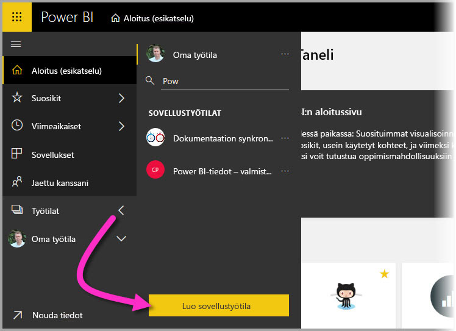
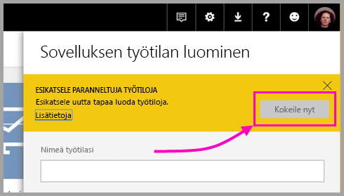
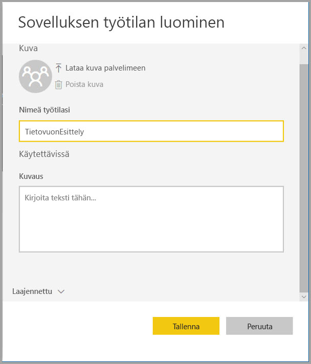
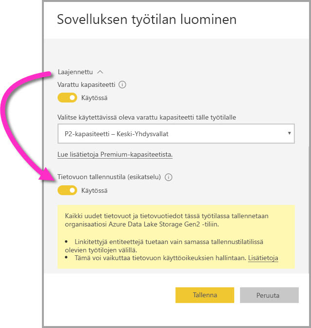
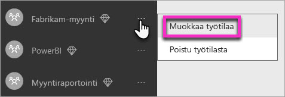
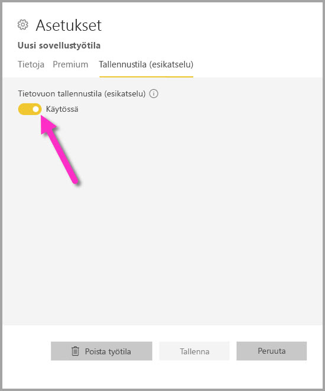
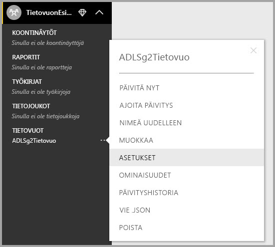
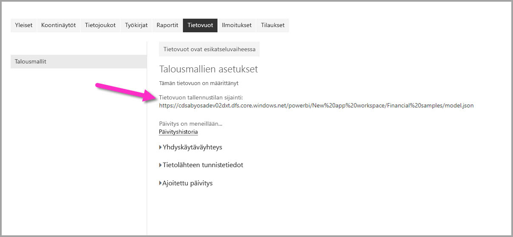

# Määritä työtilan tietovuoasetukset (esikatselu)

Power BI:nja tietovoiden avulla voit tallentaa työtilan tietovuon määritystiedoston ja datatiedostot Azure Data Lake Storage Gen2 -tiliisi. Työtilojen järjestelmänvalvojat voivat määrittää Power BI:n tätä varten. Tässä artikkelissa käydään läpi tarvittavat vaiheet. 

Ennen kuin voit määrittää työtilan tietovuon tallennussijainnin, yrityksesi yleisen järjestelmänvalvojan on yhdistettävä organisaatiosi tallennustili Power BI:hin ja otettava käyttöön tallennustilan määritysoikeudet kyseisessä tallennustilissä. *[Yhdistä Azure Data Lake Storage Gen2 tietovuon tallennukseen (esikatselu)](service-dataflows-connect-azure-data-lake-storage-gen2.md)* 

Työtilan tietovuon tallennusasetukset voidaan määrittää kahdella tavalla: 

* Työtilan luomisen aikana
* Muokkaamalla aiemmin luotua työtilaa

Kumpaankin vaihtoehtoon perehdytään seuraavissa osioissa. 

> [!IMPORTANT]
> Työtilan tietovuon tallennusasetusta voidaan muuttaa vain, jos työtilassa ei ole yhtäkään tietovuota. Lisäksi tämä ominaisuus on käytettävissä vain uudessa työtilakokemuksessa. Lisätietoja uudesta työtilasta on artikkelissa [Uusien työtilojen luominen (esiversio) Power BI:ssä](service-create-the-new-workspaces.md).

## Luo uusi työtila ja määritä sen tietovuon tallennustila

Kun haluat luoda uuden sovellustyötilan Power BI -palvelussa, valitse **Työtilat > Luo sovellustyötila**.

Luo sovellustyötila -valintaikkunassa saattaa näkyä keltainen ruutu, jonka otsikko on **Esikatsele paranneltuja työtiloja**. Valitse kyseisellä alueella **Kokeile nyt**.

Voit antaa uudelle työtilalle yksilöllisen nimen avautuvassa valintaikkunassa. Älä vielä valitse **Tallenna**, sillä lisäasetuksia on määritettävä.

Laajenna seuraavaksi **Luo sovellustyötila** -valintaikkunassa **Lisäasetukset**-alue, jossa voit ottaa käyttöön **Tietovuon tallennustila (esikatselu)** -asetuksen.

Luo uusi työtila valitsemalla **Tallenna**. Jokainen tässä työtilassa luotu uusi tietovuo tallentaa nyt määritystiedoston (Model.json-tiedoston) ja tiedot organisaatiosi Azure Data Lake Storage Gen2 -tilille. 

## Päivitä aiemmin luodun työtilan tietovuon tallennustila

Voit uuden työtilan luomisen sijasta päivittää olemassa olevan työtilan siten, että sen määritystiedosto ja tiedot tallennetaan organisaatiosi Azure Data Lake Storage Gen2 -tilille. Muista, että tietovuon tallennusasetusta voidaan muuttaa vain, jos työtilassa ei ole yhtäkään tietovuota.

Muokkaa sovellustyötilaa valitsemalla kolme pistettä **(...)** ja valitsemalla sitten **Muokkaa työtilaa**. 

Laajenna avautuvassa **Muokkaa työtilaa** -ikkunassa **Lisäasetukset** ja vaihda sitten **Tietovuon tallennustila (esikatselu)** -asetuksen arvoksi **Käytössä**. 

Valitse sitten **Tallenna**. Jokainen tässä työtilassa luotu uusi tietovuo tallentaa määritystiedoston ja tiedot organisaatiosi Azure Data Lake Storage Gen2 -tilille.

## Hae tallennettujen tietovuotiedostojen URI

Kun luot tietovuon työtilassa, joka on määritetty organisaatiosi Azure Data Lake -tiliin, voit käyttää sen määritys- ja datatiedostoja suoraan. Niiden sijainti on käytettävissä **Tietovuon asetukset** -sivulla. Pääset sinne seuraavasti:

Valitse kolme pistettä **(...)**  työtilan **Tietovuot**-kohdassa luetellun tietovuon vieressä. Valitse näkyviin tulevasta valikosta **Asetukset**.

Näytettävissä tiedoissa tietovuon CDM-kansion sijainti näkyy kohdassa **Tietovuon tallennustilan sijainti** seuraavan kuvan mukaisesti.

> [!NOTE]
> Power BI määrittää tietovuon omistajalle lukuoikeudet CDM-kansioon, johon tietovuotiedostot on tallennettu. Tietovuon tallennussijainnin käyttöoikeuden myöntäminen muille henkilöille tai palveluille edellyttää, että tallennustilin omistaja myöntää oikeudet Azuressa.

## Huomioitavat asiat ja rajoitukset

Tiettyjä tietovuon ominaisuuksia ei tueta, kun tietovuon tallennustilana on Azure Data Lake Storage Gen2: 

Power BI Pro-, Power BI Premium- ja Power BI Embedded -työtilat:
* **Linkitettyjen entiteettien** ominaisuutta tuetaan vain samassa tallennustilissä olevien työtilojen välillä.
* Työtilan käyttöoikeudet eivät koske Azure Data Lake Storage Gen2 -järjestelmään tallennettuja tietovoita; vain tietovuon omistaja voi käyttää sitä.
* Muilta osin kaikki tietojen valmistelutyökalun ominaisuudet ovat samat kuin Power BI -tallennustilaan tallennetuissa tietovoissa

Muita harkittavia seikkoja on seuraavassa luettelossa:

* Kun tietovuon tallennussijainti on määritetty, sitä ei voi muuttaa.
* Vain Azure Data Lake Storage Gen2 -järjestelmään tallennetun tietovuon omistaja voi käyttää sen tietoja.
* Power BI:n jaettujen kapasiteettien paikallisia tietolähteitä ei tueta tietovoissa, jotka on tallennettu organisaatiosi Azure Data Lake Storage Gen2 -järjestelmään.

**Power BI Desktop** -asiakas ei voi käyttää Azure Data Lake Storage Gen2 -tiliin tallennettuja tietovoita, jos hän ei ole tietovuon omistaja. Katso seuraavaa esimerkkiä:

1.  Anna luo uuden sovellustyötilan ja määrittää sen tallentamaan tietovuot organisaation Data Lake -järjestelmään.
2.  Ben, joka on myös jäsen Annan luomassa työtilassa, haluaa noutaa tietoja Annan luomasta tietovuosta Power BI Desktopin ja tietovuon liittimen avulla.
3.  Ben saa virheen, koska häntä ei ole lisätty tietovuon CDM-kansion valtuutetuksi käyttäjäksi Data Lake -järjestelmässä.

    

## Seuraavat vaiheet

Tässä artikkelissa annetaan ohjeet työtilan tallennustilan määrittämiseen tietovoita varten. Lisätietoja saat seuraavista artikkeleista:

Lisätietoja tietovoista, CDM:stä ja Azure Data Lake Storage Gen2:sta on seuraavissa artikkeleissa:

* [Tietovuot ja Azure Data Lake -integrointi (esikatselu)](service-dataflows-azure-data-lake-integration.md)
* [Lisää CDM-kansio Power BI:hin tietovuona (esikatselu)](service-dataflows-add-cdm-folder.md)
* [Yhdistä Azure Data Lake Storage Gen2 tietovuotallennusta varten (esikatselu)](service-dataflows-connect-azure-data-lake-storage-gen2.md)

Lisätietoja tietovoista yleisesti on seuraavissa artikkeleissa:

* [Tietovoiden luominen ja käyttäminen Power BI:ssä](service-dataflows-create-use.md)
* [Laskettujen entiteettien käyttäminen Power BI Premiumissa (esikatselu)](service-dataflows-computed-entities-premium.md)
* [Tietovoiden käyttäminen paikallisten tietolähteiden kanssa (esikatselu)](service-dataflows-on-premises-gateways.md)
* [Kehittäjien resurssit Power BI -tietovoille (esikatselu)](service-dataflows-developer-resources.md)

Lisätietoja Azure-tallennustilasta on seuraavissa artikkeleissa:

* [Azure-tallennuksen suojausopas](https://docs.microsoft.com/azure/storage/common/storage-security-guide)
* [Azure-tietopalveluiden github-mallien käytön aloittaminen](https://aka.ms/cdmadstutorial)

Lisätietoja Common Data Modelista on sen yleiskatsauksen sisältävässä artikkelissa:

* [Common Data Model – yleiskatsaus](https://docs.microsoft.com/powerapps/common-data-model/overview)
* [CDM-kansiot](https://go.microsoft.com/fwlink/?linkid=2045304)
* [CDM-mallitiedoston määritys](https://go.microsoft.com/fwlink/?linkid=2045521)

Voit myös yrittää [esittää kysymyksiä Power BI -yhteisössä](http://community.powerbi.com/).
